#### The JavaScriptmas event continues! I recap Scrimba's Twitter Space "Tricky non-technical interview questions and answers," I document my solutions and highlight more fellow coders from the community!

---

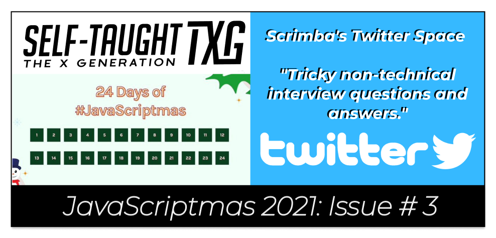

---

### Scrimba's Twitter Space 

What is a Twitter Space? Twitter Spaces are events held on Twitter where the host of the space conducts live conversations with the speakers assigned to a panel and with audience members invited up to the panel.

Scrimba's most recent Twitter Space was a conversation on the topic, "**Tricky non-technical interview questions and answers**."

Hosts: [Alex](https://twitter.com/bookercodes) and [Leanne](https://twitter.com/RybaLeanne)

**Speakers:** 

* [@TechRally](https://twitter.com/TechRally)
* [@willjohnsonio](https://twitter.com/willjohnsonio)
* [@TechSquidTV](https://twitter.com/TechSquidTV)
* [@sahanarajasekar](https://twitter.com/sahanarajasekar)
* [@xDeniTech](https://twitter.com/xDeniTech)

---

### Tell me about yourself.

The first question covered during Scrimba's Twitter Space was "**Tell me about yourself**."

**To handle this question, we are advised to keep our answer succinct.** 

Keep your answer on the topic of the position you are applying for, show enthusiasm for the technologies you are using, and lead your enthusiasm back to the company you are interviewing for.

***Notes:*** *Keep it succinct, show enthusiasm, lead your enthusiasm back to why you want to work there.*

---

### Why do you want to work here? 

**To best answer the question, "Why do you want to work here" is to have first thoroughly researched the company you are applying for.**

You can learn about the company you are applying for by researching their website. Go over their about page and create a relevant bullet point list of essential aspects of the company. 

***Notes:*** *Do your research on the company you are applying for.*

---

### Questions to ask at the end of the interview

We are encouraged to ask questions at the end of the interview. Not doing so may lead to the impression that we are not that interested in the position we are applying for.

**Questions to ask at the end of the interview:**

1. What will be my responsibility for the first 30 days?
2. Do you have tips for me? 
3. Your expectations of me for my first full year?

***Notes:*** *Ask questions (it's a 2-way street). Not asking questions may reflect that you are uninterested.*

---

### What can you bring to the table/company?

When asked, "**What can you bring to the table/company?**" describe what you are passionate about, and lead it into how your skills will help their company.

**describe what you are passionate about:**

* You are self-motivated
* You are a coding enthusiast
* You enjoy solving problems
* You're concerned about helping customers' needs
* You will hold your tech team to high standards

***Notes:*** *You are self-motivated, love to code, solve problems, help customers' needs, hold the tech team to high standards.*

---

### Tell me about a difficult work relationship.

**Tell me about a difficult work relationship with a co-worker and how you resolved it.**

To handle this delicate question, we are advised to keep our skills as a coder separate from ourselves and our soft skills, or we will take everything personally.

Also, share a story where you actually resolved the issue with your co-worker. [@TechRally](https://twitter.com/TechRally), during the Twitter Space, explained that he failed an interview because he shared an "unresolved" story of a difficult work relationship with a co-worker.

***Notes:***  *Share a "resolved" story of a difficult work relationship with a co-worker. Try to resolve the problem with the co-worker before you bring it up to a manager/management.* 

---

### Salary negotiation

When it comes to salary negotiation, we are advised to determine the salary range beforehand and make sure we are comfortable with the range.

In addition to the offered salary, keep in mind the benefits offered. Healthcare, vacation time, matched contributions to your 401(k) account all together construct your overall compensation.

Also, we are told that we will have leverage during salary negotiation if we currently have other job offers at the time of the interview. 

***Notes:*** *Know the salary range beforehand, keep in mind the overall compensation offered, and you can gain leverage by having multiple other job offers.* 

---

### Why are you leaving your current job?

When we are asked why we are leaving our current job, we are encouraged to focus less on why we are leaving and more on why we want to work there.

We are to present everything positively, and we are instructed not to bash people at our current or previous jobs.

**Reasons for leaving our current job:**

* Want to move up professionally
* You learned all you can at your current job
* Looking to expand your skills

***Notes:*** *Focus less on why you are leaving and more on why you want to work there. Present everything positively, and do not "bad talk" anyone you previously worked with.* 

---

### Summary of the Twitter Space

The best way to handle "**tricky non-technical interview questions**" is to be well prepared. Research the company you are applying for, keep your answers succinct and on topic, and make sure you are also prepared to ask your own questions.

Make sure you always shine a positive light on yourself and do not bad-talk past or current colleagues. 

Show enthusiasm about working for them, demonstrate how your skill will benefit their company, and tactfully explain why you are leaving your current job.

---

### Community Highlights

In this section of the article, I'm showcasing the work of fellow JavaScriptmas coders from the community!

---

**Steve** ([@steveWhoCodes](https://twitter.com/steveWhoCodes)) solved [Kevin Powell's](https://twitter.com/KevinJPowell) challenge 18 in style, including the stretch goals of adding corresponding list images. Well done! 

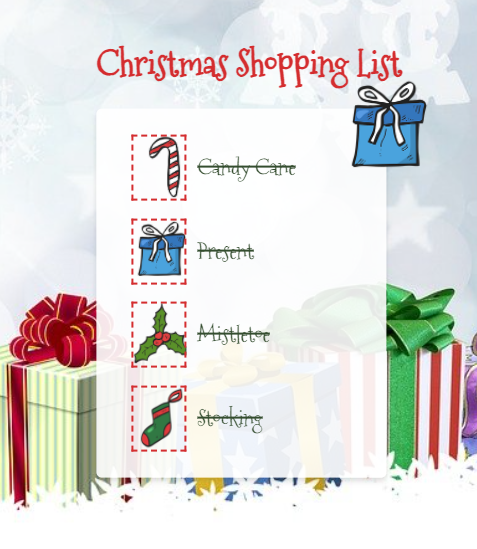

**Link to Steve's scrim:** [scrimba.com/scrim](https://scrimba.com/scrim/coc8d4a639f5f28bf6ed709a0)

---

**Lucas** ([@LucasSutter1](https://twitter.com/LucasSutter1)) completed the stretch goal of switching names of people between the Naughty and Nice list by writing a "switchIt" function! Well done!

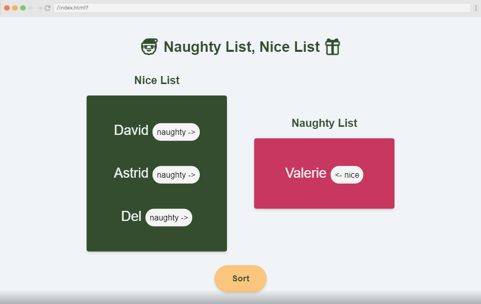

**Link to Lucas's scrim:** [scrimba.com/scrim](https://scrimba.com/scrim/coa96497e8543e2adf53efd83)

---

**Tim** ([@TimRinkel](https://twitter.com/TimRinkel)) created a Festive Translator with nice message animations.

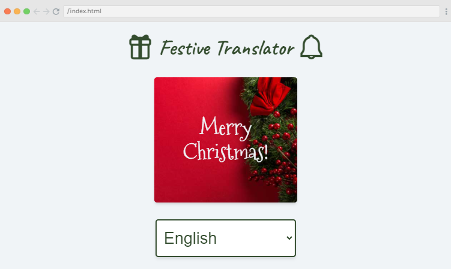

**Link to Tim's scrim:** [scrimba.com/scrim](https://scrimba.com/scrim/co35345e7b344131b33377777)

---

Matt ([@mattemmmmm](https://twitter.com/mattemmmmm)) created a Snow Man Customer that includes a "Random Color" button that lights up the snowman like a Christmas tree! When you are finished customizing the snowman, you can "checkmark" him to the beach and watch him melt! Very creative!

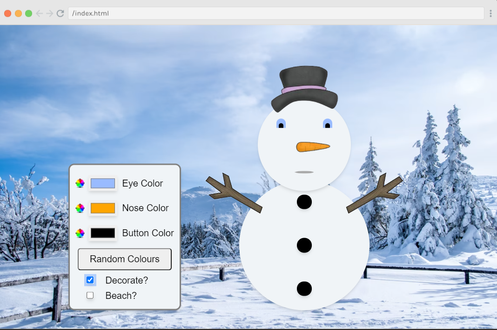

Link to Matt's scrim: [scrimba.com/scrim](https://scrimba.com/scrim/co4e5429aa3a5a32e06da2e45)

---

OlehSml ([@OlehSml](https://twitter.com/OlehSml)) decided to change the Dessert Decider challenge into a Pizza Decider challenge! Click on the "See Delicious Pizzas 😋" button to generate random pizza onto the cutting board background. This challenge was tastefully done!

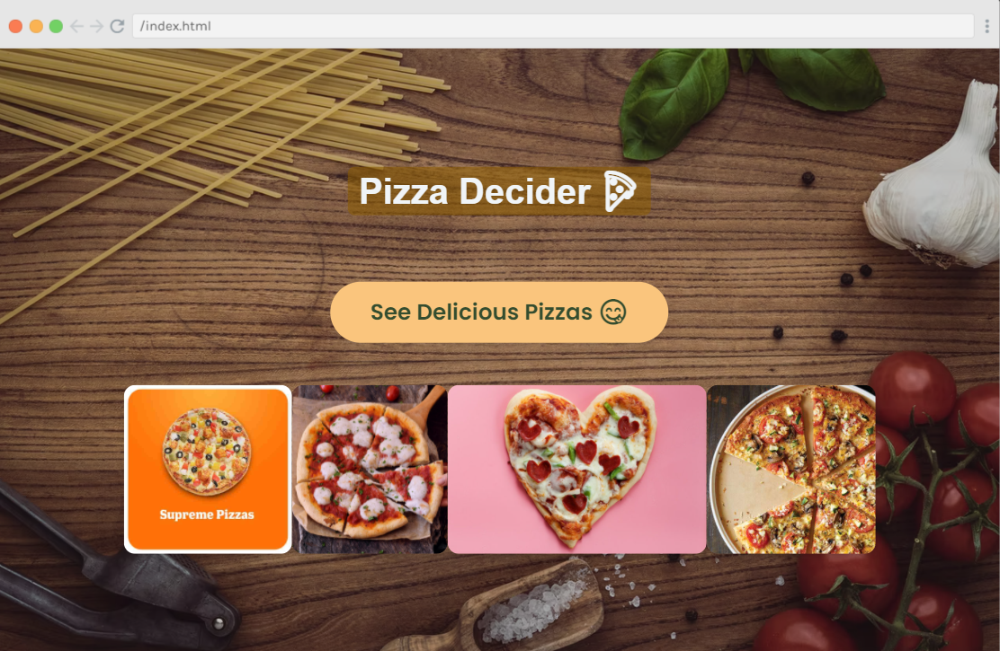

Link to OlehSml's scrim: [scrimba.com/scrim](https://scrimba.com/scrim/co22a4ee1ac3a3c0fe18457eb)

---

### Below are my coding solutions to the JavaScriptmas challenges 12 through 18!

---

### Challenge 12

#### Christmas Guest List

**Task:** 

1. Write the JS to render the Christmas day guest list in the guest list.
2. Add the functionality to add new guests.

---

**To style the page, I added:**

* Transparent gradient background
* Background image (from pixabay.com)
* Dotted white border

---

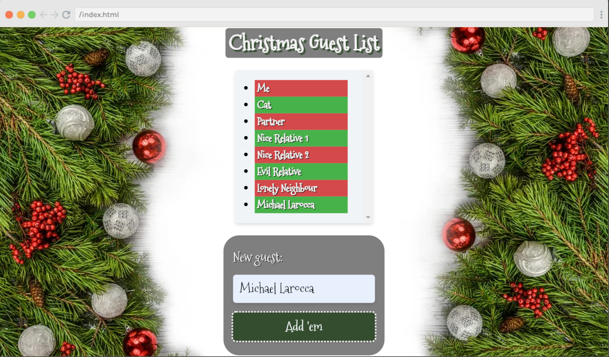

---

### Final code

#### Challenge 12

**Link to the solution: [scrimba.com/scrim](https://scrimba.com/scrim/co57849489b5b872f7d95e6c0)**

```javascript
function loadGuestList(){
    for(let i = 0; i <guests.length; i++) {
        const listItem = document.createElement("li");
        const listItemName = guests[i];    
        listItem.textContent = listItemName;
        guestList.appendChild(listItem);
    }
}
loadGuestList();

btn.addEventListener("click", addGuest);

function addGuest() {
    const listItem = document.createElement("li");
    const listItemName = input.value;
    listItem.textContent = listItemName;
    guestList.appendChild(listItem);
}
```

---

### Challenge 13

#### Christmas Dinner Calculator

**Task:** *Write the JS to decide the perfect Christmas dinner and render it in the result element. Don't forget to check whether the meal should be vegetarian!*

---

**To style the page, I added:**

* Transparent gradient background
* Background image (from pixabay.com)
* Dotted white border


---

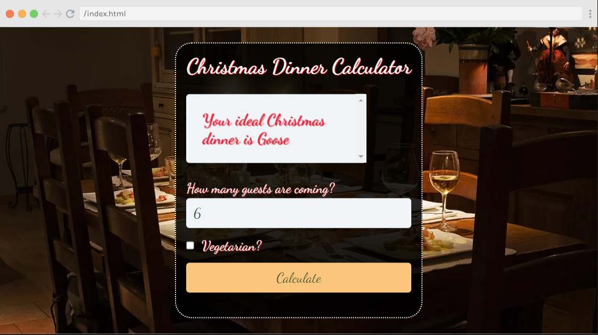

---

### Final code

#### Challenge 13

**Link to the solution: [scrimba.com/scrim](https://scrimba.com/scrim/co6fc45678b7d9762466fb26b)**

```javascript
function christmasCalculator(){
    let guests = document.getElementById("num-input").value;
    let vegetarianInput = document.getElementById("vegetarian-input");
    let vegetarianInputTrue = vegetarianInput.checked;
    
    if(vegetarianInputTrue === true) {
        result.textContent = "Your ideal Christmas dinner is Nut roast"
    } else {
        if(guests > 5) {
            result.textContent = "Your ideal Christmas dinner is Goose"
        } else {
            result.textContent = "Your ideal Christmas dinner is turkey"   
        }
    }
    
}
```

---

### Challenge 14

#### Lonely Elf

**Task:** 

1. Write a function to duplicate the elf when the button is clicked.
2. See index.css for optional styling challenges.   

---

**To style the page, I added:**

* Sky background image (from pixabay.com)
* Wall background image (from pixabay.com)

---

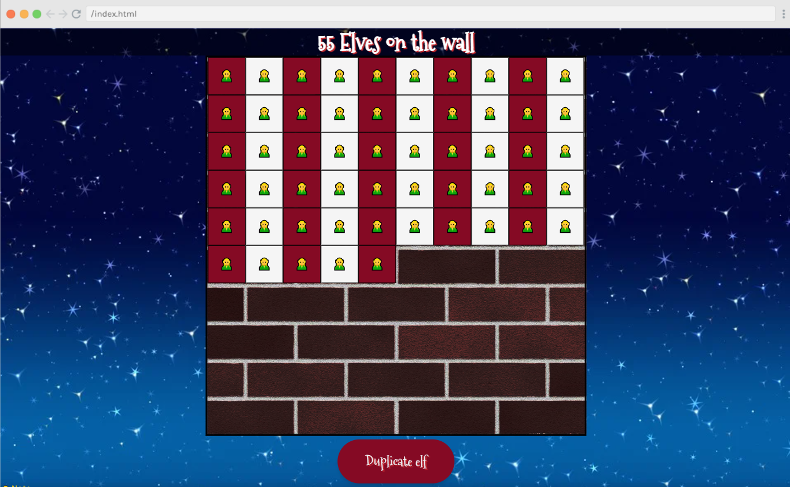

---

### Final code

#### Challenge 14

**Link to the solution: [scrimba.com/scrim](https://scrimba.com/scrim/co4d14c2785de4a5cb7e6b805)**

```javascript
function duplicateElf(){

if(counterElf < 100){   
    counterElf++;

    const divElf = document.createElement("div");
        divElf.classList.add("square-elf");
        divElf.innerText = "🧝";
        containerElf.appendChild(divElf);
    title.innerText = `${counterElf} Elves on the wall`;    
    } else {
        title.innerText = `${counterElf} Elves on the wall!`; 
    }
}

```

---

### Challenge 15

#### Festive Translator

**Task:** *Write a function to display the correct greeting when a language is selected.*

---

**To style the page, I added:**

* Transparent gradient background
* Background image (from pixabay.com)


---

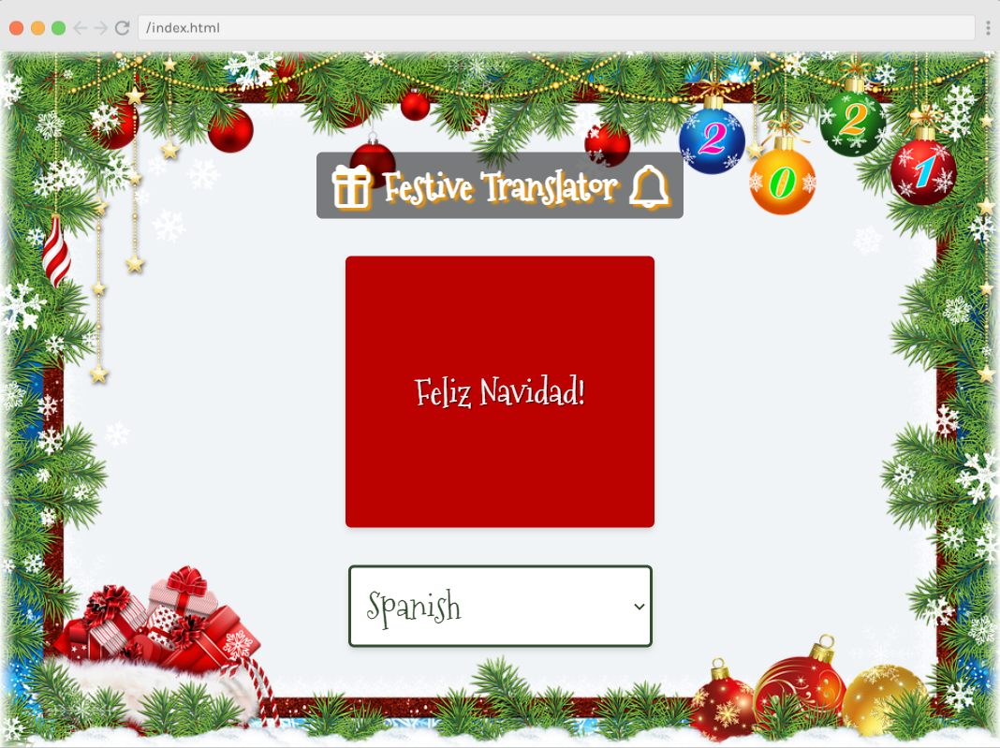

---

### Final code

#### Challenge 15

**Link to the solution: [scrimba.com/scrim](https://scrimba.com/scrim/co8ae4be3b351f697d2bcf9e1)**

```javascript
function translate() {

    for (let i=0;i<greetingsArr.length;i++) {
  
        if (greetingsArr[i].language === languageSelector.value) {
            greetingDisplay.innerText = greetingsArr[i].greeting;
        }
    }

}
```

---

### Challenge 16

#### Christmas Movie Selector

**Task:** 

1. Write a function to select a suitable movie based on the age group.
2. Display it in the suggested-movie paragraph when the button is clicked.

---

**To style the page, I added:**

* Background image (from pixabay.com)
* Tv png image from Google

---

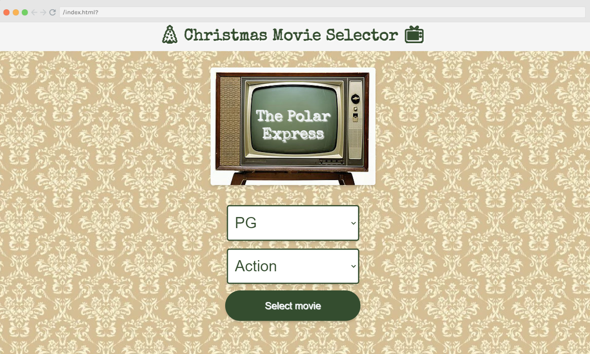

---

### Final code

#### Challenge 16

**Link to the solution: [scrimba.com/scrim](https://scrimba.com/scrim/co8ce40b0a12419459e43b603)**

```javascript
function selectMovie() {

    for(let i =0; i <moviesArr.length; i++) {
        

        if(ageSelector.value === moviesArr[i].age && genreSelector.value === moviesArr[i].genre){
           suggestedMovie.innerText = moviesArr[i].name;
        }
    }
}
```

---

### Challenge  17

#### Naughty List, Nice List

**Task:** *Write the JavaScript to sort the people in sorteesArr into the naughty and nice lists, according to whether they have been good or not. Then display the names in the relevant place in the DOM.*

---

**To style the page, I added:**

* Background image (from pixabay.com)
* Parchment image (from pixabay.com)

---

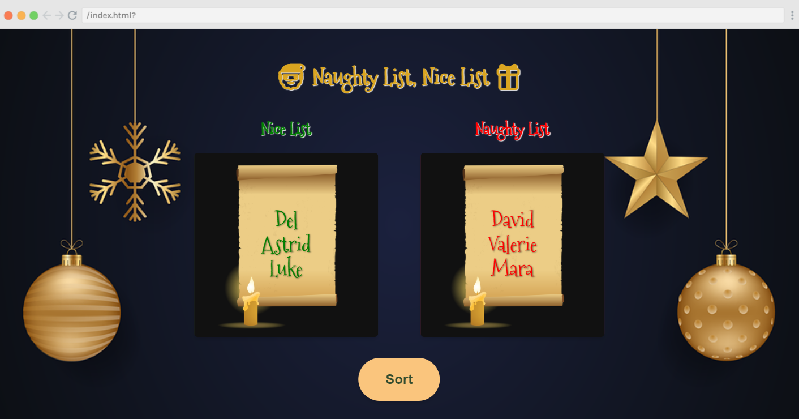

---

### Final code

#### Challenge 17

**Link to the solution: [scrimba.com/scrim](https://scrimba.com/scrim/co2084003a0b1807b15162873)**

```javascript
function sort() {
    for(let i = 0; i<sorteesArr.length;i++){

        if(sorteesArr[i].hasBeenGood) {
            listNice.push(sorteesArr[i].name);
              
            const listItemGood = document.createElement("li");
            const listItemGoodName = document.createTextNode(sorteesArr[i].name);
            listItemGood.appendChild(listItemGoodName);
            niceList.appendChild(listItemGood);
        } else {
           listNaughty.push(sorteesArr[i].name);
            const listItemBad = document.createElement("li");
            const listItemBadName = document.createTextNode(sorteesArr[i].name);
            listItemBad.appendChild(listItemBadName);
            naughtyList.appendChild(listItemBad);
        }
        btn.disabled = true;
    }

}
```

---

### Challenge 18

#### Custom Shopping Checkboxes

**Task:** *Write the CSS to create custom checkboxes for our shopping list.*

---

**To style the page, I added:**

* Background image (from pixabay.com)
* Google Font

---

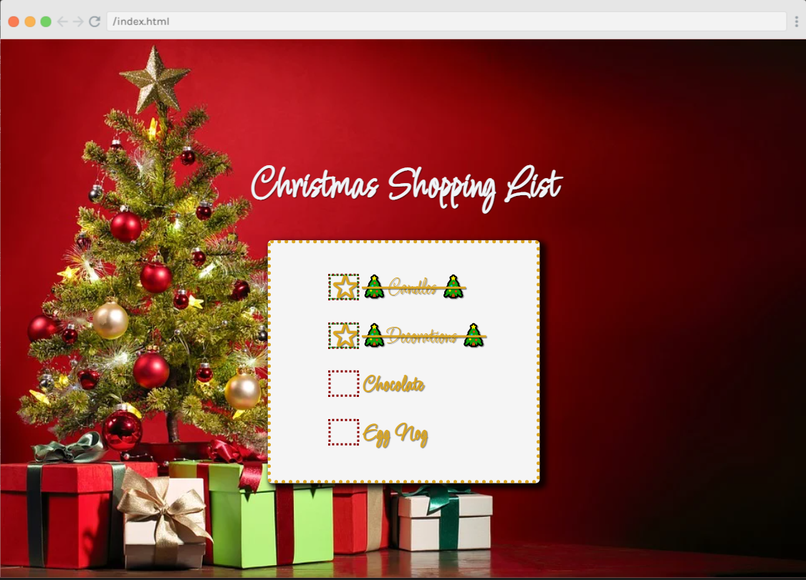

---

### Final code

#### Challenge 18

**Link to the solution: [scrimba.com/scrim](https://scrimba.com/scrim/co00347cf90b815d5e251d8b5)**

```css
[type="checkbox"] {
    opacity: 0;
}

[type="checkbox"] + label {
    position: relative;
    padding-left: 35px;
    cursor: pointer;
    display: inline-block;
    color: goldenrod;
    line-height: 30px;
}

[type="checkbox"] + label::before {
    content: "";
    left: 0;
    top: 0;
    position: absolute;
    width: 30px;
    height: 25px;
    outline: 3px dotted darkred;
}

[type="checkbox"]:checked + label::after {
    content: "⭐";
    left: 0;
    top: 0;
    position: absolute;
    width: 30px;
    height: 25px;
    outline: 2px dotted green;
}

input[type=checkbox]:checked + label.strikethrough span::before {
    content: "🎄";
}

input[type=checkbox]:checked + label.strikethrough span::after {
    content: "🎄";
}
```

---

### JavaScriptmas Winners

A FREE full-year subscription to Scrimba!

* Day 11: [@claircedesign](https://twitter.com/claircedesign)
* Day 12: @marleigh (Discord)
* Day 13: @Emmanuel (Discord)
* Day 14: @Mik (Discord)
* Day 15: [@dsabalete](https://twitter.com/dsabalete)
* Day 16: [@Arbaaz_77](https://twitter.com/Arbaaz_77)
* Day 16: [@evla27](https://twitter.com/evla27)
* Day 16: [@graficdoctor](https://twitter.com/graficdoctor)
* Day 16: @Daniela (Discord)

---

**Be sure to check out my related articles!**

* [Review: Scrimba's Weekly Web Dev Challenge](https://selftaughttxg.com/2021/01-21/ReviewScrimbaWebDevChallenge/)
* [Scrimba: JavaScriptmas 2020](https://selftaughttxg.com/2020/12-20/Scrimba-JavaScriptmas_2020/)
* [The Post-JavaScriptmas 2020 Post](https://selftaughttxg.com/2020/12-20/The_Post-JavaScriptmas_2020_Post/)

---

#### **Scrimba has once again impressed and inspired me! You can read my full [Scrimba review](https://selftaughttxg.com/2020/12-20/Review-Scrimba/) on my 12/13/2020 post.**


#### *"That&#39;s one of the best Scrimba reviews I&#39;ve ever read, <a href="https://twitter.com/MikeJudeLarocca?ref_src=twsrc%5Etfw">@MikeJudeLarocca</a>. Thank you! 🙏 "*
###### &mdash; Per Harald Borgen, CEO of Scrimba <a href="https://twitter.com/perborgen/status/1338462544143540227?ref_src=twsrc%5Etfw">December 14, 2020</a></blockquote>

---

### Conclusion

Scrimba's JavaScriptmas annual FREE event is a wonderful way to commit to coding daily and is a fun and festive event where all participants have an equal opportunity to win prizes, regardless of their skill level.

During the JavaScriptmas event, Scrimba offers new students a 20% discount code through a link provided at the end of each day's coding challenge.

By completing all 24 coding challenges, you will be awarded a certificate and an exclusive Discord badge, and since each submission acts as a raffle ticket, you will have 24 chances to win prizes!

---

###### *Are you now interested in participating in this year's Scrimba's JavaScriptmas? Have you already participated in last year's Scrimba's JavaScriptmas? Please share the article and comment!* 

---
