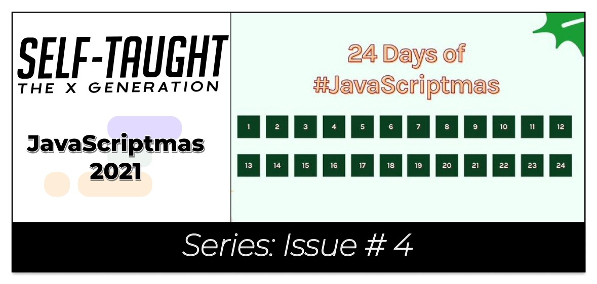
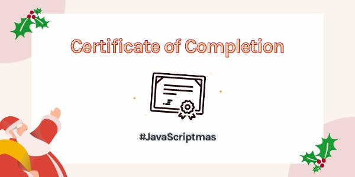
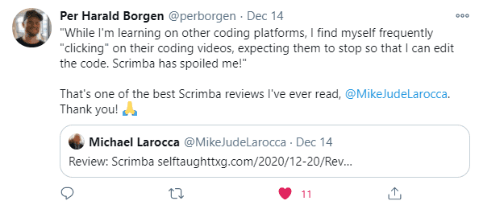

(WRITE ARTICLE SECTION)

The post-JavaScriptmas 2021 post! 

---

---

---

### My JavaScriptmas Submissions 

**Below is my list of each day's completed JavaScriptmas challenges.**

*I hope that "**Scrimba Claus**" checks it twice!*

---

###### *Pixabay: Illustration by Mohamed Hassan* 

---

### My JavaScriptmas submissions 
| Date          |      Scrim    |
| ------------- | :-----------: |
| 12/01/2021    | [Countdown To Christmas](https://scrimba.com/scrim/coa0a4b3fa1f7c1469fc7920b)  | 
| 12/02/2021    | [Toggle Christmas Theme](https://scrimba.com/scrim/co13e44988d021d0d1ef8e4d1)  |
| 12/03/2021    | [Don't Scare your Relatives](https://scrimba.com/scrim/co15a4778919bad3308cc5e49)  |
| 12/04/2021    | [Shopping Checklist](https://scrimba.com/scrim/co0a54eebb3e6a888a05f94cf)  |
| 12/05/2021    | [Christmas Card Writer](https://scrimba.com/scrim/co7204e0b987eed3efa96a0ba)  |
| 12/06/2021    | [Text Christmassifier](https://scrimba.com/scrim/coa87417580e41f42970058b5)  |
| 12/07/2021    | [Play a Christmas Song](https://scrimba.com/scrim/co5c24787b75a079234177e6d)  |
| 12/08/2021    | [Bell Animator](https://scrimba.com/scrim/co2634920a12d1a428048aa66)  |
| 12/09/2021    | [Turn on the Decorations](https://scrimba.com/scrim/coea94082b722874a3fed1b40)  |
| 12/10/2021    | [Festivity Loader](https://scrimba.com/scrim/co6be476bbf1d964ffd055afb) |
| 12/11/2021    | [Christmas Carousel](https://scrimba.com/scrim/co2ae432c849fa2c68b22a2b0) |
| 12/12/2021    | [Christmas Guest List](https://scrimba.com/scrim/co57849489b5b872f7d95e6c0) |
| 12/13/2021    | [Christmas Dinner Calculator](https://scrimba.com/scrim/co6fc45678b7d9762466fb26b) |
| 12/14/2021    | [Lonely Elf](https://scrimba.com/scrim/co4d14c2785de4a5cb7e6b805) |
| 12/15/2021    | [Festive Translator](https://scrimba.com/scrim/co8ae4be3b351f697d2bcf9e1) |
| 12/16/2021    | [Christmas Movie Selector](https://scrimba.com/scrim/co8ce40b0a12419459e43b603) |
| 12/17/2021    | [Naughty List, Nice List](https://scrimba.com/scrim/co2084003a0b1807b15162873) |
| 12/18/2021    | [Custom Shopping Checkboxes](https://scrimba.com/scrim/co00347cf90b815d5e251d8b5)     |
| 12/19/2021    | [Dessert Decider](https://scrimba.com/scrim/cobd94581a9a68d928e5de523) |
| 12/20/2021    | [Snowman Customiser](https://scrimba.com/scrim/cobfd4b289c653c53f9246e76) |
| 12/21/2021    | [HOLD](https://scrimba.com/scrim/HOLD) |
| 12/22/2021    | [HOLD](https://scrimba.com/scrim/HOLD) |
| 12/23/2021    | [HOLD](https://scrimba.com/scrim/HOLD) |
| 12/24/2021    | [HOLD - (Coded along with the JavaScriptmas live stream!)](https://scrimba.com/scrim/HOLD) |

---

#### *Coming soon!*

---

### JavaScriptmas Winners

A FREE full-year subscription to Scrimba!

* Day 1: [@betocabadev](https://twitter.com/betocabadev)
* Day 2: @zero_ (Discord)
* Day 3: @Sid (Discord)
* Day 4: [@wonderbarstudio](https://twitter.com/wonderbarstudio)
* Day 5: @Eryk (Discord)
* Day 6: Nacho Vasquez ( Discord )
* Day 7: [@Vanshsh2701](https://twitter.com/Vanshsh2701)
* Day 8: [@AmethystCodes](https://twitter.com/AmethystCodes)
* Day 9: Eldocbrown ( Discord )
* Day 10: [@Mare_Duci](https://twitter.com/Mare_Duci)
* Day 11: [@claircedesign](https://twitter.com/claircedesign)
* Day 12: @marleigh (Discord)
* Day 13: @Emmanuel (Discord)
* Day 14: @Mik (Discord)
* Day 15: [@dsabalete](https://twitter.com/dsabalete)
* Day 16: [@Arbaaz_77](https://twitter.com/Arbaaz_77)
* Day 17: [@evla27](https://twitter.com/evla27)
* Day 18: [@graficdoctor](https://twitter.com/graficdoctor)
* Day 19: @Daniela (Discord)
* Day 20: @Mansi (Discord)
* Day 21: [@HOLD](https://twitter.com/HOLD)
* Day 22: [@HOLD](https://twitter.com/HOLD)
* Day 23: @HOLD (Discord)
* Day 24: @HOLD (Discord)

--- 

**Be sure to check out my related articles!**

* [Review: Scrimba's Weekly Web Dev Challenge](https://selftaughttxg.com/2021/01-21/ReviewScrimbaWebDevChallenge/)
* [Scrimba: JavaScriptmas 2020](https://selftaughttxg.com/2020/12-20/Scrimba-JavaScriptmas_2020/)
* [The Post-JavaScriptmas 2020 Post](https://selftaughttxg.com/2020/12-20/The_Post-JavaScriptmas_2020_Post/)

---

#### **Scrimba has once again impressed and inspired me! You can read my full [Scrimba review](https://selftaughttxg.com/2020/12-20/Review-Scrimba/) on my 12/13/2020 post.**

#### *"That&#39;s one of the best Scrimba reviews I&#39;ve ever read, <a href="https://twitter.com/MikeJudeLarocca?ref_src=twsrc%5Etfw">@MikeJudeLarocca</a>. Thank you! 🙏 "*
###### &mdash; Per Harald Borgen, CEO of Scrimba <a href="https://twitter.com/perborgen/status/1338462544143540227?ref_src=twsrc%5Etfw">December 14, 2020</a></blockquote>

---

### Conclusion
(WRITE ARTICLE SECTION)