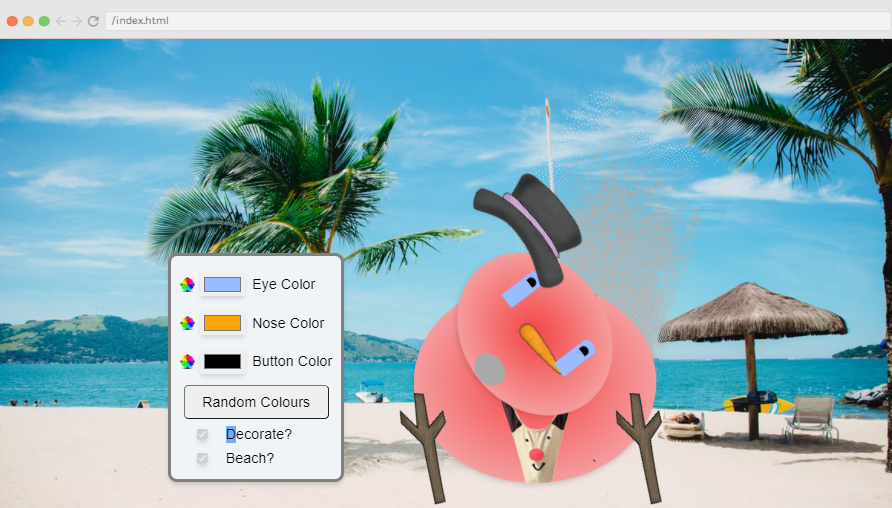
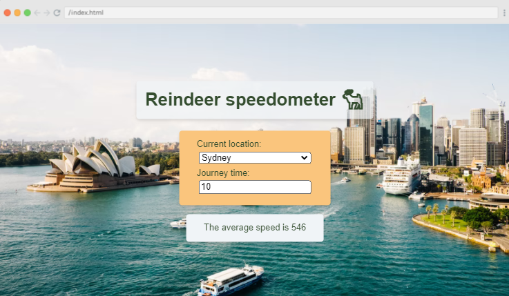
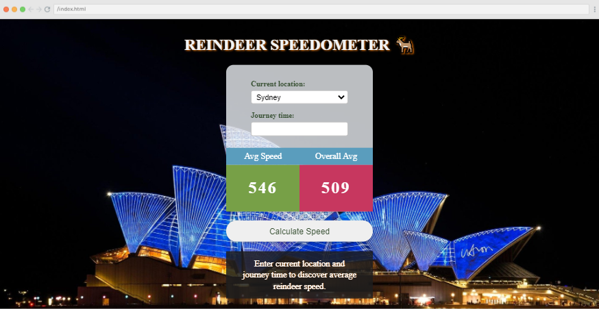
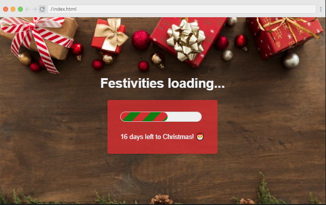

(WRITE ARTICLE SECTION)

The post-JavaScriptmas 2021 post! 

---

---

---

### Community Highlights

Well, it looks like I'm not the only one who found **Matt's** ([@mattemmmmm](https://twitter.com/mattemmmmm)) "Snow Man Customer," Michael and Leanne found it too!

The same project of Matt's, which I featured in my last article, was also featured in Scrimba's JavaScriptmas 2021 Live Finale!

When you are finished customizing Matt's snowman, you can send it to the beach and watch him melt!

---

---

**Link to Matt's scrim: [scrimba.com/scrim](https://scrimba.com/scrim/co4e5429aa3a5a32e06da2e45)**

---

Debbie ([@debbie_digital](https://twitter.com/debbie_digital)), featured in my first JavaScriptmas 2021 article, was also featured in Scrimba's JavaScriptmas 2021 Live Finale! 

In Debbie's Reindeer Speedometer project, the background image changes with a corresponding picture of the current location selected, nicely done!

---

---

**Link to Debbie's scrim: [scrimba.com/scrim](https://scrimba.com/scrim/cocb045b581449780b148f1ba)**

---

Muhammad Tahir ([@tahir__k](https://twitter.com/tahir__k)), featured in my second JavaScriptmas 2021 article, was also featured in Scrimba's JavaScriptmas 2021 Live Finale! 

Muhammad Tahir's Reindeer Speedometer project also changes the background image with a corresponding picture of the selected current location. The project also includes an average speed as well as an overall average.

---

---

**Link to Tahir's scrim: [scrimba.com/scrim](https://scrimba.com/scrim/cocbd49ccbd3c0558b38d5a71)**

---

Up next, Aaron's Lonely Elf project was featured in Scrimba's JavaScriptmas 2021 Live Finale! 

In Aaron's project, the elves are duplicated each time the "Duplicate Elf" button is clicked; one elf becomes two, two elves become four, four elves become eight, and so forth.

However, once the elves exceed one hundred in number, the elf overlord starts to reduce the elves, one by one, until there are exactly one hundred elves. Finally, when the elves are reduced to one hundred, the elves animate in a jumping "wave,"  similar to the "wave" created by fans at a sporting event.

---

---

**Link to Aaron's scrim: [scrimba.com/scrim](https://scrimba.com/scrim/co85f4bb19c2f3f2f4dfebd25)**

---

The next featured project is Simon's Christmas Dogs Carousel. This carousel consists of adorable dogs in festive settings, and this project includes a zoom-in and zoom-out feature! Well done!

---

---

**Link to Simon's scrim: [scrimba.com/scrim](https://scrimba.com/scrim/co94a46b7bc2a176c2f5365ad)**

---

Next up is Hugo's Festivities Loading project. Hugo achieved the effect that I initially wanted; Hugo successfully designed the actual loading bar and made it look like a candy cane!

I will definitely be looking into his code to see how he accomplished this effect!

---

---

**Link to Hugo's scrim: [scrimba.com/scrim](https://scrimba.com/scrim/coafa404e887c2fbf8b4b1c65)**

---

Last but certainly not least is David's Desert Decider project. Not only does his project retrieve images of delicious desserts in a festive setting, but his project also stores the images in an array so that the user can click on a "Previous desert" button to view them! 

Michael, Leanne, and the Livestream audience, including myself, were very impressed! Well done, Hugo!

---

---

**Link to David's scrim: [scrimba.com/scrim](https://scrimba.com/scrim/cob1f45cbb4cbd9c1fa3dc34f)**

---

***Be sure to check out all of the featured JavaScriptmas Solutions of the Day: [weeklywebdevchallenge.scrimba.com/javascriptmas](https://weeklywebdevchallenge.scrimba.com/javascriptmas/javascriptmas.html)***

Thank you, [Leanne](https://www.youtube.com/c/CodewithLeanne), for featuring my [day seven solution](https://scrimba.com/scrim/co5c24787b75a079234177e6d)!

---

### My JavaScriptmas Submissions 

**Below is my list of each day's completed JavaScriptmas challenges.**

*I hope that "**Scrimba Claus**" checks it twice!*

---

###### *Pixabay: Illustration by Mohamed Hassan* 

---

### My JavaScriptmas submissions 
| Date          |      Scrim    |
| ------------- | :-----------: |
| 12/01/2021    | [Countdown To Christmas](https://scrimba.com/scrim/coa0a4b3fa1f7c1469fc7920b)  | 
| 12/02/2021    | [Toggle Christmas Theme](https://scrimba.com/scrim/co13e44988d021d0d1ef8e4d1)  |
| 12/03/2021    | [Don't Scare your Relatives](https://scrimba.com/scrim/co15a4778919bad3308cc5e49)  |
| 12/04/2021    | [Shopping Checklist](https://scrimba.com/scrim/co0a54eebb3e6a888a05f94cf)  |
| 12/05/2021    | [Christmas Card Writer](https://scrimba.com/scrim/co7204e0b987eed3efa96a0ba)  |
| 12/06/2021    | [Text Christmassifier](https://scrimba.com/scrim/coa87417580e41f42970058b5)  |
| 12/07/2021    | [Play a Christmas Song](https://scrimba.com/scrim/co5c24787b75a079234177e6d)  |
| 12/08/2021    | [Bell Animator](https://scrimba.com/scrim/co2634920a12d1a428048aa66)  |
| 12/09/2021    | [Turn on the Decorations](https://scrimba.com/scrim/coea94082b722874a3fed1b40)  |
| 12/10/2021    | [Festivity Loader](https://scrimba.com/scrim/co6be476bbf1d964ffd055afb) |
| 12/11/2021    | [Christmas Carousel](https://scrimba.com/scrim/co2ae432c849fa2c68b22a2b0) |
| 12/12/2021    | [Christmas Guest List](https://scrimba.com/scrim/co57849489b5b872f7d95e6c0) |
| 12/13/2021    | [Christmas Dinner Calculator](https://scrimba.com/scrim/co6fc45678b7d9762466fb26b) |
| 12/14/2021    | [Lonely Elf](https://scrimba.com/scrim/co4d14c2785de4a5cb7e6b805) |
| 12/15/2021    | [Festive Translator](https://scrimba.com/scrim/co8ae4be3b351f697d2bcf9e1) |
| 12/16/2021    | [Christmas Movie Selector](https://scrimba.com/scrim/co8ce40b0a12419459e43b603) |
| 12/17/2021    | [Naughty List, Nice List](https://scrimba.com/scrim/co2084003a0b1807b15162873) |
| 12/18/2021    | [Custom Shopping Checkboxes](https://scrimba.com/scrim/co00347cf90b815d5e251d8b5)     |
| 12/19/2021    | [Dessert Decider](https://scrimba.com/scrim/cobd94581a9a68d928e5de523) |
| 12/20/2021    | [Snowman Customiser](https://scrimba.com/scrim/cobfd4b289c653c53f9246e76) |
| 12/21/2021    | [Reindeer Speedometer](https://scrimba.com/scrim/cofa042da8ed2d57239499fdb) |
| 12/22/2021    | [Christmas Stress Buster (Coming soon!)]() |
| 12/23/2021    | [Coming soon!]() |
| 12/24/2021    | [Coming soon!]() |

---

#### *Coming soon!*

---

### JavaScriptmas Winners

A FREE full-year subscription to Scrimba!

* Day 1: [@betocabadev](https://twitter.com/betocabadev)
* Day 2: @zero_ (Discord)
* Day 3: @Sid (Discord)
* Day 4: [@wonderbarstudio](https://twitter.com/wonderbarstudio)
* Day 5: @Eryk (Discord)
* Day 6: Nacho Vasquez ( Discord )
* Day 7: [@Vanshsh2701](https://twitter.com/Vanshsh2701)
* Day 8: [@AmethystCodes](https://twitter.com/AmethystCodes)
* Day 9: Eldocbrown ( Discord )
* Day 10: [@Mare_Duci](https://twitter.com/Mare_Duci)
* Day 11: [@claircedesign](https://twitter.com/claircedesign)
* Day 12: @marleigh (Discord)
* Day 13: @Emmanuel (Discord)
* Day 14: @Mik (Discord)
* Day 15: [@dsabalete](https://twitter.com/dsabalete)
* Day 16: [@Arbaaz_77](https://twitter.com/Arbaaz_77)
* Day 17: [@evla27](https://twitter.com/evla27)
* Day 18: [@graficdoctor](https://twitter.com/graficdoctor)
* Day 19: @Daniela (Discord)
* Day 20: @Mansi (Discord)
* Day 21: [@emily_nobbs](https://twitter.com/emily_nobbs)
* Day 22: [@emily_nobbs](https://twitter.com/emily_nobbs)
* Day 23: @Chula (Discord)
* Day 24: [@BlizZard](https://twitter.com/Muhamma50084948)
--- 

**Be sure to check out my related articles!**

* [Review: Scrimba's Weekly Web Dev Challenge](https://selftaughttxg.com/2021/01-21/ReviewScrimbaWebDevChallenge/)
* [Scrimba: JavaScriptmas 2020](https://selftaughttxg.com/2020/12-20/Scrimba-JavaScriptmas_2020/)
* [The Post-JavaScriptmas 2020 Post](https://selftaughttxg.com/2020/12-20/The_Post-JavaScriptmas_2020_Post/)

---

#### **Scrimba has once again impressed and inspired me! You can read my full [Scrimba review](https://selftaughttxg.com/2020/12-20/Review-Scrimba/) on my 12/13/2020 post.**

#### *"That&#39;s one of the best Scrimba reviews I&#39;ve ever read, <a href="https://twitter.com/MikeJudeLarocca?ref_src=twsrc%5Etfw">@MikeJudeLarocca</a>. Thank you! 🙏 "*
###### &mdash; Per Harald Borgen, CEO of Scrimba <a href="https://twitter.com/perborgen/status/1338462544143540227?ref_src=twsrc%5Etfw">December 14, 2020</a></blockquote>

---

### Conclusion
(WRITE ARTICLE SECTION)