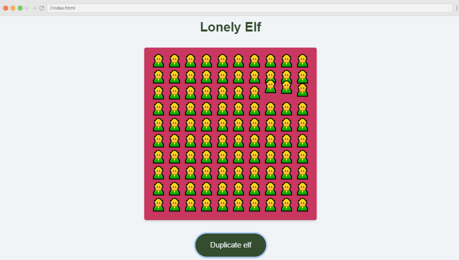

#### The post-JavaScriptmas 2021 post! This article wraps up Scrimba's monumental 24-day event! All winners, community highlights, Livestream, Podcast, and new Scrimba YouTube celebrity teacher announced!

---

---

Scrimba has done it again! Another monumental JavaScriptmas event! Over 6,000 participants and over 17,000 code solutions were submitted!

Scrimba has encouraged its students to code every day for 24 days in a fun and festive way!

JavaScriptmas participants had the opportunity to share their code solutions with the community via Twitter and Discord, and they received positive feedback and encouragement from fellow coders!

Throughout the month, members of Scrimba selected code solutions from JavaScriptmas participants that "caught their eye," and they shared them on the [Weekly Web Dev Challenge](https://weeklywebdevchallenge.scrimba.com/javascriptmas/javascriptmas.html) website! Several of these coding solutions were also featured in the YouTube JavaScriptmas 2021 Live Finale!

---

**The JavaScriptmas 2021 Live Finale hour event:**

* Amazing solutions from the community featured
* Coding the last challenge live
* Drawing the grand prize winner

---

### JavaScriptmas 2021 Live Finale!

<iframe width="853" height="480" src="https://www.youtube.com/embed/_TTqPlKjX2Y" title="YouTube video player" frameborder="0" allow="accelerometer; autoplay; clipboard-write; encrypted-media; gyroscope; picture-in-picture" allowfullscreen></iframe>

---

### Community Highlights

Well, it looks like I'm not the only one who found **Matt's** ([@mattemmmmm](https://twitter.com/mattemmmmm)) "Snowman Customiser," Michael and Leanne found it too!

The same project of Matt's, which I featured in my last article, was also featured in Scrimba's JavaScriptmas 2021 Live Finale!

When you are finished customizing Matt's snowman, you can send it to the beach and watch him melt!

---

---

**Link to Matt's scrim: [scrimba.com/scrim](https://scrimba.com/scrim/co4e5429aa3a5a32e06da2e45)**

---

**Debbie** ([@debbie_digital](https://twitter.com/debbie_digital)), featured in my first JavaScriptmas 2021 article, was also featured in Scrimba's JavaScriptmas 2021 Live Finale! 

In Debbie's Reindeer Speedometer project, the background image changes with a corresponding picture of the current location selected, nicely done!

---

---

**Link to Debbie's scrim: [scrimba.com/scrim](https://scrimba.com/scrim/cocb045b581449780b148f1ba)**

---

**Muhammad Tahir** ([@tahir__k](https://twitter.com/tahir__k)), featured in my second JavaScriptmas 2021 article, was also featured in Scrimba's JavaScriptmas 2021 Live Finale! 

Muhammad Tahir's Reindeer Speedometer project also changes the background image with a corresponding picture of the selected current location. The project also includes an average speed as well as an overall average.

---

---

**Link to Tahir's scrim: [scrimba.com/scrim](https://scrimba.com/scrim/cocbd49ccbd3c0558b38d5a71)**

---

Up next, **Aaron's** Lonely Elf project was featured in Scrimba's JavaScriptmas 2021 Live Finale! 

In Aaron's project, the elves are duplicated each time the "Duplicate Elf" button is clicked; one elf becomes two, two elves become four, four elves become eight, and so forth.

However, once the elves exceed one hundred in number, the elf overlord starts to reduce the elves, one by one, until there are exactly one hundred elves. Finally, when the elves are reduced to one hundred, the elves animate in a jumping "wave,"  similar to the "wave" created by fans at a sporting event.

---

---

**Link to Aaron's scrim: [scrimba.com/scrim](https://scrimba.com/scrim/co85f4bb19c2f3f2f4dfebd25)**

---

The next featured project is **Simon's** Christmas Dogs Carousel. This carousel consists of adorable dogs in festive settings, and this project includes a zoom-in and zoom-out feature! Well done!

---

---

**Link to Simon's scrim: [scrimba.com/scrim](https://scrimba.com/scrim/co94a46b7bc2a176c2f5365ad)**

---

Next up is **Hugo's** Festivities Loading project. Hugo achieved the effect that I initially wanted; Hugo successfully designed the actual loading bar and made it look like a candy cane!

I will definitely be looking into his code to see how he accomplished this effect!

---

---

**Link to Hugo's scrim: [scrimba.com/scrim](https://scrimba.com/scrim/coafa404e887c2fbf8b4b1c65)**

---

Last but certainly not least is **David's** Desert Decider project. Not only does his project retrieve images of delicious desserts in a festive setting, but his project also stores the images in an array so that the user can click on a "Previous desert" button to view them! 

Michael, Leanne, and the Livestream audience, including myself, were very impressed! Well done, David!

---

---

**Link to David's scrim: [scrimba.com/scrim](https://scrimba.com/scrim/cob1f45cbb4cbd9c1fa3dc34f)**

---

***Be sure to check out all of the featured JavaScriptmas Solutions of the Day: [weekly web dev challenge](https://weeklywebdevchallenge.scrimba.com/javascriptmas/javascriptmas.html)***

Thank you, [Leanne](https://www.youtube.com/c/CodewithLeanne), for featuring my [day seven solution](https://scrimba.com/scrim/co5c24787b75a079234177e6d)!

---

### Coding the last challenge

**The last JavaScriptmas challenge, Sleigh Launcher, was coded live during the stream by Michael and Leanne. (Timestamp 4:50)**

---

### JavaScriptmas Winners

A FREE full-year subscription to Scrimba!

* Day 1: [@betocabadev](https://twitter.com/betocabadev)
* Day 2: @zero_ (Discord)
* Day 3: @Sid (Discord)
* Day 4: [@wonderbarstudio](https://twitter.com/wonderbarstudio)
* Day 5: @Eryk (Discord)
* Day 6: Nacho Vasquez ( Discord )
* Day 7: [@Vanshsh2701](https://twitter.com/Vanshsh2701)
* Day 8: [@AmethystCodes](https://twitter.com/AmethystCodes)
* Day 9: Eldocbrown ( Discord )
* Day 10: [@Mare_Duci](https://twitter.com/Mare_Duci)
* Day 11: [@claircedesign](https://twitter.com/claircedesign)
* Day 12: @marleigh (Discord)
* Day 13: @Emmanuel (Discord)
* Day 14: @Mik (Discord)
* Day 15: [@dsabalete](https://twitter.com/dsabalete)
* Day 16: [@Arbaaz_77](https://twitter.com/Arbaaz_77)
* Day 17: [@evla27](https://twitter.com/evla27)
* Day 18: [@graficdoctor](https://twitter.com/graficdoctor)
* Day 19: @Daniela (Discord)
* Day 20: @Mansi (Discord)
* Day 21: [@emily_nobbs](https://twitter.com/emily_nobbs)
* Day 22: [@emily_nobbs](https://twitter.com/emily_nobbs)
* Day 23: @Chula (Discord)
* Day 24: [@BlizZard](https://twitter.com/Muhamma50084948)

---

### Announcing the grand prize winner

The grand prize winner of Scrimba's JavaScriptmas event receives a lifetime Scrimba pro membership and $1,000 dollars!

The winner is picked at random, which gives everyone participating a fair chance of winning, regardless of their programming skill level.

After two random drawings that led to #JavaScriptmas "spam" entries, a winner was drawn that had indeed submitted an operational challenge.

And the winner is: [BlizZard](https://twitter.com/Muhamma50084948)

---

**Here is a message from BlizZard, found on the Scrimba Discord General channel:**

*To the Scrimba team and the entire community, I have no words to express my gratitude towards you. Still in shock that I won, literally shaking right now. The sole reason I participated in Javascriptmas was so that I could get some coding practice in during my exams where I normally would not have been doing any coding and never thought I would win. Javascriptmas is an amazing event and I would encourage everyone to participate in it. You never know, you could win just like me.* 

*Lastly, would just like to send a thank you to Scrimba and everyone who congratulated me.*

---

---

### The Scrimba "Team Christmas QnA" Podcast

In his special Christmas episode of the Scrimba Podcast, the Scrimba team joined to answer your questions, told us what they all would do if they won the lottery, and announced a new part-time teacher coming in 2022.

---

#### The name Scrimba

The common question of "Where did the name Scrimba come from" was answered.

Scrimba was first called Scrimbla. Scrimbla was a name given to a code editor created by [Sindre Aarsaether](https://twitter.com/sindreaars). 

Per joins in on the conversation and explains that the programing language used to create their screencasts is called "Imba." So naturally, when you make a screencast using Imba, you get a "screen-Imba" (Scrimba)! Scrim for short.

---

#### Updated Scrimba Screencast

The great news is the Scrimba team technicians tell us that they are just "scratching the surface" when it comes to utilizing the full potential of Imba to create their screencasts.

Currently, a new updated version of the Scrimba screencast is in the works, as the Scrimba team technicians work on overhauling their website!

---

#### Code Reviews

As part of the new updated version of the Scrimba screencast, a feature is being created where students can review other students' code (scrims)!

We are told that the best way to learn is to teach, and with the upcoming Code Reviews feature, we will be able to do just that!

---

#### Winning the Lottery

For me, the funniest answer to "what they all would do if they won the lottery" is buying a Limo and using it to drive everywhere in casual clothes!

---

#### New Teacher Announced

During the Podcast, YouTube celebrity [Kevin Powell](https://www.kevinpowell.co/), also known as "The King of CSS," will be joining the Scrimba team in 2022 as a part-time teacher!

To learn more about Kevin Powell, you can read my [Teacher Feature: Kevin Powell](https://selftaughttxg.com/2021/05-21/TeacherFeature-KevinPowell/) article.

---

***Be sure to listen to the entire Podcast episode!***

<iframe width="100%" height="180" frameborder="no" scrolling="no" seamless src="https://share.transistor.fm/e/a7082ce2"></iframe>

---

### My JavaScriptmas Submissions 

**Below is my list of each day's completed JavaScriptmas challenges.**

*I hope that "**Scrimba Claus**" checks it twice!*

---

###### *Pixabay: Illustration by Mohamed Hassan* 

---

### My JavaScriptmas submissions 
| Date          |      Scrim    |
| ------------- | :-----------: |
| 12/01/2021    | [Countdown To Christmas](https://scrimba.com/scrim/coa0a4b3fa1f7c1469fc7920b)  | 
| 12/02/2021    | [Toggle Christmas Theme](https://scrimba.com/scrim/co13e44988d021d0d1ef8e4d1)  |
| 12/03/2021    | [Don't Scare your Relatives](https://scrimba.com/scrim/co15a4778919bad3308cc5e49)  |
| 12/04/2021    | [Shopping Checklist](https://scrimba.com/scrim/co0a54eebb3e6a888a05f94cf)  |
| 12/05/2021    | [Christmas Card Writer](https://scrimba.com/scrim/co7204e0b987eed3efa96a0ba)  |
| 12/06/2021    | [Text Christmassifier](https://scrimba.com/scrim/coa87417580e41f42970058b5)  |
| 12/07/2021    | [Play a Christmas Song](https://scrimba.com/scrim/co5c24787b75a079234177e6d)  |
| 12/08/2021    | [Bell Animator](https://scrimba.com/scrim/co2634920a12d1a428048aa66)  |
| 12/09/2021    | [Turn on the Decorations](https://scrimba.com/scrim/coea94082b722874a3fed1b40)  |
| 12/10/2021    | [Festivity Loader](https://scrimba.com/scrim/co6be476bbf1d964ffd055afb) |
| 12/11/2021    | [Christmas Carousel](https://scrimba.com/scrim/co2ae432c849fa2c68b22a2b0) |
| 12/12/2021    | [Christmas Guest List](https://scrimba.com/scrim/co57849489b5b872f7d95e6c0) |
| 12/13/2021    | [Christmas Dinner Calculator](https://scrimba.com/scrim/co6fc45678b7d9762466fb26b) |
| 12/14/2021    | [Lonely Elf](https://scrimba.com/scrim/co4d14c2785de4a5cb7e6b805) |
| 12/15/2021    | [Festive Translator](https://scrimba.com/scrim/co8ae4be3b351f697d2bcf9e1) |
| 12/16/2021    | [Christmas Movie Selector](https://scrimba.com/scrim/co8ce40b0a12419459e43b603) |
| 12/17/2021    | [Naughty List, Nice List](https://scrimba.com/scrim/co2084003a0b1807b15162873) |
| 12/18/2021    | [Custom Shopping Checkboxes](https://scrimba.com/scrim/co00347cf90b815d5e251d8b5)     |
| 12/19/2021    | [Dessert Decider](https://scrimba.com/scrim/cobd94581a9a68d928e5de523) |
| 12/20/2021    | [Snowman Customiser](https://scrimba.com/scrim/cobfd4b289c653c53f9246e76) |
| 12/21/2021    | [Reindeer Speedometer](https://scrimba.com/scrim/cofa042da8ed2d57239499fdb) |
| 12/22/2021    | [Christmas Stress Buster](https://scrimba.com/scrim/coab94ff0b4711a38fadd2ca1) |
| 12/23/2021    | [Customisable Santa Sign](https://scrimba.com/scrim/co2024effabdb070a624a7f52) |
| 12/24/2021    | [Sleigh Launcher (Coded along with the JavaScriptmas Livestream!)](https://scrimba.com/scrim/co325435886e2fbbe8027f266)
 |

---

#### *Coming soon!*

---

**Be sure to check out my related articles!**

* [Review: Scrimba's Weekly Web Dev Challenge](https://selftaughttxg.com/2021/01-21/ReviewScrimbaWebDevChallenge/)
* [Scrimba: JavaScriptmas 2020](https://selftaughttxg.com/2020/12-20/Scrimba-JavaScriptmas_2020/)
* [The Post-JavaScriptmas 2020 Post](https://selftaughttxg.com/2020/12-20/The_Post-JavaScriptmas_2020_Post/)

---

#### **Scrimba has once again impressed and inspired me! You can read my full [Scrimba review](https://selftaughttxg.com/2020/12-20/Review-Scrimba/) on my 12/13/2020 post.**

#### *"That&#39;s one of the best Scrimba reviews I&#39;ve ever read, <a href="https://twitter.com/MikeJudeLarocca?ref_src=twsrc%5Etfw">@MikeJudeLarocca</a>. Thank you! 🙏 "*
###### &mdash; Per Harald Borgen, CEO of Scrimba <a href="https://twitter.com/perborgen/status/1338462544143540227?ref_src=twsrc%5Etfw">December 14, 2020</a></blockquote>

---

### Conclusion

JavaScriptmas is a wonderful festive seasonal event created by Scrimba. Participants grow their coding skills, and their "online" presence, by being encouraged to code every day during the event and sharing their solutions with the community.

JavaScriptmas participants of all coding levels receive an equal opportunity to win prizes throughout the event due to Scrimba's craftily created "raffle" style contest; the more you code and submit valid solutions, the more chances you have to win!

In 2022, Scrimba will be updating its already amazing unique screencast technology that allows students to pause, edit code, and resume lessons, making it even better! One of the updates is a "Code Review" feature where students can take the role of teachers. Finally, Scrimba is adding YouTube celebrity Kevin Powell to their staff!

There is still time to get a 70% discount on a year of Scrimba Pro membership! [Offer at midnight GMT time on January 1st](https://click.convertkit-mail.com/d0url5kp4es0h22l00sm/n2hohvhnrew9oka0/aHR0cHM6Ly9zY3JpbWJhLmNvbS9wcmljaW5nP2NvdXBvbj1jaHJpc3RtYXMtZGlzY291bnQtMjAyMS1xYXgjam9pbg==).

---

###### Are you now interested in participating in this year's Scrimba's JavaScriptmas? Have you already participated in last year's Scrimba's JavaScriptmas? Please share the article and comment!