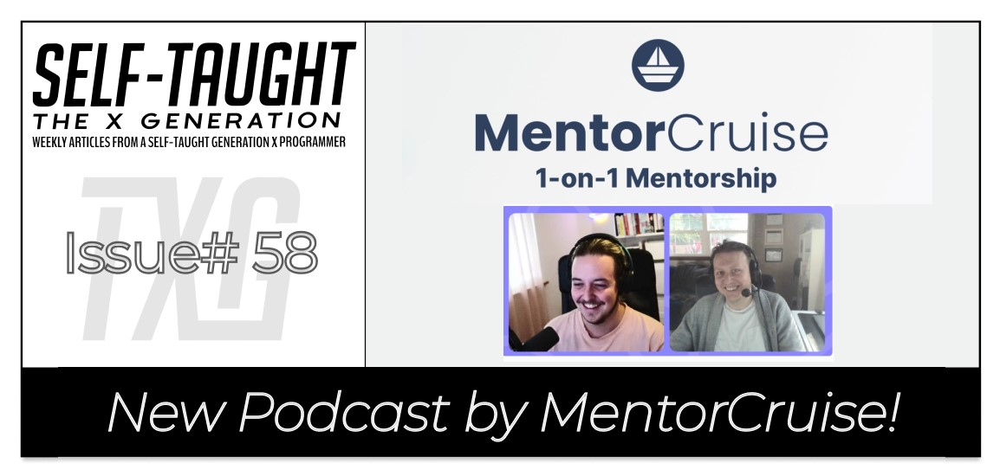
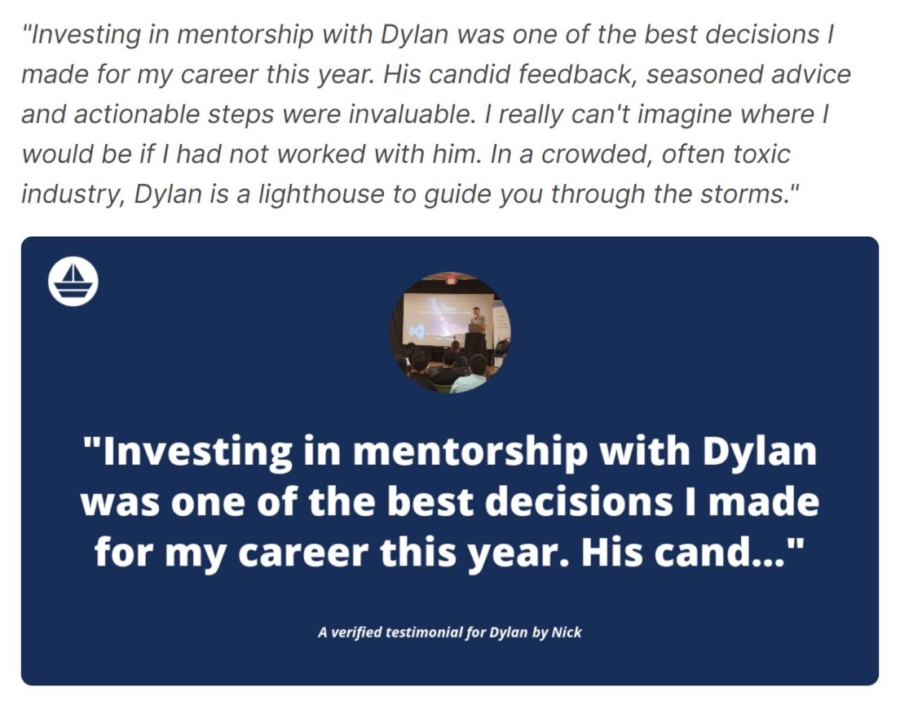

#### Would you like 1-on-1 help from industry experts to help you break into tech? In this weeks' article, I cover MentorCruise's new Podcast featuring tech celebrity Dylan Israel, the guest on episode one!

---

---

### About MentorCruise

Through MentorCruise, you can hire a dedicated career coach to help and support you in reaching your goals for a flat monthly price.

---

*"Want to ace your next job interview? Successfully build your startup? Itching to learn high-demand skills? Work smart with an online mentor or coach by your side to offer expert advice and guidance to match your zeal. Become unstoppable using MentorCruise."*

> -MentorCruise

---

### About Dylan Israel

Dylan Israel is currently a [Front End Engineer II](https://www.amazon.jobs/en/jobs/1413095/front-end-engineer-ii#:~:text=As%20a%20Front%20End%20Engineer,%2Dclass%20customer%2Dfacing%20experiences.) at Amazon, a Mentor, and an Educator.

Dylan has built courses on JavaScript, TypeScript, and Front End technologies. He speaks at conferences, has created over 1,000 videos on software engineering, and is Co-Host of the "[Self-Taught or Not](https://www.selftaughtornot.com/)" Podcast.

---

### The MentorCruise Podcast

The MentorCruise Podcast is a brand new Podcast consisting of in-depth conversations with their Mentors.   

---

### EP 1 - Breaking into big tech with Dylan Israel

Dylan Israel is the first guest on the new MentorCruise Podcast, and the topic is "**Breaking into big tech**."

Dylan discusses his path to success as a self-taught developer during the Podcast, from his humble beginnings to landing his first job at a "FAANG" company. 

*(* ***FAANG:*** *Facebook, Amazon, Apple, Netflix, and Google)*

---

*"It took four years to be an overnight success!"*

> -Dylan Israel

---

### Humble Beginnings

Like many people, Dylan chose to go to college because it was the typical path. Admittedly, Dylan only gave college a "half effort" because he wasn't happy there.

Dylan decided to drop out of college to pursue becoming a software engineer on his own. He describes his first job in tech as "a cross between a business analyst and a technical writer." He worked 50 hours a week.

Continuing his education, Dylan spent a lot of time taking coding courses from online schools; Dylan cites [Codecademy](https://www.codecademy.com/) and [freeCodeCamp](https://www.freecodecamp.org/).

While learning with these online schools, Dylan created his own [YouTube channel](https://www.youtube.com/user/pizzapokerguy87), where he documents and teaches what he is learning. 

---

"*I just wanted an interesting side project that would catch people's eyes, and maybe I could make some money in the best-case scenario."*

> -Dylan Israel

---

**Many people found Dylan's resourceful and inspirational YouTube channel and coded along with him, including me!**

However, not everyone shared my positive opinion of [Dylan Israel's YouTube Chanel](https://www.youtube.com/user/pizzapokerguy87). Throughout his self-taught coding journey, Dylan has come across traditionally trained developers and "[Trolls](https://en.wikipedia.org/wiki/Internet_troll)" who were vocal about their disbelief in his ability to become a professional engineer.

---

*"The comment was like, Hey! Self-taught engineers will never be engineers or something like that. Part of it was maybe a chip on my shoulder and being like, listen, I can work anywhere, and I will prove it to you, and am going to Big 4, big tech companies."*

> -Dylan Israel

---

**Dylan pursued his journey and persevered in becoming a professional engineer despite their negativity.**

---

### How Dylan landed a job at Amazon

Dylan worked at [Price Waterhouse Cooper](https://www.pwc.com/), a big company, but not a big tech company. He credits all of his "**passion projects**" in drawing the attention of tech recruiters.

---

*"For the recruiters to reach out, they have to say, 'Hey, maybe this person knows what they are doing and is a very passionate engineer, and let us give him a shot.' Right?"*

> -Dylan Israel

---

**Dylan secured an interview at Amazon through a recruiter that reached out to him. Two weeks after the interview, Amazon hired Dylan.**

---

---

### What to expect at a FAANG interview

**Amazon was not the first FAANG company Dylan interviewed for. He interviewed five times at FAANG companies before being hired.**

Dylan informs us that each FAANG interview is a four to six-hour process.

---

*"I had 5 FAANG interviews before I got my first FAANG job, right? And that is not a fun process to go through by any means, right? That is probably 30 hours of just interviews that did not amount to much of anything other than a learning experience. It absolutely is worth and it absolutely has made me a better engineer and has had a positive impact on my career trajectory."* 

> -Dylan Israel

--- 

Dylan tells us, although all of his "passion projects" got him the attention he needed to get his foot in the door of FAANG companies, during the interview, all of that "goes out the window," and it's straight onto "data structures and algorithms tests."

**In addition to data structures and algorithms questions, FAANG companies also require you to take behavioral tests. Dylan tells us that we need to show that we have confidence, and we need to believe in our own skillset, or "people are going to pick up on that," and they are not going to hire us.** 

---

*"You have to be able to sell yourself. You have to be able to answer questions, interact. So much of any job is not only the technical part. Do people perceive you are going to be easy to work with? that you are going to be fun to work with? and that they are going to ask you a question and you are not just going to grunt back at them, right? So, I do not think you need to be an extrovert by any sense of imagination, but you have to be able to communicate your experience and be confident that you can, for some of those behavioral questions."*

> -Dylan Israel

---

### What FAANG companies look for in candidates

**During the Podcast, Dylan provides us with valuable information on what big tech companies look for in candidates:**

*"It is like, hey, we want somebody who brings something different to the team, and it is going to make the team better."*

> -Dylan Israel

---

Dylan tells us there are many applicants to the big "FAANG" tech companies and explains what the applicants have in common and what will help you to stand out.

**Applicants have in common:**

* Software engineer
* Work experience

**How Dylan stands out from other applicants:**

* Course Creator
* YouTuber
* Podcaster
* Conference Speaker
* Mentor

---

*"How am I different than other engineers? Well, I build courses, I do YouTube. I have podcasts. I spoke at conferences. And then they were, great! We found our diamond in the rough type of guy."*

> -Dylan Israel

---

**Dylan also tells us, to pass the interview, we have to be confident and be able to articulate our expertise clearly.**

---

### What Dylan does at Amazon

Dylan works at Amazon as a "[Front End Engineer II](https://www.amazon.jobs/en/jobs/1413095/front-end-engineer-ii#:~:text=As%20a%20Front%20End%20Engineer,%2Dclass%20customer%2Dfacing%20experiences.)" on a project called [Explore](https://www.amazon.com/b?ie=UTF8&node=19424628011).

**Dylan describes the Amazon Explore project,** *"we are digitizing travel and experiences. It is a web RTC real-time streaming app, a pretty fun thing, different than building your traditional e-commerce platform or component library that I have done in the past."*

You can use this link to check out Amazon's [Explore](https://www.amazon.com/b?node=19419898011&ref_=ae_nav_lgo), which is currently in its beta version.

---

---

### Dylan as a Mentor

**Dylan is a top mentor on [MentorCruise](https://mentorcruise.com/mentor/DylanIsrael/) with a five-star rating from over thirty mentees.**

Also, Dylan provides his own created courses for **FREE** for all of his MentorCruise mentees!

---

 
---

***You can read the entire transcript and listen to the full episode on the [MentorCruise website](https://mentorcruise.com/blog/breaking-into-big-tech-w-dylan-israel-95a7d/)!***

---

### Erik Hanchett as a Mentor

Did you know that Dylan's [Self-Taught or Not](https://www.selftaughtornot.com/) Podcast Co-Host Erik Hanchett is also a [MentorCruise mentor](https://mentorcruise.com/mentor/erikhanchett/)?

Erik has a Bachelor's Degree in Computer Science and an M.B.A. in Entrepreneurship from the University of Nevada, Reno. Erik also works at Amazon as a Front End Engineer.

---

---

*To learn more about Erik, you can read my article: [Erik Hanchett: Advice on how to get your first developer job from an Amazon Front-End Engineer](https://selftaughttxg.com/2021/08-21/ErikHanchett-AdviceOnGettingYourFirstDevJob/)* 

---

### Dominic Monn Links

The host for the MentorCruise Podcast is **Dominic Monn**. Be sure to give him a follow!

* [Twitter](https://twitter.com/dqmonn)

* [GitHub](https://github.com/dmonn)

---

#### *Be sure to check out the [MentorCruise website](https://mentorcruise.com/)!*

---

### Dylan's Projects

**YouTube channel** 

Dylan's YouTube channel [CodingTutorials360](https://www.youtube.com/c/CodingTutorials360/about) has over 79,000 subscribers, and the channel's total views are over 5.8 million.

**YouTube channel description**

*"Coders and inspiring programmers have come to the correct channel. Daily uploads of multiple object-oriented programming languages. Specializing with JavaScript and its frameworks such as jQuery, Angular, React, and more. Most of the content is focused around online tutorial sites such as Codecademy, FreeCodeCamp, and CodeCombat."*

---

**Podcast**

The [Self-Taught or Not](https://www.selftaughtornot.com/) Podcast covers the "do's and don'ts" of software development and is hosted by Dylan Israel & Erik Hanchett. 

*Dylan tells us he put his YouTube and Podcast on hold as he is currently building courses.*

---

**Building courses for:**

* LinkedIn Learning
* w3schools

For **LinkedIn Learning**, Dylan created a course for Unit Testing with Jasmine and a course for TypeScript.

Many self-taught developers find their way to [w3schools](https://www.w3schools.com/) when learning how to code, including Dylan. Now Dylan is creating "[TypeScript](https://en.wikipedia.org/wiki/TypeScript)" content for w3schools!

---

### My other Dylan Israel articles

* [Communication skill advice from a six-figure Amazon developer](https://selftaughttxg.com/2021/06-21/06-28-21/)

* [Job Search and Interview Tips with Dylan Israel](https://selftaughttxg.com/2021/03-21/JobSearchAndInterviewTipsWithDylanIsrael/)

* [Teacher Feature: Dylan Israel](https://selftaughttxg.com/2020/12-20/12-06-2020_TeacherFeature-Dylan_Israel/)

---

### Dylan's links

* [Hire Dylan to mentor you via MentorCruise](https://mentorcruise.com/mentor/DylanIsrael)

* [Dylan Israel's website](http://dylanisrael.com/)

* [Dylan Israel's YouTube Chanel](https://www.youtube.com/user/pizzapokerguy87)

* [Self-Taught or Not website](https://www.selftaughtornot.com/)

* [Dylan Israel's Udemy courses](https://www.udemy.com/user/dylanisrael/)

* [Dylan Israel's Github](https://github.com/PizzaPokerGuy)

* [Twitter](https://twitter.com/PizzaPokerGuy)

* [LinkedIn](https://www.linkedin.com/in/dylan310/)

---

### Advance your career with a 20% discount on Scrimba Pro using this [affiliate link](https://scrimba.com/?via=MichaelLarocca)!

Become a hireable developer with Scrimba Pro! Discover a world of coding knowledge with full access to all courses, hands-on projects, and a vibrant community. You can [read my article](https://selftaughttxg.com/2021/06-21/06-07-21/) to learn more about my exceptional experiences with Scrimba and how it helps many become confident, well-prepared web developers!

###### ***Important:*** *This discount is for new accounts only. If a higher discount is currently available, it will be applied automatically.*

**How to Claim Your Discount:**
1. Click [the link](https://scrimba.com/?via=MichaelLarocca) to explore the new Scrimba 2.0.
2. Create a new account.
3. Upgrade to Pro; the 20% discount will automatically apply.

##### ***Disclosure:*** *This article contains affiliate links. I will earn a commission from any purchases made through these links at no extra cost to you. Your support helps me continue creating valuable content. Thank you!*

---

### Conclusion

In just under five years, as a self-taught developer, Dylan Israel went from being a college dropout to a six-figure employee of a highly sought-after "FAANG" company, Amazon.

In addition to building his online presence through his YouTube channel, Podcast, courses, and public speaking, Dylan credits having a mentor as a significant contributor to his "path to success." 

Dylan has come full circle; He was instructed by a mentor and is now a five-star mentor at MentorCruise!

---

###### Are you now interested in 1-on-1 help from a MentorCruise industry expert? Have you already been mentored by an industry expert, or are you a mentor yourself? Please share the article and comment!

---

