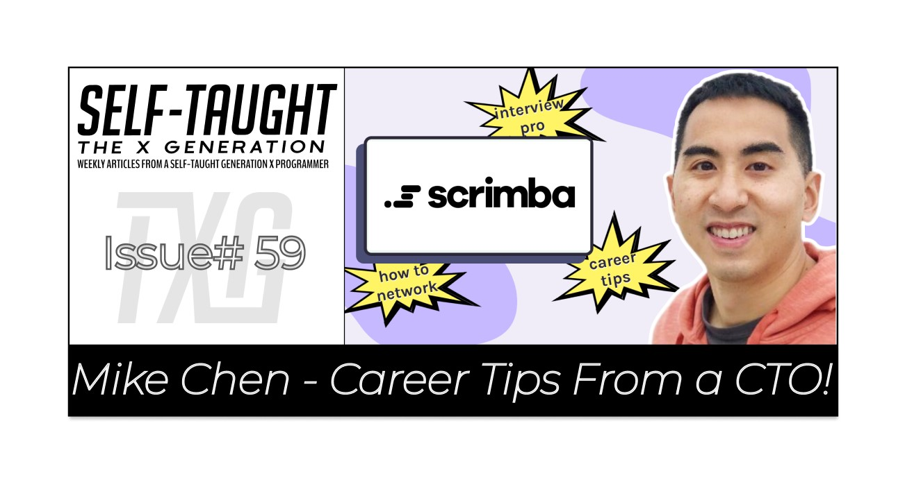
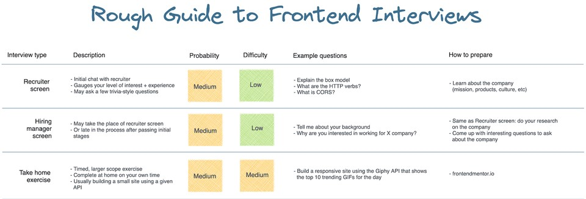
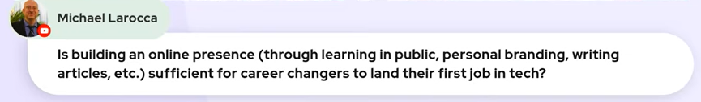

### Mike Chen: Career Tips From a CTO

In this week's article, CTO and co-founder at Motivo Mike Chen visits us on a Scrimba Livestream to give us the tips we need to help us break into tech! Interview prep, salary negotiation, and more!

--- 

---

### About Mike Chen

Mike Chen is a self-taught developer that has worked at [Airbnb](https://www.airbnb.com/) and Google. He is now Co-Founder and CTO (chief technical officer) at [Motivo](https://motivohealth.com/).

Mike Chen is also an active member of the "Tech Twitter" community. He is always helping out aspiring web developers with his expertise to help them "transition into tech!"

---

Motivo is the first HIPAA-compliant platform connecting therapists to clinical supervisors.

*"Motivo connects new therapists with experienced clinical supervisors from the beginning to the end of the therapist licensure process."*

> -[Motive.com](https://motivohealth.com/).

---

### Interview Prep

Mike Chen has done over a hundred frontend interviews on both sides of the interview table at companies of all sizes. 

He streams every Friday from 8-9:30 AM PST on [His Twitch channel](https://twitch.tv/genericmikechen), and he invites us to bring our questions about the interview process! 

After the Twitch stream, Mike holds a Q&A session to provide feedback for the participants.

---

James Robinson, who is Mike's friend and Twitch stream partner, created a helpful chart that is available on **reddit.com**:
[a rough guide to the frontend interview process](https://www.reddit.com/r/webdev/comments/rs8wlw/a_rough_guide_to_the_frontend_interview_process/)

---

---

### Elevator Pitch

Mike advises us to have an "[elevator pitch](https://en.wikipedia.org/wiki/Elevator_pitch)" readily prepared for interviews.

**Pitch for your background**

* Who you are
* Why are you interested in tech
* What are you passionate about

**In addition to having our elevator pitch prepared, we need to research the company well and know the companies core values.**

**Mike tells us,** *"Interviewing is sales. You're selling yourself, and you need to be selective about what you tell them in order to convince them that you're the right fit."*

---

### S.T.A.R.

#### [Situation, task, action, result](https://en.wikipedia.org/wiki/Situation,_task,_action,_result)

**Mike advises us to be ready with stories of problematic situations we have encountered in our work experience to discuss during interviews.**

**We will need to provide a compelling example of:**

* The situation
* The task
* The action taken
* What was the result was

Be sure to provide a story that ends with a successful resolution that you came up with that solved the problem of the situation.

---

### What is your weakness?

As a hiring manager, Mike does not ask, "**what is your weakness**." However, he provides advice on how to handle this question.

**Mike tell us to avoid saying things such as:**

* I'm an overachiever
* I work too hard

Hiring managers will see through the “**trying to make yourself look good**” approach while you’re supposed to be answering what your weakness is.

We are advised to be tactful when providing a weakness and always offer a "**call to action**" on how we are working toward improving it. For example, if we say our weakness is public speaking, we can discuss how we hired a coach to help “instruct and train us.”

---

### Salary Negotiation

**Mike tells us that a company's first offer is almost always less than they are willing to pay and expect you to negotiate.**

Mike advises us to “**do our market value research for the job you are applying for**.”

---

*“How much does a Front End Web Developer make? The national average salary for a Front End Web Developer is $73,157 in the United States.”*

> -[Glass door](https://www.glassdoor.com/Salaries/front-end-web-developer-salary-SRCH_KO0,23.htm)

---

### Transferable Skills

**How do you sell yourself as a self-taught developer to an employer?**

As a hiring manager, Mike tells us to detail our "**transferable skills**" to help us stand out from other applicants.

As an example, Mike tells us if you are transitioning from a teaching background, you need to be thorough in "**connecting the dots**." Demonstrate how your teaching experience will transition into teaching others how to code. A great way to achieve this and demonstrate your knowledge is to write articles!

**Detail your transferable skills on your:**

* Resume
* Cover Letters
* e-mails to potential hiring managers
* LinkedIn
* Blog Articles 

**Mike also advises us to personalize cover letters and thoroughly research the companies we apply to.**

Companies will have a set of "**core values**." Mike encourages us to learn the core values of the companies we apply for and use that knowledge to align ourselves as being a "**good culture fit**" while being interviewed.

---

### Joining a Community

During the Livestream, Rasha, an audience member, asked a question about staying motivated as a self-taught developer.

---

---

Mike noticed, as well as I did, that Scrimba has a thriving Discord community. Mike encourages us to join the Scrimba community so that we may receive the encouragement, help, and support that was not available to him when he was learning how to code.

*To learn about my experience with Scrimba's Discord community, you can read my article: [I Get By With a Little Help from My Friends](https://selftaughttxg.com/2021/01-21/LittleHelpFromMyFriends/)*

---

<iframe width="956" height="538" src="https://www.youtube.com/embed/EXWar7Mywyo" title="YouTube video player" frameborder="0" allow="accelerometer; autoplay; clipboard-write; encrypted-media; gyroscope; picture-in-picture" allowfullscreen></iframe>

---

#### *Be sure to watch the whole Scrimba Livestream!*

---

Learning in Public

Why are some people afraid of learning in public? Mike addresses this question by letting us know that he was one of them!

**People are afraid of:**

* Being wrong
* Being judged
* People not engaging

**Mike explains,** *"you're going to be wrong and that it is ok to be wrong."* 

If you can take a correction gracefully, in public, that will prove that you can learn from your mistakes and that you are coachable, which is an essential trait for junior developers.

---

**Here are articles I wrote about learning in public:**

* [Shawn Wang (Swyx): Actionable tactics that will help you to become hireable](https://selftaughttxg.com/2021/07-21/Swyx-ActionableTactics/)
* [The Importance of Learning in Public](https://selftaughttxg.com/2021/08-21/TheImportanceOfLearningInPublic/)

---

### Building an online presence

**During the Livestream, here is the question I asked:** *"Is building an online presence (through learning in public, personal branding, writing articles, etc.) sufficient for career changers to land their first job in tech?"* 

> -Timestamp 53:00

---

---

Mike tells us that building an online presence is "**very helpful**," but it is not sufficient. We will still need to have a polished resume, LinkedIn profile, Portfolio, learn how to interview well, and acquire the technical skills required for the job. After this preparation, our online presence will "set us apart and elevate us beyond other applicants."

**The good news is I have also reviewed/participated in other Scrimba events covering these topics, and I wrote the following articles documenting the process. You may find valuable insight from them:**

* [Resumes - Jermaine "Jupiter" Murray](https://selftaughttxg.com/2021/05-21/CreateCVsAndResumesThatGetNoticedByTechRecruiters/)
* [LinkedIn - Danny Thompson](https://selftaughttxg.com/2021/05-21/LinkedInReviewWithDannyThompson/)
* [LinkedIn - Molly-May Gallagher](https://selftaughttxg.com/2021/03-21/LinkedIn-Profile-Review/)
* [PortfolioWebsite - Molly-May Gallagher](https://selftaughttxg.com/2021/05-21/PortfolioWebsite/)
* [Interview Tips - Molly-May Gallagher](https://selftaughttxg.com/2021/04-21/InterviewTipsFromATechRecruiter/)
* [JobSearch and Interview Tips - Dylan Israel](https://selftaughttxg.com/2021/03-21/JobSearchAndInterviewTipsWithDylanIsrael/)
* [Leveraging Recruiters - Taylor Desseyn](https://selftaughttxg.com/2021/09-21/TaylorDesseyn-LeveragingRecruiters/)

---

### Mike Chen Links

* [Twitter](https://twitter.com/genericmikechen)
* [LinkedIn](https://www.linkedin.com/in/chenhmike/)
* [Website](https://mikechen.io/)
* [Twitch](https://twitch.tv/genericmikechen)

---

### Conclusion

Being adequately prepared will significantly help us in passing interviews. We need to know the current market value of the position we are applying for and be willing to negotiate to secure proper compensation.

Practicing via mock interviews will help us improve our elevator pitch, discuss "S.T.A.R." situations, articulate transferable skills, and help us to feel more comfortable talking about our weaknesses. 

Creating an online presence by learning in public will provide us with a competitive advantage by demonstrating our programming abilities and work ethic, ultimately giving us the best chance of being hired!

---

##### **Let's connect! I'm active on [LinkedIn](https://www.linkedin.com/in/michaeljudelarocca/) and [Twitter](https://twitter.com/MikeJudeLarocca).**

---

###### Did Mike's advice on interview preparation help you? Would you like to or have you already participated in Mike's Twitch stream mock interview? Please share the article and comment!

---

