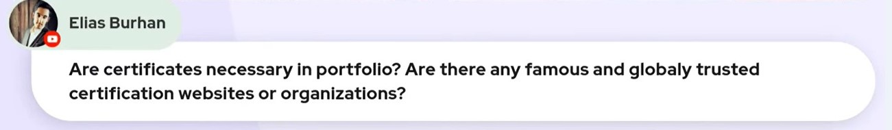
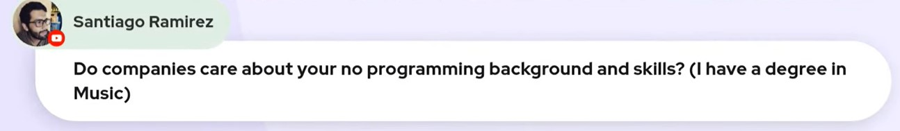
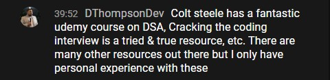

### Tech Rally - Career Tips From an Amazon Dev

#### In this week's article, Alexander Lee (Tech Rally) joins us on a Scrimba Livestream to give us the tips we need to help us break into tech! Portfolio building, networking, interview guidance, and more!

---

---

### About Alexander Lee (Tech Rally)

Alex graduated from the University of California, San Diego (UCSD) in 2011 with a Mechanical Engineering degree. He currently works a Amazon as a Frontend Engineer.

Alex attended a three-month Bootcamp in Manhatten, and two months after completing it, he started a job as a full stack developer at an agency.

He realized he enjoyed front-end web development during his time at the agency and decided to make front-end his specialty.

Alex is a helpful member of the Tech Twitter community, where he regularly helps developers break their way into the tech industry!

---

### Portfolio

(WRITE ARTICLE SECTION)

---

### Purchase your own domain

(WRITE ARTICLE SECTION)

---

*"If you're not willing to invest in yourself, then how can you expect a hiring manager or recruiter to invest in you."*

> -Tech Rally 

---

### Portfolio Projects

(WRITE ARTICLE SECTION)

---

### Presentable GitHub

(WRITE ARTICLE SECTION)

* [Review: Eddie Jaoude Course - How to customize your GitHub Profile](https://selftaughttxg.com/2021/11-21/ReviewEddieJaoudeGitHubCourse/)
* [How to Create a Next Level GitHub Profile, with Jesse Hall](https://selftaughttxg.com/2021/11-21/CreateAGitHubProfileJesseHall/)

---

### Work Experience

As a developer trying to land your first job in tech, how can you apply for a job that requires work experience when you don't have work experience?

**Alex provides us with viable options for supplemental work experience to satisfy this work experience requirement.**

* Internships
* Freelancing

---

### Internships

(WRITE ARTICLE SECTION)

---

### Freelancing

(WRITE ARTICLE SECTION)

Alex tells us that freelancing counts as work experience to your resume.

---

Here is an important note about stating you're a **freelancer**. In a previous [LinkedIn review article I wrote](https://selftaughttxg.com/2021/05-21/LinkedInReviewWithDannyThompson/), Danny Thompson explains that people **unintentionally** falsify their work experience by stating that they are freelancers.

Danny Thompson explains there is a distinct difference between being a **freelancer** and being a **student**.

When you state that you are a freelancer, hiring managers want to see receipts, Meaning you were paid for your work.

---

<iframe width="956" height="538" src="https://www.youtube.com/embed/mPg2jZ2Nqxw" title="YouTube video player" frameborder="0" allow="accelerometer; autoplay; clipboard-write; encrypted-media; gyroscope; picture-in-picture" allowfullscreen></iframe>

#### *Be sure to watch the full Livestream!*

---

### Certificates

Although Alex does not have any certificates, he tells us if you do not have a traditional form of education such as a college degree, certificates are really good to have as an alternative.

---

---

Again referencing my previous [LinkedIn review article I wrote](https://selftaughttxg.com/2021/05-21/LinkedInReviewWithDannyThompson/), Danny Thompson explains that certifications that are taken at test centers such as Amazon (AWS) & Google certifications will be acknowledged by hiring managers. However, online certifications earned from home are more for our own growth and personal achievements.

---

### Transferable Skills

(WRITE ARTICLE SECTION)
TS-57:00

---

---

### Building your online presence

(WRITE ARTICLE SECTION)

---

---

### Networking

(WRITE ARTICLE SECTION)

**Twitter**

---

---

### Interviewing

(WRITE ARTICLE SECTION)

---

### Data Structure and Algorithms

(WRITE ARTICLE SECTION)

---

---

**Danny Thompson, during the Livestream, recommended the following resources,** *"​Colt Steele has a fantastic Udemy course on DSA, Cracking the coding interview is a tried & true resource, etc. There are many other resources out there, but I only have personal experience with these"*

* [JavaScript Algorithms and Data Structures Masterclass](https://www.udemy.com/course/js-algorithms-and-data-structures-masterclass/)
* [Cracking the Coding Interview: 189 Programming Questions and Solutions 6th Edition](https://www.amazon.com/Cracking-Coding-Interview-Programming-Questions/dp/0984782850)

---

### frontendeval

(WRITE ARTICLE SECTION)

[frontendeval](https://frontendeval.com/)

---

---

*"Get ahead of the curve by training with exercises that mimic the questions asked by top Silicon Valley companies and startups."*

>- frontendeval

---

**To learn about frontendeval's co-creator Mike Chen, you can read my article [Mike Chen: Career Tips From a CTO](https://selftaughttxg.com/2022/01-22/MikeChen/)**

---

### Tech Rally Courses

* [Practical Portfolio: Build a Portfolio Easily with HTML, CSS, and Themes](https://courses.techrally.co/practical-portfolio-build-a-portfolio-easily-with-html-css-and-a-bootstrap-theme)
* [Build a Sports Odds Application with ReactJS, React Bootstrap, and Rapid API](https://courses.techrally.co/unfiltered-development-build-a-sports-odds-application-with-reactjs-react-bootstrap-and-rapid-api)
* [The Ultimate Developer Environment Setup](https://courses.techrally.co/the-ultimate-developer-environment-setup)

---

---

### Tech Rally Links

* [Website](https://www.techrally.co/)
* [YouTube](https://youtube.com/c/techrally)
* [LinkedIn](https://www.linkedin.com/in/alexanderlee2/)
* [Twitter](https://twitter.com/TheTechRally)
* [Instagram](https://www.instagram.com/thetechrally/)

---

### Conclusion

(WRITE ARTICLE SECTION)

---

##### **Let's connect! I'm active on [LinkedIn](https://www.linkedin.com/in/michaeljudelarocca/) and [Twitter](https://twitter.com/MikeJudeLarocca).**

---

??

---