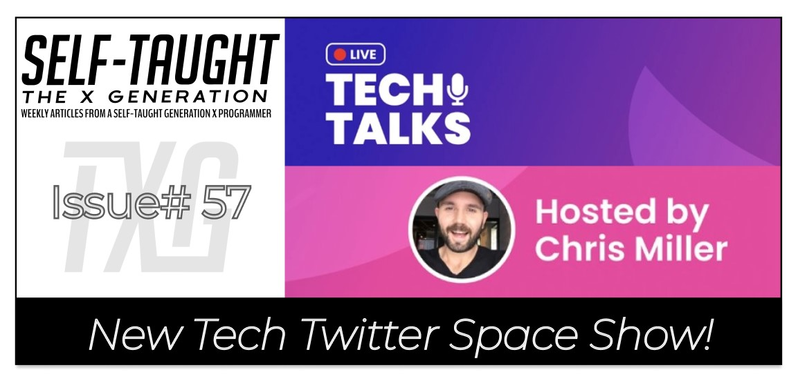
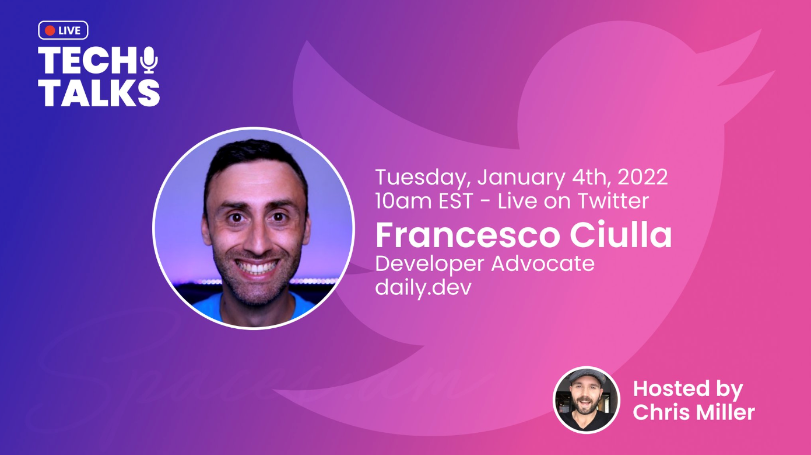
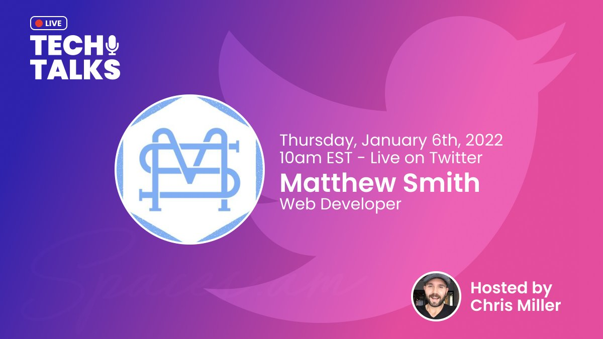
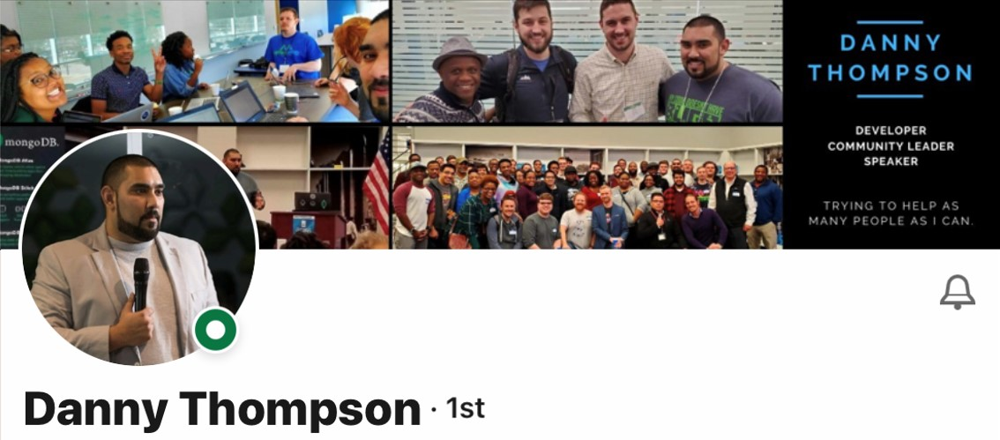

This article covers Chris Miller's new Twitter Space show "Tech Talks," a show where we get to know the person behind the tech: Francesco Ciulla and Matthew Smith with guest co-host Danny Thompson!

---

---

### About Chris Miller

Chris Miller is a web developer, an entrepreneur, and a Tech Twitter regular. Chris is the founder of [Prolific Digital](https://prolificdigital.com/) and resides in Louisville, Kentucky, United States.

---

### About Twitter Spaces

*Twitter Spaces is where live audio conversations happen.
The conversation about you and your content is at its best on Twitter, and now you can Tweet and talk. Spaces unlocks conversations on Twitter with the depth and power only the human voice can bring.*

> -Twitter

---

Twitter Spaces are held daily by members of the Tech Twitter community. Many conversations held on Twitter Spaces are enriched with valuable content, including advice, interventions, and life lessons taught through experience from seasoned professionals.

**However, unless you were present during these live-hosted Twitter Spaces, you missed out on this valuable content; Until now.**

---

### Tech Talks

Tech Talks is a new Twitter Space show hosted by Chris Miller where guests from the tech industry are invited on for the purpose of "getting to know the person behind the tech."

**Tech Talks takes advantage of the new feature released by Twitter, recorded Twitter Spaces!**

Tech Talks is scheduled two times per week, on Tuesdays and Thursdays at 10 am EST, and all episodes are available for replay!

---

---

### Episode 1

#### Francesco Ciulla

[Francesco Ciulla](https://www.youtube.com/c/FrancescoCiulla) is a developer advocate for [Docker](https://www.docker.com/), [DevOps](https://en.wikipedia.org/wiki/DevOps), and [Web3](https://en.wikipedia.org/wiki/Web3). 

Francesco has over 5,000 subscribers on his YouTube channel, where he interviews people in the tech world and creates content on Docker and Containers. He also has over 66,000 followers on Twitter.

---

During the Tech Talks episode, Francesco talks about his first Tweet, which was on the subject of "[SpaceX](https://www.spacex.com/)," which caught the attention of Chris. Francesco explains this Tweet was before he knew about Tech Twitter, and he was just "trying Twitter out." **Francesco then reveals that he wanted to be an astronaut when he was a child**.

---

*"I like the idea that there is always something that we can discover."*

> -Francesco Ciulla

---

Francesco continues talking about his childhood by telling us that he always liked computers and that his first computer was a [Commodore 64](https://en.wikipedia.org/wiki/Commodore_64).

Francesco elaborates on liking computers as he explains that he likes to build them, and he still builds computers until this day. **However, Francesco tells us that although he was interested in computers and technology, he did not envision it as a career**.

Francesco then talks about being a volleyball coach from the age of fifteen to thirty-two and being active in martial arts and other sports. He then tells us that his father was a gym teacher and that his mother is a math teacher.

--- 

***Francesco cites [Maximilian Schwarzmüller](https://www.udemy.com/user/maximilian-schwarzmuller/) as an influence, particularly the fact that Maximilian's accent improved as he taught more and more courses.*** 

---

During the lockdown due to the pandemic in 2020, Francesco saved three hours of commute time by starting to work remotely.

Francesco tells us he used the extra three hours a day building his Twitter followers.

Francesco also explains how working remotely via video calls helped him adjust to being comfortable in front of a camera.

On March 31st of 2021, Francesco quit his stressful job to become a full-time freelancer!

---

**Even though Francesco is knowledgeable in coding and technologies, he enjoys networking with fellow community members and getting to know them by inviting them onto his [YouTube show](https://www.youtube.com/c/FrancescoCiulla) and interviewing them.**

---

*"People are more important than the code they create."*

> -Francesco Ciulla

---

***Be sure to listen to the replay of the whole episode!***

**[Link to Episode 1](https://twitter.com/i/spaces/1MYxNnDQRXQxw?s=20)**

---

---

### Episode 2

#### Matthew Smith

In episode two, we are introduced to **[Matthew Smith](https://twitter.com/Matthew_WebDev)**. Like many of us, including myself, Matthew wants to land his first job in tech as a career changer.

Matthew Smith has spent many years as a professional chef in the foodservice industry. He describes the long hours he worked and how he believes the restaurant business model is broken. Matthew elaborates that the markup and the pay are low in the restaurant model, resulting in many businesses closing down shortly after the government enforced restrictions due to the pandemic.

Matthew is currently working as a freelance developer. Yet, he explains that the work, including the pay, is sporadic, and he does not enjoy the interpersonal business aspects of freelancing. Matthew would like a full-time steady job as a developer, where he can primarily focus on programming.

However, Matthew's current attempts at "**getting his foot in the door**" as a developer have proven difficult.

**Then during the Tech Talks episode, Chris Miller brings in an unannounced speaker to help Matthew, "tech celebrity" Danny Thompson!**

---

---

**During the Tech Talks episode, Danny Thompson expresses the importance of having a strong LinkedIn profile,  which will significantly enhance our chances of getting our foot into the tech industry door.**

Danny Thompson informs us that hiring managers have a different version of LinkedIn than we as users do. When hiring managers search for candidates, the information we put in our LinkedIn "**Headline**" shows up in the results. For example, my current LinkedIn Headline is: **(Front-End Web Developer | JavaScript | CSS | HTML)**.

**Also, Danny explains it is essential for us to list the job we want, not our current job.** In addition to listing the job you want, you will also want to list your skills in your LinkedIn "**Headline**," as I previously described.

---

***To learn more about optimizing your LinkedIn profile and to learn more about Danny Thompson, you can read my following articles:***

* [LinkedIn Review With Danny Thompson](https://selftaughttxg.com/2021/05-21/LinkedInReviewWithDannyThompson/)

* [TeacherFeature Danny Thompson](https://selftaughttxg.com/2021/03-21/TeacherFeature_DannyThompson/)

---

***Be sure to listen to the replay of the whole episode!***

**[Link to Episode 2](https://twitter.com/i/spaces/1djGXPDLvNvGZ?s=20)**

---

---

#### *Be sure to tune in to the next Tech Talks episode at 10 am EST on January 11th, 2022, with guest Katherine Peterson!*

---

---

### Spaces.am

Never miss out on an upcoming Twitter Space again! Chris invites us to signup for a mailing list from [Spaces.am](https://spaces.am/)!

"[Spaces.am](https://spaces.am/)" is a website coming soon to promote Twitter Spaces!

---

*"It's no longer a secret - we're building out a platform for show creators to list, share, and promote their spaces."*

> -Spaces.am

---

**You can also follow Spaces.am on Twitter: [@spaces_am](https://twitter.com/spaces_am)**

---

### Chris Miller Links

* [Twitter](https://twitter.com/millertchris)
* [LinkedIn](https://www.linkedin.com/in/millertchris/)
* [Website](https://prolificdigital.com/)
* [YouTube](https://www.youtube.com/user/MillerTChris)

---

### Advance your career with a 20% discount on Scrimba Pro using this [affiliate link](https://scrimba.com/?via=MichaelLarocca)!

Become a hireable developer with Scrimba Pro! Discover a world of coding knowledge with full access to all courses, hands-on projects, and a vibrant community. You can [read my article](https://selftaughttxg.com/2021/06-21/06-07-21/) to learn more about my exceptional experiences with Scrimba and how it helps many become confident, well-prepared web developers!

###### ***Important:*** *This discount is for new accounts only. If a higher discount is currently available, it will be applied automatically.*

**How to Claim Your Discount:**
1. Click [the link](https://scrimba.com/?via=MichaelLarocca) to explore the new Scrimba 2.0.
2. Create a new account.
3. Upgrade to Pro; the 20% discount will automatically apply.

##### ***Disclosure:*** *This article contains affiliate links. I will earn a commission from any purchases made through these links at no extra cost to you. Your support helps me continue creating valuable content. Thank you!*

---

### Conclusion

Chris Miller's new Twitter Space show "Tech Talks" is already proving to be a MUST LISTEN to show. Tech Talks premise is to "get to know the person behind the tech," but with tech industry intervention from professionals such as Danny Thompson, it's proving to be much more! 

Be sure to tune in LIVE to Chris Miller's "Tech Talks" Tuesdays and Thursdays at 10 am EST, or listen to the replay. All episodes are recorded Twitter Spaces!

---

###### Are you now interested in Chris Miller's new Twitter Space show "Tech Talks"? Have you already listened to the latest episode? Please share the article and comment!

