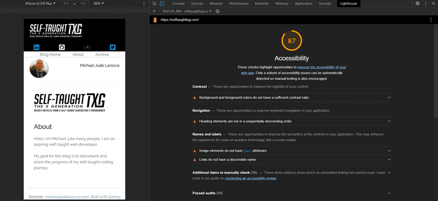
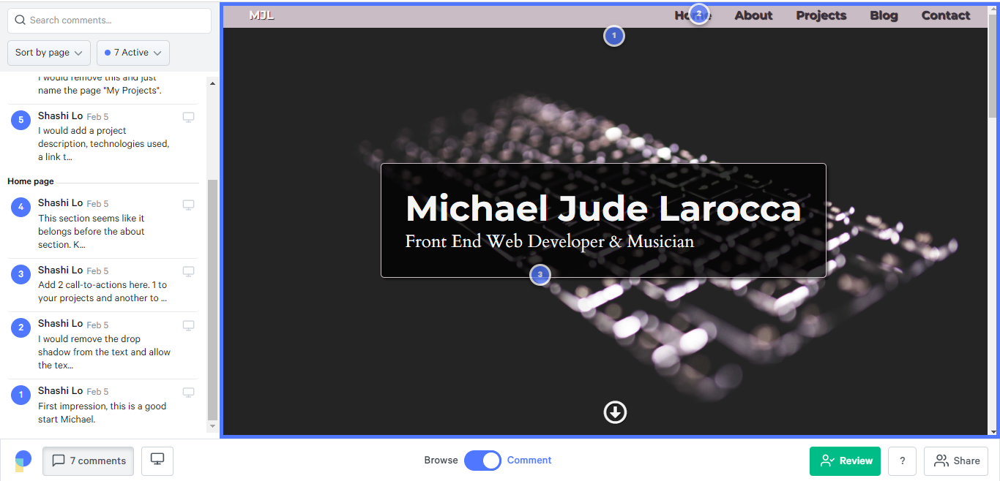
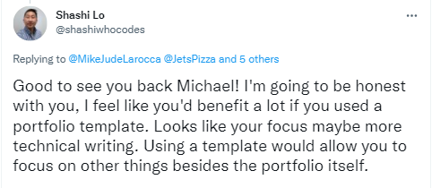
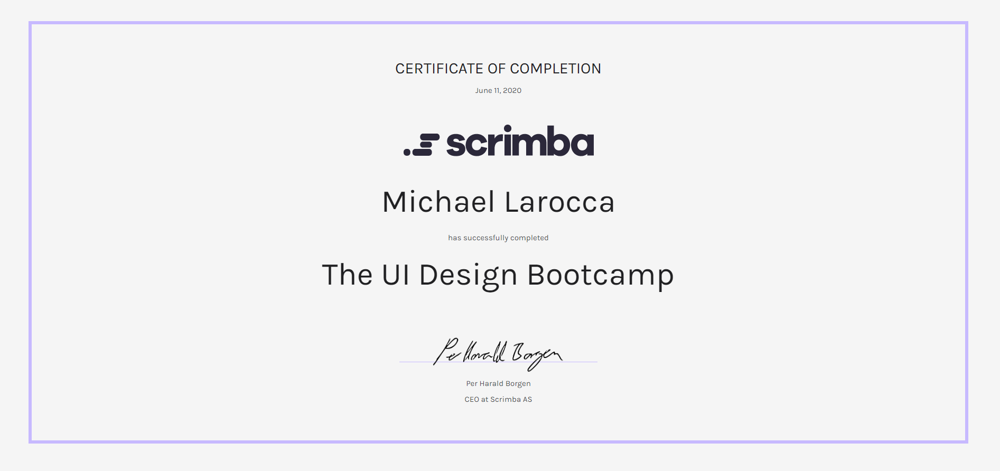

#### In this week's article, Senior UI Engineer Shashi Lo joins us on a Scrimba Livestream event to talk about the UI Design fundamentals, provide tips, and introduce us to his FREE Friday portfolio reviews!

---

---

### About Shashi Lo

Shashi Lo earned an associate's degree in Web Design at the Art Institute International of Minnesota and is currently a Senior UI Engineer at Dremio. 

Shashi has over 15 years of experience in the tech industry, volunteers for the Hmong District Youth, and provides FREE help for aspiring web developers weekly!

---

### What is UI Design

**According to Wikipedia,** *"User interface design or user interface engineering is the design of user interfaces for machines and software, such as computers, home appliances, mobile devices, and other electronic devices, with the focus on maximizing usability and the user experience."*

---

## Understanding the UI Design Fundamentals

Shashi tells us that the fundamentals are always key in anything in programming. Once we have a solid foundation in the fundamentals, it will be easier to learn other languages, frameworks, and component libraries. 

**Scrimba's FREE UI Design Fundamentals course lists the following UI Design principles:**

**UI Design principles**

* Visual Hierarchy
* Typography
* Color
* Contrast
* Alignment
* Scale
* White Space

---

***I completed the [Scrimba Learn UI Design Fundamentals course](https://scrimba.com/learn/design), and I highly recommend it!***

---

**To learn more about the course instructor for the Scrimba LearnUI Design Fundamentals course, you can read my articles:**

* [Teacher Feature: Gary Simon](https://selftaughttxg.com/2021/04-21/TeacherFeature-GarySimon/)
* [Review: The Boja](https://selftaughttxg.com/2021/08-21/Review-The_Boja/)

---

### Inspiration for UI Design 

Shashi introduces us to the [dribbble](https://dribbble.com/) website for UI design inspiration.

Dribble is an "invitation only" website where the UI design elite showcases their work.

Shashi explains we can analyze the works displayed on this website to see how to utilize the typography, color scheme, layouts, and other aspects of design appropriately. 

---

### Know Your Target Audience

When Shashi is asked by Scrimba host Leanne what is the most challenging part of UI Design, he tells us it is trying to please everyone with your design; you can't please everyone.

**Shashi tells us the best approach to deciding on your UI design is knowing your target audience.**

If you create a website for Health Insurence, your target audience will likely be older. Therefore, Shashi advises we go with a simple design, avoiding all of the "bells and whistles," allowing the users to navigate easily.

If you create a website for VR (virtual reality), your target audience will likely be younger. Shashi tells us we can now add all of the "bells and whistles" when we have a younger target audience.

---

### Common UI Design Mistakes

**Below is a list of common UI design mistakes that Shashi had identified:**

* Inconsistency
* Proper balance in sections
* Poor usage of Typography
* Lack of a hover state
* Text-only links within a button

---

**Inconsistency**

Websites do not have consistent styles for buttons or typography.

---

**Proper balance in sections**

Another common mistake is an improper balance on items on a webpage. Shashi tells us he will come across a div with a 20-pixel margin on the top but a 100-pixel margin at the bottom of the div, causing a visually uncomfortable imbalance for users.

---

**Poor usage of Typography**

Shashi explains that combining typography (fonts) is difficult.

To discover good font combinations, Shashi advises viewing the work of professional designers for inspiration.

---

**Lack of a hover state**

Hover states signify that an item on a webpage is interactive to the user.

Since buttons are "action items," Shashi explains they should always have a hover state.

Adding hover states to items on a webpage help to guide the users by providing visual cues.

--- 

**Text-only links within a button**

Another problem Shashi mentions is actionable items, such as buttons or menu items, that only work when you click or touch the text.

Shashi's solution is to make sure the whole element itself is actionable when you click or touch it.

---

### Dev Tools

Shashi uses the dev tools built into the Google Chrome browser to inspect and optimize his projects as part of his regular workflow.

---

*"Chrome DevTools is a set of web developer tools built directly into the Google Chrome browser."*

> -[Chrome Developers](https://developer.chrome.com/docs/devtools/)

---

**Chrome DevTools provides:**

* Performance check
* Accessibility
* SEO
* And more!

Shashi teaches us that our website's performance (Google page ranking) is based on the mobile layout score. That is now one more reason for us to design our websites with a "mobile-first" approach.

---

***To learn more about the Google Chrome DevTools, you can read my article "[Web Accessibility 101 - with Carie Fisher](https://selftaughttxg.com/2021/07-21/WebAccessibility101-WithCarieFisher/)" where I used it to audit my blog website!*** 

---

**Another tool that Shashi uses is [Tiny PNG](https://tinypng.com/).**

Shashi tells us that he does an 80% compression on his website jpegs, and he also removes the metadata behind the jpegs. 

After running this procedure, he saves about 20% in image file space, resulting in a huge increase in the website's performance!

---

<iframe width="1350" height="488" src="https://www.youtube.com/embed/gayxhFPMJ7M" title="YouTube video player" frameborder="0" allow="accelerometer; autoplay; clipboard-write; encrypted-media; gyroscope; picture-in-picture" allowfullscreen></iframe>

#### *Be sure to watch the full Livestream!*

---

### How do you stay updated on trends?

Shashi wisely suggests that we follow resourceful content creators on Twitter to stay updated on trends.

**Shashi explains that he doesn't have the time and luxury to "deep dive" into new topics and trends, so he learns about them from other talented creators that keep us informed.**

Shashi cites Kevin Powell ([@KevinJPowell](https://twitter.com/KevinJPowell)) and Jhey ([@jh3yy](https://twitter.com/jh3yy)) as his resources.

---

**To learn more about Kevin Powell, you can read my articles:**

* [TeacherFeature-KevinPowell](https://selftaughttxg.com/2021/05-21/TeacherFeature-KevinPowell/)
* [What's new in CSS - With Kevin Powell](https://selftaughttxg.com/2021/06-21/06-14-21/)

---

***After Shashi's shoutout to "Jhey" during the Livestream, from chats on Twitter, it looks like a new Scrimba GreenSock course taught by Jhey could be in the works!***   

---

### Portfolio Reviews

On Fridays, Shashi provides **FREE** help for aspiring web developers with his "**Portfolio Review Friday**" on Twitter.

Just respond to his "Portfolio Review Friday" tweet, answer a few questions ( so he can get to know you ), and provide a link to your portfolio website.

---

**Shashi reviewed my portfolio website! Here is my submission:** 

**1. Post a link to your personal portfolio** 

* https://michaeljudelarocca.com 

**2. Tell us about your dream job** 

* My dream job is to be a teacher at a company such as 
@scrimba, @freeCodeCamp, @Codecademy

**3. Do you enjoy @JetsPizza!?** 

* I never had JetsPizza, but I love @GrimaldisNY Margherita!

---

---

### My Portfolio Review

Recently, [Pastel](https://usepastel.com/) started to sponsor Shashi's Portfolio Review Friday!

---

**Using Pastel is simple and fast**

* Enter a URL and within seconds, Pastel lets you click to leave comments on any website.
* Share a unique Pastel link with clients or teammates to get their feedback all in one place.
* Easily make copy suggestions with Pastel and see the before and after on the page.

---

---

#### *As you can see, [Pastel](https://usepastel.com/) makes it easy for developers to coordinate!*

---

---

Shashi always gives honest, constructive criticism to the portfolio website submissions he receives, which is vital for the proper growth of becoming a proficient web developer.

After reviewing my portfolio website, Shashi recommended that I use an "HTML Portfolio Template" for my site so that I can focus more on the projects and other items I am showcasing.

---

*To learn about utilizing HTML Portfolio Templates, you can read my article "Tech Rally: Career Tips From an Amazon Dev." Alexander Lee (Tech Rally) also encourages developers to use  HTML Templates, and he has [a course that teaches how to create and deploy a portfolio website](https://courses.techrally.co/practical-portfolio-build-a-portfolio-easily-with-html-css-and-a-bootstrap-theme)!*

---

### Frontend Mentor
(WRITE ARTICLE SECTION)

[Frontend Mentor](https://www.frontendmentor.io/)

---

***Kevin Powell teamed up with Frontend Mentor and Scrimba to make the "[Build a space travel website](https://scrimba.com/learn/spacetravel)" course!***

---

### Scrimba UI Design Bootcamp

If you are interested in taking a deep dive into learning more about UI Design, Scrimba also has a Bootcamp taught by Gary Simon!

---

***I completed the [Scrimba UI Design Bootcamp](https://scrimba.com/learn/designbootcamp), and I highly recommend it!***

---

**To learn more about how Scrimba has helped me as a self-taught web developer, you can read my articles:**

* [Review: Scrimba](https://selftaughttxg.com/2020/12-20/Review-Scrimba/)
* [How Scrimba is helping me and many others to become confident, well-prepared web developers](https://selftaughttxg.com/2021/06-21/06-07-21/)
* [Review: Scrimba's Weekly Web Dev Challenge](https://selftaughttxg.com/2021/01-21/ReviewScrimbaWebDevChallenge/)

---

### Are developers expected to be design experts?

Shashi explains that as web developers, we are not expected to be design experts. 

Our job as web developers is to work with designers, turning their designs into viable working websites. 

Sometimes, Shashi explains, the designer's work is so ambitious it will not translate into a good "user experience" website. It is then up to us to work with the designers to restructure their designs into a user-friendly format to fulfill design and useability requirements.

---

### Shashi Lo Links
(WRITE ARTICLE SECTION)

---

### Conclusion
(WRITE ARTICLE SECTION)

---

##### **Let's connect! I'm active on [LinkedIn](https://www.linkedin.com/in/michaeljudelarocca/) and [Twitter](https://twitter.com/MikeJudeLarocca).**

---

###### Are you now more confident in creating UI Design after learning from Shashi? Would you or have you had your portfolio reviewed by Shashi? Please share the article and comment!

---