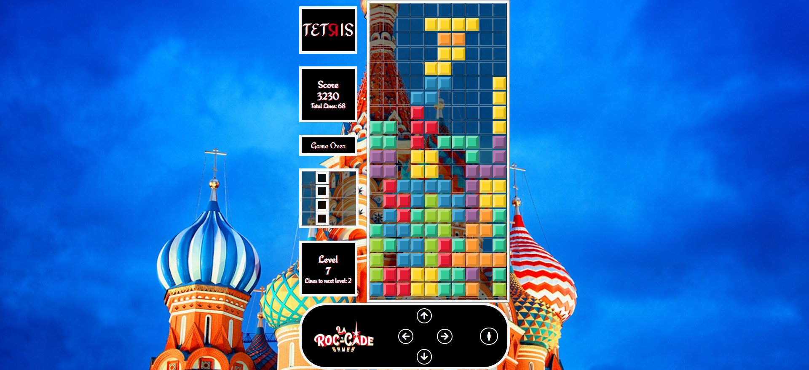
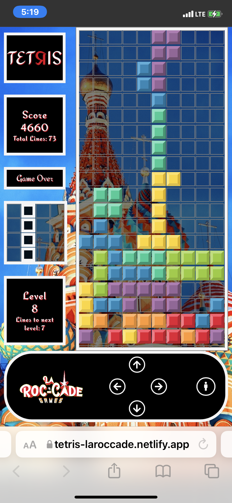

#### This article covers Ania Kubow's Tetris, consisting of HTML, CSS, and JavaScript, with no frameworks. The simple styling and gameplay leave plenty of room for enhancements, which I took to the max! 

---

---

### About Ania Kubow
(WRITE ARTICLE SECTION)

---

### Building Tetris with JavaScript
(WRITE ARTICLE SECTION)

---

<iframe width="956" height="538" src="https://www.youtube.com/embed/w1JJfK09ujQ" title="YouTube video player" frameborder="0" allow="accelerometer; autoplay; clipboard-write; encrypted-media; gyroscope; picture-in-picture" allowfullscreen></iframe>

---

### My enhancements
(WRITE ARTICLE SECTION)

**My Enhancements**

* Styling
* Sounds
* Line Counting
* Levels
* Bonus Points
* Speed Increase
* Touch Controles
* Game Restart

---

Link to the game: [tetris-laroccade](https://tetris-laroccade.netlify.app/)

---

---

### Styling
(WRITE ARTICLE SECTION)

---

### Sounds
(WRITE ARTICLE SECTION)

---

### Line Counting
(WRITE ARTICLE SECTION)

---

### Levels
(WRITE ARTICLE SECTION)

---

### Bonus Points
(WRITE ARTICLE SECTION)

---

### Speed Increase
(WRITE ARTICLE SECTION)

---

### Touch Controles
(WRITE ARTICLE SECTION)

---

### Game Restart
(WRITE ARTICLE SECTION)

---

### Mobil View
(WRITE ARTICLE SECTION)

---

---

### Ania Kubow Links
(WRITE ARTICLE SECTION)

---

### Conclusion
(WRITE ARTICLE SECTION)

---

##### **Let's connect! I'm active on [LinkedIn](https://www.linkedin.com/in/michaeljudelarocca/) and [Twitter](https://twitter.com/MikeJudeLarocca).**

---
