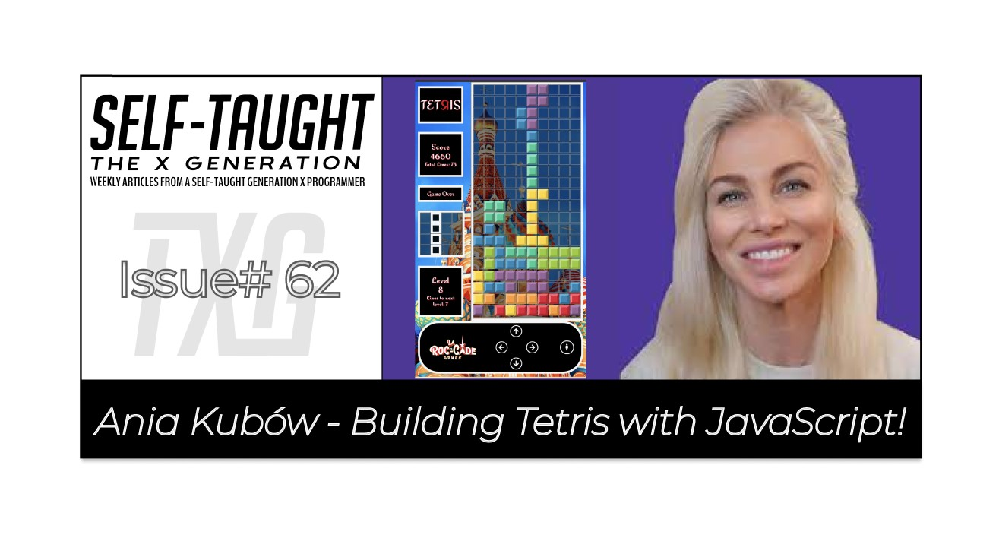

#### This article covers Ania Kubow's Tetris, consisting of HTML, CSS, and JavaScript, with no frameworks. The simple styling and gameplay leave plenty of room for enhancements, which I took to the max! 

---



---

### About Ania Kubow

Ania Kubow is a software developer that teaches others how to code by building retro games and projects. She is also part of the core team at [freeCodeCamp](https://www.freecodecamp.org/).

Ania was born in Poland and raised in the UAE, and graduated from Dubai College, majoring in Math, Physics, and DesignTech before moving to the UK to attend University.

---

### Building Tetris with JavaScript

Ania's [FREE YouTube course](https://www.youtube.com/watch?v=rAUn1Lom6dw&t=135s) teaches you how to make a Tetris game in JavaScript with basic functionality and styling.

**In this game of Tetris Ania covers the following JavaScript methods:** 

* addEventListener() 
* querySelector() 
* querySelectorAll() 
* keyCode() 
* Math.floor() 
* Math.random() 
* length 
* forEach() 
* splice() 
* clearInterval()
* setInterval() 
* some() 
* innerHTML() 
* every() 
* add() 
* remove() 
* contains() 

---

<iframe width="956" height="538" src="https://www.youtube.com/embed/rAUn1Lom6dw" title="YouTube video player" frameborder="0" allow="accelerometer; autoplay; clipboard-write; encrypted-media; gyroscope; picture-in-picture" allowfullscreen></iframe>

---

### Ania Kubow's Completed Game

Ania Kubow's Tetris JavaScript tutorial is brilliant, and I can highly recommend it to anyone interested in learning JavaScript.

Not only do you learn how to make a game to add to your portfolio, you learn fundamental JavaScript programming in a fun and engaging way!

The simplicity of the Tetris JavaScript project allows you to create a working game rather quickly and leaves plenty of room for customization, which I took to the max!

---

***Note:*** *There is a known issue of rotating the Tetrominoes at the edge of the board; half of the rotated Tetromino displays on both the left and right edges of the gameboard.*

*This issue was addressed by Ania and can be resolved by adding additional code found in her GitHub repo.*

 ***///FIX ROTATION OF TETROMINOS A THE EDGE*** 

---


---

### My enhancements

Like many people, I have spent countless hours playing Tetris on numerous platforms.

In an effort to pay homage and capture the essential essence of the Tetris game, I added the following enhancements:

**My Enhancements**

* Styling
* Sounds
* Line Counting
* Levels
* Bonus Points
* Status Window
* Speed Increase
* Additional Tetrominoes
* Touch Controls
* Game Restart

---

#### *Here is a link to my completed Tetris game: [tetris-laroccade](https://tetris-laroccade.netlify.app/)*

---


---

### Styling

For the font, I used [Redressed](https://fonts.google.com/specimen/Redressed?query=redress) from [fonts.google.com](https://fonts.google.com/).

I had some trouble with the "TETRIS" logo; I wanted to reverse the "R" in TETRIS, as seen in some of the various game ports.

I realized that the CSS **transform** was not working with an HTML `<span>` tag. I resolved this issue using an HTML `<div>` tag as follows:

```html
<!--  Title  -->
<div id="title">
    <div>TET</div>
    <div class="text-flip">R</div>
    <div>IS</div>
</div>
```

```css
.text-flip {
  transform: rotateY(180deg);
  border: none;
  color: rgb(223,0,31);
}
```

Finally, I used [Flexbox](https://www.w3schools.com/css/css3_flexbox.asp) on the "title" to display all the letters on one line.

---

For the game's background image, I used Saint Basil's Cathedral, as seen in various versions of the Tetris game.

For the game grids, I created a semi-transparent background. I decided to use gray borders on the grid divs for visual assistance and easier gameplay for the users.
   
```css
#grid {
  background-color: rgba(0,0,0,.5);
}

div {
  border: 1px solid gray;
}
```

---

For the Tetrominoes design, I used a Google Chrome "[color picker](https://chrome.google.com/webstore/detail/colorpick-eyedropper/ohcpnigalekghcmgcdcenkpelffpdolg?hl=en)" to get the hexadecimal colors found on the following picture:

---


---

**Below is the code for the orange Tetromino:**

```css
.orange {
  border-top: 5px solid #FFB56C;
  border-right: 5px solid #DB852E;
  border-bottom: 5px solid #DB852E;
  border-left: 5px solid #FFB56C;
  background-color: #FF9934;
}
  ```
**I wrote a function to select a color to add to the Tetrominoes randomly.**

```javascript
// Randomly select a color for each Tetromino
function color() {
    const tetrominoeColors = ["green", "blue", "orange", "yellow", "purple", "red", "teal"];
    const chooseRandomColor = Math.floor(Math.random() * tetrominoeColors.length);
    randomColor = tetrominoeColors[chooseRandomColor];
  }
color();
 ```

**I add the random color when the Tetrominoes are drawn and undrawn.**

```javascript
//Draw Tetrominoes
  function draw() {
    current.forEach(index => {
    squares[currentPosition + index].classList.add('tetromino', randomColor);
  })
}
```

---

I came up with a desktop and mobile-friendly design for the game layout. I positioned the game information on the left side of the game grid and placed the game controller on the bottom of both.

For learning how to create design layouts in CSS, I highly recommend learning from [Kevin Powell](https://www.kevinpowell.co/). 

---

***To learn more about Kevin Powell and how he has helped me, you can read my following articles:***

* [Teacher Feature: Kevin Powell](https://selftaughttxg.com/2021/05-21/TeacherFeature-KevinPowell/)
* [What's new in CSS - With Kevin Powell](https://selftaughttxg.com/2021/06-21/06-14-21/)
* [Hacktoberfest 2021: Issue IV "A New Approach"](https://selftaughttxg.com/2021/11-21/Hacktoberfest2021Issue4/)

---

### Sounds

I created several mp3 files from this YouTube video for the game's sound effects: [Tetris - Sound Effects Collection](https://www.youtube.com/watch?v=Xm9O2iJLWxY).

For the game's music, I created an mp3 from the following YouTube video: [Original Tetris theme (Tetris Soundtrack)](https://www.youtube.com/watch?v=NmCCQxVBfyM). This music is from the Nintendo Gameboy port.

To create the mp3's I used the free, open-source, cross-platform audio software [Audacity](https://www.audacityteam.org/). 

To capture the audio playing from the YouTube videos, I configured my computer following the steps in this informative article: [How to Record Sound from Computer directly without a Microphone?](https://codegena.com/record-sound-from-computer-without-microphone/), by [Shan Eapen Koshy](https://codegena.com/author/shaneapen/).

---

### Line Counting

I created a variable to count how many rows (lines) the player completed. The total lines completed are displayed underneath the game score.

I also created a count down to the next level variable. For every ten lines completed, the game level increments. This is displayed beneath the level.

---

### Levels

I created levels for the game by creating a level variable. The level variable is incremented by one for every ten lines completed by the player.

---

### Score and Bonus Points

I came up with a simple scoring system for the game's score that incrementally rewards the player as they progress through the levels.

I created a "currentLineScore" variable set by the current level times ten.

```javascript
currentLineScore = level * 10;
```

For the bonus points, if a player completes a combo of two, three, or four lines in one move, the bonus points equal the current line score times the number of rows completed. The total bonus and the current line score are displayed in the status window.

```javascript
if(counterRow > 1) {
  let bonusPoints = currentLineScore * counterRow;
  score += bonusPoints;
  display.textContent = `Bonus! +${bonusPoints}`;

  setTimeout(function(){
    display.textContent = `Score +${bonusPoints}`;
  }, 2500);  
  
  setTimeout(function(){
    display.textContent = ``;
  }, 5000);
}   
```

---

### Status Window

I created a status window to display messages to the player. 

The first message displayed is a blinking "Press Start" message, instructing the player to press or click on the start button.

I designed the start button to resemble an arcade game one-player start button, including a single-player icon. This icon also blinks to draw the attention of the player.

**Additional messages sent to the Status Window:**

* Score
* Bonus Points
* Levels
* Game Over

---

***Note:*** *`<blink>` is a deprecated HTML tag. To recreate the blink tag effect, I used code created by [Colby Fayock](https://www.freecodecamp.org/news/make-it-blink-html-tutorial-how-to-use-the-blink-tag-with-code-examples/).*

---

### Speed Increase

As the game levels increase, to make the game more challenging, I increase the speed of the Tetrominoes.

The game speed starts at 500 milliseconds ( half a second ) and then decreases by 50 milliseconds at each level.

The speed decrease stops at level nine when the game speed equals 100 milliseconds.

I also wrote a "**changeGameSpeed**" function that is activated by the player when they press the down arrow. When the player presses the down arrow, the speed of the Tetromino in play will decrease to 100 milliseconds. Then when the Tetromino in play lands, the next Tetromino in plays speed will resume at the current level speed.

```javascript
function changeGameSpeed() {
  if(speedIncrease === true) {
    gameSpeed = 100;
      clearInterval(timerId);
      timerId = setInterval(moveDown, gameSpeed);
  }
  if(speedIncrease === false) {
      levelSpeed();
      clearInterval(timerId);
      timerId = setInterval(moveDown, gameSpeed);
  }
}
```

---

***As the Tetrominoes falling speed increased, glitches were visible appearing. Trailing game div spaces were retaining the Tetrominoes color. I wrote a "clearGridDivs" function to clear the game grid to resolve these issues.***

```javascript
// Erase/Clear grid divs
function clearGridDivs() {
  squares.forEach(index => {
    squares.forEach((item, index)=>{
      if(!squares[index].classList.contains("taken")) {
      squares[index].classList.remove("green", "blue", "orange", "yellow", "purple", "red", "teal");  
      }        
    })
  })
}
```

---

### Additional Tetrominoes

After extensive playing/testing the game, I realized that I could not rotate the available Tetrominoes to fit in specific patterns created by the player on the game grid.

**It turns out that the Tetris game consists of seven Tetrominoes. Following the tutorial, you only create five Tetrominoes.** 

The missing two Tetrominoes are variations of the "**L**" Tetromino and the "**Z**" Tetromino.

```javascript
const lTetromino2 = [
  [0,width,width*2,width*2+1],
  [0,1,2,width],
  [0,1,width+1,width*2+1],
  [2,width,width+1,width+2]
]

  const zTetromino2 = [
  [1, width, width+1, width*2],
  [width, width+1, width*2+1, width*2+2],
  [1, width, width+1, width*2],
  [width, width+1, width*2+1, width*2+2]
]
```

I created both missing Tetrominoes and wrote additional code to implement them into the game. However, it wasn't without incident!

The additional two Tetrominoes worked fine in the game. However, the "Next Up Tetromino" grid displayed the wrong Tetrominoes. Since they were consistent in displaying the wrong Tetrominoes, an "L" for an "O" and and "O" for a "T," I was able to determine the error.

**When adding the additional two Tetrominoes, make sure your "theTetrominoes" array and your "upNextTetrominoes" array are in the same order!**

```javascript
// The theTetrominoes array
const theTetrominoes = [lTetromino, lTetromino2, zTetromino, zTetromino2, tTetromino, oTetromino, iTetromino];

// The upNextTetrominoes array
const upNextTetrominoes = [
  [1, displayWidth+1, displayWidth*2+1, 2], //lTetromino
  [0, displayWidth,displayWidth*2,displayWidth*2+1], //lTetromino2
  [0, displayWidth, displayWidth+1, displayWidth*2+1], //zTetromino
  [1, displayWidth, displayWidth+1, displayWidth*2], //zTetromino2
  [1, displayWidth, displayWidth+1, displayWidth+2], //tTetromino
  [0, 1, displayWidth, displayWidth+1], //oTetromino
  [1, displayWidth+1, displayWidth*2+1, displayWidth*3+1] //iTetromino
]  
```

---

### Touch Controls

I knew that I wanted to take a "mobile-first" approach from the very beginning of this project. I previously coded a playable [snake game](https://scrimba-snake-game.netlify.app/) on my iPhone that includes a touch-button game controller, and I similarly designed the Tetris game.

The game controller consists of four directional arrow buttons and a start button. It also sports my "La Roc Cade" logo, created by [design_desk](https://www.fiverr.com/design_desk) on [Fiverr](https://www.fiverr.com/).

Since Ania did all of the hefty lifting coding the direction functions, all I had to do was add event listeners to each button and call the corresponding function.

**However, it seems like a good idea on paper and in design. But, during gameplay, it's less than ideal.**

The problem is, during higher levels with faster gameplay, trying it tap the directional buttons is often taken as a "double-tap" by the phone, resulting in zooming into the screen instead of moving the Tetromino in the desired direction.

Additional, there is an issue with the viewable height when viewed on the phone. I set the background image to 100% of the screen's view height. However, on my iPhone, the browser search bar is located at the bottom of the screen, and the background image continues behind it, resulting in an unwanted swipe-down touch gesture that moves the entire game grid up.

**After finding and playing the official [Tetris](https://tetris.com/games-content/play-tetris-content/index-mobile.php) game on my iPhone, I realized that "swipe-gesture" directional controls are a better approach for mobile gameplay.** 

Also, the official [Tetris](https://tetris.com/games-content/play-tetris-content/index-mobile.php) has the game grid along with the background perfectly formatted for the phone, allowing the swipe gestures to control the Tetromeinoes without moving the game grid around.

---

### Mobile View

Below is a screenshot of my Tetris game as viewed on an iPhone 11.

---


---

### Game Restart

When the game ends, the game can be restarted by clicking/pressing the start button.

I wrote a "**restartGame**" function that clears the game board and resets all necessary starting variables.

To draw the player's attention, I once again add the "**blink**" class to the start button.

---

### My Other freeCodeCamp Articles

* [Free Code Camp's July 2021 Summit](https://selftaughttxg.com/2021/07-21/FreeCodeCampsJuly2021Summit/)
* [Learn to code and earn a certification for free](https://selftaughttxg.com/2021/02-21/Earn_a_certification/)
* [There and Back Again](https://selftaughttxg.com/2021/01-21/ThereAndBackAgain/)
* [Teacher Feature: Dylan Israel](https://selftaughttxg.com/2020/12-20/12-06-2020_TeacherFeature-Dylan_Israel/)

---

***Note:*** *If you can financially afford to, please consider a monthly contribution to Free Code Camp. Free Code Camp accepts monthly donations of $5 to help their non-profit organization run.*

---

### Ania Kubow Links

* 🔗[YouTube](https://www.youtube.com/c/AniaKub%C3%B3w)
* 🔗[Twitter](https://twitter.com/ania_kubow)
* 🔗[LinkedIn](https://www.linkedin.com/in/ania-kubow/)
* 🔗[GitHub](https://github.com/kubowania)
* 🔗[javascriptgames.online](http://javascriptgames.online/)

---

### Conclusion
(WRITE ARTICLE SECTION)


---

##### **Let's connect! I'm active on [LinkedIn](https://www.linkedin.com/in/michaeljudelarocca/) and [Twitter](https://twitter.com/MikeJudeLarocca).**

---
