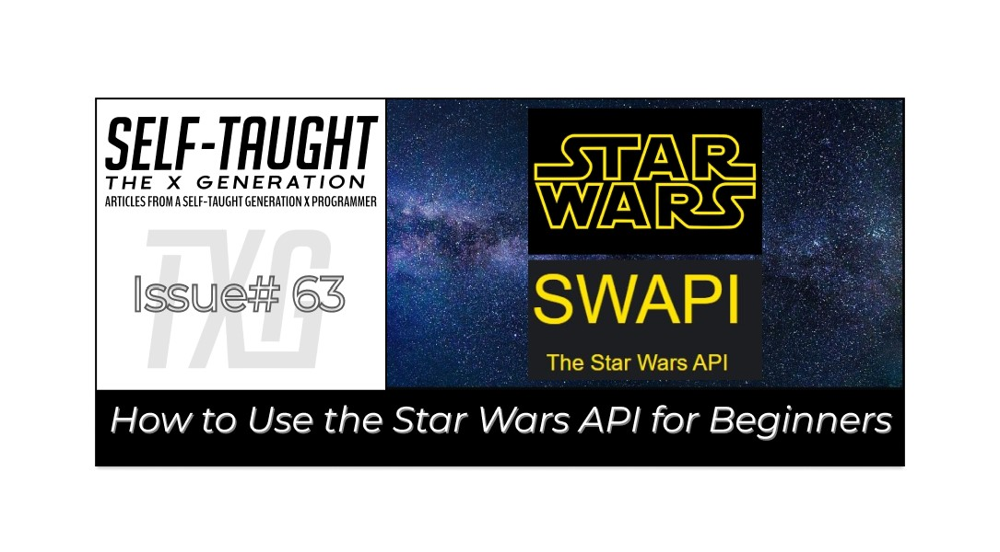
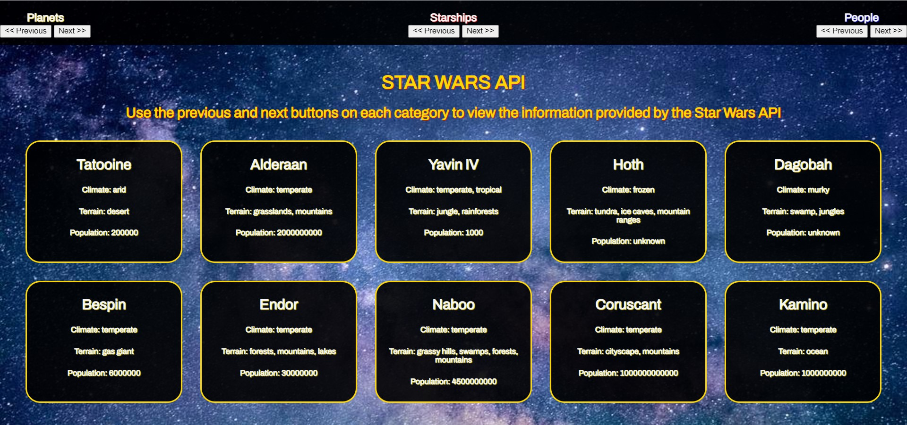

#### May the 4th be with you! In this article, to celebrate Star Wars Day, I learned and stepped through the process of using the Star Wars API to display the information on a vanilla JavaScript website!

---



---

### Intro

Until now, I've managed to postpone learning how to work with APIs during my self-taught coding journey. Since it's Star Wars Day this week, "May the 4th", I decided it was an excellent time to learn how to work with them, starting with using the [Star Wars API](https://swapi.dev/)!

---

### What is an API

[Wikipedia explains](https://en.wikipedia.org/wiki/API), "An application programming interface (API) is a connection between computers or between computer programs."

---

### The Star Wars API

The [Star Wars API](https://swapi.dev/) contains data from the first seven Star Wars films, including Planets, Spaceships, Vehicles, People, Films, and Species.

**The Star Wars API is an open API, meaning it is a publicly available application programming interface, and it does not require authentication to use it.**

Since the Star Wars API is an open API, we do not need an access token, simplifying the connection process.

---

### How to use the Star Wars API

We will be accessing the Star Wars API using the [JavaScript fetch() method](https://developer.mozilla.org/en-US/docs/Web/API/fetch), which returns a [promise](https://developer.mozilla.org/en-US/docs/Web/JavaScript/Reference/Global_Objects/Promise) that is fulfilled once the response is available. 

The [response](https://developer.mozilla.org/en-US/docs/Web/API/Response) is an object which we then convert into JSON using the [json() method](https://developer.mozilla.org/en-US/docs/Web/JavaScript/Reference/Global_Objects/JSON).

**Once we convert the received object, we can then access the information, set it to variables, and display it for the users to see.**  


---

### Connecting to the Star Wars API

**JSON (JavaScript Object Notation) is the standard data format the Star Wars API provides by default.** 

**Wikipedia defines** *"JSON is an open standard file format and data interchange format that uses human-readable text to store and transmit data objects consisting of attribute–value pairs and arrays."*

**I wrote asynchronous javascript functions to retrieve the JSON data from the Star Wars API.**

*For an in-depth look into working with JSON files, [here is helpful information provided by Mozilla](https://developer.mozilla.org/en-US/docs/Learn/JavaScript/Objects/JSON).*

---

### Asynchronous Functions 

**Mozilla defines,** *"An async function is a function declared with the async keyword, and the await keyword is permitted within it. The async and await keywords enable asynchronous, promise-based behavior to be written in a cleaner style, avoiding the need to explicitly configure promise chains."*

**The following code is an async function I wrote as a simple demonstration.**

**Steps:**

* fetch() to fetch the data
* json() to convert the data
* console.log() to view data

```javascript
async function fetchPlanets() { 
  const results = await fetch("https://swapi.dev/api/planets/?page=1");
  const data = await results.json();
    console.log(data);
} 
fetchPlanets();
```

If you copy the code and paste it into a code editor, such as CodePen, you will see the results from the Star Wars API in the "console.log."

**This function retrieves the data from the first page of the "Planets." When they arrive, the results are then stored in the "data" variable and then printed to the console for viewing.**

--- 

### Setting the data to variables

**Expanding on the first example, let's set variables to the count, next, and previous data on page 1 of the Star Wars API planets page and print the results to the console.**

```javascript
async function fetchPlanets() { 
  let results = await fetch("https://swapi.dev/api/planets/?page=1");
  const data = await results.json();
    console.log(data);
  let count = data.count;
  let next = data.next;
  let previous = data.previous;
    console.log(count);
    console.log(next);
    console.log(previous);
} 
fetchPlanets();
```

**We have now fetched data, converted it, and set data to variables.**

**A few things to note:**

* The data must first be converted to JSON, in order to set the data to variables
* In this example, the variables are declared within the function, meaning the variables are not globally scoped. To clarify, if you console log the variables outside of the "fetchPlanets" function, you will get a "is not defined" error

---

### Retrieving the "Planets" data

The "**fetchPlanets**" function retrieves the data from the first page of the "**Planets**" page. Each of the "**Planets**" pages contains 10 planets.

The 10 planets are located in the results array. To view the first planet's information, we will add the following code to the "**fetchPlanets**" function: **console.log(data.results[0])**.

```javascript
async function fetchPlanets() { 
  let results = await fetch("https://swapi.dev/api/planets/?page=1");
  const data = await results.json();
    console.log(data);
  let count = data.count;
  let next = data.next;
  let previous = data.previous;
    console.log(count);
    console.log(next);
    console.log(previous);
    
    console.log(data.results[0]);
} 
fetchPlanets();
```

**Within the "fetchPlanets" function, we can create a variable called  "name" and log the result to the console as follows:**

```javascript
let name = data.results[0].name;
console.log(name);
```

**Now that we understand how to access the first planet's data, it's time to learn how to access all of the planets on each page.** 

---

### Access all of the planets on each page

Each page of the "**Planets**" contains 10 planet records, respectively. We will use the [JavaScript forEach() method](https://developer.mozilla.org/en-US/docs/Web/JavaScript/Reference/Global_Objects/Array/forEach) to access them.

**First, we need to create a variable and set it to the results array where each planet record is located.**

```javascript
let planets = data.results;
```

**Then, just to view each of the planets' names, we will write a for each loop as follows:**

```javascript
    planets.forEach(item => {
      console.log(item.name);
    });
```

**Now that we can access each of the planets on the first page, we can choose any of the data we want and set them to variables to use. Such as the name, climate, terrain, and population.**

***Note:*** *To keep this project simple, I am not using fields that contain URL's and nested elements, such as the "residents."*

---

*Here is the finished example "fetchPlanets" function. You can copy this code to a code editor, such as [CodePen](https://codepen.io/), and then remark and unremark the console logs to see the results.*

```javascript
async function fetchPlanets() { 
  let results = await fetch("https://swapi.dev/api/planets/?page=1");
  const data = await results.json();
    console.log(data);
  let count = data.count;
  let next = data.next;
  let previous = data.previous;
    console.log(count);
    console.log(next);
    console.log(previous);

    console.log(data.results[0]);
  let name = data.results[0].name;
    console.log(name);
  
  let planets = data.results;
  planets.forEach(item => {
    console.log(item.name);
  });  
} 
fetchPlanets();
```

--- 

### My finished Star Wars API project

Link to the project: [https://star-wars-api-version-01.netlify.app/](https://star-wars-api-version-01.netlify.app/)



---

### Handling the data from the Star Wars API

After watching several tutorials listed in "**Resources I used**," I chose to use some of the information provided from the Starships, People, and Planets.

I then used "[forEach()](https://developer.mozilla.org/en-US/docs/Web/JavaScript/Reference/Global_Objects/Array/forEach)" loops for the three categories that retrieved the information I chose and then created "**HTML div cards**" to display the information.  

```javascript
const ctnPlanets = document.getElementById("ctn-main");
const planetsPrevious = document.getElementById("planets-previous");
const planetsNext = document.getElementById("planets-next");

// Variables Planets
let URL_Planets = "https://swapi.dev/api/planets/?page=1";
let nextPlanets;
let previousPlanets;

planetsPrevious.addEventListener("click", pagePreviousPlanets);
planetsNext.addEventListener("click", pageNextPlanets);

// Functions Planets
async function fetchPlanets() {
  document.querySelector('.overlay').classList.add('active');
  let results = await fetch(URL_Planets);
  const data = await results.json();
  nextPlanets = data.next;
  previousPlanets = data.previous;
  let planets = data.results;
  let outPut = ' ';
  document.querySelector('.overlay').classList.remove('active');
  planets.forEach(item => {
    outPut += `<div class="card card-planet">
                  <h2>${item.name}</h2>
                  <h5>Climate: ${item.climate}</h5>
                  <h5>Terrain: ${item.terrain}</h5>
                  <h5>Population: ${item.population}</h5>
               </div>`
  })
  ctnPlanets.innerHTML = outPut;
}

```

---

***Note:*** *While using the for each loop, initially, I was only getting the last record of the data. This was because the "for each loop" was overwriting the previous data. I resolved the issue by changing the "outPut" variable to "plus equals." Using "plus equals" keeps the last value set and adds new values to it as expected.* 

---

**I then wrote a function to cycle through the pages of the planets; the Star Wars API provides ten records per page ( I wrote similar code for the previous page).**

```javascript
function pageNextPlanets() {
  if(nextPlanets) {
    URL_Planets = new URL(nextPlanets);
  }
  fetchPlanets()
    .then(response => { 
    console.log(`Success: Planets`);
  })
    .catch(error => { 
    console.log(`error!`)
    console.error(error) 
  });
}
```

The "**pageNextPlanets**" function checks if there is a URL for the next page. If there is, the URL for the next page is set to the URL_Planets variable for use in the "**fetchPlanets**" function.

I added the [catch() method](https://developer.mozilla.org/en-US/docs/Web/JavaScript/Reference/Global_Objects/Promise/catch) to the "pageNextPlanets" function to log errors if they should arrise.

---

### Resources I used

**To learn how to work with APIs, and specifically the Star Wars API, I watched the following YouTube tutorials:**

* [1.1: fetch() - Working With Data & APIs in JavaScript](https://www.youtube.com/watch?v=tc8DU14qX6I)
* [Async/Await with Starwars API using Vanilla Javascript and Bootstrap](https://www.youtube.com/watch?v=Y6fhfs6nBww&t=1233s)
* [Having Fun with the Star Wars API](https://www.youtube.com/watch?v=qb6sMTeyLJY&t=1074s)

---

#### 🔗 *If you would like another beginner-friendly API project, be sure to check out my article: [JavaScript: How to Use the Chuck Norris API for Beginners](https://selftaughttxg.com/2023/02-23/javascript-how-to-use-the-chuck-norris-api-for-beginners/)*

---

### Your first step into a larger world


###### *All rights reserved by Disney and Lucasfilm.*

---

### Conclusion

Learning to work with APIs is an essential skill needed in becoming a professional developer.

If you learned how to fetch data from the Star Wars API, convert it to JSON data, and display it in a manner of your choice for the first time, it is a grand achievement you should be proud of!

You've taken your first step into a larger world, working with APIs!

---

Let's connect! I'm active on [LinkedIn](https://www.linkedin.com/in/michaeljudelarocca/) and [Twitter](https://twitter.com/MikeJudeLarocca).

---

###### ***Are you now encouraged to learn how to work with the Star Wars API? Have you already worked with APIs in your own projects? Please share the article and comment!***

