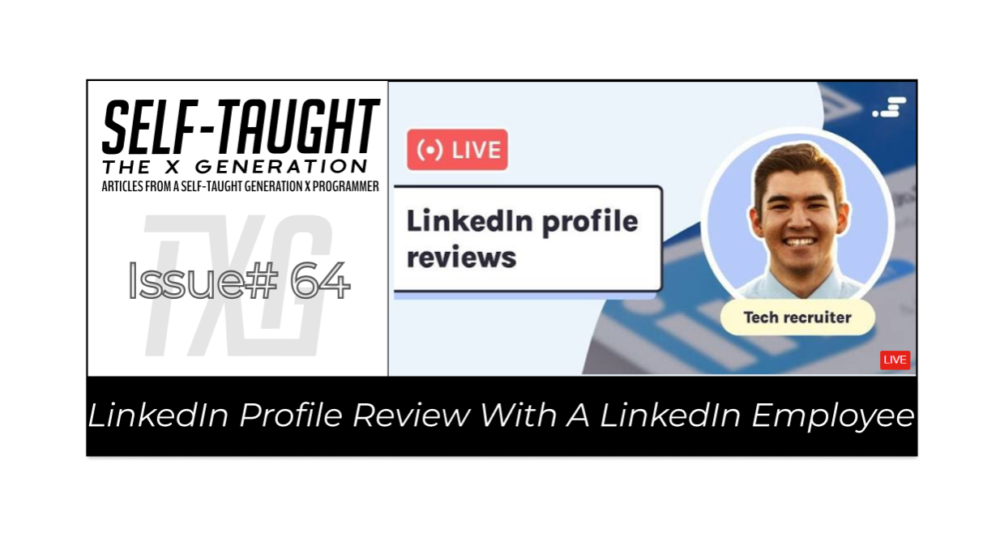

#### In this article, marketing associate Austin Henline from LinkedIn joins us on a Scrimba Livestream to teach us how to optimize our profiles, giving us the best chance to acquire new job opportunities!

---

---

### About Austin Henline 
Austin Henline studied Strategic Management and Business Strategy at the Bringham Young University Marriott School of Business. He works as a Marketing Associate at LinkedIn and has personally optimized over 1,300 LinkedIn profiles.

Austin hosted a TEDx talk explaining how vital having a LinkedIn profile is in today's job market and teaching us how to establish a professional brand for ourselves to stand out from the crowd on LinkedIn.

---

<iframe width="956" height="538" src="https://www.youtube.com/embed/gxqW1hXC3q8" title="How to establish a professional brand with novice experience on LinkedIn | Austin Henline | TEDxSUU" frameborder="0" allow="accelerometer; autoplay; clipboard-write; encrypted-media; gyroscope; picture-in-picture" allowfullscreen></iframe>

How to establish a professional brand with novice experience on LinkedIn | Austin Henline | TEDxSUU
TS: 6:00

---

Austin explains that nowadays, having a LinkedIn profile is equally important as having a resume. On a personal note, Austin tells us out of the first 24 jobs he applied to, all of them requested a LinkedIn profile as part of the application process, which he did not have then.

Since then, Austin has created an exceptional LinkedIn profile that has attracted over 300 job offers. He now works at LinkedIn and has trained career advisers, businesses, universities, and non-profits on improving their LinkedIn strategies.

---

*"95% of recruiters use LinkedIn to find talent these days."*

> -Austin Henline 

---

**During his TEDx talk presentation,  Austin provides us with four steps to help us establish our professional brand and set ourselves apart from the rest:**

1. Define your purpose and your target audience
2. Demand attention with your headline
3. Create your own content
4. Recognize and nurture your skills

**Define your purpose and your target audience**

Before you can find success on LinkedIn, you need to define why you want to use the platform.

**Are you:**

* Looking for a job.
* A business owner looking to hire
* Looking for customers
* Grow your network
* Looking for a career change

Once you define what you are using the platform for, you will know your target audience. With your target audience in mind, you can best optimize your LinkedIn profile.

---

*"By stating the value that you bring to people, rather than making them spend their time trying to figure out how you benefit them, then you'll Attract a greater number of your target audience."*

> -Austin Henline

---

**Demand attention with your headline**

If you do not create a headline, LinkedIn defaults your headline to display your work position at the company you work. If you are a student who is not working, LinkedIn defaults your headline to display you as a student at the university you are attending.

*90% of LinkedIn profiles use the default headline. By creating a headline, you will optimize your LinkedIn profile significantly.*

**Demand attention with your headline by:**

* Stating the benefit you provide for your target audience
* Including your current position
* Including skills that you have  

Optimizing your headline will not only give others an idea of who you are at a glance, but your profile will show up in more searches due to the keywords included in your headline.

**Create content**

Only 1% of LinkedIn members create content. Not only will you stand out significantly as a content creator, but influential people will likely discover you!

**Recognize and nurture your skills**

Recognize your skills, nurture them, and turn them into your personal brand. Your personal brand will become a catalyst that will continuously open up doors of opportunities for you!

**Following Austin's four optimization steps of defining your target audience, demanding attention with your headline, creating content, and developing your skills will help you to stand out on LinkedIn.**

---

### Scrimba Livestream event
During this Scrimba Livestream event, Austin goes into further detail on how to optimize our LinkedIn profiles and reviews several submitted profiles, including mine!

---

<iframe width="956" height="538" src="https://www.youtube.com/embed/Sb3yQYreopY" title="LinkedIn profile reviews with a tech recruiter" frameborder="0" allow="accelerometer; autoplay; clipboard-write; encrypted-media; gyroscope; picture-in-picture" allowfullscreen></iframe>

**LinkedIn profile reviews with a tech recruiter**

---

***In the following detailed article sections below, Austin Henline advises us on how to optimize our LinkedIn profile.***

---

### Headline
**The headline section provides an opportunity to briefly describe who you are, what you currently do, and what you seek. You will want to make sure that you adequately provide this information succinctly. Think of it similar to a resume that only gets an eight-second glance!**

The headline section is also the section searched for keywords.

**When recruiters and employers search LinkedIn for people with specific skills, the keywords they enter match keywords found in the profiles headline section.** 

*For example, if you are a Front-End Developer and include that text in your headline, your profile will appear in searches that include Front-End Developer. However, you will not appear in JavaScript, CSS, and HTML searches if you do not also have those keywords in your headline!* 

**You can optimize your LinkedIn headline section by:**

* Describing who you are, what you currently do, and what you seek.
* Using each of your skills as keywords for searches.
* Utilizing the entire 220-character limit.
* Saving headline characters by alternatively using the "Open to work" banner.

---

***Tip:*** *You can use the only "let recruiters know" option if you do not wish to display the "open-to-work banner" for everyone to view.* 

---

### Cover photo
Austin tells us if we are not using a cover photo on our LinkedIn profile, it is a lost opportunity. Not only will it gain the attention of viewers, but it will also provide them with a picture of who you are.

If you are a public speaker, you can use a picture of yourself publicly speaking. If you are a web developer, you could include the icons of what you use, such as HTML, CSS, and JavaScript.

**You can create a cover photo using free resources, such as [Figma](https://www.figma.com/), and you can use license-free pictures and images from sites, such as [Pixabay](https://pixabay.com/).**

If designing a cover photo is not your thing, you can pay someone else to create it. I paid for mine using [Fiverr](https://www.fiverr.com/).

---

***Tip:*** *Adding contact information on your cover photo will give recruiters a way to reach you without using their limited InMail message credits.*

--- 

### About section
After plenty of research and having my LinkedIn portfolio reviewed three times, there seem to be different opinions on what belongs in the about section. Some advise it to be long and detailed, some recommend it to be short and sweet, and others suggest it to be somewhere in the middle.  

**Austin proposes we provide five paragraphs in our LinkedIn about section that include the following:**

1. A hook
2. Your past
3. Your present
4. Your Future
5. Your skills

**A hook**

For the first paragraph, write something catchy that will entice the reader. Share some personality, and tell your story.

**Your past**

In the second paragraph, write about where you have been and what you have done.

**Your present**

In this paragraph, write about what you are currently doing. What is your job? Do you enjoy it?

**Your Future**

What career aspirations do you have? What are you interested in doing? Write about these topics in this paragraph.

**Your skills**

In the last paragraph, provide a list of skills that you have. Doing so will help you appear in searches and allow recruiters and employers to see your skills at a glance without having to look deeper into your profile.

---

*Note: If you are copying information from your resume into your about section,  be consistent throughout your LinkedIn profile when writing in the first or third person. For example, if you write, "Michael writes articles for both his website and others," and then in your experience section, "I have two years of experience writing articles," it would be inconsistent. Austin advises us to write in the first person for our LinkedIn profile.*

---

### Experience section
In the experience section, there is an opportunity to optimize your profile by adding details to each of your experience titles.

**Consider adding bullet points to elaborate on your experience titles, similar to bullet points you may have on your resume. You can even talk about your accomplishments in each of these sections.**

*As it may be tempting to include all of our work experience, Austin advises us only to include the experience that is relevant to the jobs we are currently seeking.*

---

### For college students without experience
If you are currently in college or recently graduated, you may not have work experience.

**As a viable alternative to work experience, you can highlight your:**

* Volunteer experience
* Club experiences
* Projects

In your LinkedIn experience section, you can talk about any volunteer experience, club experiences, and projects you created. You can even display your projects in your LinkedIn profile's projects section!

---

### Career transition/break
If you have a time gap between jobs, most likely, they will ask what you did during that period. 

**Although there may be many reasons for your break, you can create a "positive spin" on it by adding supplemental work experience such as:**

* Freelancing
* Studying
* Earning  certificates
* Completing Bootcamps

---

### For career changers 
Suppose you have many years of experience in your current job and want to transition into tech. In that case, Austin tells us that we will have to work harder to promote ourselves as capable programmers to recruiters and employers.

**To prove yourself as a capable programmer, In your LinkedIn about section, highlight your accomplishments in your current career, and explain how they would make you an excellent web developer.**

**Since you most likely will not have professional work experience as a developer, make sure to add impressive projects, preferably unique to your current role, that you created to your LinkedIn projects section for recruiters and employers to evaluate.**

As a career changer, you have many years of work experience, equating to a lot of value! Make sure to take your time filling out the LinkedIn about and projects sections to prove it.

---

### Activity 
Heed caution! Austin informs us that LinkedIn profiles without activity are a red flag to recruiters and employers; they are hesitant to reach out to them because they are not confident that the messages sent will be read.

**You can gain LinkedIn activity for your profile by:**

* Posting content 
* Commenting on others' posts
* Interaction and building relationships

---

---

**Make sure not to miss out on employment opportunities due to inactivity! You can easily add activity to your LinkedIn account by:**

* Leaving comments on posts 
* Creating posts
* Interacting and building relationships

---

### Add a profile in another language
You might fill out your LinkedIn profile multilingually if you speak more than one language. Doing so may confuse others viewing your profile. To resolve this issue, you can create separate profiles for each language.

**Creating profiles in each language that you speak benefits both you and potential employers/recruiters by:** 

* Providing clear and concise information for each profile by eliminating the use of multilingual content.
* Maximizing character limits on each LinkedIn profile section.
* Offering an opportunity for you to write new content for each language profile.  
* Providing toggle buttons for each language.
* Potentially attracting language-specific job roles.

*Please note that adding a profile in another language is only available on the desktop/laptop version of LinkedIn.* 

**Steps to add a profile in another language:**

1. On the top right, click on "ME."
2. Then click on "View Profile."
3. Finally, on the right, click on "Add profile in another language."

---

My review - timestamp: 49:30

---

### My LinkedIn profile review
I had my LinkedIn profile reviewed on two previous Scrimba Livestreams. Taking what I learned, I updated my profile with the feedback and advice I was given.

It is time for LinkedIn professional Austin Henline to review my profile and let us know what I got right, what I got wrong, and how to optimize my profile further.

***What I got right*** 

**Cover Photo**

Austin complimented my cover photo, explaining that it has a theme that relates to my experience; it is clear at first glance that I am a Front-End Web Developer.

Austin then brings to our attention that recruiters benefit from contact information displayed on the cover photo. 

**Since recruiters have limited InMail message credits, displaying contact information on the cover photo gives them a guaranteed way of contacting you!**

---

---

***What I got wrong*** 

**LinkedIn location setting**

For my LinkedIn location setting, I entered Brooklyn, New York. By doing so, I unintentionally limited the searches I appeared to just Brooklyn.

**By changing my LinkedIn location from Brooklyn to the New York City Metropolitan Area, I significantly increased the radius of job searches I appear in!** 

---

***Tip:*** *Optimize your LinkedIn location setting by selecting an area encompassing a wide radius so that your profile will appear in more job searches.*

---

**Use your headline**

Take advantage of your headline's character count (220 characters)!

Every word you include in your LinkedIn headline is searchable. Including your technical skills, such as JavaScript and React, along with a short description of yourself, will benefit you as it will be easier for recruiters and employers to find you through searches.

**Add your skills to your About section**

Austin encourages us to have a paragraph detailing our skills in our LinkedIn about section. Doing so gives recruiters and potential employers immediate and convenient access to our skillset at a glance!

*Although I did include a skillset paragraph, I did not have a paragraph describing who I am, what I've done, and what experience I have; an elevator pitch.*

**Add an elevator pitch to your About section**

An [elevator pitch](https://en.wikipedia.org/wiki/Elevator_pitch) is a general explanation of one's skills and goals and why one would be a productive and beneficial person to have on a team or within a company or project.

**In simple terms, an elevator pitch is a short speech describing yourself:**

1. Who you are
2. What you've done
3. What experience do you have

---

> **Austin advises all of us,** *"you need to give them (recruiters/employers) a reason to be interested in reaching out to you."*

---

**Adding an elevator pitch to your LinkedIn about section will fulfill the reason requirement recruiters and employers are looking for.** 

---

### Stay encouraged 

Unlike other platforms such as TikTok and Instagram, where a post can go viral and gain thousands of followers, LinkedIn is slow and steady in gaining followers. Austin explains it will take time to build your reputation, grow your network, and see results.

However, if you stick with it and grow your network on LinkedIn, your patients will pay off by providing you with continual employment opportunities!

---

### My other LinkedIn review articles

* [Create a LinkedIn profile that gets noticed by tech recruiters](https://selftaughttxg.com/2021/03-21/LinkedIn-Profile-Review/)
* [LinkedIn Review with Danny Thompson](https://selftaughttxg.com/2021/05-21/LinkedInReviewWithDannyThompson/)

---

### Austin Henline links

🔗 [LinkedIn]()
🔗 [YouTube](https://www.youtube.com/c/AustinHenline)

---

**I continue to have wonderful experiences with Scrimba, and I highly recommend learning with them! You can read my full [Scrimba review](https://selftaughttxg.com/2020/12-20/Review-Scrimba/) on my 12/13/2020 post.**

#### *"That&#39;s one of the best Scrimba reviews I&#39;ve ever read, <a href="https://twitter.com/MikeJudeLarocca?ref_src=twsrc%5Etfw">@MikeJudeLarocca</a>. Thank you! 🙏 "*
###### &mdash; Per Harald Borgen, CEO of Scrimba <a href="https://twitter.com/perborgen/status/1338462544143540227?ref_src=twsrc%5Etfw">December 14, 2020</a></blockquote>

---

### Conclusion

(WRITE ARTICLE SECTION)

---

Let's connect! I'm active on [LinkedIn](https://www.linkedin.com/in/michaeljudelarocca/) and [Twitter](https://twitter.com/MikeJudeLarocca).

---

###### ***Please share the article and comment!***