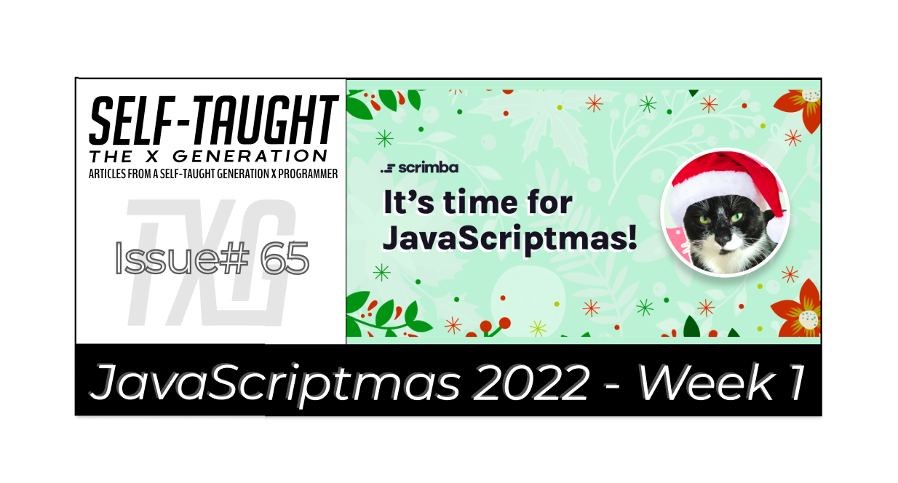
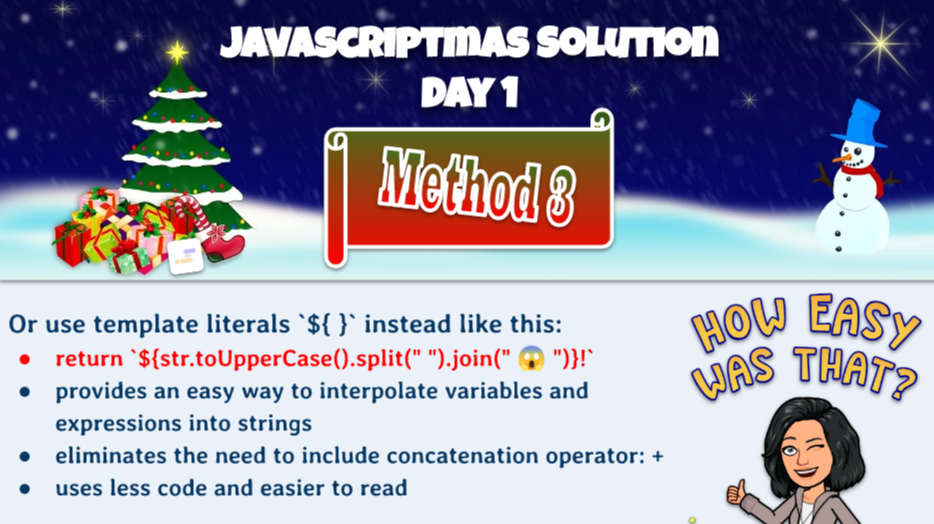

---

### JavaScriptmas 2022 - Week 1

Tis the season to be coding! JavaScriptmas time is here!

JavaScriptmas is a FREE annual festive coding event hosted by the online coding school [Scrimba](https://scrimba.com/). 

From December 1st to the 24th, new coding challenges will be released daily. All valid solutions submitted in their Discord JavaScriptmas channel act as a raffle ticket. So the more valid solutions you enter, the more chances you have to win! Two winners will be drawn during their YouTube Livestream on December 24th and receive $1000 cash plus a lifetime Scrimba Pro membership!

The first winner will be chosen randomly from the daily coding challenge submissions (on Discord).

The second winner is randomly chosen from their submitted code reviews (on Discord).    

What are the code reviews? A code review is when YOU [record a scrim](https://selftaughttxg.com/2021/02-21/CreateAScrimbaScreencast/) reviewing another person's JavaScriptmas solution, providing constructive feedback.

**This year will be my third year participating in Scrimba's JavaScriptmas event. I will be completing each of the daily challenges and providing detailed solutions. Also, I am featuring others' works in the community hights section!**

---

### Community highlights ⬇

#### Gina Russo



If you would like a demonstration on how to create a [Scrimba Screencast](https://selftaughttxg.com/2021/02-21/CreateAScrimbaScreencast/) and teach coding with a presentation, it doesn't get any better than [Gina Russo's](https://www.linkedin.com/in/gina-p-russo/)!

Gina teaches us how to solve the first day's coding challenge in not one, not two, but in three ways! She also created beautifully illustrated slides that provide the detailed coding concepts taught, which is very helpful to students following and coding along.  

---

###  My JavaScript code challenge solutions ⬇

---

### Day 1 challenge
#### Panic function
*Write a PANIC function. The function should take in a sentence and return the same sentence in all caps with an exclamation point (!) at the end. Use JavaScript's built-in string methods. If the string is a phrase or sentence, add a 😱 emoji in between each word.* 

```javascript
function panic(sentence) {
    const panicSentence = sentence.split(' ').join(' 😱 ').toUpperCase().concat('!');
    return panicSentence;
}
```

**Although the solution to this challenge may seem complicated at first glance, it is solved easily using JavaScript methods.**

***ℹ Note:*** *By using periods, you can chain JavaScript methods together.*

The [split()](https://www.w3schools.com/jsref/jsref_split.asp) method splits a string into an array of substrings. This method accepts a separator as an optional parameter. We get each word of the string by adding a space between single quotation marks as a separator.

The [join()](https://www.w3schools.com/jsref/jsref_join.asp) method returns an array as a string. This method includes a separator argument (the default separator is a comma). I solved this part of the challenge by passing in single quotation marks with an 😱 emoji as the separator argument. I included a space between the single quotation marks.

The [toUpperCase()](https://www.w3schools.com/jsref/jsref_touppercase.asp) method converts a string to uppercase letters. 

The [concat()](https://www.w3schools.com/jsref/jsref_concat_string.asp) method joins two or more strings and returns a new string. We add the exclamation point at the end by passing it in between single quotes as a parameter.

***🔗 [My solution for day 1](https://scrimba.com/scrim/co9a34c2898498bcea9f6ecd6)***

---

### Day 2 challenge
#### Totally Private Data Farm
*Write a function that maps through the current data and returns a new array of objects with only two properties: fullName and birthday. Each result in your array should look like this when you're done:* 
```javascript
{
    fullName: "Levent Busser", 
    birthday: "Fri Aug 20 1971"
}
```

**In this challenge, we must format information from the provided array and return it.**

Here is the first record in the provided array: 
```javascript
      {
         "name":{
            "title":"Mr",
            "first":"Levent",
            "last":"Busser"
         },
         "dob":{
            "date":"1971-08-21T01:08:00.099Z",
            "age":51
         }
      }
```

**First, let's look at how we retrieve each item we need using console logs. To simplify, we will view the first record in the provided array.**

We access the first record by using the console log as follows:
```javascript
console.log(data[0]);
{name: {title: "Mr", first: "Levent", last: "Busser"}, dob: {date: "1971-08-21T01:08:00.099Z", age: 51}}
```

We can retrieve the first and last names as follows:
```javascript
console.log(data[0].name.first);
console.log(data[0].name.last);
Levent
Busser
```

To create the full name, we concatenate the first and last name using [string interpolation](https://www.w3schools.com/js/js_string_templates.asp).
```javascript
const fullName = `${data[0].name.first} ${data[0].name.last}`;
console.log(fullName);
Levent Busser
```

Now we retrieve the date of birth date as follows:
```javascript
console.log(data[0].dob.date)
1971-08-21T01:08:00.099Z
```

To format the date specified by the challenge, we need to create a new [date object](https://www.w3schools.com/js/js_dates.asp) and pass in the date of birth value. Then we need to use the [toDateString()](https://www.w3schools.com/jsref/jsref_todatestring.asp) method to format it as specified.
```javascript
const date = new Date (data[0].dob.date)
console.log(date.toDateString())
Fri Aug 20 1971
```

**Now that we understand how to format the data, we can use a [forEach()](https://www.w3schools.com/jsref/jsref_foreach.asp) loop for cycling through the provided data array and then push the formatted data into a new array called totallyPrivateDataArray to return.**

```javascript
function transformData(data) {
  const totallyPrivateDataArray = [];

  const records = data.forEach((record) => {
      const fullName = `${record.name.first} ${record.name.last}`;    
      const birthDate = new Date(record.dob.date);    
          
      const newRecord = {
              fullName: fullName,
              birthday: birthDate.toDateString()
          };
          totallyPrivateDataArray.push(newRecord);
      });

  return totallyPrivateDataArray;
  }
```

For each iteration of the for loop, we create a variable for each record's full name and birthday. We assign the fullName variable by concatenating the first and last name. 

Then, we assign the birthday variable by creating a [new Date()](https://www.w3schools.com/js/js_dates.asp) object. We pass in the current record's date of birth value and format it using the [toDateString()](https://www.w3schools.com/jsref/jsref_todatestring.asp) method.

Now that we have new variables with the proper format, we create an object called newRecord and assign them with the key-value pairs as required by the coding challenge.

Finally, we push the object we just created into the totallyPrivateDataArray and return the array after the forEach loop.

***🔗 [My solution for day 2](https://scrimba.com/scrim/coc5544d981fd75aeb4ef0b50)***

---

### Day 3 challenge
#### Favorite Foods
*Topic: Object Destructuring*
  1. Edit the faveFoods object so that it contains your favorite foods.
  2. Destructure the faveFoods object into three consts: breakfast, lunch, and supper.
  3. Fetch the meals <section> from the DOM.
  4. Set the innerHTML content of the meals <section> to a paragraph that states what your favorite foods are for breakfast, lunch, and supper.Use a template literal to construct the string.

**This challenge instructs us to use [object destructuring](https://www.w3schools.com/react/react_es6_destructuring.asp). Destructuring makes it easy to extract just what we need from an object.**

So what's the benefit of using destructuring? Using it, we can assign multiple variables with just one succinct line of code!

In this challenge, the benefit of using destructuring is not apparent since we are working with a small object. However, it comes in handy when working with large objects.

*ℹ Here is a helpful short video by Fireship: [JS Destructuring in 100 Seconds](https://www.youtube.com/watch?v=UgEaJBz3bjY).*

First, we add the food to the empty strings provided in the faveFoods object. To add the emojis on Windows, use the buttons "Windows" + "." (period) to open up the emojis dialog box.
```javascript
const faveFoods = {
    breakfast: 'croissants 🥐',
    lunch: 'tuna sandwiches 🥪',
    supper: 'pizza 🍕'
}
```

Here is how to assign the variables using destructuring as instructed:
```javascript
const { breakfast, lunch, supper } = faveFoods;
```

We can verify it worked by using the console log:
```javascript
console.log(breakfast);
console.log(lunch);
console.log(supper);

croissants 🥐
tuna sandwiches 🥪
pizza 🍕
```

Next, we use [document.getElementById]() to fetch the meals `<section>` from the DOM as instructed by writing the following code:
```javascript
const meals = document.getElementById("meals");
```

Finally, we solve the challenge by using [innerHTML](https://www.w3schools.com/jsref/prop_html_innerhtml.asp) to add a paragraph using string interpolation.
```javascript
meals.innerHTML = `
    <p>
        For breakfast, I only like ${breakfast}. I love ${lunch} for lunch, and I usually want ${supper} for supper.
    </p>
`;    
```

***🔗 [My solution for day 3](https://scrimba.com/scrim/cob19441da8d65e3f62055ed0)***

---

### Day 4 challenge
#### Whispering function 
*Write a function 'whisper' that takes in a sentence and returns a new sentence in all lowercase letters with "shh..." at the beginning.* 

*The function should also remove an exclamation point at the end of the sentence, if there is one.* 

*Example*
*input: "The KITTENS are SLEEPING!"*
*output: "shh... the kittens are sleeping"*

*Hint: endsWith and slice*

**This challenge asks us to return a formatted sentence. If the sentence ends with an exclamation point, remove it, add "shh..." to the beginning, and set it to lowercase.**

To find out if the sentence ends with an exclamation point, we will use the aptly named [endsWith()](https://www.w3schools.com/jsref/jsref_endswith.asp) method. This method returns true or false.

```javascript
console.log(sentence.endsWith('!'));
```

We can use the [slice()](https://www.w3schools.com/jsref/jsref_slice_array.asp) method to remove the last character in the sentence we pass in. 

The slice method accepts a start and an end parameter. We enter zero to start at the beginning, and we enter a negative one to remove the last character.

```javascript
console.log(sentence.slice(0,-1));
```

To solve the challenge, we write an if statement that checks if the passed-in sentence ends with an exclamation point. We then return the appropriate sentence using string interpolation and the [toLowerCase()](https://www.w3schools.com/jsref/jsref_tolowercase.asp) method.

```javascript
function whisper(sentence) {

   if(sentence.endsWith('!')) {
       return `shh... ${sentence.slice(0,-1).toLowerCase()}`;
   } else {
       return `shh... ${sentence.toLowerCase()}`;
   }
}
```

***🔗 [My solution for day 4](https://scrimba.com/scrim/co41d48089c3b9230ecf9ca3a)***

---

### Conclusion

Scrimba's JavaScriptmas annual FREE event is a wonderful way to commit to coding daily and is a fun and festive event where all participants have an equal opportunity to win prizes, regardless of their skill level.

By completing all 24 coding challenges, you will be awarded a certificate and an exclusive Discord badge, and since each submission acts as a raffle ticket, you will have 24 chances to win prizes!

---

**Let's connect! I'm active on [LinkedIn](https://www.linkedin.com/in/michaeljudelarocca/) and [Twitter](https://twitter.com/MikeJudeLarocca).**

---

###### *Are you now interested in participating in this year's Scrimba's JavaScriptmas? Have you already participated in last year's Scrimba's JavaScriptmas? Please share the article and comment!* 

---