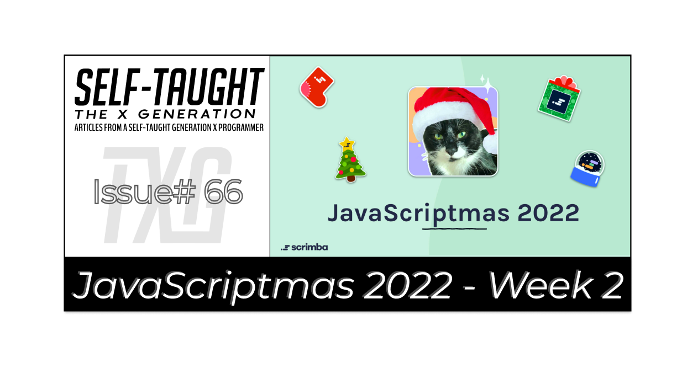
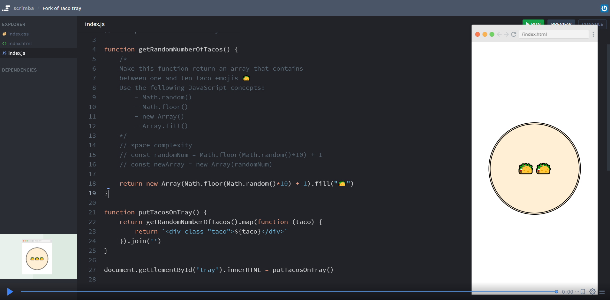
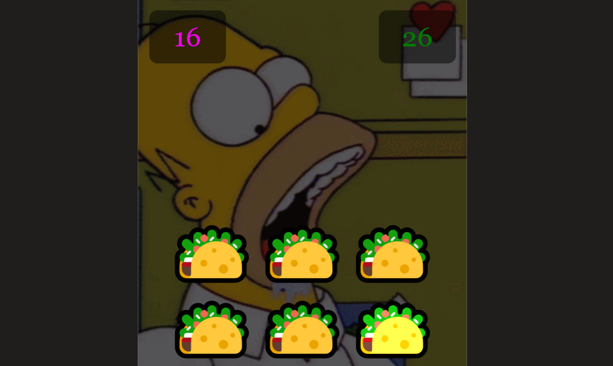
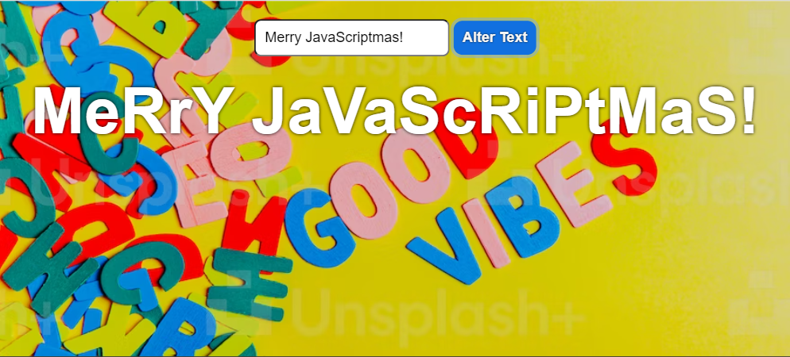

#### ❄ JavaScriptmas continues! I cover the event in this article series by completing each daily challenge providing detailed solutions, and featuring others' works in the community highlights section! ❄

---



---

### Intro

Grab your favorite holiday drink, put on some festive music, and get ready to code! 🍹

JavaScriptmas is a 24-day coding challenge event where you can win prizes, regardless of your skill level, by submitting valid solutions and helping others by recording code reviews of their work. 🎄

In this article series, I'm completing each challenge and stepping through and documenting in detail how I solve each one. If you are new to coding or just curious about my solution approach, you may find it helpful for your code-learning journey! 💻

I will also be highlighting others' outstanding works as I come across them during this wonderful festive event! 🎉

---

### Prize rules

From December 1st to the 24th, new coding challenges will be released daily. All valid solutions submitted in their Discord JavaScriptmas channel act as a raffle ticket. So the more valid solutions you enter, the more chances you have to win! Two winners will be drawn during their YouTube Livestream on December 24th and receive $1000 cash plus a lifetime Scrimba Pro membership!

The first winner will be chosen randomly from the daily coding challenge submissions (on Discord).

The second winner is randomly chosen from their submitted code reviews (on Discord). Each submitted coding review acts as a single raffle ticket, so the more you help others, the more chances you have to win a prize!

***Note:*** *You must enter each daily coding challenge submission by midnight (GMT), and it must be a working solution for your entry to be valid.*

--- 

### What are code reviews?

What are the code reviews? A code review is when YOU record a scrim reviewing another person's JavaScriptmas solution, providing constructive feedback.

*For a deep-dive into learning how to create Scrimba screencasts, I wrote this detailed article on the topic: [How to create Scrimba screencasts and turn them into a Scrimba course](https://selftaughttxg.com/2021/02-21/CreateAScrimbaScreencast/)*

---

### Community highlights ⬇

#### Jolene Kearse



If you're curious about what a code review providing constructive feedback looks like, [Jolene Kearse](https://twitter.com/FromJolene) just set the standard!

In a short four-minute review, Jolene starts by reviewing the code and complimenting the student on their approach to solving the problem and confirms with them that to code works perfectly.

Going over the student's code, she then explains that adding unnecessary variables is not a good idea because of memory (space complexity), which we learn about in data structures and algorithms.

Jolene then refactors the code to be more succinct and optimizes it to use less memory.

Finally, Jolene goes over the refactored code, explaining how each code challenge requirement is complete while complementing the student on their approach to solving it!

🔗[Link to the scrim](https://scrimba.com/scrim/cob664c889972afe30dc69916)

---

#### Daniel Beck Rose



[Daniel Beck Rose](https://discord.com/channels/684009642984341525/919153471691849769/1049682864398151730) turned the day six coding challenge of creating a random number of tacos into a game!

**How the game works:**
* new random number of tacos appears every 2 seconds
* you get +1 point for every taco you click on
* you get -1 point for every taco you haven't clicked on when the next tacos appear
* you get +2 bonus points if you get 6 or more tacos in a single round
* you have 30 seconds to score as many points as you can
* your top score gets saved

The gameplay is similar to a wack-a-mole game and displays a hilarious animated gif of Homer Simpson with his mouth open and drooling as if he is the one eating all the remaining tacos!

Discord: DanielBeckRose#3967

🔗[Link to the scrim](https://scrimba.com/scrim/coea541eeafbc701b1b7c607f)

---

#### Dheeraj Purohit



Creatively combining what he has learned, [Dheeraj Purohit](https://twitter.com/the_indianyoga) turned the day seven challenge into a function that simulates a typewriter!

This coding challenge only requires us to return a string with alternating uppercase and lowercase letters.

However, the function Dheeraj wrote not only meets the code challenge requirements but takes in a sentence the user enters and then has it typed out on the screen, letter by letter!  

🔗[Link to the scrim](https://scrimba.com/learn/javascriptmas/fork-of-alternating-caps-dheeraj-co3764a0d8f0b3f9fd34cb1a1)

---

### My JavaScript code challenge solutions ⬇

---

### Day 5 challenge
#### Candy Sale
*It's the day after Halloween 🎃 and all the candy is on sale!*

*To buy up all the candy, use map() and filter() to put all the candy into a 'shoppingCart' array.* 

*The new array should contain only the item and the price, like this:*
```javascript
Expected output: 
[
    {item: "🍭", price: 2.99},
    {item: "🍫", price: 1.99}, 
    {item: "🍬", price: 0.89}
]
```    

**This challenge instructs us to solve it using filter() and map().**

The [filter()](https://www.w3schools.com/jsref/jsref_filter.asp) method creates a new array filled with elements that pass a test provided by a function.

With [map()](https://www.w3schools.com/jsref/jsref_map.asp), we can perform an action on each element in a collection and then gather the results into a new array.

Let's take a look at just the first record in the products array to see what we are working with:

```javascript
console.log(products[0]);
{item: "🍭", price: 2.99, type: "sweet"}
```

So, first, we need to check each record (object) in the products array to see if its value for type equals sweet. Using filter, we can set just these records to a new array declared "filterProducts" as follows:
```javascript
const filterProducts = products.filter(product => product.type === "sweet");
```

We can console logs to see the results: 
```javascript
console.log(filterProducts);
[{item: "🍭", price: 2.99, type: "sweet"}, {item: "🍫", price: 1.99, type: "sweet"}, {item: "🍬", price: 0.89, type: "sweet"}]
```

Now, let's see how map works separately. We will use map to return a new array declared "mapProducts," with only the key-value pairs introduced by the challenge as follows:
```javascript
const mapProducts = products.map(product => ({item: product.item, price: product.price})); 
```

We can console logs to see the results of using map: 
```javascript
console.log(mapProducts);
[{item: "🍭", price: 2.99}, {item: "🍫", price: 1.99}, {item: "🥫", price: 1.99}, {item: "🍬", price: 0.89}, {item: "🥦", price: 3.99}, {item: "🍖", price: 3.99}]
```

Great! We got both filter and map working separately. Now, before we write a function to solve the challenge, let's see how we can chain both methods to get the results we want:  
```javascript
const chain = products.filter(product => product.type === "sweet").map(product => ({item: product.item, price: product.price})); 
```

Once again, let's see the results by using a console log:
```javascript
console.log(chain);
[{item: "🍭", price: 2.99}, {item: "🍫", price: 1.99}, {item: "🍬", price: 0.89}]
```

Now that we know how to use the filter and map methods, we can write a function to solve the challenge. By chaining the methods, we can create a new array declared "shoppingCart" with one succinct line of code.
```javascript
function getSaleItems(products){
    
    const shoppingCart = products.filter(product => product.type === "sweet").map(product =>({item: product.item, price: product.price}));

    return shoppingCart;
};
```

***🔗 [My solution for day 5](https://scrimba.com/scrim/co6d84464bcc4a8a9ea71fb4b)***

---

### Day 6 challenge
#### Taco Tray

*Make this function return an array that contains between one and ten taco emojis 🌮 Use the following JavaScript concepts:*
* Math.random()
* Math.floor()
* new Array()
* Array.fill()

**We will use the four JavaScript concepts as instructed to solve this challenge.**

**Random numbers in JavaScript** 

Ah, yes, creating random numbers in JavaScript. If you haven't already done so, you will often create random numbers in your coding projects.

The [Math.random()](https://www.w3schools.com/jsref/jsref_random.asp) method returns a random number from 0 (inclusive) up to but not including 1 (exclusive).

So, to get a number between 0 and 10, we need to use the Math.random() method and multiply it by ten as follows:
```javascript
let x = Math.random() * 10;
console.log(x)
4.420535959639502
```

We can eliminate the decimal places using [Math.floor()](https://www.w3schools.com/jsref/jsref_random.asp):
```javascript
console.log(Math.floor(x));
4
```

To create a random number between 1 and 10, after we multiply by 10, we add 1, utilizing Math.floor():
```javascript
let randomNumber = Math.floor(Math.random()*10)+1;
```

Now, let's create an array name tacos with 3 undefined elements using the JavaScript keyword [new Array()](https://www.w3schools.com/js/js_arrays.asp):
```javascript
const tacos= new Array(3); 
console.log(tacos);  
[undefined, undefined, undefined]
```

We can now assign a taco emoji to all of the undefined elements using the [fill()](https://www.w3schools.com/jsref/jsref_fill.asp) method:
```javascript
tacos.fill('🌮');
console.log(tacos); 
["🌮", "🌮", "🌮"]
```

Now we have covered everything we need to solve the challenge. 

**We can create a variable named tray with one succinct line of code by chaining the JavaScript methods, and then add it to the provided function as follows:**
```javascript
function getRandomNumberOfTacos() {        
    const tray = new Array(Math.floor(Math.random()*10)+1).fill('🌮').join(' ');    
    return [tray];
}
```

***Note:*** *We use the [join(' ')](https://www.w3schools.com/jsref/jsref_join.asp) method to remove the commas between the taco emojis.*

---

### Day 7 challenge
#### Alternating Caps 
*Write a function that takes in a string of letters and returns a sentence in which every other letter is capitalized.*

*Example input: "I'm so happy it's Monday"*
*Example output: "I'M So hApPy iT'S MoNdAy"*

**This challenge requires us to take in a string and return it with alternating capitalization.**

I create an array, use a loop, and use the JavaScript split method to solve this challenge.

First, I create a new empty array named newStr to return and a strSplit array that converts the string passed into the function into an array. 

```javascript
const newStr = [];
const strSplit = str.split('');
console.log(strSplit);
["I", "'", "m", " ", "s", "o", " ", "h", "a", "p", "p", "y", " ", "i", "t", "'", "s", " ", "M", "o", "n", "d", "a", "y"]
```
Now it's time to write the [for loop](https://www.w3schools.com/js/js_loop_for.asp).

To find out if a number is odd or even, we use the [modulus operator (%)](https://www.w3schools.com/js/js_arithmetic.asp), which returns the division remainder. If a number divided by 2 leaves a remainder of 1, then the number is odd.

Using the modulus operator (%) in a for loop allows us to check if the current iteration value is odd or even, allowing us to write an if statement to handle each case.

We use the [toUpperCase()](https://www.w3schools.com/jsref/jsref_touppercase.asp) method on the letters in the strSplit array during the even number iterations. If the loop is on an odd number iteration, we use the [toLocaleLowerCase()](https://www.w3schools.com/jsref/jsref_tolocalelowercase.asp) method.

We push each uppercase and lowercase charter into the newStr array.

```javascript
function altCaps(str){
    const newStr = [];
    const strSplit = str.split('');
        console.log(strSplit)
      
    for(let i = 0; i < strSplit.length; i++) {
        if(i % 2 == 0 ) {
            newStr.push(strSplit[i].toUpperCase());
        } else {
            newStr.push(strSplit[i].toLocaleLowerCase());
        }
    }
    return newStr.join('');
}
```
The coding challenge is solved by retuning the newStr array using the [join('')](https://www.w3schools.com/jsref/jsref_join.asp) method.

🔗 [My solution for day 7](https://scrimba.com/scrim/codc84e3689c8014085ccdde2)

---

### Day 8 challenge
#### Valid Time

*Check if the given string is a correct time representation on the 24-hour clock.*

**The hints to solve this challenge are to use the JavaScript methods parseInt() and split(). Notice the hint does not tell us to use the JavaScript Date object.**

Using the [split()](https://www.w3schools.com/jsref/jsref_split.asp) method, we isolate the first number before and the second after the colon.

We then use [parseInt()](https://www.w3schools.com/jsref/jsref_parseint.asp) on the first and second numbers so we can then use an if statement to verify valid numbers ( valid clock time ).

*[Military time](https://militaryconnection.com/military-time/#:~:text=Military%20time%20operates%20on%20a%2024%2D%20hour%20clock%20that%20begins,00%20p.m.%20being%202300%20hours.) operates on a 24- hour clock that begins at midnight which is referred to as 0000 hours, with 1:00 a.m. being 0100 hours, 2:00 a.m. being 0200 hours, etc. all the way to 11:00 p.m. being 2300 hours.*

To solve the challenge, we need to check if each of the four numbers falls within a valid range.

**Clock numbers:**
* First: 0 to 2
* Second: 0 to 3
* Third: 0 to 5
* Forth: 0 to 9

We return true only if all four numbers are within the specified range. Else we return false.

To write the function, I created an empty array and an array created from the passed-in string using the Javascript split() method.

I then use a for loop to take each character, excluding the colon, use parseInt() to convert it into a number, and then push it into the arrTime array.

Finally, I create an if statement to check if each number in the arrTime array falls within a valid range.

```javascript
function validTime(str) {
    const arrTime = [];    
    const strSplit = str.split('');    

    for(let i = 0; i < strSplit.length; i++) {
        if(strSplit[i] != ':') {
            arrTime.push(parseInt(strSplit[i]))
        }   
    }
  
    if(
        arrTime[0] >= 0 && arrTime[0] <= 2 &&
        arrTime[1] >= 0 && arrTime[1] <= 3 &&
        arrTime[2] >= 0 && arrTime[2] <= 5 &&
        arrTime[3] >= 0 && arrTime[3] <= 9
        ) {
        return true;
    } else {
        return false;
    }
}
```

🔗 [My solution for day 8](https://scrimba.com/scrim/co6304bd2ba53d34a83486cee)

---

#### *If you would like to learn more about my journey with Scrimba and how learning with them may help you, you can read my article: [How Scrimba is helping me and many others to become confident, well-prepared web developers](https://selftaughttxg.com/2021/06-21/06-07-21/)*

---

**I continue to have wonderful experiences with Scrimba, and I highly recommend learning with them! You can read my full [Scrimba review](https://selftaughttxg.com/2020/12-20/Review-Scrimba/) on my 12/13/2020 post.**


#### *"That&#39;s one of the best Scrimba reviews I&#39;ve ever read, <a href="https://twitter.com/MikeJudeLarocca?ref_src=twsrc%5Etfw">@MikeJudeLarocca</a>. Thank you! 🙏 "*
###### &mdash; Per Harald Borgen, CEO of Scrimba <a href="https://twitter.com/perborgen/status/1338462544143540227?ref_src=twsrc%5Etfw">December 14, 2020</a></blockquote>

---

### Conclusion

Scrimba's JavaScriptmas annual FREE event is a wonderful way to commit to coding daily. It is a fun and festive event where all participants have an equal opportunity to win prizes, regardless of their skill level.

By completing all 24 coding challenges and submitting them daily by midnight (GMT) time, each submission acts as a raffle ticket, so you will have up to 24 chances to win prizes, plus unlimited more chances with submitting coding reviews!

---

**Let's connect! I'm active on [LinkedIn](https://www.linkedin.com/in/michaeljudelarocca/) and [Twitter](https://twitter.com/MikeJudeLarocca).**

---

###### *Are you now interested in participating in this year's Scrimba's JavaScriptmas? Have you already participated in last year's Scrimba's JavaScriptmas? Please share the article and comment!* 

---
