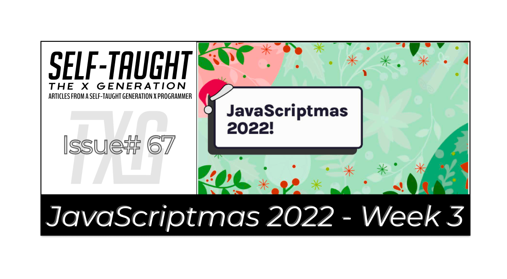
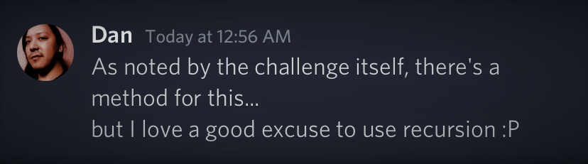
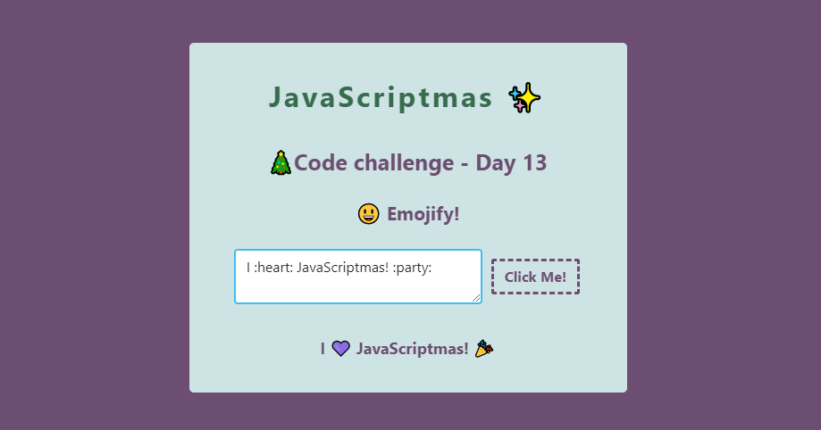
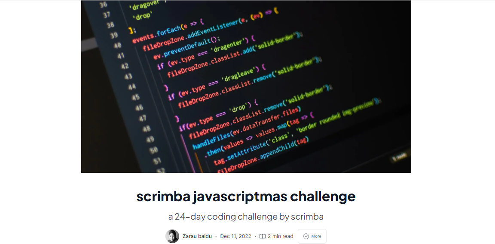

#### JavaScriptmas is almost over, but there is still time to get in on the fun! I cover the event in this article series by completing each daily challenge, providing solutions, and featuring others' works!

---



---

### Intro

Grab your favorite holiday drink, put on some festive music, and get ready to code! 🍹

JavaScriptmas is a 24-day coding challenge event where you can win prizes, regardless of your skill level, by submitting valid solutions and helping others by recording code reviews of their work. 🎄

In this article series, I'm completing each challenge and stepping through and documenting in detail how I solve each one. If you are new to coding or just curious about my solution approach, you may find it helpful for your code-learning journey! 💻

I will also be highlighting others' outstanding works as I come across them during this wonderful festive event! 🎉

---

### Prize rules

From December 1st to the 24th, new coding challenges will be released daily. All valid solutions submitted in their Discord JavaScriptmas channel act as a raffle ticket. So the more valid solutions you enter, the more chances you have to win! Two winners will be drawn during their YouTube Livestream on December 24th and receive $1000 cash plus a lifetime Scrimba Pro membership!

The first winner will be chosen randomly from the daily coding challenge submissions (on Discord).

The second winner is randomly chosen from their submitted code reviews (on Discord). Each submitted coding review acts as a single raffle ticket, so the more you help others, the more chances you have to win a prize!

***Note:*** *You must enter each daily coding challenge submission by midnight (GMT), and it must be a working solution for your entry to be valid.*

--- 

### What are code reviews?

What are the code reviews? A code review is when YOU record a scrim reviewing another person's JavaScriptmas solution, providing constructive feedback.

*For a deep-dive into learning how to create Scrimba screencasts, I wrote this detailed article on the topic: [How to create Scrimba screencasts and turn them into a Scrimba course](https://selftaughttxg.com/2021/02-21/CreateAScrimbaScreencast/)*

---

### Community highlights ⬇

#### Daniel Nagaoka

The day 17 challenge instructs us to write a function to flatten nested arrays of strings or numbers into a single array. Although there is a method for this, we are encouraged also solve it manually. 

Unlike the many who solved this challenge with nested loops, including myself, [Dan](https://www.linkedin.com/in/daninagaoka/) creatively solved it using recursion!

**So, what is recursion? [FreeCodeCamp describes](https://www.freecodecamp.org/news/quick-intro-to-recursion),** ***"recursion is when a function calls itself until someone stops it. It can be used instead of a loop. If no one stops it, it'll recurse forever and crash your program. A base case is a condition that stops the recursion."***

My initial thought was to use recursion to solve a challenge like this, flattening arrays. However, I understand the theory of recursion, but I need to learn how to use it in practical application. So I was excited when I came across Dan's message in the JavaScriptmas Discord, along with [a link to his elegant solution](https://scrimba.com/scrim/co5e04457ab5f4ce8e3982c65):



Initially, Dan only had a few lines of code (without the comments explaining the code). I reached out to Dan, complimenting his work, and I asked if he could please elaborate on his solution, as it will significantly benefit others learning to code, including myself!

**Not only did he add comments to his solution, but Dan also took the time to write a whole article section! So, without further ado, let's learn from Dan on the topic of recursion ⬇**    

---

First, a few notes on the Array.prototype.reduce method. It's not the main feature of the solution, but it can be quite a handful for beginners, so I'd rather address it, albeit briefly:

In short, the reduce method consolidates the original array into a single value - which can be virtually anything, from a string or number to a new array or an object. To do that, it iterates through its children and will process each of them with a custom function - the reducer callback function. The reducer will always receive data about the current iteration as arguments, the most important being:
1. The consolidated (or "accumulated") value that will be expanded upon, then passed to the next iteration;
2. The current child being processed in this iteration.

**The reduce method itself, therefore, requires:**
1. The reducer callback function, as described above;
2. An initial state for the consolidated value.

*For a hands-on explanation, you can refer to this [really good video by Mosh](https://www.youtube.com/watch?v=g1C40tDP0Bk).* 

Now for the actual usage of recursion.

**Simply put, recursion is just a function that calls itself. That may summarize it, but its applicability is a little more elusive to beginners.**

Let's start by getting something out of the way: recursion !== looping. It isn't, and if you're using it for this purpose, then you're just building confusing code.

Recursion really shines when we need to iterate over a structure of interconnected elements (called nodes) which you need to process, sort or find something in it while having no previous knowledge about its size or depth.

**So why does it apply in our current scenario? Let's say you were to flatten an array using a for loop:**
```javascript
function flatten(arr) {
  const array = [1, 2, [3, 4]];
  const newArray = [];
  for (const item of array) {
    if (Array.isArray(item)) newArray.push(...item);
    else newArray.push(item);
  }
  return newArray;
}

// [1, 2, 3, 4];
console.log(flatten(newArray));
```

**Sure, that works, but try a different, more elaborate array structure. Let's say:**
```javascript
const ohnoes = [1, 2, [3, [4, 5]]];
// [1, 2, 3, [4, 5]]
console.log(flatten(ohnoes));
```

**I hope you realized quite quickly that it would be unsustainable to nest n for loops in your code to account for n possible layers.**

So what if, instead of nesting for loops, we actually called the function itself to solve the nested arrays for us? 
Keeping in mind that sole objective is to only have non-array elements as children to our final array, we can come up with a recursive function that will always return an array with an array-free children list, like so:
```javascript
function flattenRecursive(arr) {
    return arr.reduce(
        (consolidated, child) => {
            // check if the child is an array itself
            if (Array.isArray(child)) {
                // we need to flatten the array before including its elements in
                // our consolidated array, so we call flattenRecursive recursively
                consolidated.push(...flattenRecursive(child));
            } else {
                // not an array, so just include it in the final array
                consolidated.push(child);
            }
            
            // return the consolidated array
            return consolidated;
        },
        [], // the initial, empty array
    );
}
```

**And now we get:**
```javascript
const yay = [1, 2, [3, [4, [5, [6, [[[[[7], [8, 9]]]]]]], 10]]];
// [1, 2, 3, 4, 5, 6, 7, 8, 9, 10]
console.log(flattenRecursive(yay));
```

>And that's about it!
>Recursion is a bit too hefty a subject to tackle casually in an article like this and admittedly not something we really use often in our everyday lives as programmers, but a powerful technique when it comes into play, and definitely a must-have skill for every computer scientist. 

>*- Dan*

#### 🎉*Absolutely amazing! Thank you so much, Dan, for sharing your insights and providing us with this valuable content!* 🎉

🔗 LinkedIn: [Daniel Nagaoka](https://www.linkedin.com/in/daninagaoka/) 

🔗 Link to Dan's challenge scrim: [Pumpkin's Prizes](https://scrimba.com/scrim/co5e04457ab5f4ce8e3982c65)

---

#### Carla



**Carla Took the day 13 emoji challenge and turned it into a beautifully styled form that displays the messages entered by the users!**

The challenge instructs us to write two functions. The first function replaces lowercase words surrounded by colons with a corresponding emoji. Then the second function finds any emoji shortcodes in a phrase.

```javascript
const emojis = {
    "smile": "😊",
    "angry": "😠",
    "party": "🎉",
    "heart": "💜",
    "cat":   "🐱",
    "dog":   "🐕"
}
```

As you can see in the picture above, when a user enters a phrase and clicks the "Click Me" button, corresponding emojis are replaced by words surrounded by colons. "I 💜 JavaScriptmas! 🎉"

**Carla's Discord:** carlamar#3910 

[🔗Link to the scrim](https://scrimba.com/learn/javascriptmas/fork-of-emojify-co1544d709da17c8e24fd6dcc)

---

#### Zarau baidu



(WRITE ARTICLE SECTION)

[🔗Link to the article](https://zeerau.hashnode.dev/scrimba-javascriptmas-challenge)

---

### My JavaScript code challenge solutions ⬇

---

### Day 12 challenge
#### Breakfast Menu
*Topic: .map()*
*Our restaurant menu currently only shows the breakfast menu,as it has been hard coded into the HTML file. However, we want to offer a dinner menu instead. Let's fix this using .map()*

1. First, fetch a reference to the menu <section> from the DOM. 
2. Set the innerHTML content of the menu <section> to...
3. the dinnerFoods array by mapping over the array and returning the following div for each food in the array: `<div class="food">FOOD VALUE HERE</div>` 
4. Remember to remove any separating commas between the food divs!

**The challenge provides all the HTML and CSS. We just need to write the JavaScript.**

First, we assign the menu variable using [getElementById()](https://www.w3schools.com/jsref/met_document_getelementbyid.asp) as follows:
```javascript
const menu = document.getElementById("menu");
```

Now let's take a look at the HTML `<div>` the challenge asks us to create:
```html
<div class="food">FOOD VALUE HERE</div>
```

**To solve the challenge, we will use [map()](https://www.w3schools.com/jsref/jsref_map.asp) as instructed, and we will use string interpolation to replace "FOOD VALUE HERE" for each item in the dinner foods array, using [join()](https://www.w3schools.com/jsref/jsref_join.asp) to remove the commas.**
```javascript
menu.innerHTML = dinnerFoods.map(item => `<div class="food">${item}</div>`).join('');
```
    
🔗 [My solution for day 12](https://scrimba.com/scrim/coe6d404f9ded6ede77611415)

---

### Day 13 challenge
#### Emojify
*1. Write a function that checks if a lowercase word starts and ends with a colon. If it does, remove the colons and look up the word in the emoji object. If the word is in the emojis object, return the corresponding emoji.If it isn't, return the original word.*

*2. Write a function to find any emoji shortcodes in a phrase.Your function should map over each word in the phrase, emojify any word that begins and ends with a colon, then return the emojified phrase.Feel free to use your emojify function from the previous exercise!*

**We solve this challenge by creating two functions. The first function returns an emoji if they pass certain conditions and if it exists in the emoji object. The second function returns a sentence and utilizes the first function to replace applicable words with emojis.**

**Function 1**

Let's start with writing the first function. The challenge provides an emoji object. I created an emoji array by utilizing [Object.entries()](https://developer.mozilla.org/en-US/docs/Web/JavaScript/Reference/Global_Objects/Object/entries) as follows:
```javascript
const emojisArray = Object.entries(emojis); 
    console.log(emojisArray);
[["smile", "😊"], ["angry", "😠"], ["party", "🎉"], ["heart", "💜"], ["cat", "🐱"], ["dog", "🐕"]]    
```

Now, we need to determine whether the passed-in word starts and ends with a colon. We use an [if statement](https://www.w3schools.com/js/js_if_else.asp), [startsWith()](https://www.w3schools.com/jsref/jsref_startswith.asp), and [endsWith()](https://www.w3schools.com/jsref/jsref_endswith.asp).
```javascript
if(word.startsWith(':') && word.endsWith(':')) {

}
```

Next, we create a variable using [slice()](https://www.w3schools.com/jsref/jsref_slice_array.asp) to remove the colons.
```javascript
const wordSlice = word.slice(1,-1)
```

Now, using a for loop, we iterate over the emoji array. If we find a matching word, we return the corresponding emoji. If we do not find a matching word, we return the wordSlice variable (returning the wordSlice variable filters out matches that begin with an UPPERCASE). 
```javascript
for(let i = 0; i < emojisArray.length; i++) {
    if(wordSlice === emojisArray[i][0]) {
        return emojisArray[i][1];
    }
}
return wordSlice;
```
Finally, we return the passed-in word If no conditions are met in the if statement.
```javascript
return word; 
```

That was a lot to take in, so let's see the entire completed function.
```javascript
function emojifyWord(word){
        
    const emojisArray = Object.entries(emojis); 
    
    if(word.startsWith(':') && word.endsWith(':')) {
        
        const wordSlice = word.slice(1,-1)
            
        for(let i = 0; i < emojisArray.length; i++) {
            if(wordSlice === emojisArray[i][0]) {
                return emojisArray[i][1];
            }
        }
        return wordSlice;
    } 
    return word;     
}
```

**Function 2**

**Now it's time to write the second function. This function will take in a string ( a sentence ) and replace any lowercase word that starts and ends with a colon and exists in the emoji array.**

We start by turning that passed-in string into an array:
```javascript
const phraseArray = phrase.split(' ');
	console.log(phraseArray);
["I", ":heart:", "my", ":cat:"]
```

Next, we write a for loop to iterate over the emoji array and use an if statement in search of lowercase words starting and ending with colons.
```javascript
        if(phraseArray[i].startsWith(':') && phraseArray[i].endsWith(':')) {

        }
```

If we find a lowercase word that starts and ends with a colon, we use the first function to retrieve the emoji, and then we use [splice()](https://www.w3schools.com/jsref/jsref_splice.asp) to replace the word in the string with the emoji.
```javascript
phraseArray.splice(i,1,emojifyWord(phraseArray[i]));
```

Finally, we return the phrase array using [join()](https://www.w3schools.com/jsref/jsref_join.asp).
```javascript
return phraseArray.join(' ');
```

Here is the entire second function:
```javascript
function emojifyPhrase(phrase){

    const phraseArray = phrase.split(' ');

    for(let i = 0; i < phraseArray.length; i++) {
        if(phraseArray[i].startsWith(':') && phraseArray[i].endsWith(':')) {
            phraseArray.splice(i,1,emojifyWord(phraseArray[i]));
        }
    }  
    return phraseArray.join(' ');
}

console.log(emojifyPhrase("I :heart: my :cat:"));
I 💜 my 🐱
```

🔗 [My solution for day 13](https://scrimba.com/scrim/co78b48fcaa8ee36684bb3559)

---

### Day 14 challenge
#### Count Vowel Consonant
*You are given string s that consists of only lowercase English letters. If vowels ('a', 'e', 'i', 'o', 'u') are given a value of 1 and consonants are given a value of 2, return the sum of all of the letters in the input string.*

**I solved this challenge using a [for loop](https://www.w3schools.com/js/js_loop_for.asp) and an [if statement](https://www.w3schools.com/js/js_if_else.asp). If the current letter in the loop is a vowel, I add 1; if the current letter in the loop is a consonant, I add 2. I return the total in a variable named counter.**

```javascript
function countVowelConsonant(str) {

  let counter = 0;
  
  for(let i = 0; i < str.length; i++) {

      if(
          str[i] === 'a' ||
          str[i] === 'e' ||
          str[i] === 'i' ||
          str[i] === 'o' ||
          str[i] === 'u' 
          ){
           counter++;   
          } else {
           counter+=2;  
          }
  }
  return counter;
}
```

🔗 [My solution for day 14](https://scrimba.com/scrim/co4c54238bbff17b8c7f50a52)

---

### Day 15 challenge
#### Palindromes
*Palindromes are words that are the same forward or backward. For example, "noon" and "kayak" are palindromes.*
 
*Write a function to check if a lowercase string of letters is a palindrome. If the word is a palindrome, return true. If it isn't, return false.* 

**We solve this challenge by comparing the string passed-in with the reversed version of the passed-in string. We use the JavaScript methods split, reverse, and join in accomplishing this task.** 
 
Let's take a look one step at a time:

**We first use [split()](https://www.w3schools.com/jsref/jsref_split.asp)**
```javascript
const split = str.split('');
    console.log(split);
["p", "u", "m", "p", "k", "i", "n", "s"]
```

**Then we use [reverse()](https://www.w3schools.com/jsref/jsref_reverse.asp)**
```javascript
const reverse = split.reverse();
    console.log(reverse);
["s", "n", "i", "k", "p", "m", "u", "p"]
```

**Now we use [join()](https://www.w3schools.com/jsref/jsref_join.asp)**
```javascript
const join = reverse.join('');
    console.log(join);  
snikpmup
```
*We can clearly see that the word "pumpkins" is not the same when reversed.*

**To solve the challenge, we can use the [Conditional (Ternary) Operator](https://www.w3schools.com/js/js_comparisons.asp) to write one succinct line of code to add to the function as follows:**

```javascript
function isPalindrome(str){
  return str === str.split('').reverse().join('') ? true : false;        
}
```

🔗 [My solution for day 15](https://scrimba.com/scrim/cod394a7c91f7987142755176)

---

### Day 16 challenge
#### Insert Dashes
*Transform a given sentence into a new one with dashes between each two consecutive letters.*

**Example**
For inputString = "aba caba" the output should be "a-b-a c-a-b-a"

**Hints**
* join()
* split()

At first glance, this challenge seems like it will be solved by simply using join() and split(). However, doing so results in extra dashes, failing the challenge.

```javascript
console.log(arr.split('').join('-'));
a-b-a- -c-a-b-a
```
Although my approach to solving it is not succinct code, it is easy to follow logically. 

**Using a [for each loop()](https://www.w3schools.com/jsref/jsref_foreach.asp), I pass each letter through an [else if](https://www.w3schools.com/js/js_if_else.asp) statement that covers all scenarios. I then push each appropriately modified letter into a new array that I [join()](https://www.w3schools.com/jsref/jsref_join.asp) and return.**

**Scenarios:**
* The next item is blank
* The current item is blank
* The current item is the last in the array

```javascript
function insertDashes(arr) {
    
    const returnArray = [];
    const splitArray = arr.split('');

    for(let i = 0; i < splitArray.length; i++) {
        
        if(splitArray[i+1] == " ") {
            returnArray.push(`${splitArray[i]}`);
        } else if (splitArray[i] == " "){
            returnArray.push(`${splitArray[i]}`);
        } else if(i === splitArray.length -1){
            returnArray.push(`${splitArray[i]}`);
        } else {
            returnArray.push(`${splitArray[i]}-`);
        }
    }
    return returnArray.join('');
}
result: ,"a-b-a c-a-b-a"
```

🔗 [My solution for day 16](https://scrimba.com/scrim/co63a4e4c82106e6cef1a20c7)

---

### Day 17 challenge
#### Pumpkin's Prizes

🔗 [My solution for day 17](https://scrimba.com/scrim/coacd4756b7fa2610ca92b5f6)

---

### Day 18 challenge
#### Candies

🔗 [My solution for day 18](https://scrimba.com/scrim/co5c04fc7b969ba7c7980ace6)

---

#### *If you would like to learn more about my journey with Scrimba and how learning with them may help you, you can read my article: [How Scrimba is helping me and many others to become confident, well-prepared web developers](https://selftaughttxg.com/2021/06-21/06-07-21/)*

---

**I continue to have wonderful experiences with Scrimba, and I highly recommend learning with them! You can read my full [Scrimba review](https://selftaughttxg.com/2020/12-20/Review-Scrimba/) on my 12/13/2020 post.**


#### *"That&#39;s one of the best Scrimba reviews I&#39;ve ever read, <a href="https://twitter.com/MikeJudeLarocca?ref_src=twsrc%5Etfw">@MikeJudeLarocca</a>. Thank you! 🙏 "*
###### &mdash; Per Harald Borgen, CEO of Scrimba <a href="https://twitter.com/perborgen/status/1338462544143540227?ref_src=twsrc%5Etfw">December 14, 2020</a></blockquote>

---

### Conclusion

Scrimba's JavaScriptmas annual FREE event is a wonderful way to commit to coding daily. It is a fun and festive event where all participants have an equal opportunity to win prizes, regardless of their skill level.

By completing all 24 coding challenges and submitting them daily by midnight (GMT) time, each submission acts as a raffle ticket, so you will have up to 24 chances to win prizes, plus unlimited more chances with submitting coding reviews!

---

**Let's connect! I'm active on [LinkedIn](https://www.linkedin.com/in/michaeljudelarocca/) and [Twitter](https://twitter.com/MikeJudeLarocca).**

---

###### *Are you now interested in participating in this year's Scrimba's JavaScriptmas? Have you already participated in last year's Scrimba's JavaScriptmas? Please share the article and comment!* 

---