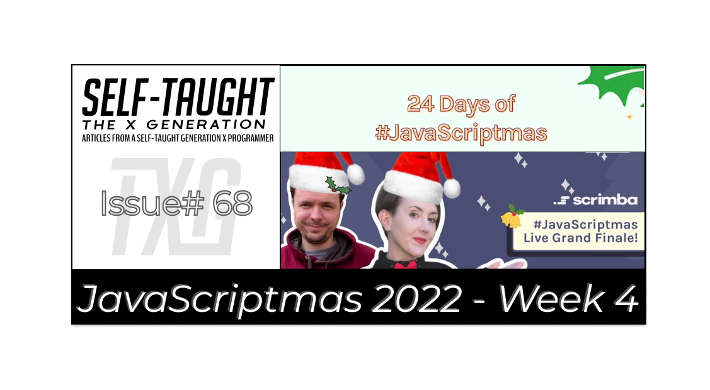

#### The post-JavaScriptmas 2022 post! This article concludes Scrimba's annual 24-day holiday event! I cover the remaining challenges with detailed solutions, more community highlights, and the Livestream!

(WRITE ARTICLE SECTION)

---

 

---

HOLD
(WRITE ARTICLE SECTION)

---

### Community highlights ⬇
(WRITE ARTICLE SECTION)

---

### Scrimba JavaScriptmas Grand Finale

<iframe width="956" height="538" src="https://www.youtube.com/embed/--ujdY7Qdgk" title="Scrimba JavaScriptmas Grand Finale" frameborder="0" allow="accelerometer; autoplay; clipboard-write; encrypted-media; gyroscope; picture-in-picture" allowfullscreen></iframe>

---

### My JavaScript code challenge solutions ⬇
(WRITE ARTICLE SECTION)

---

### Day 19 challenge
#### Century From Year

---

### Day 20 challenge
#### Find Free Podcasts

---

### Day 21 challenge
#### Definitely Not FizzBuzz

---

### Day 22 challenge
#### HOLD

---

### Day 23 challenge
#### HOLD

---

### Day 24 challenge
#### HOLD

---

### My JavaScriptmas Submissions 💻

**Below is my list of each day's completed JavaScriptmas challenges. ⬇**

*I hope that "**Scrimba Claus**" checks it twice!* 🎄

---

###### *Pixabay: Illustration by Mohamed Hassan* 

---

### ❄ My JavaScriptmas submissions ❄
| Date          |      Scrim    |
| ------------- | :-----------: |
| 12/01/2022    | [Panic function](https://scrimba.com/scrim/co9a34c2898498bcea9f6ecd6) | 
| 12/02/2022    | [Totally Private Data Farm](https://scrimba.com/scrim/coc5544d981fd75aeb4ef0b50) |
| 12/03/2022    | [Favorite Foods](https://scrimba.com/scrim/cob19441da8d65e3f62055ed0) |
| 12/04/2022    | [Whispering function ](https://scrimba.com/scrim/co41d48089c3b9230ecf9ca3a) |
| 12/05/2022    | [Candy Sale](https://scrimba.com/scrim/co6d84464bcc4a8a9ea71fb4b) |
| 12/06/2022    | [Taco Tray](https://scrimba.com/scrim/coc8e45a187d6f095ff231931) |
| 12/07/2022    | [Alternating Caps](https://scrimba.com/scrim/codc84e3689c8014085ccdde2) |
| 12/08/2022    | [Valid Time](https://scrimba.com/scrim/co6304bd2ba53d34a83486cee) |
| 12/09/2022    | [toTitleCase](https://scrimba.com/scrim/co660469dadaf9bee14baf739) |
| 12/10/2022    | [Sort by length](https://scrimba.com/scrim/cofd24b83981281d36e1e8b8d) |
| 12/11/2022    | [Decode an Alien Message](https://scrimba.com/scrim/cob4e48959616f7a6f04ab267) |
| 12/12/2022    | [Breakfast Menu](https://scrimba.com/scrim/coe6d404f9ded6ede77611415) |
| 12/13/2022    | [Emojify](https://scrimba.com/scrim/co78b48fcaa8ee36684bb3559) |
| 12/14/2022    | [Count Vowel Consonant](https://scrimba.com/scrim/co4c54238bbff17b8c7f50a52) |
| 12/15/2022    | [Palindromes](https://scrimba.com/scrim/cod394a7c91f7987142755176) |
| 12/16/2022    | [Insert Dashes](https://scrimba.com/scrim/co63a4e4c82106e6cef1a20c7) |
| 12/17/2022    | [Pumpkin's Prizes](https://scrimba.com/scrim/coacd4756b7fa2610ca92b5f6) |
| 12/18/2022    | [Candies](https://scrimba.com/scrim/co5c04fc7b969ba7c7980ace6) |
| 12/19/2022    | [HOLD]() |
| 12/20/2022    | [HOLD]() |
| 12/21/2022    | [HOLD]() |
| 12/22/2022    | [HOLD]() |
| 12/23/2022    | [HOLD]() |
| 12/24/2022    | [HOLD]() |

---

#### *If you would like to learn more about my journey with Scrimba and how learning with them may help you, you can read my article: [How Scrimba is helping me and many others to become confident, well-prepared web developers](https://selftaughttxg.com/2021/06-21/06-07-21/)*

---

**I continue to have wonderful experiences with Scrimba, and I highly recommend learning with them! You can read my full [Scrimba review](https://selftaughttxg.com/2020/12-20/Review-Scrimba/) on my 12/13/2020 post.**

#### *"That&#39;s one of the best Scrimba reviews I&#39;ve ever read, <a href="https://twitter.com/MikeJudeLarocca?ref_src=twsrc%5Etfw">@MikeJudeLarocca</a>. Thank you! 🙏 "*
###### &mdash; Per Harald Borgen, CEO of Scrimba <a href="https://twitter.com/perborgen/status/1338462544143540227?ref_src=twsrc%5Etfw">December 14, 2020</a></blockquote>

---

### Conclusion
(WRITE ARTICLE SECTION)

---

**Let's connect! I'm active on [LinkedIn](https://www.linkedin.com/in/michaeljudelarocca/) and [Twitter](https://twitter.com/MikeJudeLarocca).**

---

###### *HOLD* 

---