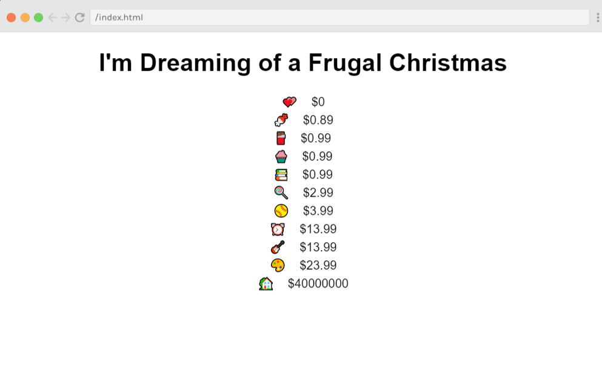
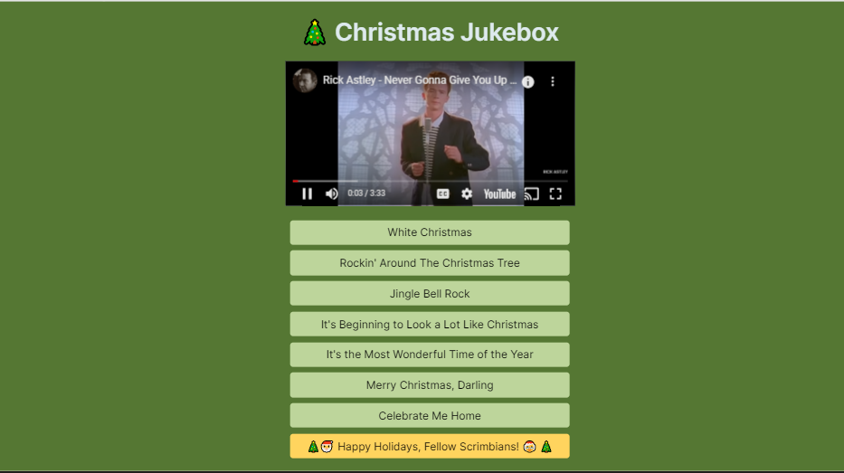
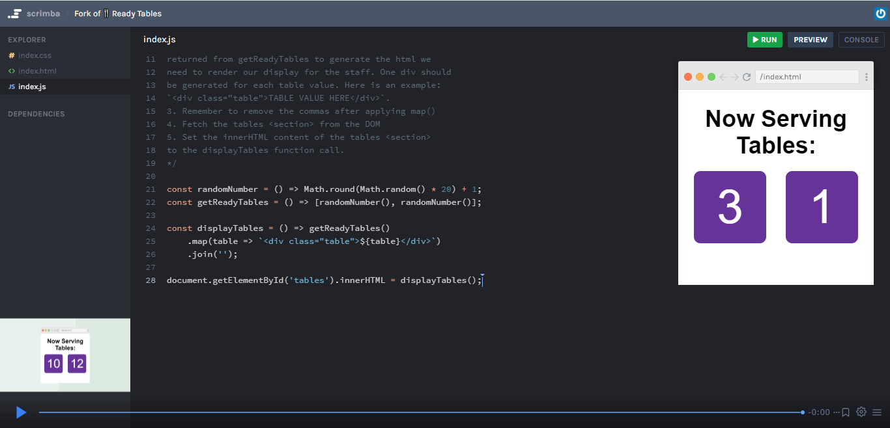

#### The post-JavaScriptmas 2022 post! This article concludes Scrimba's annual 24-day holiday event! I cover the remaining challenges with detailed solutions, more community highlights, and the Livestream!

(WRITE ARTICLE SECTION)

---

 

---

HOLD
(WRITE ARTICLE SECTION)

---

### Community highlights ⬇
#### Farrah



Farrah completed the day 23 challenge with one succinct line of code, and then for a stretch goal, wrote a second function to display the list of sorted items by price (cheapest to most expensive) in DOM!

```javascript
function sortProducts(data){
    return data.sort((a,b)=>{return a.price - b.price})
}
//Stretch - display list of items sorted by price (cheapest to most expensive) in DOM
function showList() {
    let listEl = ''
    listByCheapest.forEach((i)=>{
    listEl += `<div>${i.product} &nbsp&nbsp $${i.price}</div>`
    })
    return listEl
}
```

**Farrah - Discord: 9tfdev#1635**

🔗 [Link to the scrim](https://scrimba.com/scrim/cob724152b3df686ab394fd09)

---

### mykalimba



The JavaScriptmas coder, who goes by the name **mykalimba**, created a visually impressive Christmas Jukebox for the day 24 challenge!

This Christmas Jukebox starts with the click of just one button that says, "Do it." When you click the button, it disappears, and then eight new buttons slide in one at a time with a nice slide-in effect! Each button has a color transition from green to red as you hover over them, and the selected song button changes to a gold-yellow. 
 
In addition to the provided song buttons, new ones were added. One button included says "**🎄🎅 Happy Holidays, Fellow Scrimbians! 🤶 🎄**" that plays the song Never Gonna Give You Up, by Rick Astley when clicked!

**mykalimba - Discord: headtothesky#3781**

🔗 [Link to the scrim](https://scrimba.com/scrim/cE4BGNh6)

---

### Jordan



**Jordan** created a constructive code review of **Jakub's** already succinct JavaScript challenge solution!

Jordan starts by complimenting Jakub's solution, acknowledging that it works, and analyzing that Jakub's goal was to solve the challenge in as few lines of code as possible.

Jordan then refactors the code, thoroughly explaining and proving that the changes work in solving the coding challenge; he removes a [spread operator](https://www.w3schools.com/react/react_es6_spread.asp), breaks repetitive code into a new function making the code [dry](https://en.wikipedia.org/wiki/Don%27t_repeat_yourself), and changes a [query selector](https://www.w3schools.com/jsref/met_document_queryselector.asp) to a [getElementById](https://www.w3schools.com/jsref/met_document_getelementbyid.asp). 

🔗 [Link to the code review](https://scrimba.com/scrim/coad44b548b624f854eeff222)

**Jordan - Discord: chinagoblin#3171**

**Jakub - Discord: Jirous#5567**

---

### ❄ Community highlights list ❄
| Highlight |      Name    | Scrim |
| ------------- | :-----------: | ------------- |
| 1  | [Gina Russo](https://www.linkedin.com/in/gina-p-russo/) | [Panic function](https://scrimba.com/scrim/cJPD3Lu2?pl=p67LBHv) |
| 2  | [Michaella Rodriguez](https://www.linkedin.com/in/michaella-rodriguez/) | [Whispering function](https://scrimba.com/scrim/coc924780a45744007a4c1c66) |
| 3  | [Matt](https://twitter.com/mattemmmmm) | [Panic function ](https://scrimba.com/scrim/co2884c13af5c29b1f9c396d7) |
| 4  | [Jolene Kearse](https://twitter.com/FromJolene) | [Code Review - Taco Tray](https://scrimba.com/scrim/cob664c889972afe30dc69916) |
| 5  | Daniel Beck Rose | [Taco Tray](https://scrimba.com/scrim/coea541eeafbc701b1b7c607f) |
| 6  | [Dheeraj Purohit](https://twitter.com/the_indianyoga) | [Alternating Caps ](https://scrimba.com/learn/javascriptmas/fork-of-alternating-caps-dheeraj-co3764a0d8f0b3f9fd34cb1a1) |
| 7  | [Daniel Nagaoka](https://www.linkedin.com/in/daninagaoka/) | [Pumpkin's Prizes](https://scrimba.com/scrim/co5e04457ab5f4ce8e3982c65) |
| 8  | Carla | [Emojify](https://scrimba.com/learn/javascriptmas/fork-of-emojify-co1544d709da17c8e24fd6dcc) |
| 9  | [Zarau baidu](https://twitter.com/Zarau47902847) | [Panic function ](https://zeerau.hashnode.dev/scrimba-javascriptmas-challenge) |
| 10 | Farrah | [Holiday Gift Shopping](https://scrimba.com/scrim/cob724152b3df686ab394fd09) |
| 11 | mykalimba | [Christmas Jukebox](https://scrimba.com/scrim/cE4BGNh6) |
| 12 | Jordan | [Code Review - Ready Tables](https://scrimba.com/scrim/coad44b548b624f854eeff222) |

---

### My JavaScript code challenge solutions ⬇

---

### Day 19 challenge
#### Century From Year
*Given a year, return the century it is in. The first century spans from the year 1 up to and including the year 100, the second - from year 101 up and including the year 200, etc.*

**Example**
* For the year = 1905, the output should be centuryFromYear(year) = 20;
* For the year = 1700, the output should be centuryFromYear(year) = 17;

**Hints**
* Math.floor()

**We solve this challenge by using math. We need to divide the year passed in by 100, and we need to round up to determine the century.** 

To round up in JavaScript we use the [Math.ceil()](https://www.w3schools.com/jsref/jsref_ceil.asp) method.

```javascript
function centuryFromYear(num) {
    return Math.ceil(num / 100);
}
```   

🔗 [My solution for day 19](https://scrimba.com/scrim/co69e459aa221dfcac22bf94b)

---


### Day 20 challenge
#### Find Free Podcasts
*We have a list of podcasts and need the ability to filter by only podcasts which are free.*

*Write a function that takes in the podcast data and returns an new array of only those podcasts which are free.*

*Additionally, your new array should return only objects containing only the podcast title, rating, and whether or not it is paid.* 

*Expected output:* 
```javascript
[
    {title: "Scrimba Podcast", rating: 10, paid: false}, 
    {title: "Something about Witches", rating: 8, paid: false}, 
    {title: "Coding Corner", rating: 9, paid: false}
]
```

**We solve this challenge in 2 steps:**
1. Filter()
2. Map()

Let's take a look at the first record in the podcasts array.
```javascript
    {
        id: 1,
        title: "Scrimba Podcast", 
        duration: 50, 
        tags: ["education", "jobs", "technology"], 
        hosts: ["Alex Booker"], 
        rating: 10,
        genre: "education",
        paid: false
    },
```

First, we need to create a new array to push records into and return.
```javascript
const freePadCastsArrray = [];
``` 

Next, let's see how to filter out the free podcasts. Using the JavaScript [filter()](https://www.w3schools.com/jsref/jsref_filter.asp) method, we can iterate over the podcasts array and filter out the records with a **false** value for **paid**.
```javascript
const podCasts = data.filter(podcast => podcast.paid === false);
```

Now that we have the filtered list, we can chain on the JavaScript [map()](https://www.w3schools.com/jsref/jsref_map.asp) method to return only the key-value pairs needed. We then set the key-value pairs to variables and add them to a new object named **newRecord**.
```javascript
    const podCasts = data.filter(podcast => podcast.paid === false).map(podcast => {
        const title = podcast.title;
        const rating = podcast.rating;
        const paid = podcast.paid;
        
        const newRecord = {
            title: title,
            rating: rating,
            paid: paid,
        }
```

Each iteration creates one **newRecord** that we push into the **freePadCastsArrray**. 
```javascript
freePadCastsArrray.push(newRecord);
```
We solve the challenge by returning the returning **freePadCastsArrray**.
```javascript
return freePadCastsArrray; 
```

Here is the completed function.
```javascript
function getFreePodcasts(data){
    const freePadCastsArrray = [];

    const podCasts = data.filter(podcast => podcast.paid === false).map(podcast => {
        const title = podcast.title;
        const rating = podcast.rating;
        const paid = podcast.paid;
        
        const newRecord = {
            title: title,
            rating: rating,
            paid: paid,
        }
        freePadCastsArrray.push(newRecord);
    });    
    return freePadCastsArrray; 
}
```


🔗 [My solution for day 20](https://scrimba.com/scrim/co76e4e4f8de4d5dd6a472202)

---

### Day 21 challenge
#### Definitely Not FizzBuzz
*Scrimba CEO Per Borgen wants you to write a program to grant special bonuses to all his employees based on their employee ID numbers!* 

*Scrimba has 100 employees and their employee ID numbers range from 1 - 100. If the employee's ID number is:* 

* *Divisible by 3 - Vacation!* 
* *Divisible by 5 - $100,000 bonus!* 
* *Divisible by both 3 and 5 - JACKPOT! 1 Million and a Yacht!*
* *Not divisible by 3 or 5 - :(*
    
*Write a program to loop through all the ID numbers and print their prize.* 

*Your function's output should look something like this:* 

* 1 - :(
* 2 - :(
* 3 - Vacation! 
* 4 - :(
* 5 - $100,000 bonus!

The code for this challenge is simple; we can solve it with a [for loop](https://www.w3schools.com/js/js_loop_for.asp) and an [else if](https://www.w3schools.com/js/js_if_else.asp) statement. 

**The tricky part is structuring the correct order of the else if statement.**  

To solve the challenge, we will use the modulus [operator (%)](https://www.w3schools.com/js/js_arithmetic.asp) to determine if each number is divisible as instructed.

First, we create a for loop that counts from 1 to 100.
```javascript
for(let i = 1; i <= 100; i++) {

}
```

Now we start the if statement by checking if the current number i is divisible by both 3 and 5. 
```javascript
if(i % 3 === 0 && i % 5 === 0) {
    console.log(`${i}: JACKPOT! 1 Million and a Yacht!`);
```

Then, if the current number i is just divisible by 3:
```javascript
else if(i % 3 === 0) {
            console.log(`${i}: Vacation!`);
```

Next, we check if the current number i is just divisible by 5:
```javascript
else if(i % 5 === 0) {
            console.log(`${i}: $100,000 bonus!`)
```

And finally, if the current number i is not divisible by 3 or by 5:
```javascript
else if(!i % 3 === 0 || !i % 5 === 0) {
            console.log(`${i}: :(`);
```

Here is the completed function:
```javascript
function awardBonuses(){
    for(let i = 1; i <= 100; i++) {
        
        if(i % 3 === 0 && i % 5 === 0) {
            console.log(`${i}: JACKPOT! 1 Million and a Yacht!`);
        } else if(i % 3 === 0) {
            console.log(`${i}: Vacation!`);
        } else if(i % 5 === 0) {
            console.log(`${i}: $100,000 bonus!`)
        } else if(!i % 3 === 0 || !i % 5 === 0) {
            console.log(`${i}: :(`);
        }
    }
}
```

🔗 [My solution for day 21](https://scrimba.com/scrim/co1904c558deb52c6588cc1fe)

---

### Day 22 challenge
#### Ready Tables

*- Topic: Return a Function*

*Our restaurant has 20 tables and the staff serves 2 tables at a time. They need to know which tables are ready to serve. Let's fix this with what we learned about returning a function inside of another function.*

1. Create a function called displayTables.
2. displayTables should map over the array of ready tables 
returned from getReadyTables to generate the html we 
need to render our display for the staff. One div should 
be generated for each table value. Here is an example: 
`<div class="table">TABLE VALUE HERE</div>`. 
3. Remember to remove the commas after applying map()
4. Fetch the tables <section> from the DOM 
5. Set the innerHTML content of the tables <section> 
to the displayTables function call.

**This challenge provides all the HTML & CSS; we just need to write the JavaScript. We will write a new function called *displayTables* that calls the provided function *getReadyTables* to solve this problem.**

**Inside the displayTables function, we will write three variables:**
* **tables** to fetch the HTML tables `<section>` from the DOM 
* **readyTables** to call the provided function
* **outPut** to set the innerHTML content of the tables

```javascript
function displayTables() {
    const tables = document.getElementById("tables");
    const readyTables = getReadyTables();
    let outPut = ``;
}
```

**As instructed, we will use the JavaScript [map()](https://www.w3schools.com/jsref/jsref_map.asp) method to loop over the ready tables returned from getReadyTables function.**

While iterating over the **readyTables** array, we add an HTML div element for every item ( table ) in the array, and add it to the **outPut** variable as follows: 
```javascript
    readyTables.map(tabel => {
        outPut += `<div class="table">${tabel}</div>`;
    });
```

**We solve the challenge by setting the *tables* inner HTML to the value of the *outPut* variable.**

*Here is the completed function:*
```javascript
function displayTables() {
    const tables = document.getElementById("tables");
    const readyTables = getReadyTables();
    let outPut = ``;

    readyTables.map(tabel => {
        outPut += `<div class="table">${tabel}</div>`;
    });
    
    tables.innerHTML = outPut;
}
```

🔗 [My solution for day 22](https://scrimba.com/scrim/cof064557b12f601700e24091)

---

### Day 23 challenge
#### Holiday Gift Shopping
*You're online shopping for holiday gifts, but money is tight so we need to look at the cheapest items first. Use the built in sort() method to write a function that returns a new array of products sorted by price, cheapest to most expensive.* 


**This challenge provides us with an array of products. The product array consists of key-value pairs, the product value in the form of an icon, and the product's price. To solve the challenge, we will use the JavaScript sort method to sort the items by price from lowest to highest.**

When working with strings, the Javascript sort method works as expected.
```javascript
const letters = ["a", "e", "d", "c", "b"];
letters.sort();

console.log(letters);
["a","b","c","d","e"]
```

However, when working with numbers, we need to pass the following function into the  sort method:
```javascript
const points = [40, 100, 1, 5, 25, 10];
points.sort(function(a, b){return a-b});

console.log(points);
[1,5,10,25,40,100]
```

We need to access and compare each product's value to solve the challenge.

Let's look at the first record in the products array as follows:
```javascript
console.log(data[0]);
{product: "🍭", price: 2.99}
```

To access the price, we can access an object's properties using dot notation.
```javascript
console.log(data[0].price);
2.99
```

Now, to solve the challenge, let's use the JavaScript sort method to sort from the lowest to the highest price. 
```javascript
return data.sort(function(a, b) {return a.price - b.price}); 
```

We can write a more succinct line of code by refactoring as follows:
```javascript
return data.sort((a, b) => a.price - b.price); 
```

Here is the completed function:
```javascript
function sortProducts(data){
    return data.sort((a, b) => a.price - b.price); 
}
```

🔗 [My solution for day 23](https://scrimba.com/learn/javascriptmas/-holiday-gift-shopping-cob4d41cabc75bb2fdaec4a6f)

---

### Day 24 challenge
#### Christmas Jukebox

**The final Javascriptmas challenge is to build a music jukebox.** 

The styling of the music jukebox is complete, along with an embedded YouTube iframe to display Christmas videos and buttons containing the corresponding YouTube ID to the songs.

**To solve this challenge, we need to program a function that changes the iframe's URL source when the user clicks on each of the song buttons.**

Before we code the JavaScript, let's first look at the HTML iframe provided.
```html
  <div class="container">
    <h1>🎄 Christmas Jukebox</h1>
    <iframe id="player" type="text/html" width="480" height="240" src="https://www.youtube.com/embed/PoAjmmD89Vw?autoplay=1" frameborder="0"></iframe>
    
    <div class="songs">
        <button onclick="playSong('PoAjmmD89Vw')">White Christmas</button>
        <button onclick="playSong('1qYz7rfgLWE')">Rockin' Around The Christmas Tree</button>
        <button onclick="playSong('R_vmuL0gjU0')">Jingle Bell Rock</button>
        <button onclick="playSong('WaNwEkCeZrE')">It's Beginning to Look a Lot Like Christmas</button>
        <button onclick="playSong('AN_R4pR1hck')">It's the Most Wonderful Time of the Year</button>
    </div>
  </div>
```

Looking at the iframe src value, we can see the entire URL containing the YouTube song ID for White Christmas.
```html
src="https://www.youtube.com/embed/PoAjmmD89Vw?autoplay=1"
```

Below is just the unique YouTube ID for White Christmas.
```html
PoAjmmD89Vw
```

Now, look at each button, and you will see a click event that calls a function called playSong with each song's unique YouTube ID passed in as a parameter.

**To solve the challenge, we will use [template literals](https://www.w3schools.com/js/js_string_templates.asp) to create a string that incorporates each song's YouTube ID passed in as a parameter and set the value to the player source.**
```javascript
player.src = `https://www.youtube.com/embed/${id}?autoplay=1`;
```

Here is the completed function.
```javascript
const player = document.getElementById("player")

function playSong(id) {
  // Challenge: Add code here to make the youtube player play the new YouTube song
    player.src = `https://www.youtube.com/embed/${id}?autoplay=1`;
}
```

🔗 [My solution for day 24](https://scrimba.com/scrim/co7234b8b930436dbc69b1d2e)


---

### My JavaScriptmas Submissions 💻

**Below is my list of each day's completed JavaScriptmas challenges. ⬇**

*I hope that "**Scrimba Claus**" checks it twice!* 🎄

---


###### *Pixabay: Illustration by Mohamed Hassan* 

---

### ❄ My JavaScriptmas submissions ❄
| Date          |      Scrim    |
| ------------- | :-----------: |
| 12/01/2022    | [Panic function](https://scrimba.com/scrim/co9a34c2898498bcea9f6ecd6) | 
| 12/02/2022    | [Totally Private Data Farm](https://scrimba.com/scrim/coc5544d981fd75aeb4ef0b50) |
| 12/03/2022    | [Favorite Foods](https://scrimba.com/scrim/cob19441da8d65e3f62055ed0) |
| 12/04/2022    | [Whispering function ](https://scrimba.com/scrim/co41d48089c3b9230ecf9ca3a) |
| 12/05/2022    | [Candy Sale](https://scrimba.com/scrim/co6d84464bcc4a8a9ea71fb4b) |
| 12/06/2022    | [Taco Tray](https://scrimba.com/scrim/coc8e45a187d6f095ff231931) |
| 12/07/2022    | [Alternating Caps](https://scrimba.com/scrim/codc84e3689c8014085ccdde2) |
| 12/08/2022    | [Valid Time](https://scrimba.com/scrim/co6304bd2ba53d34a83486cee) |
| 12/09/2022    | [toTitleCase](https://scrimba.com/scrim/co660469dadaf9bee14baf739) |
| 12/10/2022    | [Sort by length](https://scrimba.com/scrim/cofd24b83981281d36e1e8b8d) |
| 12/11/2022    | [Decode an Alien Message](https://scrimba.com/scrim/cob4e48959616f7a6f04ab267) |
| 12/12/2022    | [Breakfast Menu](https://scrimba.com/scrim/coe6d404f9ded6ede77611415) |
| 12/13/2022    | [Emojify](https://scrimba.com/scrim/co78b48fcaa8ee36684bb3559) |
| 12/14/2022    | [Count Vowel Consonant](https://scrimba.com/scrim/co4c54238bbff17b8c7f50a52) |
| 12/15/2022    | [Palindromes](https://scrimba.com/scrim/cod394a7c91f7987142755176) |
| 12/16/2022    | [Insert Dashes](https://scrimba.com/scrim/co63a4e4c82106e6cef1a20c7) |
| 12/17/2022    | [Pumpkin's Prizes](https://scrimba.com/scrim/coacd4756b7fa2610ca92b5f6) |
| 12/18/2022    | [Candies](https://scrimba.com/scrim/co5c04fc7b969ba7c7980ace6) |
| 12/19/2022    | [Century From Year](https://scrimba.com/scrim/co69e459aa221dfcac22bf94b) |
| 12/20/2022    | [Find Free Podcasts](https://scrimba.com/scrim/co76e4e4f8de4d5dd6a472202) |
| 12/21/2022    | [Definitely Not FizzBuzz](https://scrimba.com/scrim/co1904c558deb52c6588cc1fe) |
| 12/22/2022    | [Ready Tables](https://scrimba.com/scrim/cof064557b12f601700e24091) |
| 12/23/2022    | [Holiday Gift Shopping](https://scrimba.com/learn/javascriptmas/-holiday-gift-shopping-cob4d41cabc75bb2fdaec4a6f) |
| 12/24/2022    | [Christmas Jukebox](https://scrimba.com/scrim/co7234b8b930436dbc69b1d2e) |

---

### Scrimba JavaScriptmas Grand Finale

<iframe width="956" height="538" src="https://www.youtube.com/embed/--ujdY7Qdgk" title="Scrimba JavaScriptmas Grand Finale" frameborder="0" allow="accelerometer; autoplay; clipboard-write; encrypted-media; gyroscope; picture-in-picture" allowfullscreen></iframe>

---

### Announcing the winners
(WRITE ARTICLE SECTION)

---

#### *If you would like to learn more about my journey with Scrimba and how learning with them may help you, you can read my article: [How Scrimba is helping me and many others to become confident, well-prepared web developers](https://selftaughttxg.com/2021/06-21/06-07-21/)*

---

**I continue to have wonderful experiences with Scrimba, and I highly recommend learning with them! You can read my full [Scrimba review](https://selftaughttxg.com/2020/12-20/Review-Scrimba/) on my 12/13/2020 post.**


#### *"That&#39;s one of the best Scrimba reviews I&#39;ve ever read, <a href="https://twitter.com/MikeJudeLarocca?ref_src=twsrc%5Etfw">@MikeJudeLarocca</a>. Thank you! 🙏 "*
###### &mdash; Per Harald Borgen, CEO of Scrimba <a href="https://twitter.com/perborgen/status/1338462544143540227?ref_src=twsrc%5Etfw">December 14, 2020</a></blockquote>

---

### Conclusion
(WRITE ARTICLE SECTION)


---

**Let's connect! I'm active on [LinkedIn](https://www.linkedin.com/in/michaeljudelarocca/) and [Twitter](https://twitter.com/MikeJudeLarocca).**

---

###### *HOLD* 

---