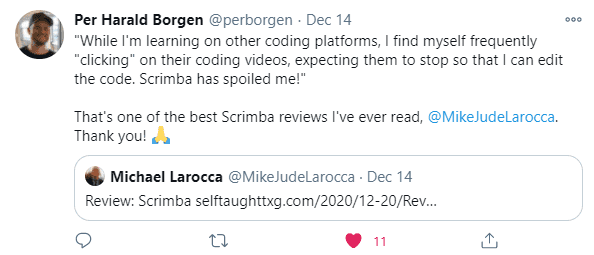

#### The post-JavaScriptmas 2022 post! This article concludes Scrimba's annual 24-day holiday event! I cover the remaining challenges with detailed solutions, more community highlights, and the Livestream!

---

 

---

HOLD
(WRITE ARTICLE SECTION)

---

### Community highlights ⬇
(WRITE ARTICLE SECTION)

---

### My JavaScript code challenge solutions ⬇

---

### Day 19 challenge
#### Century From Year

---

### Day 20 challenge
#### Find Free Podcasts

---

### Day 21 challenge
#### Definitely Not FizzBuzz

---

### Day 22 challenge
#### HOLD

---

### Day 23 challenge
#### HOLD

---

### Day 24 challenge
#### HOLD

---

### My JavaScriptmas Submissions 

**Below is my list of each day's completed JavaScriptmas challenges.**

*I hope that "**Scrimba Claus**" checks it twice!*

---

###### *Pixabay: Illustration by Mohamed Hassan* 

---

### My JavaScriptmas submissions 
| Date          |      Scrim    |
| ------------- | :-----------: |
| 12/01/2022    | [HOLD]() | 
| 12/02/2022    | [HOLD]() |
| 12/03/2022    | [HOLD]() |
| 12/04/2022    | [HOLD]() |
| 12/05/2022    | [HOLD]() |
| 12/06/2022    | [HOLD]() |
| 12/07/2022    | [HOLD]() |
| 12/08/2022    | [HOLD]() |
| 12/09/2022    | [HOLD]() |
| 12/10/2022    | [HOLD]() |
| 12/11/2022    | [HOLD]() |
| 12/12/2022    | [HOLD]() |
| 12/13/2022    | [HOLD]() |
| 12/14/2022    | [HOLD]() |
| 12/15/2022    | [HOLD]() |
| 12/16/2022    | [HOLD]() |
| 12/17/2022    | [HOLD]() |
| 12/18/2022    | [HOLD]() |    |
| 12/19/2022    | [HOLD]() |
| 12/20/2022    | [HOLD]() |
| 12/21/2022    | [HOLD]() |
| 12/22/2022    | [HOLD]() |
| 12/23/2022    | [HOLD]() |
| 12/24/2022    | [HOLD]() |

---

---

#### *If you would like to learn more about my journey with Scrimba and how learning with them may help you, you can read my article: [How Scrimba is helping me and many others to become confident, well-prepared web developers](https://selftaughttxg.com/2021/06-21/06-07-21/)*

---

**I continue to have wonderful experiences with Scrimba, and I highly recommend learning with them! You can read my full [Scrimba review](https://selftaughttxg.com/2020/12-20/Review-Scrimba/) on my 12/13/2020 post.**

#### *"That&#39;s one of the best Scrimba reviews I&#39;ve ever read, <a href="https://twitter.com/MikeJudeLarocca?ref_src=twsrc%5Etfw">@MikeJudeLarocca</a>. Thank you! 🙏 "*
###### &mdash; Per Harald Borgen, CEO of Scrimba <a href="https://twitter.com/perborgen/status/1338462544143540227?ref_src=twsrc%5Etfw">December 14, 2020</a></blockquote>

---

### Conclusion
(WRITE ARTICLE SECTION)

---

**Let's connect! I'm active on [LinkedIn](https://www.linkedin.com/in/michaeljudelarocca/) and [Twitter](https://twitter.com/MikeJudeLarocca).**

---

###### *HOLD* 

---