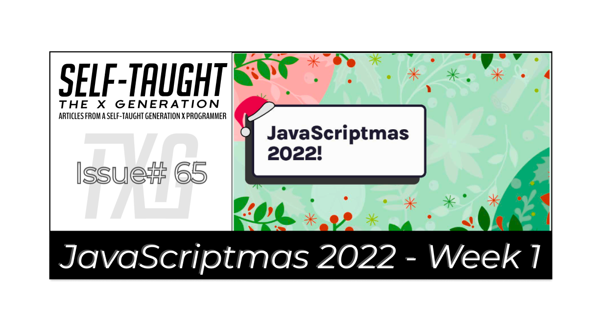

### JavaScriptmas 2022 - Week 1
(WRITE ARTICLE SECTION)

Tis the season to be coding! JavaScriptmas time is here!

---



---

### Day 1 challenge
#### Panic function
*Write a PANIC function. The function should take in a sentence and return the same sentence in all caps with an exclamation point (!) at the end. Use JavaScript's built-in string methods. If the string is a phrase or sentence, add a 😱 emoji in between each word.* 

```javascript
function panic(sentence) {
    const panicSentence = sentence.split(' ').join(' 😱 ').toUpperCase().concat('!');
    return panicSentence;
}
```

**Although the solution to this challenge may seem complicated at first glance, it is solved easily using JavaScript methods.**

***ℹ Note:*** *By using periods, you can chain JavaScript methods together.*

The [split()](https://www.w3schools.com/jsref/jsref_split.asp) method splits a string into an array of substrings. This method accepts a separator as an optional parameter. We get each word of the string by adding a space between single quotation marks as a separator.

The [join()](https://www.w3schools.com/jsref/jsref_join.asp) method returns an array as a string. This method includes a separator argument (the default separator is a comma). I solved this part of the challenge by passing in single quotation marks with an 😱 emoji as the separator argument. I included a space between the single quotation marks.

The [toUpperCase()](https://www.w3schools.com/jsref/jsref_touppercase.asp) method converts a string to uppercase letters. 

The [concat()](https://www.w3schools.com/jsref/jsref_concat_string.asp) method joins two or more strings and returns a new string. We add the exclamation point at the end by passing it in between single quotes as a parameter.

***🔗 [My solution for day 1](https://scrimba.com/scrim/co9a34c2898498bcea9f6ecd6)***

---

### Day 2 challenge
#### Totally Private Data Farm
*Write a function that maps through the current data and returns a new array of objects with only two properties: fullName and birthday. Each result in your array should look like this when you're done:* 
```javascript
{
    fullName: "Levent Busser", 
    birthday: "Fri Aug 20 1971"
}
```

**In this challenge, we must format information from the provided array and return it.**

Here is the first record in the provided array: 
```javascript
      {
         "name":{
            "title":"Mr",
            "first":"Levent",
            "last":"Busser"
         },
         "dob":{
            "date":"1971-08-21T01:08:00.099Z",
            "age":51
         }
      }
```

**First, let's look at how we retrieve each item we need using console logs. To simplify, we will view the first record in the provided array.**

We access the first record by using the console log as follows:
```javascript
console.log(data[0]);
{name: {title: "Mr", first: "Levent", last: "Busser"}, dob: {date: "1971-08-21T01:08:00.099Z", age: 51}}
```

We can retrieve the first and last names as follows:
```javascript
console.log(data[0].name.first);
console.log(data[0].name.last);
Levent
Busser
```

To create the full name, we concatenate the first and last name using [string interpolation](https://www.w3schools.com/js/js_string_templates.asp).
```javascript
const fullName = `${data[0].name.first} ${data[0].name.last}`;
console.log(fullName);
Levent Busser
```

Now we retrieve the date of birth date as follows:
```javascript
console.log(data[0].dob.date)
1971-08-21T01:08:00.099Z
```

To format the date specified by the challenge, we need to create a new [date object](https://www.w3schools.com/js/js_dates.asp) and pass in the date of birth value. Then we need to use the [toDateString()](https://www.w3schools.com/jsref/jsref_todatestring.asp) method to format it as specified.
```javascript
const date = new Date (data[0].dob.date)
console.log(date.toDateString())
Fri Aug 20 1971
```

**Now that we understand how to format the data, we can use a [forEach()](https://www.w3schools.com/jsref/jsref_foreach.asp) loop for cycling through the provided data array and then push the formatted data into a new array called totallyPrivateDataArray to return.**

```javascript
function transformData(data) {
  const totallyPrivateDataArray = [];

  const records = data.forEach((record) => {
      const fullName = `${record.name.first} ${record.name.last}`;    
      const birthDate = new Date(record.dob.date);    
          
      const newRecord = {
              fullName: fullName,
              birthday: birthDate.toDateString()
          };
          totallyPrivateDataArray.push(newRecord);
      });

  return totallyPrivateDataArray;
  }
```

For each iteration of the for loop, we create a variable for each record's full name and birthday. We assign the fullName variable by concatenating the first and last name. 

Then, we assign the birthday variable by creating a [new Date()](https://www.w3schools.com/js/js_dates.asp) object. We pass in the current record's date of birth value and format it using the [toDateString()](https://www.w3schools.com/jsref/jsref_todatestring.asp) method.

Now that we have new variables with the proper format, we create an object called newRecord and assign them with the key-value pairs as required by the coding challenge.

Finally, we push the object we just created into the totallyPrivateDataArray and return the array after the forEach loop.

***🔗 [My solution for day 2](https://scrimba.com/scrim/coc5544d981fd75aeb4ef0b50)***

---

### Day 3 challenge
#### Favorite Foods
*Topic: Object Destructuring*
  1. Edit the faveFoods object so that it contains your favorite foods.
  2. Destructure the faveFoods object into three consts: breakfast, lunch, and supper.
  3. Fetch the meals <section> from the DOM.
  4. Set the innerHTML content of the meals <section> to a paragraph that states what your favorite foods are for breakfast, lunch, and supper.Use a template literal to construct the string.

**This challenge instructs us to use [object destructuring](https://www.w3schools.com/react/react_es6_destructuring.asp). Destructuring makes it easy to extract just what we need from an object.**

*ℹ Here is a helpful short video: [JS Destructuring in 100 Seconds](https://www.youtube.com/watch?v=UgEaJBz3bjY) by Fireship.*

First, we add the food to the empty strings provided in the faveFoods object. To add the emojis on Windows, use the buttons "Windows" + "." (period) to open up the emojis dialog box.
```javascript
const faveFoods = {
    breakfast: 'croissants 🥐',
    lunch: 'tuna sandwiches 🥪',
    supper: 'pizza 🍕'
}
```

Here is how to assign the variables using destructuring as instructed:
```javascript
const { breakfast, lunch, supper } = faveFoods;
```

We can verify it worked by using the console log:
```javascript
console.log(breakfast);
console.log(lunch);
console.log(supper);

croissants 🥐
tuna sandwiches 🥪
pizza 🍕
```

Next, we use [document.getElementById]() to fetch the meals `<section>` from the DOM as instructed by writing the following code:
```javascript
const meals = document.getElementById("meals");
```

Finally, we solve the challenge by using [innerHTML](https://www.w3schools.com/jsref/prop_html_innerhtml.asp) to add a paragraph using string interpolation.
```javascript
meals.innerHTML = `
    <p>
        For breakfast, I only like ${breakfast}. I love ${lunch} for lunch, and I usually want ${supper} for supper.
    </p>
`;    
```

***🔗 [My solution for day 3](https://scrimba.com/scrim/cob19441da8d65e3f62055ed0)***

---

### Day 4 challenge
#### HOLD

---

### Conclusion

Scrimba's JavaScriptmas annual FREE event is a wonderful way to commit to coding daily and is a fun and festive event where all participants have an equal opportunity to win prizes, regardless of their skill level.

By completing all 24 coding challenges, you will be awarded a certificate and an exclusive Discord badge, and since each submission acts as a raffle ticket, you will have 24 chances to win prizes!

---

**Let's connect! I'm active on [LinkedIn](https://www.linkedin.com/in/michaeljudelarocca/) and [Twitter](https://twitter.com/MikeJudeLarocca).**

---

###### *Are you now interested in participating in this year's Scrimba's JavaScriptmas? Have you already participated in last year's Scrimba's JavaScriptmas? Please share the article and comment!* 

---