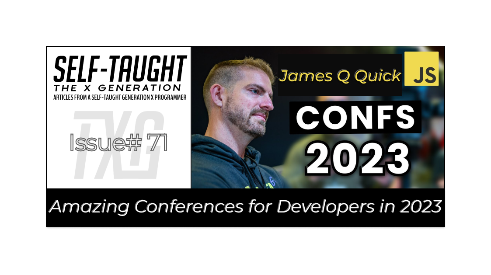

#### As a developer, attending conferences is one of the best ways to level up your career. In this article, James Q Quick provides a curated list of 10 conferences we should look forward to in 2023!

---

---

### About James Q Quick
(WRITE ARTICLE SECTION)

---

### Intro

**From networking to learning about new tools, Frameworks, and more, conferences are one of the best ways to level up your career as a developer.**

James regularly attends conferences and has experience as both an active attendee and a special guest speaker. 

In addition to great talks on various topics, James tells us that conferences are full of amazing attendees and notable speakers, and even representatives of companies that are hiring!

**James credits attending conferences as one of his hacks for advancing his career!**

---

***Note:*** *If you cannot attend the events mentioned, or if they have already ended, as they are all PREMIUM annual events, James encourages us to go sometime in the future.*

---

### Conferences

**James Q Quick's curated conference list:**
1. CodeMash 
2. THAT
3. NDC London 
4. JSWORLD
5. 5
6. 6
7. 7
8. 8
9. 9
10. 10

---

### CodeMash 
*Full-stack conference in Sandusky, United States Jan 10-13, 2023*

James has heard great things about this Conference for years and highly recommends it!

The CodeMash conference takes place in a Kalahari resort, which includes an indoor arcade, water park, and more, which is perfect for kids! 

*🔗 Event website: [CodeMash](https://dev.events/conferences/code-mash-sandusky-0-2023)*

**Below is information from the conference website 🔽**

#### CodeMash 101

*[CodeMash](https://www.codemash.org/about/) is a unique event that educates developers on current practices, methodologies and technology trends in a variety of platforms and development languages. Held every January at the lush Kalahari Resort in Sandusky, Ohio, attendees will be able to attend a world-class technical conference amid Ohio's largest indoor waterpark. Nobody will frown if you show up in shorts, sandals, and your loudest t-shirt. You might even win a prize for doing so.*

*It's not just about a grind of sessions, but also providing attendees the opportunity of continuing the conversations and networking outside of the daily conference events. The goal has always been to achieve this mission by creating a conference environment that focuses on professionalism and respect for one another.*

---

### THAT Conference
*ROUND ROCK, TX / JANUARY 15TH - 18TH, 2023*

[THAT Conference](https://that.us/) also occurs in a Kalahari resort, and James has attended THAT Conference in Wisconsin twice.

During the upcoming event in Austin on January 17th, 2023, James will be giving a keynote talk! He will also be broadcasting live episodes of the [Compressed FM podcast](https://www.compressed.fm/).

James tells us that Clark, the event's founder, cares about the community, and the branding for THAT Conference is a fun camping theme!

**Upcoming conference dates:**
*ROUND ROCK, TX CONFERENCE*
*January 15, 2023 - January 18, 2023*

*WISCONSIN DELLS, WI CONFERENCE*
*July 24, 2023 - July 27, 2023*

*🔗 Event website: [THAT Conference](https://that.us/)* 

**Below is information from the conference website 🔽**

#### WHAT IS THAT CONFERENCE?

*A full-stack, tech-obsessed conference full of fun, code-loving humans who share and learn together.*

*THAT Conference is unlike any other technical conference. This unique four-day summer camp is full of workshops, sessions, open spaces, family events, and networking, all nestled in the gorgeous Kalahari Resort and Waterpark. This family-friendly event is comprised of professional and family tracks, so there is something to learn and experience at all ages.*

---

### NDC London
*23-27 January 2023*
*Queen Elizabeth II Centre*

[NDC London](https://ndclondon.com/) has been on James's radar for several years. He has also heard amazing things about the NDC conferences in general. 

Unfortunately, James informs us he has yet to be accepted to speak at this conference. Nevertheless, he tells us NDC London is well-known with an established brand and encourages us to attend.

*🔗 Event website: [NDC London](https://ndclondon.com/)* 

**Below is information from the conference website 🔽**

#### About NDC
*Since its start-up in Oslo 2008, the Norwegian Developers Conference (NDC) quickly became one of Europe's largest conferences for .NET & Agile development. Today NDC Conferences are 5-day events with 2 days of pre-conference workshops and 3 days of conference sessions.*

#### NDC London 2023
*NDC London 2023 will be at the Queen Elizabeth II Centre from 23-27 January.*

*The conference will feature 5 tracks covering topics such as:*

*.NET - Agile - C++ - Cloud - Database - Design - DevOps - Embedded - Front-End Framework - Fun - Functional Programming - Gadgets - Internet of Things - JavaScript - Microsoft - Mobile - People - Programming Languages - Security - Techniques - Testing - Tools - UX – Web and more.*

---

03:32 - JSWORLD - https://dev.events/conferences/jsworl... 

---

04:12 - RenderATL - https://www.renderatl.com/

---

05:05 - JSNation - https://jsnation.com/

---

05:30 - React Summit - https://reactsummit.com/

---

06:15 - KCDC - https://www.kcdc.info/

---

06:55 - MagnoliaJS - https://www.magnoliajs.com/

---

07:45 - All Things Open - https://www.allthingsopen.org/

---

08:15 - Jamstack Conf - https://jamstack.org/conf/

---

### James Q Quick links
* 🔗 Check out the [compressed.fm Podcast](https://compressed.fm/)
* 🔗 [Courses](https://jamesqquick.com/courses)
* 🔗 [Newsletter 🗞](https://www.jamesqquick.com/newsletter)
* 🔗 Follow me on [Twitter 🐦](https://www.twitter.com/jamesqquick)

#### DISCORD
Join the Learn Build Teach [Discord Server 💬](https://discord.gg/vM2bagU)

---

### My other James Q Quick articles

* 🔗 [Teacher Feature: James Q Quick](https://selftaughttxg.com/2021/03-21/TeacherFeature_JamesQQuick/)
* 🔗 [The Importance of Learning in Public](https://selftaughttxg.com/2021/08-21/TheImportanceOfLearningInPublic/)

---

### Conclusion
(WRITE ARTICLE SECTION)

---

**Let's connect! I’m active on [LinkedIn](https://www.linkedin.com/in/michaeljudelarocca/) and [Twitter](https://twitter.com/MikeJudeLarocca).**

---

###### *Are you now interested in attending a conference? Have you already attended conferences and leveled up your career? Please share the article and comment!* 

---

### JSWORLD
*JavaScript conference in Amsterdam, Netherlands*
*Feb 8-10, 2023*

[JSWORLD](https://dev.events/conferences/jsworld-conference-amsterdam-1-2023) is a JavaScript-focused conference held in Amsterdam.

Just as with the other conferences, James continuously hears great things, and he looks forward to attending and speaking at the JSWORLD conference in the future.

*🔗 Event website: [jsworldconference](https://jsworldconference.com/)* 

**Below is information from the conference website 🔽**

#### JOIN WORLD'S LARGEST JAVASCRIPT COMMUNITY
*A 3-day JavaScript Celebration together with 2139 JavaScript Developers. Packed with the Latest JavaScript Updates by Authors, Creators and Experts.*

*45 talks to stay on top of the latest topics like Vue3, Angular 15, React 18, Qwik, Vite, AuthZ, Demystifying Protocol Buffers and gRPC.*

*Your chance get in touch with Creators and Maintainers from Vue, Astro, Nuxt, Angular, Vite and Storybook. You will be provided with technical updates on the largest and hottest technologies alongside case studies on how to tackle your developer challenges.*

---