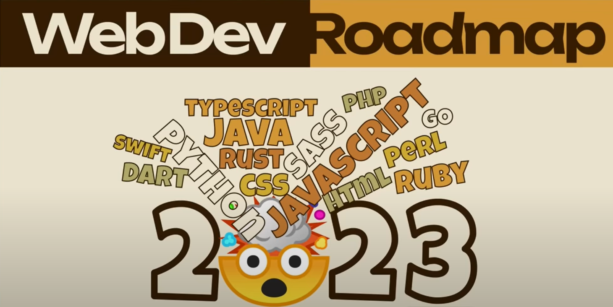

#### The demand for programmers continues to rise, and there are plenty of FREE resources to learn how to code. In this article, Jesse Hall provides us with a road map to becoming a web developer in 2023!

---

---

### About Jesse Hall

Jesse Hall is a tech industry expert and is well-known as "codeSTACKr" in the web dev community.

He creates the "best content he possibly can" to give away for FREE on his codeSTACKr YouTube channel, which has over 274,000 followers and is growing!

Each week he also provides top tech resources to help us keep up to date with the developer community and technology with his codeSTACKr newsletter.

Jesse currently works as a Senior Developer Advocate at MongoDB. 

---

### Road Map Layout

In this road map, Jesse provides us with the core essentials to become a full-stack developer in 2023.

A full-stack developer is a programmer that works with both front-end and back-end development.

**The core essentials include:**
* Skills
* Tools
* Front-End Web Development
* Back-End Development
* Additional Skills

---

### Skills

**Before we learn how to code, Jesse advises us to learn the following skills:**
* Googling
* How the internet works

#### Googling

**Jesse tells us that "Googling" is the best skill any developer can master.**

When you don't know how to fix an issue or need to learn how to accomplish a specific task, you should search online using Google.

Always do your best to research and try to resolve issues you have on your own before reaching out to the community. When reaching out to the community for help, be detailed. Be specific about the problem, what you tried, and what you already searched. 

Jesse tells us even the most experienced developers can't remember everything; they Google regularly.

#### How the internet works

**When first getting started, you need to have a basic understanding of how the internet works.**

**Internet**
* browsers
* domains
* hosting HTTP/HTTPS
* DNS

**Jesse provides us with these resources to help us understand these concepts.**
* [How the internet works in 5 min](https://youtu.be/7_LPdttKXPc)  
* [What is the internet?](https://youtu.be/Dxcc6ycZ73M)

---

### Tools

When you are ready to start coding, you must first set up your web developer environment.

**Basic Tools**
* Browsers
* Code editor
* Terminals

#### Browsers

Browsers are how your users view your applications. Depending on what browser they use, they may have different experiences. For that reason, developers test their applications on multiple browsers to ensure they are working as expected. 

**Major browsers:**
* [Chrome](https://www.google.com/chrome/dr/download/)
* [Microsoft Edge](https://www.microsoft.com/en-us/edge)
* [Safari](https://www.apple.com/safari/)
* [Fire Fox](https://www.mozilla.org/en-US/firefox/new/)

#### Code editor

The most popular code editor for developers is Microsoft's [VS Code](https://code.visualstudio.com/), and it's FREE!

Jesse has created plenty of content on [YouTube](https://www.youtube.com/@codeSTACKr) on how to install, configure, and become familiar with VS Code.

*If you want to dive deep into learning how to use VS Code, check out Jesse's [Become a VS Code SuperHero](https://www.vscodehero.com/) course.*

#### Terminals

As a developer, you will want to become comfortable using the command line (terminal). Every operating system comes with a terminal.

**Terminals**
* command prompt (comes with Windows)
* powershell (comes with Windows)
* [WSL](https://docs.microsoft.com/en-us/windows/wsl/install)
* [gitbash](https://git-scm.com/download/win)
* [zsh](https://ohmyz.sh/)

**If you are using Microsoft Windows, you are not limited to the preinstalled terminals. Jesse, and many developers, including myself, use [gitbash](https://git-scm.com/download/win).** 

*If you want to learn how to use the command line, check out Brad Traversy's [Command Line Crash Course For Beginners | Terminal Commands](https://www.youtube.com/watch?v=uwAqEzhyjtw).*

*Brad Traversy also has a helpful YouTube scripting course, [Shell Scripting Crash Course - Beginner Level](https://www.youtube.com/watch?v=v-F3YLd6oMw).*

---

<iframe width="956" height="538" src="https://www.youtube.com/embed/8aosxBJQdVc" title="Web Development 101: A Beginner's Guide to Launching a Successful Career in 2023" frameborder="0" allow="accelerometer; autoplay; clipboard-write; encrypted-media; gyroscope; picture-in-picture" allowfullscreen></iframe>

#### Web Development 101: A Beginner's Guide to Launching a Successful Career in 2023

---

### Front-End Web Development

**After we set up our web development environment, it's time to start coding! We will need to learn the following:**
* HTML
* CSS
* JavaScript

#### HTML

HTML (HyperText Markup Language) is the standard markup language for documents designed to display in a web browser. HTML is the web's main building block and provides a website's structure.

**Jesse provides us with the following HTML resources:**
* [HTML in 100](https://youtu.be/ok-plXXHlWw)
* [HTML Crash Course](https://youtu.be/XiQ9rjaa2Ow)

#### CSS

CSS (Cascading Style Sheets) is a style sheet language used to style the content on a webpage; we use CSS to style HTML elements. We also use it to add flair to a website, such as transitions and animations.

Jesse tells us there is a lot to CSS, and if you're planning to be a Front-End Developer, it is essential to understand CSS fully.

**After you learn the basic syntax, learn the following:**
* Flexbox
* Grid
* Responsive Web Design

**Jesse provides us with the following CSS resources:**
* [CSS in 100](https://youtu.be/OEV8gMkCHXQ)
* [CSS Crash Course](https://youtu.be/Tfjd5yzCaxk)
* [Position Explained](https://youtu.be/XrHMv_9LCfo)
* [Units Explained](https://youtu.be/8UTMS3WTM0k)
* [Flexbox in 100](https://youtu.be/K74l26pE4YA)
* [Flexbox Crash Course](https://youtu.be/qqDH0T6K5gY)
* [Grid in 100](https://youtu.be/uuOXPWCh-6o)
* [Grid Crash Course](https://youtu.be/0-DY8J_skZ0)

#### JavaScript

JavaScript (JS) is a programming language used in Front-End and Back-End development. We use it to make web pages interactive.

**When it comes to JavaScript, Jesse tells us that we will need to spend most of our time learning the following :**
* Basic syntax
* DOM
* Fetch API
* JSON
* ES6

---

***Important:*** *Before learning a framework such as React or Vue, you must fully understand JavaScript (also known as Vanilla JavaScript)*.

---

**Jesse provides us with the following JavaScript resources:**
* [JavaScript in 90 seconds](https://youtu.be/bGDK1rpykOQ)
* [JavaScript Crash Course](https://youtu.be/d5ob3WAGeZE)
* [DOM](https://youtu.be/y17RuWkWdn8)
* [Loops Explained](https://youtu.be/Kn06785pkJg)
* [JavaScript Micro Bytes Playlist](https://youtu.be/hkM0VJyJc1Y)
* ["this" in 100](https://youtu.be/YOlr79NaAtQ)
* ["this"](https://youtu.be/Pi3QC_fVaD0)
* [JSON](https://youtu.be/s6OIOL9OMYA)
* [Fetch Crash Course](https://youtu.be/djCuFrLLjVk)
* [JavaScript Arrow Functions](https://youtu.be/NAN7U3MrX6o)
* [JavaScript Async / Await](https://youtu.be/F8xANXY0kaU)

---

**After you learn the web development foundations of HTML, CSS, and JavaScript, it's best to learn about the following:**
* APIs
* Version Control
* Hosting & Deployment

---

#### Working with APIs

An API (application programming interface) is code that enables software programs to communicate.

APIs allow you to perform queries or computations on the back end and then send the results to the front end.

Jesse explains requesting data from a database as a simple example. The API on the server will perform that action and then send the data to the front end, allowing a layer of security for applications *(the front end would expose database login credentials, whereas the back end conceals them)*. 

**Jesse provides us with the following API resources:**
* [APIs in 100](https://youtu.be/-MTSQjw5DrM)
* [Build a REST API](https://youtu.be/l8WPWK9mS5M)
* [GraphQL in 100](https://youtu.be/eIQh02xuVw4)

---

***If you would like a beginner-friendly introduction to working with an API, check out my article [JavaScript: How to Use the Star Wars API for Beginners](https://selftaughttxg.com/2022/04-22/StarWarsAPI-01/). No authentication is needed to connect to it, making it easy!***

---

#### Version Control with Git & GitHub

Version control allows us to keep track of changes to our codebases. Version control is essential when working with other developers, such as on a team.

[Git](https://git-scm.com/) is a free and open-source distributed version control system popular among developers.

[GitHub](https://github.com/) is a code hosting platform for collaboration and version control.

**Git and GitHub are integral to the CI/CD pipeline (Continuous Integration/Deployment).**

---

#### Hosting & deployment

As a developer, You must learn how to set up a hosting service and deploy a basic website.

Jesse tells us that a static host is the easiest way to accomplish this.

**Static hosts**
* Netlify
* Vercel
* Cloudflare
* GitHub pages

The provided list consists of static hosts that can be integrated with GitHub *(I use Netlify for my blog website)*.

When you use one of the static hosts with GitHub, you can set the configuration to rebuild and redeploy your website automatically every time you push changes to the GitHub repo. Very convenient!

If your application requires a true back-end environment, you will need a more traditional hosting service, such as [Heroku](https://www.heroku.com/) or [Linode](http://www.linode.com/).

**Jesse provides us with the following hosting and deployment resources:**
* [Netlify Tutorial - How to build and deploy websites using Netlify](https://youtu.be/mT5siI19gtc)
* [Vercel](https://vercel.com/)
* [Cloudflare](https://www.cloudflare.com/)
* [Getting Started with GitHub Pages](https://www.youtube.com/watch?v=QyFcl_Fba-k)
* [Heroku](https://www.heroku.com/)
* [Linode](https://www.linode.com/)

---

### Frameworks

#### JavaScript Frameworks

Although you can find employment as a front-end web developer without first learning a framework, plenty of jobs require it, and you will increase your opportunity of landing a job if you know one.

**Popular JavaScript Frameworks include:**
* React
* Vue
* Angular
* Svelte

When deciding what framework to learn, consider researching the companies you want to work with and learn their frameworks and technologies.

After learning a JavaScript framework, you can take it further by learning Next.js or Gatsby, frameworks built on top of React. Or, if you learn Vue, you can learn Nuxt.js. Learning these frameworks will give you more built-in functionality, such as static site generation and server-side rendering.

**Jesse provides us with the following JavaScript Frameworks resources:**
* [Do This! BEFORE Learning A JavaScript Framework](https://www.youtube.com/watch?v=KkdY8X61K9g)
* [React in 100 Seconds](https://youtu.be/Tn6-PIqc4UM)
* [React JS Crash Course](https://youtu.be/w7ejDZ8SWv8)
* [Next.js in 100 Seconds // Plus Full Beginner's Tutorial](https://youtu.be/Sklc_fQBmcs)
* [Next.js Crash Course](https://youtu.be/mTz0GXj8NN0)
* [Gatsby Tutorial Playlist](https://www.youtube.com/playlist?list=PL4cUxeGkcC9hw1g77I35ZivVLe8k2nvjB)
* [Vue.js Explained in 100 Seconds](https://youtu.be/nhBVL41-_Cw)
* [Vue JS Crash Course](https://youtu.be/qZXt1Aom3Cs)
* [Nuxt JS Crash Course](https://youtu.be/ltzlhAxJr74)
* [Angular in 100 Seconds](https://youtu.be/Ata9cSC2WpM)
* [Angular Crash Course](https://youtu.be/3dHNOWTI7H8)

---

#### CSS Frameworks

CSS Frameworks make it easier to use CSS to style your applications. 

***Note:*** *Before you learn a CSS Framework, you should first learn CSS.* 

**Two CSS Frameworks that Jesse uses and recommends are:**
* Tailwind 
* Bootstrap 

**Jesse provides us with the following CSS Frameworks resources:**
* [Tailwind in 100 Seconds](https://youtu.be/mr15Xzb1Ook)
* [Your First Tailwind Website](https://youtu.be/NRagrTU_v8o)
* [Bootstrap 5 Tutorial Playlist](https://www.youtube.com/playlist?list=PL4cUxeGkcC9joIM91nLzd_qaH_AimmdAR)

---

### Back-end Development

#### Back-end Development with Node.js

Once you have learned JavaScript, you should learn [Node.js](https://nodejs.org/en/about/) and [Express.js](https://expressjs.com/). 

Node.js allows us to use JavaScript on the back-end server.

Express is a Node.js web application framework that provides features such as defining routes, building out APIs, connecting to databases, and more.

You will also need to learn with [npm](https://www.npmjs.com/) (Node Package Manager). Package managers allow us to easily add pre-built packages to our applications, which helps us accomplish various tasks without constantly "reinventing the wheel." 

**Jesse provides us with the following resources:**
* [Node.js Crash Course for Beginners Tutorial - Learn Node Basics in 30 Minutes!](https://youtu.be/2LUdnb-mls0)
* [Learn Express JS In 35 Minutes](https://youtu.be/SccSCuHhOw0)
* [What is NPM, and why do we need it? | Tutorial for beginners](https://youtu.be/P3aKRdUyr0s)

---

#### Databases

Jesse tells us that just about every website needs to keep track of data, for example, products on an e-commerce website.

**There are different types of databases, such as:**
* Relational
* Document
* Graph
* Wide Column

Relational databases are similar to spreadsheets, containing tables, rows, and columns. The tables link to each other using a unique identifier.

Relational databases are more strict, requiring each table's column and type to be defined ahead of time, creating a predefined [scheme](https://www.w3schools.in/dbms/data-schemas).

ORM (Object Relational Mapper) makes handling disconnected data easier when working with relational databases. When queried, the database will return all of the connected data.

**Jesse tells us the most popular databases use SQL (Structured Query Language). Examples of structured query languages are:**
* SQL
* MySQL
* PostgreSQL
* MS SQL

Document databases are relatively new, which brings many benefits over SQL databases.

**Document databases are:**
* Flexible
* Uses JSON
* No ORM needed

Jesse explains that document databases are not as strict as relational databases by default but can be as strict as you need, making them flexible.

Document databases use JSON-structured documents, making it easy for JavaScript developers to understand and implement. Because of this, there is no need for ORMs when working with them.

**Jesse provides us with the following database resources:**
* [SQL in 100](https://youtu.be/zsjvFFKOm3c)
* [SQL Crash Course](https://youtu.be/p3qvj9hO_Bo)
* [MongoDB in 100](https://youtu.be/-bt_y4Loofg)
* [MongoDB Crash Course](https://youtu.be/2QQGWYe7IDU)

---

#### Authentication

If your website needs to keep track of user interactions, such as a shopping cart, or it has user accounts, you will need to implement authentication.

You can use oAuth or JWT (JavaScript Web Tokens) to implement authentication manually, or you can use an authentication provider to do all the work for you.

Jesse recommends [Auth0](https://auth0.com/) as an authentication provider.

**Jesse provides us with the following Authentication resources:**
* [Auth0 in 100](https://youtu.be/yufqeJLP1rI)
* [Auth0 with React.js User Login](https://youtu.be/MqczHS3Z2bc)

---

#### Content Management Systems (CMS)

Content management systems allow us to manage the content of our websites easily. 

If you plan on freelancing, content management systems are a good choice. With content management systems, you provide a way for your customers to update their website content easily on their own.

Jesse tells us that [WordPress]() is probably the most popular CMS. However, they traditionally require us to use their service for the front-end CMS and back-end CMS.

In the past few years, Headless CMSs have become popular, and now WordPress supports Headless CMSs. This allows us to use a headless CMS for the back-end, then you can use any front-end technology that you want, freeing us from being tied to a specific technology on the front-end and back-end.

Examples of headless CMSs are [Sanity.io](https://www.sanity.io/) and [Strapi](https://strapi.io/).

**Jesse provides us with the following content Management Systems resources:**
* [WordPress Headless](https://youtu.be/YZR6P6Q0tmc)
* [Sanity.io Crash Course](https://youtu.be/32RP-sG1njE)
* [Strapi Crash Course](https://youtu.be/6FnwAbd2SDY)

---

### Additional Skills

**Jesse also provides a list of additional optional skills, including:**
* [TypeScript Crash Course](https://youtu.be/wyO8RWl1ges)
* Blockchain & Cryptocurrencies
* Soft Skills & Personal Development
* And more!

*Watch his YouTube video to learn more, and you can also sign up for his FREE [2023 Web Dev Roadmap Podia course](https://courses.codestackr.com/products/home), which includes the complete list of resource links.*

---

#### *For the complete list of links, you can sign up for Jesse Halls's FREE [2023 Web Dev Roadmap Podia course](https://courses.codestackr.com/products/home).*

---

### My other Jesse Hall articles
* 🔗 [Teacher Feature: Jesse Hall (codeSTACKr)](https://selftaughttxg.com/2021/02-21/TeacherFeature_JesseHall/)
* 🔗 [How to Create a Next Level GitHub Profile, with Jesse Hall](https://selftaughttxg.com/2021/11-21/CreateAGitHubProfileJesseHall/)

---

### Conclusion

Armed with a roadmap of FREE resources consisting of the skills, tools, and technologies you need, with hard work and dedication, there's is time to become a web developer in 2023.

As a developer, you will still need to learn continually as new technologies emerge. Be encouraged, knowing that once you have learned a language, it will be easier for you to learn new ones. 

When deciding what framework to learn, consider researching the companies you want to work with and learn their frameworks and technologies; they might use something other than the most popular. 

In addition to the core requirements of being a web developer, additional skills, such as soft skills, will significantly benefit you and set you apart from others when seeking employment opportunities. Check out Jesse's FREE complete resource list, providing what you need to become a web developer in 2023!

---

**Let's connect! I'm active on [LinkedIn](https://www.linkedin.com/in/michaeljudelarocca/) and [Twitter](https://twitter.com/MikeJudeLarocca).**

---

###### *Are you now confident in becoming a web developer in 2023? Have you already learned web development from Jesse Hall's tutorials? Please share the article and comment!* 
