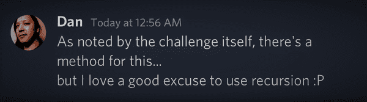

#### Whether you are preparing for a coding interview or would like to learn about recursion, in this article Daniel Nagaoka teaches us how to write a recursive function in JavaScript!

---


---

### About Daniel Nagaoka

Dan has experience in both Frontend and Full Stack Development. He graduated from the Universidade Paulista in São Paulo, Brazil, with a Bachelor's degree in Computer Science.

---

### What is recursion 


**So, what is recursion? [MDN web docs](https://developer.mozilla.org/en-US/docs/Glossary/Recursion) explains,** *"The act of a function calling itself recursion is used to solve problems that contain smaller sub-problems. A recursive function can receive two inputs: a base case (ends recursion) or a recursive case (resumes recursion)."*

---

### When to use recursion 

To quote Dan:

> Recursion really shines when we need to iterate over a structure of **interconnected elements** (called **nodes**) which you need to process, sort or find something in it while having no previous knowledge about its size or depth - most often to perform complex operations that is likely to produce many branches during the execution.

We'll learn more on its applicability further ahead in the article.

---

### How I found Dan's recursive function 

I came across Dan's recursive function while participating in Scrimba's [JavaScriptmas](https://selftaughttxg.com/2022/12-22/JavaScriptmas-2022-Issue_1/) 24-day annual coding event. 

**The day 17 challenge, Pumpkin's Prizes, instructs us to write a function to flatten nested arrays of strings or numbers into a single array.**

By the very nature of the challenge, my initial thought was to use recursion to solve this problem. However, although I understand the concept of recursion, I need to learn how to use it in practical application.

So I was excited when I came across Dan's message in the JavaScriptmas Discord, along with [a link to his elegant solution](https://scrimba.com/scrim/co5e04457ab5f4ce8e3982c65):



Initially, Dan only had a few lines of code without comments explaining what line of code does.

I reached out to Dan, complimenting his work, and I asked if he could please elaborate on his solution, as it will significantly benefit others learning to code, including myself!

Not only did he add comments to his solution, but Dan also took the time to write a whole article section in [issue 3](https://selftaughttxg.com/2022/12-22/JavaScriptmas-2022-Issue_3/) of my JavaScriptmas 2023 article series.

**The topic of recursion and the article section Dan wrote deserved a separate article, the one you are reading now.** 

---

### Understanding the function 

Before Dan shows us how to create a recursive function, let us first break down and understand all the moving parts.

**As a self-taught developer, I know what it is like to rewrite someone else's code, get it working, and feel great about it. Until you realize you don't actually understand how it works and have difficulty writing the code yourself.**

**Dan's recursive function consists of the following:**
* Reduce method
* Arrow Function
* If else statement 
* isArray method
* Array push method
* Spread operator
* A JavaScript Array

So before we learn how to write a recursive function, let's understand each part needed to build it.

---

### Reduce
(Write article section)

---

### Arrow Function

[MDN web docs](https://developer.mozilla.org/en-US/docs/Web/JavaScript/Reference/Functions/Arrow_functions) explains that an arrow function expression is a compact alternative to a traditional function expression, with some semantic differences and deliberate limitations in usage:
* Arrow functions don't have their own bindings to this, arguments, or super, and should not be used as methods.
* Arrow functions cannot be used as constructors. Calling them with new throws a TypeError. They also don't have access to the new.target keyword.
* Arrow functions cannot use yield within their body and cannot be created as generator functions.

*The arrow function written in Dan's recursive function is simple, so don't worry. I just want you to understand the syntax if you are unfamiliar with arrow functions.*

**To demonstrate, I wrote two simple greet functions:**
```javascript
function greetOne(name) {
  return "Hello " + name;
}

  console.log(greetOne("Michael"));
"Hello Michael"  
```
**Here is the same function rewritten as an arrow function:**
```javascript
greetTwo = name => "Hello " + name;

  console.log(greetTwo("Michael"));
"Hello Michael"  
```

**By rewriting the greet function as an arrow function, we eliminated the following syntax:**
* function
* parentheses 
* curly brackets
* return

---

### If else
(Write article section)

---

### IsArray

The JavaScript method [IsArray](https://www.w3schools.com/jsref/jsref_isarray.asp) checks if an object is an array. If it is an array, it returns true. If it is not an array, it returns false.    

**In this code block, isArray returns true:**
```javascript
const colors = ["Red", "Yellow", "Green", "Blue"];
let result = Array.isArray(colors);

  console.log(result);
true
```

**In this code block, isArray returns false:**
```javascript
const firstName = "Michael";

  console.log(Array.isArray(firstName));
false
```

---

### Push
(Write article section)

---

### Spread operator
(Write article section)

---

### Dan's article section 

Now that we've covered all of the JavaScript used in Dan's recursive function, it's time for Dan to teach us how to create one. 

Below is Dan's article section previously featured JavaScriptmas 2022 - Issue 3 on the topic of recursion ⬇

---

First, a few notes on the [`Array.prototype.reduce()`](https://developer.mozilla.org/en-US/docs/Web/JavaScript/Reference/Global_Objects/Array/reduce) method. It's not the main feature of the solution, but it can be quite a handful for beginners, so I'd rather address it, albeit briefly.

In short, the reduce method consolidates the original array into a single value - which can be virtually anything, from a `string` or `number` to a completely new array or an object. To do that, it iterates through its children and processes each of them with a custom function - the _reducer callback function_. The reducer will always receive data about the current iteration as arguments, the most important being:
1. The consolidated (or "accumulated") value that will be expanded upon, then passed on to the next iteration;
2. The current child being processed in this iteration.

**The reduce method itself, therefore, requires:**
1. The reducer callback function, as described above;
2. An initial state for the consolidated value.

*For a hands-on explanation, you can refer to this [really good video by Mosh](https://www.youtube.com/watch?v=g1C40tDP0Bk).* 

Now for the actual usage of recursion.

**Simply put, recursion is just a function that calls itself. That may summarize it, but its applicability can be a little more elusive to beginners.**

Let's start by getting something out of the way: recursion !== looping. It isn't, and if you're using it for this purpose, then you're just building confusing code.

Recursion really shines when we need to iterate over a structure of **interconnected elements** (called **nodes**) which you need to process, sort or find something in it while having no previous knowledge about its size or depth. Stuff such as [tree traversal](https://www.freecodecamp.org/news/binary-search-tree-traversal-inorder-preorder-post-order-for-bst/), [path finding](https://www.freecodecamp.org/news/dijkstras-shortest-path-algorithm-visual-introduction/) and [sorting algorithms](https://www.freecodecamp.org/news/sorting-algorithms-explained-with-examples-in-python-java-and-c/) are common scenarios where recursion is required.

**So why does it apply in our current scenario? Let's say you were to flatten an array using a `for` loop:**
```javascript
function flatten(arr) {
  const newArray = [];
  for (const item of array) {
    if (Array.isArray(item)) newArray.push(...item);
    else newArray.push(item);
  }
  return newArray;
}

// [1, 2, 3, 4];
console.log(flatten(newArray));
```

**Sure, that works, but try a different, more elaborate array structure. Let's say:**
```javascript
const ohnoes = [1, 2, [3, [4, 5]]];
// [1, 2, 3, [4, 5]]
console.log(flatten(ohnoes));
```

**You probably realized that it is utterly unsustainable to nest `n` `for` loops in your code to account for `n` possible layers.**

Thinking recursively, though, is often a daunting task. Let's look at the problem a little closer:
- We want to flatten an array that is likely to have arrays as children;
- The child arrays, though, are not guaranteed to be flattened themselves.

You probably guessed that we now need to call the same function to micromanage each of the array's children as well. Considering that:
- The function should **only** ever reach its `return` expression with a _flattened_ array;
- The recursion path will eventually hit the **bottom node** of the structure - an array without child arrays - and then return it.

All of these stacking function calls are appropriately referred to as the [**call stack**](https://developer.mozilla.org/en-US/docs/Glossary/Call_stack). When our current stack finally resolves itself, we must expect the resulting array to be - ta-dah! Flat as 1 week old soda.

Now all that's left is putting together our recursive function:

```javascript
function flattenRecursive(arr) {
    // loop through the children to see which requires flattening
    return arr.reduce(
        (consolidated, child) => {
            // check if the child is an array itself
            if (Array.isArray(child)) {
                // we need to flatten the array before including its elements in
                // our consolidated array, so we call flattenRecursive recursively
                consolidated.push(...flattenRecursive(child));
            } else {
                // not an array, so just include it in the final array
                consolidated.push(child);
            }
            
            // return the consolidated array
            return consolidated;
        },
        [], // the initial, empty array
    );
}
```

**And now we get:**
```javascript
const yay = [1, 2, [3, [4, [5, [6, [[[[[7], [8, 9]]]]]]], 10]]];
// [1, 2, 3, 4, 5, 6, 7, 8, 9, 10]
console.log(flattenRecursive(yay));
```

And that's about it!

> Recursion is a bit too hefty a subject to tackle casually in an article like this and admittedly not something we really use often in our everyday lives as programmers. It is, however, a powerful technique when it comes into play, and definitely a must-have skill for every computer scientist. 

> *- Dan*

---

### Dan’ links

🔗 LinkedIn: [Daniel Nagaoka](https://www.linkedin.com/in/daninagaoka/) 

🔗 Link to Dan's challenge scrim: [Pumpkin's Prizes](https://scrimba.com/scrim/co5e04457ab5f4ce8e3982c65)

---

Conclusion
(Write article section)

---

**Let's connect! I'm active on [LinkedIn](https://www.linkedin.com/in/michaeljudelarocca/) and [Twitter](https://twitter.com/MikeJudeLarocca).**

---

###### **HOLD* 