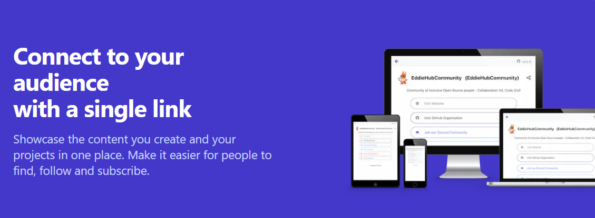
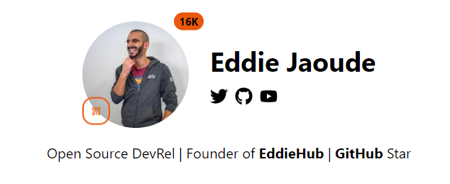
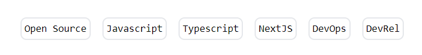
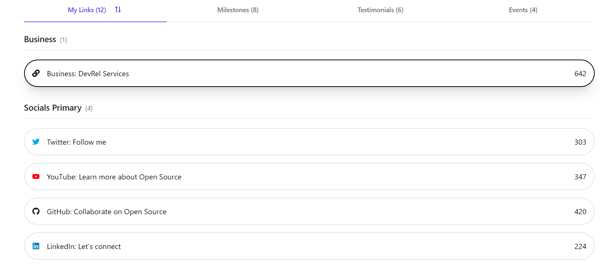
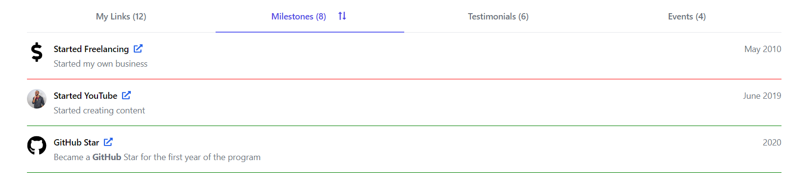
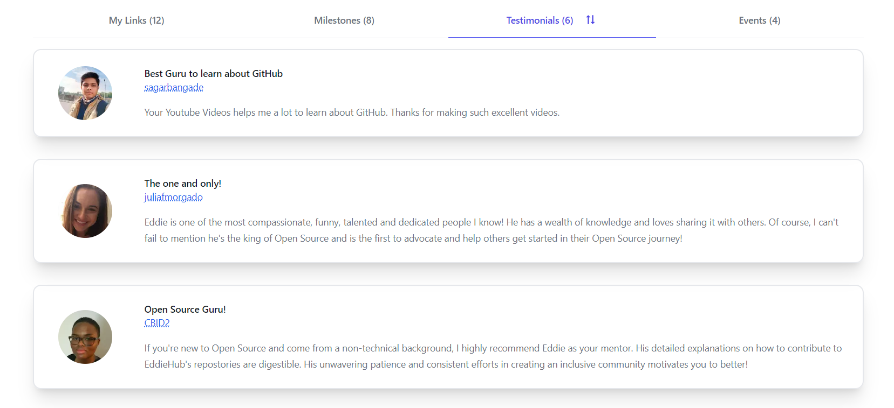
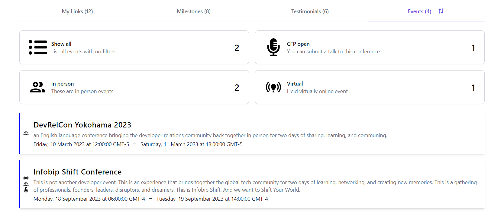
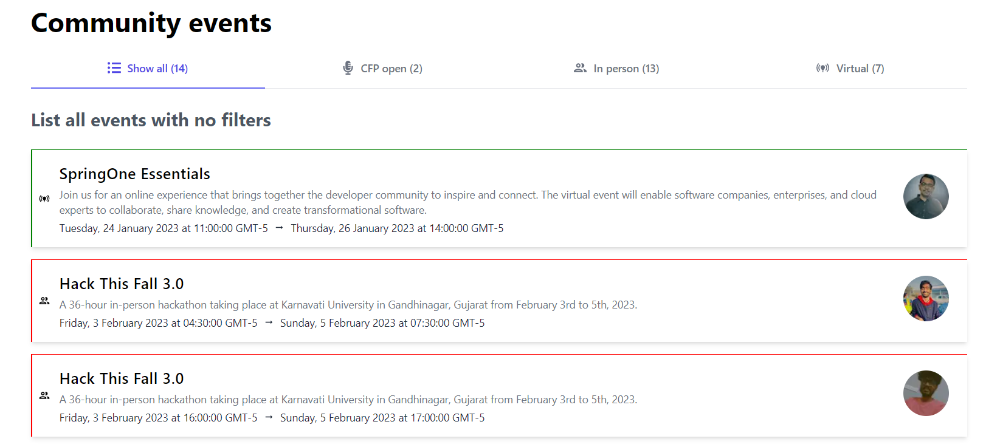
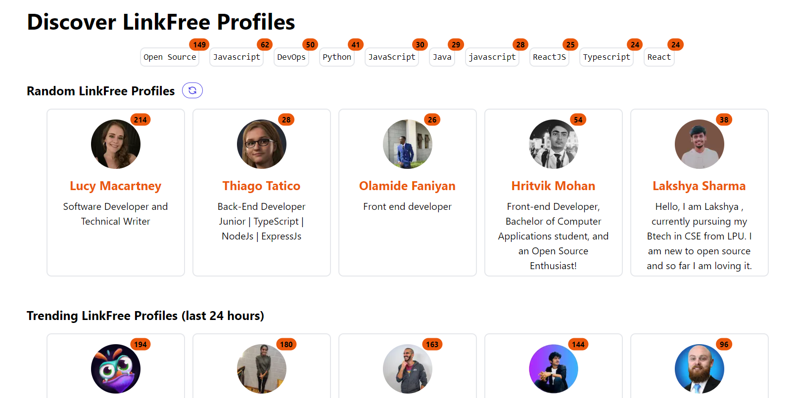

#### HOLD

---


---

Intro
(WRITE ARTICLE SECTION)

---

### About Eddie
(WRITE ARTICLE SECTION)

---

### LinkFree
(WRITE ARTICLE SECTION)



### Features
(WRITE ARTICLE SECTION)

* Your Bio, Social links & Stats
* Search by Tags
* Your QR code
* Your Links
* Your Milestones
* Your Testimonials
* Your Events
* Community Events

#### **Your Bio, Social links & Stats**

In this section, you can provide a short bio and add social links via icons.

When people view your profile, the total number is displayed next you your image.



#### **Search by Tags**
(WRITE ARTICLE SECTION)


#### **Your QR code**
(WRITE ARTICLE SECTION)

#### **Your Links**
(WRITE ARTICLE SECTION)



#### **Your Milestones**
(WRITE ARTICLE SECTION)



#### **Your Testimonials**
(WRITE ARTICLE SECTION)



#### **Your Events**
(WRITE ARTICLE SECTION)



#### **Community Events**
(WRITE ARTICLE SECTION)



---

### Discover page
(WRITE ARTICLE SECTION)

* Discover LinkFree Profiles
* Random LinkFree Profiles
* Trending LinkFree Profiles (last 24 hours)
* Popular LinkFree Profiles



*Also includes a search page!*

---

### Documentation
(WRITE ARTICLE SECTION)

Here is a selection of our popular documentation guides to help you get started.

**Popular User Guides**
* [QuickStart](https://linkfree.eddiehub.io/docs/quickstart)
* [Links](https://linkfree.eddiehub.io/docs/how-to-guides/links)
* [Bio](https://linkfree.eddiehub.io/docs/how-to-guides/bio)
* [Statistics](https://linkfree.eddiehub.io/docs/how-to-guides/statistics)
* [Events](https://linkfree.eddiehub.io/docs/how-to-guides/events)
* [Milestones](https://linkfree.eddiehub.io/docs/how-to-guides/milestones)

---

<iframe width="900" height="506" src="https://www.youtube.com/embed/05HEeCQSKRE" title="LinkFree Quickstart: How to create YOUR Profile! (Open Source)" frameborder="0" allow="accelerometer; autoplay; clipboard-write; encrypted-media; gyroscope; picture-in-picture; web-share" allowfullscreen></iframe>

---

#### LinkFree Quickstart: How to create YOUR Profile! (Open Source)

---

### Template
(WRITE ARTICLE SECTION)

```json
{
  "name": "HOLD",
  "type": "personal",
  "displayStatsPublic": true,
  "bio": "HOLD | HOLD | HOLD",
  "avatar": "HOLD",
  "tags": [
    "Javascript",
    "writing",
    "frontend"
  ],
  "socials": [
    { "icon": "FaTwitter", "url": "HOLD" },
    { "icon": "FaGithub", "url": "HOLD" },
    { "icon": "FaYoutube", "url": "HOLD" }
  ],
  "links": [
    {
      "group": "Business",
      "name": "Website: HOLD",
      "url": "HOLD",
      "icon": "FaLink"
    },
    {
      "group": "Socials Primary",
      "name": "Twitter: Follow me",
      "url": "HOLD",
      "icon": "FaTwitter",
      "color": "#00ACEE"
    },
    {
      "group": "Socials Primary",
      "name": "LinkedIn: Let's connect",
      "url": "HOLD",
      "icon": "FaLinkedin"
    },
    {
      "group": "Socials Secondary",
      "name": "YouTube Shorts: Quick technical tips",
      "url": "HOLD",
      "icon": "FaYoutube"
    },
    {
      "group": "Socials Secondary",
      "name": "HOLD",
      "url": "http://discord.eddiehub.org",
      "icon": "FaDiscord"
    },
    {
      "group": "Socials Secondary",
      "name": "Podcast: ",
      "url": "Socials Secondary",
      "icon": "FaPodcast"
    },
    {
      "name": "CodePen",
      "url": "HOLD",
      "icon": "FaCodepen"
    }
  ],
  "milestones": [
    {
      "title": "Started Freelancing",
      "date": "HOLD",
      "icon": "FaDollarSign",
      "color": "grey",
      "description": "Started my own business",
      "url": "HOLD"
    },
    {
      "title": "Started Writing Articles",
      "date": "HOLD",
      "icon": "FaPencilAlt",
      "color": "grey",
      "description": "Started my blog",
      "url": "HOLD"
    },    
    {
      "title": "Started YouTube",
      "image": "HOLD",
      "date": "HOLD",
      "icon": "FaYoutube",
      "color": "red",
      "description": "Started creating content",
      "url": "HOLD"
    }
  ]
}

```

---

<iframe width="900" height="506" src="https://www.youtube.com/embed/h3_qNTLx6dI" title="Linkfree - Open Source way to connect to your audience with one link - Eddie Jaoude" frameborder="0" allow="accelerometer; autoplay; clipboard-write; encrypted-media; gyroscope; picture-in-picture; web-share" allowfullscreen></iframe>

---

#### Linkfree - Open Source way to connect to your audience with one link - Eddie Jaoude

---

### My other Eddie Jaoude articles:

🔗 [Review: Eddie Jaoude Course - How to customize your GitHub Profile](https://selftaughttxg.com/2021/11-21/ReviewEddieJaoudeGitHubCourse/)

---

### Eddie's links

* 🔗[Website: eddiejaoude](https://www.eddiejaoude.io/)
* 🔗[GitHub: eddiejaoude](https://github.com/eddiejaoude)
* 🔗[EddieHubCommunity](https://github.com/EddieHubCommunity)
* 🔗[YouTube: eddiejaoude](https://www.youtube.com/c/eddiejaoude)
* 🔗[Twitter: eddiejaoude](https://twitter.com/eddiejaoude)

---

### Conclusion
(WRITE ARTICLE SECTION)

---

###### ***HOLD? HOLD? Please share the article and comment!***

---
