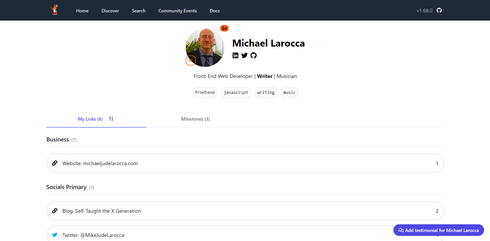

#### If you want a single link to one place showcasing all of your content, and want to expand your network, let me introduce you to LinkFree. It is more than just your links. It is a tech social platform!

---


---

### About Eddie

Eddie earned an Msc in Advanced Electronic Engineering at the University of Warwick.

He is a full-stack developer passionate about open-source, culture, community, and best coding practices. As a public speaker, Eddie promotes these topics at conferences worldwide.

As one of GitHub’s most influential developers, the community nominated him to become a GitHub star!

Eddie is also the founder of EddieHub, an inclusive open-source community that encourages and promotes communication, best practices, and technical expertise.

Eddie also promotes open-source and teaches on his YouTube channel, consisting of over 37k subscribers with over 1 million video views.

---

### What is LinkFree?

What is LinkFree? [LinkFree](https://linkfree.eddiehub.io/) is a FREE, open-source platform that allows you to connect to your audience with a single link, similar to services like Linktree.

**🔗 Link to the website: [linkfree.eddiehub.io](https://linkfree.eddiehub.io/)** 

---

### Why use LinkFree?

**If you are a developer, content creator, writer, or learning in public, creating a LinkFree account will benefit you for several reasons:**
* Comparatively small user base
* Niche tech social platform
* Advertise your products
* Share your accomplishments
* Give and receive testimonials
* Share upcoming events your attending
* And more!

#### **Comparatively small user base**
LinkFree is a newer platform with just over 1,000 active users/profiles. 

Creating a LinkFree profile in its early stages will allow you to stand out significantly on the platform, making it easier for you to grow your network and online presence.

#### **Niche tech social platform**
In addition to a smaller user base compared to other platforms, currently, LinkFree consists of like-minded tech individuals.

#### **Advertise your products**
Do you have a book, course, or other product to sell? You can add links to them along with descriptions on your LinkFree profile!

#### **Share your accomplishments**
You can share your significant achievements in your "Milestones" section. 

#### **Give and receive testimonials**
Testimonials on LinkFree profiles are an excellent way for others to learn about each other at a glance.

You can let others know how they've helped you by writing testimonials. Additionally, others can also write testimonials about you!

#### **Share upcoming events your attending**
Are you attending upcoming conferences, meetups, virtual, or similar events?

Let others know what upcoming events you're attending in your LinkFree events section.

#### **And more!**
LinkFree is an open-source project that is just getting started. Enhancements already in the works include login authorization, enhanced search features, and a more beginner-friendly user interface.

*What is the best part about LinkFree? As it is an open-source project,* ***YOUR*** *ideas, opinions, and contributions matter in making the platform the best it can be!*

---


---

### Features

**In this section of the article, we will take a look at LinkFree's current features:**
* Your Bio, Social links & Stats
* Search by Tags
* Your QR code
* Your Links
* Your Milestones
* Your Testimonials
* Your Events
* Community Events

#### **Your Bio, Social links & Stats**
In this section, you can provide a short bio and add social links via icons.

For my bio, I wrote "`Front-End Web Developer | **Writer** | Musician`" ( since it's Markdown language, I made Writer bold by surrounding it with asterisks).

When people view your profile, the total number is displayed next you your image. As you can see, Eddie used bold on "EddieHub" and "GitHub." 


#### **Search by Tags**
Similar to tags on a blog article, you can add tags that relate to you on your profile.

When you click on a tag, for example, a javascript tag, you jump to the search page, now populated with other LinkFree members that have the corresponding tag, making it easy to network with others!

Currently, you can invent your own tags; you are not limited to pre-defined tags. However, this causes a known issue. Slight spelling differences, including upper/lowercase variations, separate users into separate groups ( javascript and JavaScript result in two groups). This issue is being addressed.


#### **Your QR code**
Now, this is really cool! You automatically get a QR code associated with your LinkFree account by just joining! 

You will see an icon for your QR code bouncing on the bottom left side of your profile picture. The page expands when you click the icon, revealing your QR code.

#### **Your Links**
And now, it is time for LinkFree's main feature, links! This section is where you create links to your other platforms. 

You can organize your links into several categories: business, socials primary, secondary, and others.


#### **Your Milestones**
On your profile, you will see a milestones tab. The milestones section displays the highlights of your career, such as earning a certification, your first paid gig in tech, starting a blog, YouTube, or similar accomplishments.


#### **Your Testimonials**
When other LinkFree members write testimonials about you, upon your approval, they will display in the testimonials section of your profile.

When someone writes you a testimonial, you will receive a GitHub notification. If you want to display the testimonial on your LinkFree profile, you will need to add a testimonial field to your JSON file that includes the LinkFree member's user name that gave you the testimonial. Don't worry, it's not as difficult as it sounds, and there is thorough documentation on the whole process.


#### **Your Events**
If you are attending upcoming events, in person or virtual, you can let others know in this section.

To add upcoming events to your profile, you will need to create a JSON file and have it merged via pull request. Again, no worries; the documentation is easy to follow.


#### **Community Events**
All events posted by community LinkFree accounts, such as the EddieHubEddieHubCommunity, will be displayed in this section.


---

### Discover page

**The LinkFree discover page currently consists of the following four sections:**
* Discover LinkFree Profiles
* Random LinkFree Profiles
* Trending LinkFree Profiles (last 24 hours)
* Popular LinkFree Profiles

#### **Discover LinkFree Profiles**
In the discover LinkFree profiles section, you can filter members by the corresponding tags on display.

#### **Random LinkFree Profiles**
In this section, every LinkFree member gets a chance to get discovered! Just click the refresh icon to display a new random group of profiles.

#### **Trending LinkFree Profiles (last 24 hours)**
Different members trend on different days! Discover who is currently tending in this section.

#### **Popular LinkFree Profiles**
This section displays the overall popular LinkFree profiles, typically profiles with over 5k views.


---

### Search page
Use the search page to find LinkFree members by name; alternatively, you can search by tags.

---

### Documentation

**Here is a selection of LinkFree's popular documentation guides to help you get started:**
* [QuickStart](https://linkfree.eddiehub.io/docs/quickstart)
* [Links](https://linkfree.eddiehub.io/docs/how-to-guides/links)
* [Bio](https://linkfree.eddiehub.io/docs/how-to-guides/bio)
* [Statistics](https://linkfree.eddiehub.io/docs/how-to-guides/statistics)
* [Events](https://linkfree.eddiehub.io/docs/how-to-guides/events)
* [Milestones](https://linkfree.eddiehub.io/docs/how-to-guides/milestones)

🔗 Here is a link to the complete documentation: [https://linkfree.eddiehub.io/docs](https://linkfree.eddiehub.io/docs)

*As LinkFree is an open-source project, contributions are welcome! Check out the [LinkFree repo](https://github.com/EddieHubCommunity/LinkFree) and the [documentation source](https://github.com/EddieHubCommunity/LinkFree/tree/main/pages/docs) on GitHub for more information.*

---

<iframe width="900" height="506" src="https://www.youtube.com/embed/05HEeCQSKRE" title="LinkFree Quickstart: How to create YOUR Profile! (Open Source)" frameborder="0" allow="accelerometer; autoplay; clipboard-write; encrypted-media; gyroscope; picture-in-picture; web-share" allowfullscreen></iframe>

---

#### LinkFree Quickstart: How to create YOUR Profile! (Open Source)

---

### Template

Below is the JSON file I created for my LinkFree profile; the file met the necessary requirements and was successfully merged via pull request. **Feel free to use it as a template and modify it accordingly**.

```json
{
  "name": "Michael Larocca",
  "type": "personal",
  "displayStatsPublic": true,
  "bio": "Front-End Web Developer | **Writer** | Musician",
  "avatar": "https://github.com/MichaelLarocca.png",
  "tags": [
    "frontend",
    "javascript",
    "writing",
    "music"
  ],
  "socials": [
    { "icon": "FaLinkedin", "url": "https://www.linkedin.com/in/michael-larocca-9315a3202/" },
    { "icon": "FaTwitter", "url": "https://twitter.com/MikeJudeLarocca" },
    { "icon": "FaGithub", "url": "https://github.com/MichaelLarocca" }
  ],
  "links": [
    {
      "group": "Business",
      "name": "Website: michaeljudelarocca.com",
      "url": "https://michaeljudelarocca.com/",
      "icon": "FaLink"
    },
    {
      "group": "Socials Primary",
      "name": "Blog: Self-Taught the X Generation",
      "url": "https://selftaughttxg.com/",
      "icon": "FaLink"
    },    
    {
      "group": "Socials Primary",
      "name": "Twitter: @MikeJudeLarocca",
      "url": "https://twitter.com/MikeJudeLarocca",
      "icon": "FaTwitter",
      "color": "#00ACEE"
    },
    {
      "group": "Socials Primary",
      "name": "LinkedIn: Let's connect",
      "url": "https://www.linkedin.com/in/michael-larocca-9315a3202/",
      "icon": "FaLinkedin"
    },
    {
      "group": "Socials Secondary",
      "name": "Discord: Michael Larocca#7221",
      "url": "https://discord.com",
      "icon": "FaDiscord"
    },
    {
      "name": "CodePen: @Michael_Larocca",
      "url": "https://codepen.io/Michael_Larocca",
      "icon": "FaCodepen"
    }
  ],
  "milestones": [
    {
      "title": "Started Freelancing",
      "date": "August 9th, 2022",
      "icon": "FaDollarSign",
      "color": "grey",
      "description": "My first paid article 📝",
      "url": "https://scrimba.com/articles/author/michael/"
    },
    {
      "title": "Started Writing Articles",
      "date": "December 6th, 2020",
      "icon": "FaPencilAlt",
      "color": "grey",
      "description": "Started my blog",
      "url": "https://selftaughttxg.com/"
    },    
    {
      "title": "Earned a Certification",
      "date": "May 2nd, 2020",
      "icon": "FaFreeCodeCamp",
      "color": "green",
      "description": "Earned freeCodeCamps Responsive Web Design Certification",
      "url": "https://www.freecodecamp.org/certification/fccab1f30e2-e3ae-4d33-944a-659978c16159/responsive-web-design"
    }
  ]
}
```

---

 

---

#### Check out this “LinkFree in action” video of [Francesco Ciulla](https://linkfree.eddiehub.io/FrancescoXX) setting up a LinkFree profile with Eddie Jaoude from scratch!

*“This is one of the most promising projects I saw so far. Congrats to Eddie Jaoude and to whoever is participating in the amazing OPEN-SOURCE project!”*

> *-Francesco Ciulla*

---

<iframe width="900" height="506" src="https://www.youtube.com/embed/h3_qNTLx6dI" title="Linkfree - Open Source way to connect to your audience with one link - Eddie Jaoude" frameborder="0" allow="accelerometer; autoplay; clipboard-write; encrypted-media; gyroscope; picture-in-picture; web-share" allowfullscreen></iframe>

---

#### Linkfree - Open Source way to connect to your audience with one link - Eddie Jaoude

---

📝 ***If you found this article helpful and have created a LinkFree profile, please consider writing a brief testimonial for me on [LinkFree](https://linkfree.eddiehub.io/MichaelLarocca).*** 👍🏻

---

### My other Eddie Jaoude articles:

🔗 [Review: Eddie Jaoude Course - How to customize your GitHub Profile](https://selftaughttxg.com/2021/11-21/ReviewEddieJaoudeGitHubCourse/)

---

### Eddie's links

* 🔗[LinkFree](https://linkfree.eddiehub.io/)
* 🔗[Website: eddiejaoude](https://www.eddiejaoude.io/)
* 🔗[GitHub: eddiejaoude](https://github.com/eddiejaoude)
* 🔗[EddieHubCommunity](https://github.com/EddieHubCommunity)
* 🔗[YouTube: eddiejaoude](https://www.youtube.com/c/eddiejaoude)
* 🔗[Twitter: eddiejaoude](https://twitter.com/eddiejaoude)

---

### Conclusion

As a developer, content creator, writer, or someone simply learning in public, you will significantly benefit from creating a LinkFree profile, as it provides you with so much more than just one link to all of your content.

LinkFree also offers you a spotlight in a small yet growing community of wonderful like-minded people to network with, resulting in a significantly greater chance of others discovering YOU than on similar services with much larger user bases.

As a platform, LinkFree is just getting started and already has many more features in the making. Since LinkFree is an open-source project, creating a profile empowers YOU! As part of the LinkFree community, you will have an opportunity to contribute, ultimately providing you with an overall inclusive say in where this fantastic project is going!

---

**Let's connect! I'm active on [LinkedIn](https://www.linkedin.com/in/michaeljudelarocca/) and [Twitter](https://twitter.com/MikeJudeLarocca).**

---

###### ***Are you now interested in creating a LinkFree profile? Have you already created a profile and made new connections? Please share the article and comment!***

---
