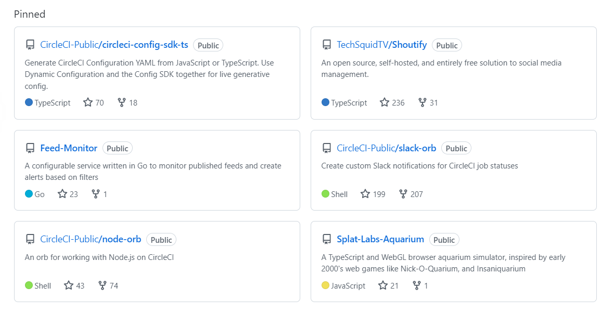

#### You've acquired the skills of a web developer, but will you pass your first interview? In this article, experienced hiring manager Kyle Tryon (TechSquidTV) prepares us to ace the technical interview!

---

Opening
(WRITE ARTICLE SECTION)

---

### About Kyle Tryon
Kyle Tryon is a Software Engineer, a content creator, and a JavaScript enthusiast who loves to teach! 

He earned an Associate's degree in Information Technology at the ITT Technical Institute-Marlton, NJ. He currently works at CircleCi, a continuous integration and delivery platform, as a Staff Software Development Engineer.

Kyle is well-known in the Tech Twitter community and helps others to break into tech by teaching on his blog and YouTube channel TechSquidTV, which has over one million video views!

---

---

### How to prepare for a technical  interview
**Researching the company you're applying to will give you a competitive advantage!**

When applying for a specific position, make sure to read the job description thoroughly. When interviewing, it's best to know what technologies they use ahead of time.

**Examples of technologies:**
* React Framework
* Vue Framework
* MERN Stack
* MEAN Stack

Study the job description as if you are studying for a test. With this method, even if you lack experience with some technologies, you will have ample time to research them enough to discuss them insightfully.

---

### Have a solid portfolio
What is a portfolio? A portfolio is a website, or page on a website, displaying your works. While there are plenty of standard portfolio projects, such as weather apps and calculators, Kyle recommends creating one or two exceptionally unique ones that showcase our programming capabilities and help us to stand out from the crowd. 

For example, if you are great with front-end design, you could create several apps, even if they are not functional. Also, consider building a UI library or other open-source project for others to use and contribute.  

**It is best to give potential employers "something to look at." Kyle elaborates it is not about how many green contribution squares you have on GitHub but the quality of each contribution square! The ability to create and maintain open-source projects and your code quality demonstrate your competency and capabilities to employers.**

*To learn more about creating a portfolio website, you may find my other related articles helpful:*
🔗[Create a portfolio website that gets noticed by tech recruiters](https://selftaughttxg.com/2021/05-21/PortfolioWebsite/)
🔗[Tech Rally: Career Tips From an Amazon Dev](https://selftaughttxg.com/2022/01-22/TechRally/)

---

### Get comfortable with Git
As Kyle mentioned, prospective employers want to ensure that you can work with source control in a team environment. Using it on your own is great, but it's in your best interest to get experience working with others. 

**Common interview questions include:**
* Do you have version control experience working with other developers
* Do you use conventional commit messages
* Can you merge pull requests
* Are you familiar with other common Git-based operations

**So how can you get this experience before ever working on a team? A great way is to contribute to open-source projects! You will become familiar with team-based Git operations by actively contributing.**

*An excellent place for beginners to get started with open-source is the EddieHub community! [EddieHub](http://eddiehub.org/) is an open-source community that encourages and promotes communication best practices, as well as
technical expertise in an inclusive and welcoming environment.*

**If you would like to get some practice with Git branching, Scrimba host [Leanne](https://www.youtube.com/@CodewithLeanne) provides us with the following resource: [learngitbranching.js.org](https://learngitbranching.js.org/?locale=en_US)**

---

### Your GitHub profile
Your GitHub profile is an excellent way to showcase your skill and experience.

**By pinning your best repositories, you provide an easy way for prospective employers to see your capabilities at a glance.**

---

***Tip:*** *On your GitHub profile, you can pin up to six of your best projects for others to view.* 

---

---

**On Kyle's pinned repositories, you can see he uses the following languages:**
* TypeScript
* Go
* Shell
* JavaScript

Viewing his pinned repositories, you can also see he has as many as 236 stars and 207 forks, which shows the popularity of the projects! In addition, there are also repositories demonstrating he has experience working with other developers.

***If you would like to learn how to customize your GidHub profile, you may find my other related articles helpful:***
* 🔗 [Review: Eddie Jaoude Course - How to customize your GitHub Profile](https://selftaughttxg.com/2021/11-21/ReviewEddieJaoudeGitHubCourse/)
* 🔗 [How to Create a Next Level GitHub Profile, with Jesse Hall](https://selftaughttxg.com/2021/11-21/CreateAGitHubProfileJesseHall/)

---

### Data structures and algorithms
For Kyle, data structures and algorithms have not come up that much regarding interviews. 

**Through Twitter, Kyle has noticed data structures and algorithms are common during interviews in India. So it would be best for you to research your area to determine if it's a requirement.**

Needing to know data structures and algorithms in the USA is more common when interviewing for higher-level jobs and for FAANG jobs (Facebook, Amazon, Apple, Netflix, and Google).

Kyle advises us not to stress over data structures and algorithms when applying for entry-level positions. However, learning them will be good and give you a competitive advantage!

---

### Testing 
With test-driven development, you write unit tests before you write the code. The idea of unit testing is to write functional code with expected outputs.

**An example is writing a unit test for an adding function involves:**
* Taking in two parameters (numbers)
* Expecting one output (number)

After the unit test successfully passes, by adding the two parameters and then returning the one expected output, you then write the function.

Kyle informs us that there are different levels of testing. As self-taught developers, we can start by learning unit testing, then learn the testing used at the companies we are employed. 

**Larger companies use other types of testing, such as:**
* End-to-end testing
* Load testing
* Smoke testing

If you are comfortable with unit testing, Kyle tells us we will have gained the core skills, and with them, we will be able to learn other types of testing quickly.

**If you can knowledgeably talk about test-driven development or have experience with it, Kyle tells us we are already doing great!**

---

**Danny Thompson said during the Livestream,** *"I ​definitely agree with Kyle, and we have spoke about this before. If you understand testing and can speak about it in an interview, you will definitely have an edge in your favor!"*

---

**Here are some helpful unit testing resources:**
* 🔗 [Unit Testing in JavaScript and Jasmine | TLDR Jasmine Unit Test Tutorial By: Dylan Israel](https://www.youtube.com/watch?v=h2eWfvcAOTI)
* 🔗 [Scrimba: Introduction to unit testing with Dylan C. Israel](https://scrimba.com/learn/unittest)

---

#### *My question: "Do you have any advice for career changers interviewing for their first job in tech?"*

---

### Advice for career changers
**Regarding your age, as a career changer, Kyle conveys to us that our age doesn't matter!**

**When interviewing, Kyle believes it is essential to show that you are passionate about programming.**

A great way to portray yourself as a passionate developer is through your original projects! For example, if you like video games, make them! You will exhibit your passion when you show and describe the process of creating them!

---

*While Kyle was learning TypeScript, he created this interactive [fish tank game](https://kyletryon.github.io/Splat-Labs-Aquarium/)! You can view the code on his [Splat Labs Aquarium GitHub repo](https://github.com/KyleTryon/Splat-Labs-Aquarium).*

---

<iframe width="956" height="538" src="https://www.youtube.com/embed/q84IgTViFv8" title="How to ace the software engineer technical interview" frameborder="0" allow="accelerometer; autoplay; clipboard-write; encrypted-media; gyroscope; picture-in-picture; web-share" allowfullscreen></iframe>

---

#### *How to ace the software engineer technical interview*

---

### Whiteboard testing
Whiteboard testing is a common technique for assessing candidates' coding skills without them relying on a computer's resources. While handwriting code (pseudo code in some cases), the candidates' will "talk through" their solutions so that interviewers can evaluate their thought processes.

**In simple terms, Kyle explains that the purpose of whiteboard testing is to determine if you understand the fundamentals of coding.**

Kyle encourages us to be comfortable and confident while explaining our solutions to succeed in these "under-pressure" tests. 

---

### Unfamiliar topics
When you are asked a question on an unfamiliar topic, be truthful about it and know that your goal is to show interest. 

**Kyle elaborates,** *"It's not that you don't know it; it's that you don't know it yet, and you are willing to learn!"*

---

### Where do you see yourself in five years?
Kyle reveals that the question “where do you see yourself in five years” is to assess your personal and career motivations.

To best way to reply is by conveying that in five years, you will learn and acquire the skills necessary to handle the responsibilities of a higher position, such as a senior software engineer.

By replying in this manner, you are expressing your will to learn and grow while at the same time not revealing if you plan on still being employed by them!

---

#### *If you would like to learn more about my journey with Scrimba and how learning with them may help you, you can read my article: [How Scrimba is helping me and many others to become confident, well-prepared web developers](https://selftaughttxg.com/2021/06-21/06-07-21/)*

---

**I continue to have wonderful experiences with Scrimba, and I highly recommend learning with them! You can read my full [Scrimba review](https://selftaughttxg.com/2020/12-20/Review-Scrimba/) on my 12/13/2020 post.**

#### *"That&#39;s one of the best Scrimba reviews I&#39;ve ever read, <a href="https://twitter.com/MikeJudeLarocca?ref_src=twsrc%5Etfw">@MikeJudeLarocca</a>. Thank you! 🙏 "*
###### &mdash; Per Harald Borgen, CEO of Scrimba <a href="https://twitter.com/perborgen/status/1338462544143540227?ref_src=twsrc%5Etfw">December 14, 2020</a></blockquote>

---

### Kyle Tryon links
* 🔗 [techsquidtv.com](https://techsquidtv.com/)
* 🔗 [YouTube](https://www.youtube.com/techsquidtv)
* 🔗 [Twitter](https://twitter.com/TechSquidTV)
* 🔗 [GitHub](https://github.com/KyleTryon)

---

### Conclusion
You can best prepare for your technical interview by researching what technologies the companies use, including their tech stack, ahead of time. 

Having an active GitHub profile, including unique portfolio projects and open-source projects that contain plenty of stars and forks, demonstrates your passion and proves that you have acquired real-world source control experience that includes working with others.

When asked questions you cannot answer or the infamous "where do you see yourself five years from now" question, your goal is to calmly convey that you are eager and willing to continue your pursuit of learning and growing your skillset to the point where you are eligible for higher positions which require more responsibility.

Although data structures and algorithms, unit testing, and whiteboard testing might not be expected for an entry-level position, knowing them and everything else Kyle taught us will give you a competitive advantage that can help you ace your technical interview!

---

**Let's connect! I'm active on [LinkedIn](https://www.linkedin.com/in/michaeljudelarocca/) and [Twitter](https://twitter.com/MikeJudeLarocca).**

---

###### *** Are you now confident in passing the technical interview? Have you already passed a technical interview? Please share the article and comment!***