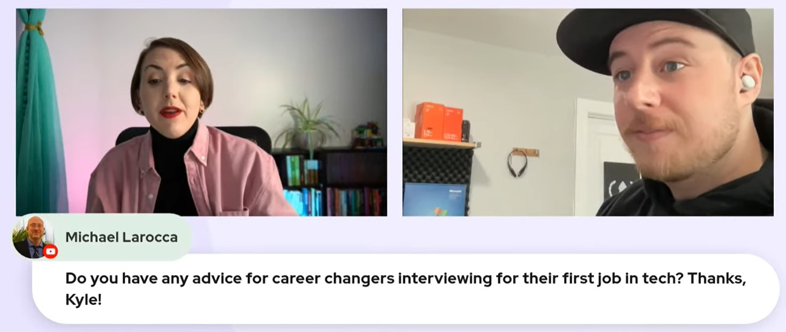

#### HOLD

Opening
(WRITE ARTICLE SECTION)

---

### About Kyle Tryon
(WRITE ARTICLE SECTION)

---

### How to prepare for a technical  interview

**Researching the company you're applying to will give you a competitive advantage!**

When applying for a specific position, make sure to read the job description thoroughly. When interviewing, it's best to know what technologies they use ahead of time.

**Examples of technologies:**
* React Framework
* Vue Framework
* MERN Stack
* MEAN Stack

Study the job description as if you are studying for a test. With this method, even if you lack experience with some technologies, you will have ample time to research them enough to discuss them insightfully.

---

### Have a solid portfolio

What is a portfolio? A portfolio is a website, or page on a website, displaying your works. While there are plenty of standard portfolio projects, such as weather apps and calculators, Kyle recommends creating one or two exceptionally unique ones that showcase our programming capabilities and help us to stand out from the crowd. 

For example, if you are great with front-end design, you could create several apps, even if they are not functional. Also, consider building a UI library or other open-source project for others to use and contribute.  

**It is best to give potential employers "something to look at." Kyle elaborates it is not about how many green contribution squares you have on GitHub but the quality of each contribution square! The ability to create and maintain open-source projects and your code quality demonstrate your competency and capabilities to employers.**

*To learn more about creating a portfolio website, you may find my other related articles helpful:*
🔗[Create a portfolio website that gets noticed by tech recruiters](https://selftaughttxg.com/2021/05-21/PortfolioWebsite/)
🔗[Tech Rally: Career Tips From an Amazon Dev](https://selftaughttxg.com/2022/01-22/TechRally/)

---

### Get comfortable with Git

As Kyle mentioned, prospective employers want to ensure that you can work with source control in a team environment. Using it on your own is great, but it's in your best interest to get experience working with others. 

**Common interview questions include:**
* Do you have version control experience working with other developers
* Do you use conventional commit messages
* Can you merge pull requests
* Are you familiar with other common Git-based operations

**So how can you get this experience before ever working on a team? A great way is to contribute to open-source projects! You will become familiar with team-based Git operations by actively contributing.**

*An excellent place for beginners to get started with open-source is the EddieHub community! EddieHub is an open-source community that encourages and promotes communication best practices, as well as
technical expertise in an inclusive and welcoming environment.* 🔗 *[http://eddiehub.org/](http://eddiehub.org/)*

**If you would like to get some practice with Git branching, Scrimba host [Leanne](https://www.youtube.com/@CodewithLeanne) provides us with the following resource: [learngitbranching.js.org](https://learngitbranching.js.org/?locale=en_US)**

---

### HOLD
(WRITE ARTICLE SECTION)

---

<iframe width="956" height="538" src="https://www.youtube.com/embed/q84IgTViFv8" title="How to ace the software engineer technical interview" frameborder="0" allow="accelerometer; autoplay; clipboard-write; encrypted-media; gyroscope; picture-in-picture; web-share" allowfullscreen></iframe>

---

### HOLD
(WRITE ARTICLE SECTION)

---
### My Question
(WRITE ARTICLE SECTION)

---

### Kyle Tryon links
(WRITE ARTICLE SECTION)

---

### Conclusion
(WRITE ARTICLE SECTION)

---

**Let's connect! I'm active on [LinkedIn](https://www.linkedin.com/in/michaeljudelarocca/) and [Twitter](https://twitter.com/MikeJudeLarocca).**

---

###### *** ? ? Please share the article and comment!***