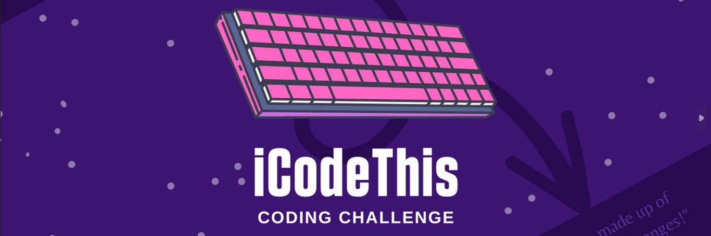
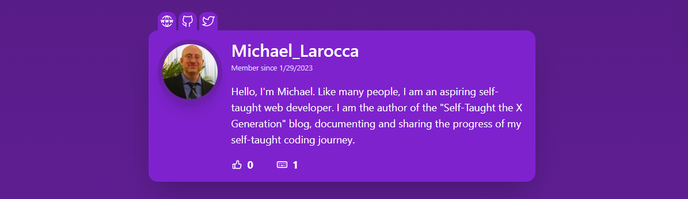
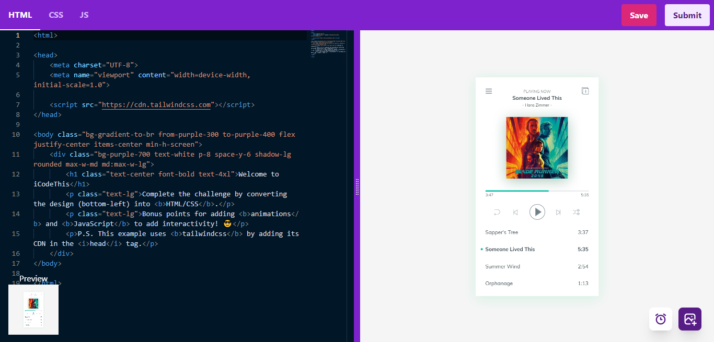
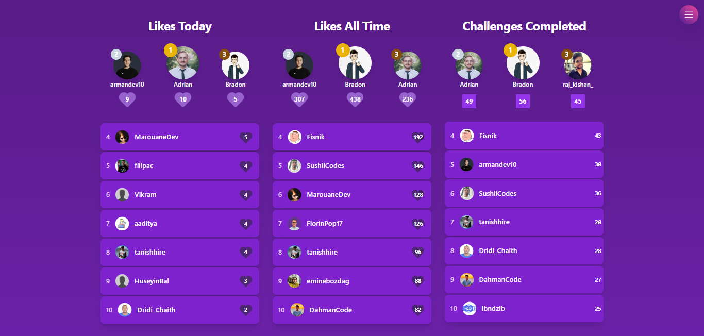

#### The best way to improve your coding skills is to code daily. In this article, we look at iCodeThis, a new FREE platform that offers daily challenges to help you become the best developer you can be!

---


---

### About Florin Pop

Florin Pop is a full-time freelancer with a passion for JavaScript. He is well known for creating coding tutorials and live-streaming his coding.

His YouTube channel has over 159K subscribers with over 67 million views!

---

### What is iCodeThis

If you're a developer looking to improve your frontend skills, Florin created something you'll find very interesting and helpful! It is a new platform called iCodeThis.

iCodeThis is a community-based platform where you complete daily coding challenges and share them with fellow iCoders on the platform and your social media if you choose.

---

### Why use iCodeThis

The best way to improve your coding skills is by coding daily. iCodeThis is a FREE platform that offers daily coding challenges and a community to help you become the best developer you can be! 

🔗 [https://www.icodethis.com/](https://www.icodethis.com/)

---



---

### Creating an account

Creating an iCodeThis account is simple; the process is fast and broken down into two sections, profile and social.

When completed, your profile displays as a delightful card.

**Profile**
* Email
* Username
* Bio
* Website
* Photo

#### **Email**
You use your email to log in via [Magic Link](https://supabase.com/docs/guides/auth/auth-magic-link), a form of passwordless login where you click on a link sent to your email address to log into your account.

#### **Username**
Your username is prominent on your profile card, and your member joined date displays directly below it.

#### **Bio**
The bio section provides you an opportunity to let others know more about you. Below your bio, the total number of likes and completed challenges display with corresponding icons.

#### **Website**
You can only add one URL for your website, so I decided to provide my newly created [LinkFree](https://selftaughttxg.com/2023/01-23/linkfree-connect-to-your-audience-with-a-single-link/) address! 

#### **Photo**
There is a button provided for you to upload a photo. I decided to use my LinkedIn profile photo.

**Social**
* Github
* Twitter
* Instagram
* Youtube
* Tiktok

To add social icon links to your profile, fill out each section with your corresponding URL address.  

I added GitHub and Twitter.  

***Note:*** *If you are experiencing issues with your profile URLs, make sure not to include the domain, just the path.* 



---

### Home screen

The home screen displays an image and description of the current coding challenge. There is also an option to complete up to three previous challenges.

A countdown clock on the top of the page shows when the next challenge will be released!

The current amount of iCodeThis members display at the bottom of the page, along with the total challenges completed.

---

### Daily Challenge

The daily challenge page displays an image and description of the current coding challenge, along with instructions on qualifications for completing it and optional stretch goals. 

This page also displays fellow iCoders submitted challenges which show as cards that include their name, an image of their challenge, and a purple heart that acts as a like counter which you can click!

**Click the "submit entry" to participate in the current coding challenge. You will code using a built-in code editor.** 

This page provides an adjustable split-screen. On the left is the code editor, with HTML, CSS, and JavaScript tabs. The right side displays the result of your code along with a nice toggle button that reveals an image of the completed challenge for you to reference.

In addition, you can time yourself with a built-in timer! Just click on the clock icon. The clock options are a start, pause, and restart timer. Very cool!

While coding, you can save your progress by clicking the save button at the top right of the screen.

**When your coding challenge is complete, you can submit it using the submit button, which is also at the top right of the screen.**

You are also encouraged to share your solutions using the hashtag #icodethis on social media!

***Note:*** *The coding challenges use the CSS framework Tailwind by default. If you do not want to use it, delete or remark the following code from the HTML file:*

```html
<script src="https://cdn.tailwindcss.com"></script>
```

---



---

### Past Challenges

The past challenge page allows you to access and participate in the previous three challenges.

At the time of writing this article, iCodeThis is FREE. There is a PRO membership in the making, and when it is available, all PRO members can access ALL challenges and more!

---

### Leaderboard

To quote a line from one of my favorite movies, "This is where the fun begins!"

**The leaderboard has three categories: likes today, likes all time, and completed challenges.**

The top three candidates display at the top of the page of each corresponding category, and the remaining fourth-place through tenth-place leaders show below.

Each leader displays the total number of likes received in the form of a purple heart!

---



---

### Discord community 

Meet and connect with other iCoders on Discord! The Discord community is a great place to introduce yourself, showcase your work, and give and receive help for iCodeThis coding challenges.

You can also stay updated with all iCodeThis-related news in the updates section. They even have a custom projects section that encourages you to create and showcase original work you make on the iCodeThis platform!

As the iCodeThis platform is still in the making, you can offer suggestions to improve the platform by submitting them in the suggestions section.

🔗 ***[iCodeThis Discord channel](https://discord.gg/wrFuatUx7f)***

---

##### *Check out Florin completing iCodeThis challenges on this YouTube Livestream!*

<iframe width="853" height="480" src="https://www.youtube.com/embed/xsP_qD1zXu4" title="Daily Coding Projects on iCodeThis" frameborder="0" allow="accelerometer; autoplay; clipboard-write; encrypted-media; gyroscope; picture-in-picture; web-share" allowfullscreen></iframe>

---

#### Daily Coding Projects on iCodeThis

---

### My other Florin Pop articles

🔗 [Scrimba Livestream with Florin Pop](https://selftaughttxg.com/2021/06-21/06-21-21/)

---

### Florin Pop links

* 🔗 [Website/Blog](https://florin-pop.com) 
* 🔗 [Twitter](https://twitter.com/florinpop1705)
* 🔗 [Linkedin](https://linkedin.com/in/florinpop17)
* 🔗 [Instagram](https://instagram.com/florinpop17)
* 🔗 [Facebook](https://facebook.com/florinpop17)
* 🔗 [Github](https://github.com/florinpop17)
* 🔗 [Dev.to](https://dev.to/florinpop17)
* 🔗 [Twitch](https://twitch.com/florinpop17)

---


### Advance your career with a 20% discount on Scrimba Pro using this [affiliate link](https://scrimba.com/?via=MichaelLarocca)!

Become a hireable developer with Scrimba Pro! Discover a world of coding knowledge with full access to all courses, hands-on projects, and a vibrant community. You can [read my article](https://selftaughttxg.com/2021/06-21/06-07-21/) to learn more about my exceptional experiences with Scrimba and how it helps many become confident, well-prepared web developers!

###### ***Important:*** *This discount is for new accounts only. If a higher discount is currently available, it will be applied automatically.*

**How to Claim Your Discount:**
1. Click [the link](https://scrimba.com/?via=MichaelLarocca) to explore the new Scrimba 2.0.
2. Create a new account.
3. Upgrade to Pro; the 20% discount will automatically apply.

##### ***Disclosure:*** *This article contains affiliate links. I will earn a commission from any purchases made through these links at no extra cost to you. Your support helps me continue creating valuable content. Thank you!*

---

### Conclusion

If you want to improve your coding skills, it is best to practice daily. iCodeThis is a FREE platform that offers daily coding challenges, a place to write original programs, and a place to share your work. 

The leaderboards are a fun and engaging way to encourage you to do your best to make the ranks and cheer on your fellow iCoders to do the same!

The iCodeThis Discord community is also an excellent resource for you. You can receive and give help there regarding the coding challenges, your original projects, and more, ultimately helping you become a better programmer!

---

**Let's connect! I'm active on [LinkedIn](https://www.linkedin.com/in/michaeljudelarocca/) and [Twitter](https://twitter.com/MikeJudeLarocca).**

---

###### ***Are you now interested in joining the iCodeThis community to better your coding skills? Are you already part of the iCodeThis community and would like to tell us how it has helped you? Please share the article and comment!***
