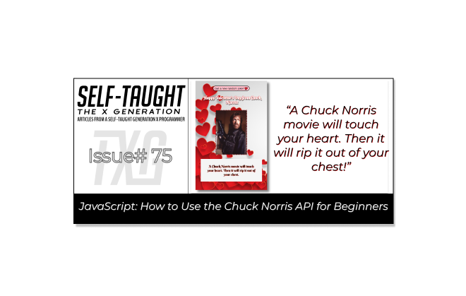
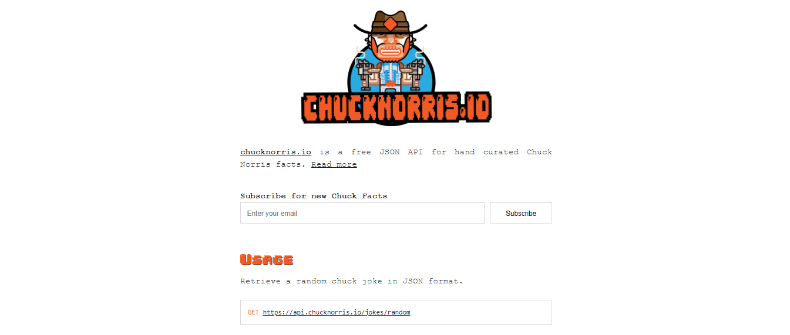
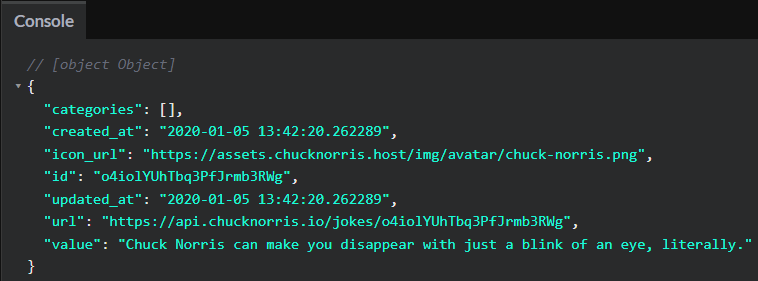

#### Does Chuck Norris speak about himself in the third person? Well, he does when he hands out Valentine's Day cards! In this article, we learn how to use the Chuck Norris API by making hilarious VD cards!

---



---

Into
(WRITE ARTICLE SECTION)

---

### Card one

Below is the simplest version of the function. 🔽
```javascript
async function fetchJoke() { 
  const results = await fetch(`https://api.chucknorris.io/jokes/random`);
  const data = await results.json();
      console.log(data.value);
} 
fetchJoke();
```

To try it out, copy or rewrite the code into a JavaScript file and check the console log. You can use [CodePen](https://codepen.io/), a FREE online code editor.

Now, let's take a closer look at this simple function and learn how it works.

**The fetch joke is an asynchronous function. Asynchronous functions return a promise, an object that provides methods to handle the eventual success or failure of the operation.**

Here is an excellent article on the topic from MDN Web Docs: [How to use promises](https://developer.mozilla.org/en-US/docs/Learn/JavaScript/Asynchronous/Promises)

In simple terms, we are trying to retrieve data, in this case, a Chuck Norris joke. We do not know how long it will take, and we do not know if there will be some errors.

---

**Let's break down the function with the help of MDN Web Docs. We are dealing with the following:**
* async 
* await 
* promise
* fetch
* .json()

The [async](https://developer.mozilla.org/en-US/docs/Web/JavaScript/Reference/Statements/async_function) declaration declares an async function.

We use the [await](https://developer.mozilla.org/en-US/docs/Web/JavaScript/Reference/Operators/await) operator to wait for a Promise and get its fulfillment value.

The [Promise](https://developer.mozilla.org/en-US/docs/Web/JavaScript/Reference/Global_Objects/Promise) object represents the eventual completion (or failure) of an asynchronous operation and its resulting value.

The Fetch API provides a JavaScript interface for accessing and manipulating parts of the protocol, such as requests and responses. It also provides a global [fetch()](https://developer.mozilla.org/en-US/docs/Web/API/Fetch_API/Using_Fetch) method that provides an easy, logical way to fetch resources asynchronously across the network.

The [json()](https://developer.mozilla.org/en-US/docs/Web/API/Response/json) method of the Response interface takes a Response stream and reads it to completion. It returns a promise which resolves by parsing the body text as JSON. Note that despite the method being named json(), the result is not JSON but is instead the result of taking JSON as input and parsing it to produce a JavaScript object.

---

To simplify, if we successfully retrieve the requested data, we will need to parse it ( convert it ), so we can work with it using JavaScript.

Now, it is essential to know that APIs are different and that you will need to read the documentation of the APIs to see how to work with them.

Let's take a look at the documentation of the [Chuck Norris API](https://api.chucknorris.io/).

---



---

The documentation tells us we can retrieve a random joke by using a GET request with the following URL: https://api.chucknorris.io/jokes/random
```javascript
const results = await fetch(`https://api.chucknorris.io/jokes/random`);
```

**When we first receive the data, we get an object like the following:**



We assigned the object to the data variable in the fetch joke function and parsed the results using json().
 ```javascript
const data = await results.json();
```

Now we can access just the joke inside the object as follows:
```javascript
data.value
```

---

**Now that we better understand how an asynchronous function works, let's tighten up the fetch joke function by adding code to handle errors. We will use a try/catch statement.**

We will first add a try block to the fetch joke. If we are unsuccessful in fetching a joke, we will use a catch block to throw an error.

```javascript
async function fetchJoke() {

	try {
        const results = await fetch(`https://api.chucknorris.io/jokes/random`);
        const data = await results.json();
            console.log(data.value);
	} catch (error) {
		console.error(error);
	}
}
fetchJoke();
```

A simple way to test if the catch error works is to turn off your internet connection. Check out the message I got in the console log!
```
GET https://api.chucknorris.io/jokes/random net::ERR_INTERNET_DISCONNECTED
```

This is great! However, the catch block will not work for a 404 error. We will get a 404 error if the URL is incorrect! Look at what happens when I add 123 to the end of the URL.
```
GET https://api.chucknorris.io/jokes/random123 404
```

To handle a 404 error, we add an if statement to the results variable. If the results are not ok, we throw an error.
```javascript
async function fetchJoke() {

	try {
		const results = await fetch(`https://api.chucknorris.io/jokes/random`);
    
		if (!results.ok) {
			throw new Error("Request failed.");
		}    
    
		const data = await results.json();
            console.log(data.value);
	} catch (error) {
		console.error(error);
	}
}
fetchJoke();
```

Now that we have written code to handle errors let's have some fun and add a custom error message. In the style of the Chuck Norris jokes, I came up with the following:
```javascript
const errorMessage = `"DO NOT DISTURB!" Chuck Norris is currently entertaining guests in his hotel room.`;
```

Let's add the custom error message to the function.
```javascript
async function fetchJoke() {
const errorMessage = `"DO NOT DISTURB!" Chuck Norris is currently entertaining guests in his hotel room.`;
  
	try {
		const results = await fetch(`https://api.chucknorris.io/jokes/random`);
  
		if (!results.ok) {
            console.log(errorMessage);
			throw new Error("Request failed.");
		}    
    
		const data = await results.json();
             console.log(data.value);
	} catch (error) {
        console.log(errorMessage);
		console.error(error);
	}
}
fetchJoke();
```

Finally, let's modify the fetch joke function to add content to a paragraph tag in HTML instead of the console log.

Add this code to the HTML page ( using CodePen is easiest ).
```html
<p id="display-joke"></p>
```

Add this code to JavaScript above the fetch joke function, not in it ( using CodePen is easiest ).
```javascript
const displayJoke = document.getElementById("display-joke");
```

***Note:*** *To add the text of the joke to the HTML paragraph tag, we use the JavaScript [textContent](https://developer.mozilla.org/en-US/docs/Web/API/Node/textContent) property.*

Here is the final JavaScript function:
```javascript
async function fetchJoke() {
    const errorMessage = `"DO NOT DISTURB!" Chuck Norris is currently entertaining guests in his hotel room.`;
  
	try {
		const results = await fetch(`https://api.chucknorris.io/jokes/random`);
  
		if (!results.ok) {
            displayJoke.textContent = errorMessage;
			throw new Error("Request failed.");
		}    
    
		const data = await results.json();
        displayJoke.textContent = data.value;
            console.log(data.value);
	} catch (error) {
        displayJoke.textContent = errorMessage;
		console.error(error);
	}
}
fetchJoke();
```

***Since I wanted to focus on the JavaScript aspects and keep this article beginner-friendly, feel free to copy my HTML and CSS code to complete the Valentine's Day card.***

* 🔗 Here is a link to the GitHub repo: [Chuck-Norris-API-VD-Card-01](https://github.com/MichaelLarocca/Chuck-Norris-API-VD-Card-01)
* 🔗 Here is a link to the CodePen: [Chuck Norris VD Card one](https://codepen.io/Michael_Larocca/pen/MWBdyZb?editors=0011)
* 🔗 Here is a link to the finished project: [chuck-norris-api-vd-card-one.netlify.app](https://chuck-norris-api-vd-card-one.netlify.app/)

---

### Card two

**By reading the Chuck Norris API instructions, you will see we can also retrieve a joke by category.**

Below is the simplest version of the function. 🔽
```javascript
async function fetchJoke() {
		const results = await fetch(`https://api.chucknorris.io/jokes/random?category=dev`);
		const data = await results.json();
		  console.log(data.value);
}
fetchJoke();
```

You will notice that the URL to retrieve a random joke by category is slightly different than the one we previously used; we added the following additional code: **?category=dev**. 

The dev in the URL refers to the dev category of Chuck Norris jokes. Let's take a look at the new URL.
```
https://api.chucknorris.io/jokes/random?category=dev
```

The dev category is one of 16 available categories.

**For the second Chuck Norris Valentine's Day card, we will add an [HTML Select element](https://developer.mozilla.org/en-US/docs/Web/HTML/Element/select) for the user to choose 1 of 16 categories.**

#### Create a variable
First, let's create a **chosenCategory** variable and assign dev to it.
```javascript
let chosenCategory = `dev`;
```

#### Template literals
Next, using [template literals](https://developer.mozilla.org/en-US/docs/Web/JavaScript/Reference/Template_literals), let's update the random category URL:
```javascript
`https://api.chucknorris.io/jokes/random?category=${chosenCategory}`
```

#### Available categories
Great! Now, let's find out what all available categories are by following the Chuck Norris API instructions.

**To retrieve a list of available categories, we use the following URL:**
```
`https://api.chucknorris.io/jokes/categories`
```

#### Category function
**Let's write a function to retrieve the available Chuck Norris joke categories:**
```javascript
async function generateCategoryOptions() {
  const results = await fetch(`https://api.chucknorris.io/jokes/categories`);
  const data = await results.json();
    console.log(data);
}
generateCategoryOptions();
```

When we run the generate category options function, we receive the following data:
```javascript
[animal,career,celebrity,dev,explicit,fashion,food,history,money,movie,music,political,religion,science,sport,travel]
```

**Now that we know all 16 Chuck Norris joke categories, we only need to update the *chosenCategory* variable to choose a new category.** 
```javascript
let chosenCategory = `music`;

async function fetchJoke() {
		const results = await fetch(`https://api.chucknorris.io/jokes/random?category=${chosenCategory}`);
		const data = await results.json();
		  console.log(data.value);
}
fetchJoke();
```

#### The HTML Select element
Now, let's look at how to create a simple HTML selection. We will just make options for the first 4 categories. We will use [label](https://developer.mozilla.org/en-US/docs/Web/HTML/Element/select), [select](https://developer.mozilla.org/en-US/docs/Web/HTML/Element/select), and [option](https://developer.mozilla.org/en-US/docs/Web/HTML/Element/option) HTML tags.
```html
      <label for="category"> Select your category</label>
      <select name="category" id="category">
      	<option value="animal">animal</option>
        <option value="career">career</option>
        <option value="celebrity">celebrity</option>
        <option value="dev">dev</option>
      </select>
```

We can add the [selected](https://developer.mozilla.org/en-US/docs/Web/HTML/Element/option#attr-selected) attribute to the dev option to make it the default value.
```html
<option value="dev" selected>dev</option>
```

Then we can use the [disabled](https://developer.mozilla.org/en-US/docs/Web/HTML/Element/option#attr-disabled) attribute to disable the select tag.
```html
<select name="category" id="category" disabled>
```

**Ok, so why are we disabling the select tag? We can continue adding the remaining options manually, for a total of 16 options, or write a function to do it instead.**

#### Generate category options function

**The new async function contains the following:**
* Create an outPut variable
* Fetch the categories from the API
* Parse the fetched data
* Remove the disabled attribute
* For each loop
* Set the outPut to inner HTML
* Select the dev category

#### Write the async function
```javascript
async function generateCategoryOptions() {
}
```

#### Create an outPut variable
We will create an outPut variable to store each of the 16 Chuck Norris joke categories. Initially, we will set the outPut variable to an empty string.
```javascript
let outPut = ``;
```

#### Fetch the categories from the API
The generate category options function will first fetch the categories from the Chuck Norris API.
```javascript
const results = await fetch(`https://api.chucknorris.io/jokes/categories`);
```

#### Parse the fetched data
```javascript
const data = await results.json();
```

#### Remove the disabled attribute
When we receive the data, we will enable the HTML select. We initialy disabled the select tag to prevent users from accessing the categories before we received the data.
```javascript
category.removeAttribute("disabled");
```

#### For each loop
Now, instead of writing each category manually, we will use a for each loop to set each category to an option as follows:
```javascript
		data.forEach((category) => {
			outPut += `<option value="${category}">${category}</option>`;
		});
```

#### Set the outPut to inner HTML
Now that we have all 16 Chuck Norris joke categories set to the outPut variable, we then set the inner HTML of the select tag to the outPut value as follows:
````javascript
category.innerHTML = outPut;
````

#### Select the dev category
Finally, since we know that the 4rd category is dev (index number 3), we can set it as the default value by setting the selected value to true.
````javascript
category[3].selected = true;
````

**Here is the finished generate category options function:**
```javascript
async function generateCategoryOptions() {
	let outPut = ``;
	const results = await fetch(`https://api.chucknorris.io/jokes/categories`);
	const data = await results.json();

	category.removeAttribute("disabled");

	data.forEach((category) => {
		outPut += `<option value="${category}">${category}</option>`;
	});
	category.innerHTML = outPut;
	category[3].selected = true;
}
```

**Now, let's tighten up this function by handling errors. We will use an if statement and a try/catch blocks as we did in the first Chuck Norris Valentine's Day card:**
```javascript
async function generateCategoryOptions() {
	let outPut = ``;

	try {
		const results = await fetch(`https://api.chucknorris.io/jokes/categories`);

		if (!results.ok) {
			throw new Error("Request failed.");
		}

		const data = await results.json();

		category.removeAttribute("disabled");

		data.forEach((category) => {
			outPut += `<option value="${category}">${category}</option>`;
		});
		category.innerHTML = outPut;
		category[3].selected = true;
	} catch {
		console.error(error);
	}
}
```

---

### HOLD
(WRITE ARTICLE SECTION)

---

### Conclusion
(WRITE ARTICLE SECTION)

---

**Let's connect! I'm active on [LinkedIn](https://www.linkedin.com/in/michaeljudelarocca/) and [Twitter](https://twitter.com/MikeJudeLarocca).**

---

###### *** ? ? Please share the article and comment!***