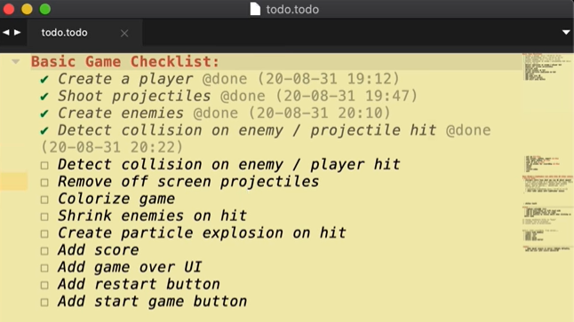
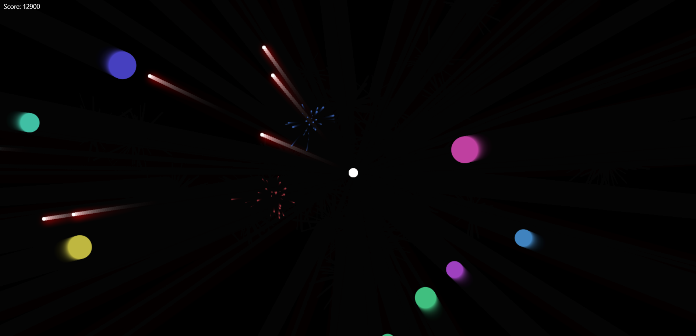

#### Would you like to learn a high in demand programming language while having fun coding video games? Then let me introduce you to Christopher Lis, who teaches premium games in many styles with JavaScript!

---


---

### About Christopher
Christopher Lis is a professional full-stack developer that teaches premium game development with JavaScript. 

He has over 9k students on his Chris Courses website, where he helps students "unleash their inner game developer" by teaching how to code games in the style of classics, Pokemon, fighting, and more!

Christopher's YouTube channel has over 120k subscribers and over 7 million video views!

---

### Learning JavaScript

**Have you ever been taught complicated formulas in a math class and asked yourself,** *"will I ever use these formulas in day-to-day life?"*

When learning JavaScript, coding concepts can feel daunting when out of context and difficult to comprehend without practical application.

**Christopher skillfully and articulately teaches complicated JavaScript concepts by taking us step-by-step through "what the code does" and "how and when to use it."** 

A great example of how Christopher teaches with clarity is during his Asteroids-style game; in his [HTML5 Canvas and JavaScript Game Tutorial](https://youtu.be/eI9idPTT0c4), he teaches us how to create a player and an enemy class, a function to spawn the enemies and an array to push them in. 

**While coding a player and enemies, we learn about the following:**
* Classes
* Functions
* Arrays	

Christopher then shows us how to shoot the enemies with projectiles and have the spawned enemies attack us by creating and using functions that calculate angles.

**By creating these functions, we learn about the following:**
* Atan2 function
* Angles
* Velocity
* Sine 
* Cosine 

*While having fun coding this JavaScript game, we are already learning advanced coding concepts and using them with practical applications, which is a great way to understand and retain what we know!*

---

### Christopher's checklist

Christopher provides an organized checklist of the covered topics for each coding project. 

As you work through a project with him, the topics on the list get checked off as you complete them.

*As a self-taught developer, I find this teaching style highly effective; with the coding concepts separated into sections, it's easy to learn each topic and provides excellent "save points" to resume coding.*



---

### HTML5 Canvas Tutorials
Chris's JavaScript games rely heavily on HTML5 Canvas.

**So, what is HTML5 Canvas? Wikipedia explains,** *"The canvas element is part of HTML5 and allows for dynamic, scriptable rendering of 2D shapes and bitmap images. It is a low-level, procedural model that updates a bitmap. HTML5 Canvas also helps in making 2D games."*
 
**Although you can jump in and code along with his game tutorials, if you want to take a deep dive and learn Canvas as a pre-requisite, Chris also created this fantastic tutorial playlist to teach us!**

🔗 [HTML5 Canvas Tutorials for Beginners](https://www.youtube.com/playlist?list=PLpPnRKq7eNW3We9VdCfx9fprhqXHwTPXL)

**Topics covered through this playlist include:**
* Canvas basics
* Gravity effects
* Collision detection
* Circular motion

---

### HTML5 Canvas and JavaScript Game Tutorial
(WRITE ARTICLE SECTION)

---

<iframe width="1349" height="488" src="https://www.youtube.com/embed/eI9idPTT0c4" title="HTML5 Canvas and JavaScript Game Tutorial" frameborder="0" allow="accelerometer; autoplay; clipboard-write; encrypted-media; gyroscope; picture-in-picture; web-share" allowfullscreen></iframe>

---

---

### GSAP
(WRITE ARTICLE SECTION)

```html
<script
    src="https://cdnjs.cloudflare.com/ajax/libs/gsap/3.11.4/gsap.min.js"
    integrity="sha512-f8mwTB+Bs8a5c46DEm7HQLcJuHMBaH/UFlcgyetMqqkvTcYg4g5VXsYR71b3qC82lZytjNYvBj2pf0VekA9/FQ=="
    crossorigin="anonymous"
    referrerpolicy="no-referrer"
    defer
></script>
```

Notes:
https://cdnjs.com/libraries/gsap

---

### Tailwind CSS
(WRITE ARTICLE SECTION)

What is Tailwind? [Tailwind](https://tailwindcss.com) is a utility-first CSS framework that provides predefined classes, providing us with a simple and concise way to style our projects.

One way to utilize Tailwind in your project is by adding the following code to your HTML page:

```html
<link href="https://unpkg.com/tailwindcss@^1.0/dist/tailwind.min.css" rel="stylesheet"/>
```
Now you can add valid Tailwind CSS classes to your HTML elements.

**By following Chris's tutorial, I now see the allure of Tailwind. Since this project is heavily JavaScript and HTML canvas-based, utilizing Tailwind allows us to quickly and efficiently style the project, saving us a lot of time while helping us to stay focused on intricate coding parts. Very cool!**

*If you would like to learn more about Tailwind, you can read my article: [Shruti Balasa: Getting started with Tailwind CSS](https://selftaughttxg.com/2021/11-21/ShrutiBalasa-Tailwind/)*

---

### My additions 
(WRITE ARTICLE SECTION)

I couldn't resist the temptation to stray a bit from the tutorial and try to add laser shot visual and sound effects, as well as asteroid explosion sounds!

#### Laser shot visual
With much trial and error, I created a red-glowing laser effect for the projectiles by adding the following code to the Projectile class:

```javascript
c.shadowColor = "red";
c.shadowBlur = 15;
c.shadowOffsetX = 3;
c.shadowOffsetY = 3;
```

Initially, everything unintentionally had the red glowing effect! I resolved the issue by adding the following code to the affected areas, which cancels out the added effect:

```javascript
c.shadowColor = "";
c.shadowBlur = 0;
c.shadowOffsetX = 0;
c.shadowOffsetY = 0;
```

#### Sound effects
To add sound to this project, I use mp3 files with the [HTMLAudioElement](https://developer.mozilla.org/en-US/docs/Web/API/HTMLAudioElement).
```javascript
const asteroidHit = new Audio("audio/Asteroid-Hit.mp3");
const soundLaser = new Audio("audio/dist_audio_lasrhit2.mp3");
```

My first attempt at adding a laser shot sound effect when the user clicks resulted in the two-second wave file playing out entirely before it played again from the beginning. I resolved this issue with the following code:

```javascript
soundLaser.pause();
soundLaser.currentTime = 0;
soundLaser.play();
```

Similarly, I wrote the following code to add explosion effects each time a projectile hits an enemy:

```javascript
asteroidHit.pause();
asteroidHit.currentTime = 0;
asteroidHit.play();
```

***Note:*** *Use discretion when adding sounds and music to your projects! Be proactive in researching if attribution is required.*

---

### My completed JavaScript game



I completed the YouTube [HTML5 Canvas and JavaScript Game Tutorial](https://youtu.be/eI9idPTT0c4) course and had a blast, figuratively and literally speaking! It was very gratifying creating a player and enemies and then coding the enemies to gravitate toward you while you frantically try to shoot them!

All of the effects in this game are impressively created with just code and mathematical formulas, without the use of images or character sprites!

**You can play my game and view my code by following the links below:**
* 🔗 [Link to play the game](https://chris-courses-canvas-javascript-game.netlify.app/)
* 🔗 [Link to my GitHub repo](https://github.com/MichaelLarocca/Chris-Courses-HTML5-Canvas-and-JavaScript-Game-Tutorial)

---

#### *If you enjoyed this article, you might also enjoy my related article: [Ania Kubow: Building Tetris with JavaScript](https://selftaughttxg.com/2022/03-22/Ania_Kubow-Tetris/)*

---


---

### Christopher's links
* 🔗 [Website](https://chriscourses.com/)
* 🔗 [Twitter](https://mobile.twitter.com/christopher4lis)
* 🔗 [Discord](https://discord.com/invite/hDgDtaCCUK)
* 🔗 [Code Pen](https://codepen.io/chriscourses)
* 🔗 [Udemy](https://www.udemy.com/user/christopher-lis-2/)
* 🔗 [GitHub](https://github.com/christopher4lis)

---

### Conclusion

JavaScript is a high-in-demand language that can open up employment opportunities for those who learn it.

Learning the JavaScript language takes time, and it can be challenging to master without proper guidance and enjoyable projects that keep you motivated.

Christopher keeps us engaged by providing us with fun arcade games to build and teaches us the JavaScript code and the programming concepts behind the code in the projects.

Christopher provides many [FREE](https://youtube.com/@ChrisCourses) hours of core coding concepts which are more than sufficient to get you up and running with JavaScript. If you want to take a deep dive into the language, and take the games your coding to the next level, be sure to check out his [Chris Courses website](https://chriscourses.com), where he teaches premium game development.

---

**Let's connect! I'm active on [LinkedIn](https://www.linkedin.com/in/michaeljudelarocca/) and [Twitter](https://twitter.com/MikeJudeLarocca).**

---

###### ***Are you now interested in coding video games to learn JavaScript? Have you already coded with Chris's JavaScript tutorials and created games you want to share? Please share the article and comment!***

