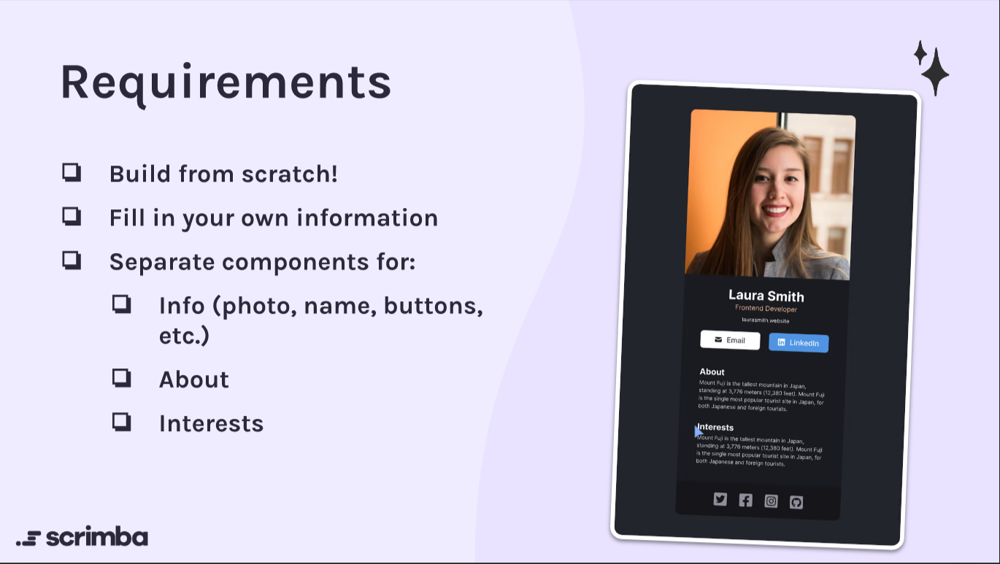
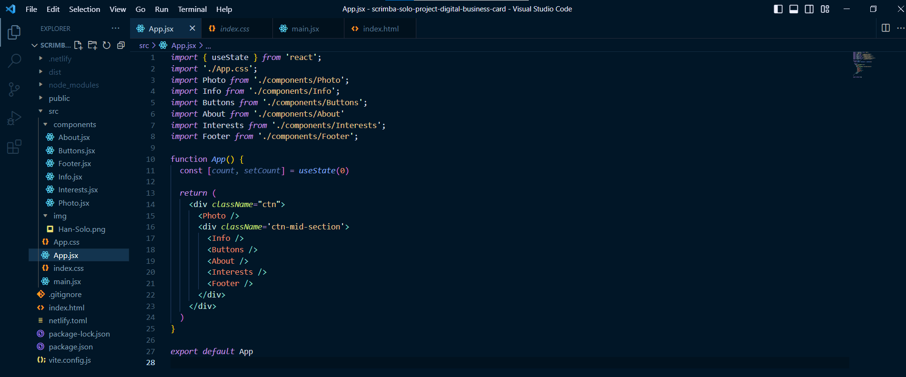

#### This article is a beginner-friendly guide on creating a digital business card with React, including how to structure and deploy it, which can impress potential employers with your growing skillset! 

---


---

### Introduction
As part of Scrimba's Front-End Developer Career Path, we are asked to create solo projects for which they do not provide a solution. We are given a set of instructions and a Figma file that displays what the finished project should look like.

**I solved their Digital Business Card Solo Project as a [scrim](https://scrimba.com/scrim/cof23464e8aaeec49a932afa0), which you can view on their website.**

To get more real-world experience, I solved their Digital Business Card Solo Project again, only this time, I created it as a React/Vite project, pushed it to GitHub, and deployed it using Netlity. However, this time, I literally made it a "Solo" business card!

#### Here are the requirements of the project:
* Build the project from scratch
* Fill in your own information
* Create separate components for:
     1. Info (photo, name, buttons, etc.)
     2. About
     3. Interests

---



---

### React
This is the first solo project in the React section of Scrimba's Front-End Developer Career Path. We are encouraged not to rush through the eleven-plus hour course and properly understand what we learned before moving forward.

When transitioning from vanilla JavaScript to React, for me, the toughest part is wrapping my head around the new way to structure a website. **As master Yoda would aptly say,** *"You must unlearn what you have learned!"*

**So, what exactly do I mean by the new way to structure a website? Let's look at the structure of a simple HTML page:**
```html
<body>

  <nav>
    <ul>
      <li><a href="#">Link 1</a></li>
      <li><a href="#">Link 2</a></li>
      <li><a href="#">Link 3</a></li>
    </ul>
  </nav>

  <main>
    <h2>Main Content</h2>
    <p>Some text here.</p>
  </main>

  <footer>
    <p>Footer</p>
    <p>Some text here.</p>
  </footer>

</body>
```

So, we are used to coding out the webpage structure directly in the HTML file. With React, we use JSX, a form of JavaScript, to break down and write each section into its own components. *(JSX allows us to write HTML-like syntax directly in the JavaScript code).*

For example, the nav bar would be coded as its own component. Then, you would also make the main section into a component. Of course, you would continue by making the footer section into its own component. All of the components go into a components folder.

Then, just like pulling out lego pieces from a box and assembling them, we piece the React components together in a separate file; the App.jsx file.

In the App.jsx file, each created component is first imported. Then we write a function similar to the one displayed below:
```javascript
import Nav from './components/Nav';
import Mainfrom './components/Main';
import Footer from './components/Footer';

function App() {

  return (
        <Nav />
        <Main/>
        <Footer />
  )
}

export default App

```

**This function is exported so that it can be imported into the main.jsx file. In the main.jsx file, we then create an element with an id of root.**

```javascript
import App from './App'

ReactDOM.createRoot(document.getElementById('root')).render(
  <React.StrictMode>
    <App />
  </React.StrictMode>,
)
```

**As you can see, the body section in the HTML file is now reduced to just one div with the id of root, which is used to display the App we created with React!**

```html
  <body>
    <div id="root"></div>
  </body>
```

### Creating a React Project
As I mentioned earlier, I created this project again locally. 

**If you would like to learn how to set up a local React development environment, I wrote the following two beginner-friendly articles:** 
* [Create a React Project, Push It to GitHub, and Deploy With Netlify, From the Command Line](https://selftaughttxg.com/2023/03-23/create-a-react-project-push-it-to-github-and-deploy-with-netlify-from-the-command-line/)
* [How to Create a Local React Environment with Vite](https://selftaughttxg.com/2023/03-23/how-to-create-a-local-react-environment-with-vite/)

---

### My Digital Business Card Project
🔗 Here is a link to the deployed project: [Netlify: scrimba-solo-project](https://scrimba-solo-project-digital-business-card.netlify.app/)

🔗 Here is a link to my GitHub repo. Feel free to inspect the code and/or clone: [GitHub scrimba-solo-project](https://github.com/MichaelLarocca/scrimba-solo-project-digital-business-card)

---


---

### File Structure 
For the file structure, I created a components folder that holds all of the components and an image folder for the photo of Han Solo.

---



---

**As instructed by the Scrimba course, I created a function called App that is exported and then imported into the main.jsx file to render.**
```javascript
import React from 'react'
import ReactDOM from 'react-dom/client'
import App from './App'
import './index.css'

ReactDOM.createRoot(document.getElementById('root')).render(
  <React.StrictMode>
    <App />
  </React.StrictMode>,
)
```

---

### My projects components, CSS and JSX files
Now that we covered the theory of React file structures, in the sections below, I included the code for the components as well as the code in the CSS and JSX files.

I also included a section that covers an issue I ran into where the image file wasn't rendering!

### Individual components 

---

#### About
```javascript
export default function About() {
    return (
        <div id="about">
            <h4>About</h4>
            <p>I'm a skilled pilot and seasoned smuggler known throughout the galaxy for my daring feats and quick thinking. I'm always ready for a new adventure, whether it's outrunning the law or navigating treacherous asteroid fields. With my trusty ship, the Millennium Falcon, by my side, I'm always one step ahead of my enemies.</p>
        </div>
    );
}
```

#### Buttons
```javascript
export default function Buttons() {
    return (
        <div className="buttons">
            <button id="btn-email"><i className="fa fa-envelope"></i>Email</button>
            <button id="btn-linkedin"><i className="fab fa-linkedin"></i>LinkedIn</button>
        </div>
    );
}
```

#### Footer
```javascript
export default function Footer() {
    return (
        <footer>
            <i className="fab fa-twitter fa-lg"></i>
            <i className="fab fa-linkedin fa-lg"></i>
            <i className="fab fa-codepen fa-lg"></i>
            <i className="fab fa-github fa-lg"></i>
        </footer>
    );
}
```

#### Info
```javascript
export default function Info() {
    return(
        <div className="info">
            <h1>Han Solo</h1>
            <h3>Pilot</h3>
            <a href="#">www.millenniumfalcon.com</a>
        </div>
    );
}
```
#### Interests
```javascript
export default function Interests() {
    return (
        <div id="interests">
            <h4>Interests</h4>
            <p>When I'm not flying through space, I enjoy spending time at my favorite cantina, swapping stories with fellow pilots and smugglers. I'm also a skilled gambler, known to win big at sabacc tables across the galaxy. And, of course, I'm always on the lookout for my next big score.</p>
        </div>
    );
}
```

---

### Individual files 

#### Photo
```javascript
import soloPhoto from '../img/Han-Solo.png'
export default function Photo() {
    return (
        <div id="ctn-image">
            </img>
            <p id="attribution"><em>Photo credit: Lucasfilm Ltd. (2015) - "Star Wars: The Force Awakens"</em></p>
        </div>
    );
}
```

#### Index CSS
```css
body {
  box-sizing: border-box;
  margin: 0;
  padding: 0;
  background-color: #23252C;
  color: white;
}
```

#### App CSS
```css
.ctn {
  border: 1px solid #333;
  margin: 50px auto;
  width: 317PX;
  border-radius: 15px;
  box-shadow: 4px 4px 4px rgba(0,0,0,0.25);
  font-family: Inter, sans-serif;
}

/* Image */
img {
  width: 317PX;
  border-top-left-radius: 15px;
  border-top-right-radius: 15px;
}

#ctn-image p {
  background-color:rgba(0,0,0,0.9);
  margin-bottom: -25px; 
  font-size: 9px;
}

#attribution {
  position: relative;
  bottom: 23px;
  text-align: center;
  text-shadow: 1px 1px 1px rgba(0,0,0,0.5);
}

/* Container for mid secion */
.ctn-mid-section {
  min-height: 399px;
  padding: 0 25px;
}

/* Info section */
.info {
  text-align: center;
}

.info h1 {
  margin-bottom: 0;
  padding-top: 0; 
}

.info h3 {
  color: #F3BF99;
  margin-top: 0;
  font-weight: 400;
}

.info a {
  color: white;
  text-decoration: none;
  font-weight: 300;
}
.info a:hover,
.info a:focus {
  color: gray;
}

/* Buttons */
button {
  border: none;
  min-width: 115px;
  height: 34px;
  border-radius: 6px;
  padding: 9px, 13px, 9px, 11px;
  cursor: pointer;
}

.buttons {
  margin: 15px 0px;
  display: flex;
  justify-content: space-around;
}

i {
  margin: 0 5px;
}

#btn-email {
  color: #374151;
}

#btn-email:hover,
#btn-email:focus {
  color: white;
  background-color: #374151;
}

#btn-linkedin {
  color: white;
  background-color: #5093E2;
}

#btn-linkedin:hover,
#btn-linkedin:focus {
  color: #5093E2;
  background-color: white;
}

/* About & Interests section */
#about,
#interests {
  font-weight: 200;
  letter-spacing: 1px; 
  margin-top: 40px;
}

#about h4,
#interests h4 {
  margin-bottom: 0;
}

#interests {
  margin-bottom: 50px;
}

/* Footer */
footer {
  width: 317PX;
  height: 64px;
  margin-left: -25px;
  background-color: #161619;
  border-bottom-left-radius: 15px;
  border-bottom-right-radius: 15px;
  display: flex;
  justify-content: center;
  align-items: center;
}

footer i {
  margin: 0 15px;
}

footer i:hover,
footer i:focus {
  color: gray;
  cursor: pointer;
}
```

---

#### App.jsx

```javascript
import { useState } from 'react';
import './App.css';
import Photo from './components/Photo';
import Info from './components/Info';
import Buttons from './components/Buttons';
import About from './components/About'
import Interests from './components/Interests';
import Footer from './components/Footer';

function App() {
  const [count, setCount] = useState(0)

  return (
    <div className="ctn">
      <Photo />
      <div className='ctn-mid-section'>
        <Info />
        <Buttons />
        <About />
        <Interests />
        <Footer />
      </div>
    </div>
  )
}

export default App
```

---

#### Main.jsx
```javascript
import React from 'react'
import ReactDOM from 'react-dom/client'
import App from './App'
import './index.css'

ReactDOM.createRoot(document.getElementById('root')).render(
  <React.StrictMode>
    <App />
  </React.StrictMode>,
)
```

---

###  A Problem I ran into
I ran into a strange problem with the photo image of Han Solo. While working locally in the dev environment, the image displayed as expected. However, when I ran the build command and deployed it to Netlify, the online website did not display the image, only a broken link icon!

I used an HTML image tag to display the image and set the source with the correct path leading to the image folder. I checked again, and it worked in the local environment but not the deployed website.

Now, I know the boilerplate Vite/React file includes images. So I decided to take a closer look since I had already deleted the boilerplate code.

**The solution is to import the image and then use the named variable of the image as the source ( do not use the actual relative path as you would in an HTML file ).**

```javascript
import soloPhoto from '../img/Han-Solo.png'
export default function Photo() {
    return (
        <div id="ctn-image">
            </img>
            <p id="attribution"><em>Photo credit: Lucasfilm Ltd. (2015) - "Star Wars: The Force Awakens"</em></p>
        </div>
    );
}
```

---

#### *If you would like to learn more about my journey with Scrimba and how learning with them may help you, you can read my article: [How Scrimba is helping me and many others to become confident, well-prepared web developers](https://selftaughttxg.com/2021/06-21/06-07-21/)*

---

**I continue to have wonderful experiences with Scrimba, and I highly recommend learning with them! You can read my full [Scrimba review](https://selftaughttxg.com/2020/12-20/Review-Scrimba/) on my 12/13/2020 post.**


#### *"That&#39;s one of the best Scrimba reviews I&#39;ve ever read, <a href="https://twitter.com/MikeJudeLarocca?ref_src=twsrc%5Etfw">@MikeJudeLarocca</a>. Thank you! 🙏 "*
###### &mdash; Per Harald Borgen, CEO of Scrimba <a href="https://twitter.com/perborgen/status/1338462544143540227?ref_src=twsrc%5Etfw">December 14, 2020</a></blockquote>

---

### Conclusion
Creating a digital business card using React is a great way to sharpen your React skills and demonstrate your expertise. The process involves breaking down the webpage structure into components using JSX and then importing them into the App.jsx file. 

Throughout the project, you may encounter and resolve interesting issues, such as the image rendering problem I ran into, which can help you further enhance your skills. 

With the instructions and Figma file provided by Scrimba, creating your own digital business card project is easy, and you can deploy it online to impress potential employers with your growing skillset!

---

**Let's connect! I'm active on [LinkedIn](https://www.linkedin.com/in/michaeljudelarocca/) and [Twitter](https://twitter.com/MikeJudeLarocca).**

---

###### ***Are you now confident in creating a React digital business card? Did you create already create a digital business card on Scrimba or deploy it to the web? Please share the article and comment!***