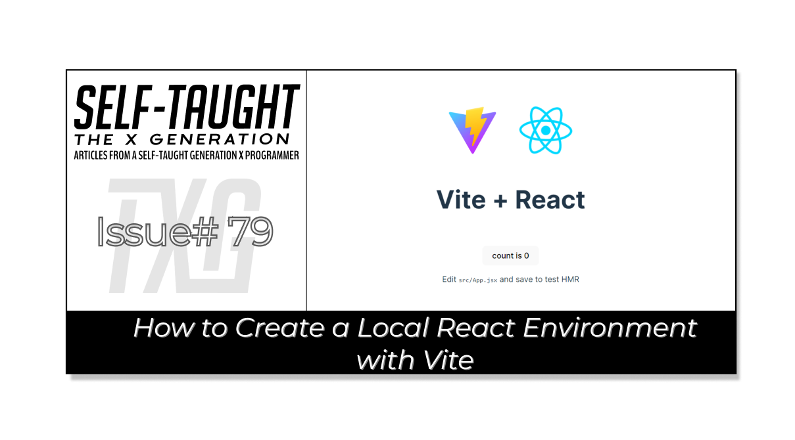
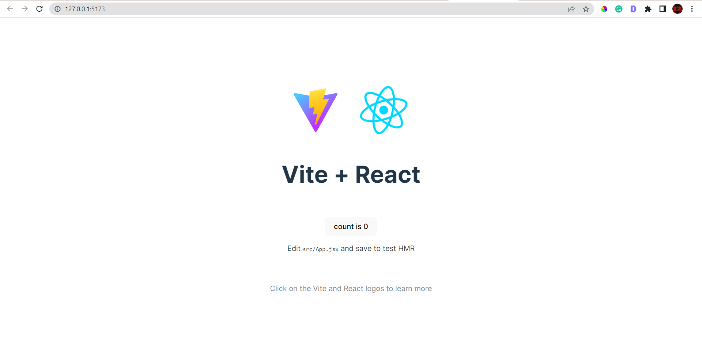

#### You've worked hard to learn JavaScript. Are you now ready to start learning React? This article teaches how to create a local environment using Vite, providing a practical approach to practicing React!

---



---

### Introduction
(WRITE ARTICLE SECTION)

---

### What is Vite?
Vite is a build tool and development server that is designed to be fast and efficient. It is commonly used for developing modern web applications with frameworks like React, Vue, and Svelte. 

Vite provides a quick and easy way to create a local development environment, allowing developers to test and experiment with their code in a safe and controlled setting. 

With Vite, developers can use features like hot module replacement, allowing faster development and testing cycles. Overall, Vite is a powerful tool that can help developers streamline their workflow and improve their productivity.

---

### Prerequisites 
We will use the [VS code editor](https://code.visualstudio.com/) with [Node.js](https://nodejs.org/en/) and [node package manager](https://www.npmjs.com/package/npm) installed to create the local development environment.

#### Command line (bash terminal)
We will then create a Vite project using the command line, selecting JavaScript and React. 

#### (Optional ) Netlify
Finally, we will deploy the React project from the command line to Netlify.

---

### Creating a Vite Project
In VS code, using the bash terminal, type in the following command:
```bash
npm create vite@latest
```

If successful, you will be asked to name the project (the default name is vite-project). 
```
? Project name: vite-project
```

Next, you will be asked to select a framework using the arrow keys. We will select React, pressing the enter key to submit.
```
Select a framework:
     Vanilla
     Vue
     React
     Preact
     Lit
     Svelte
     Others
```

Then you will be asked to select a variant. We will select JavaScript and press the enter key to submit.
```
Select a variant:
     JavaScript
     TypeScript
     JavaScript + SWC
     TypeScript + SWC
```

You will now have a Scaffolding project, and the path will display (mine is C:\Users\larocca\vite-project).

Finally, we are asked to change our directory to our project and then run npm install and npm run dev.
```
Done. Now run:

     cd vite-project
     npm install
     npm run dev
```

After following these instructions, your local React development environment is set!

Hovering over the local address in your bash terminal, use "ctrl + click"  to view the project.
```
  VITE v4.1.4  ready in 495 ms

     ➜  Local:   http://127.0.0.1:5173/
     ➜  Network: use --host to expose
     ➜  press h to show help
```

To edit the project and start your React coding practice, in your VS Code editor:
*  File
*  Open Folder
*  Using the path to the scaffolding project created, choose your project folder (mine is C:\Users\larocca\vite-project)

---



---

### Editing the project
(WRITE ARTICLE SECTION)

---

### Removing the Default Boilerplate
(WRITE ARTICLE SECTION)

---

### Setting up our React environment 
(WRITE ARTICLE SECTION)

---

### Creating simple React components 
(WRITE ARTICLE SECTION)


---

### HOLD
(WRITE ARTICLE SECTION)

---


### Deploy the project using Netlify
(WRITE ARTICLE SECTION)

---

### Conclusion

---

**Let's connect! I'm active on [LinkedIn](https://www.linkedin.com/in/michaeljudelarocca/) and [Twitter](https://twitter.com/MikeJudeLarocca).**

---

###### ***? ? Please share the article and comment!***

*****
Notes: 
You've worked hard to learn JavaScript. Are you now ready to start learning React? One effective approach to practicing React is by establishing a local environment to gain practical experience. This article explores how to create a local environment using Vite!
