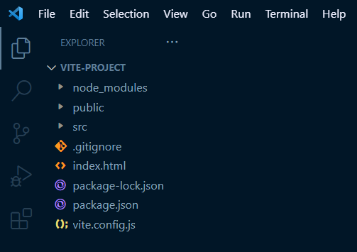
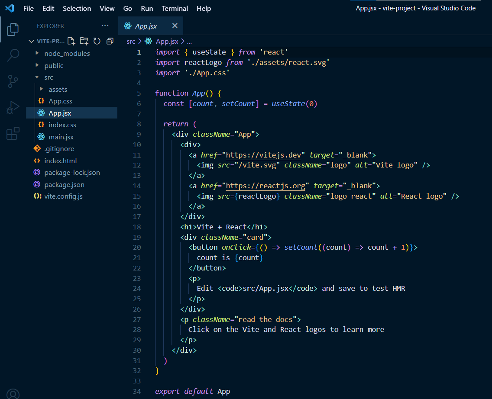
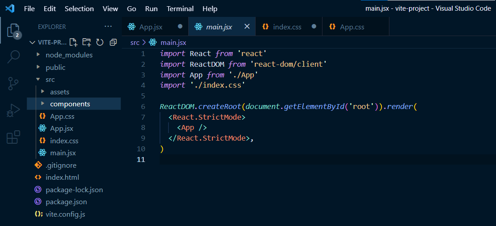

#### You've worked hard to learn JavaScript. Are you now ready to start learning React? This article teaches how to create a local environment using Vite, providing a practical approach to practicing React!

---


---

### Introduction
(WRITE ARTICLE SECTION)

---

### What is Vite?
Vite is a build tool and development server that is designed to be fast and efficient. It is commonly used for developing modern web applications with frameworks like React, Vue, and Svelte. 

Vite provides a quick and easy way to create a local development environment, allowing developers to test and experiment with their code in a safe and controlled setting. 

With Vite, developers can use features like hot module replacement, allowing faster development and testing cycles. Overall, Vite is a powerful tool that can help developers streamline their workflow and improve their productivity.

---

### Prerequisites 
We will use the [VS code editor](https://code.visualstudio.com/) with [Node.js](https://nodejs.org/en/) and [node package manager](https://www.npmjs.com/package/npm) installed to create the local development environment.

#### Command line (bash terminal)
We will then create a Vite project using the command line, selecting JavaScript and React. 

#### (Optional ) Netlify
Finally, we will deploy the React project from the command line to Netlify.

---

### Creating a Vite Project
In VS code, using the bash terminal, type in the following command:
```bash
npm create vite@latest
```

If successful, you will be asked to name the project (the default name is vite-project). 
```
? Project name: vite-project
```

Next, you will be asked to select a framework using the arrow keys. We will select React, pressing the enter key to submit.
```
Select a framework:
     Vanilla
     Vue
     React
     Preact
     Lit
     Svelte
     Others
```

Then you will be asked to select a variant. We will select JavaScript and press the enter key to submit.
```
Select a variant:
     JavaScript
     TypeScript
     JavaScript + SWC
     TypeScript + SWC
```

You will now have a Scaffolding project, and the path will display (mine is C:\Users\larocca\vite-project).

Finally, we are asked to change our directory to our project and then run npm install and npm run dev.
```
Done. Now run:

     cd vite-project
     npm install
     npm run dev
```

After following these instructions, your local React development environment is set!

Hovering over the local address in your bash terminal, use "ctrl + click"  to view the project.
```
  VITE v4.1.4  ready in 495 ms

     ➜  Local:   http://127.0.0.1:5173/
     ➜  Network: use --host to expose
     ➜  press h to show help
```

To edit the project and start your React coding practice, in your VS Code editor:
*  File
*  Open Folder
*  Using the path to the scaffolding project created, choose your project folder (mine is C:\Users\larocca\vite-project)

---


---

### Editing the project
Once you open your project folder, you should see the following files:



We will start by replacing the "Vite + React" text with "Hello World!"

**Navigate to the following file to update:**
* scr
* App.jsx

Now, locate the `<h1>` element ( you can use the find ctrl + f ), and replace the text to say "Hello World!"

Once you have replaced the text, save the project ( ctrl + s ). You will now see your change in the browser! As you make changes in your code, each time you save your work, it will automatically update in the browser (similar to Live Server)



#### Vite terminal shortcuts
Below is a list of Vite shortcuts you can use in the bash terminal. Once you quit the application, use **npm run dev** to start it up again.

```
  Shortcuts
  press r to restart the server
  press u to show server url   
  press o to open in browser   
  press c to clear console     
  press q to quit
```

---

### Removing the Default Boilerplate
**Now that our local React environment is set up, let's look at the default boilerplate and see what we can remove.**

#### App.css and index.css
**What is the difference between App.css and index.css?**

In React, App.css is a file where you can write styles for a specific app component, like a header or footer. 

On the other hand, index.css is used for styles that will affect the whole app, like the background color or font size. 

So, if you want to style a particular component, you can use App.css; if you want to style the entire app, you can use index.css.

***Feel free to remark or delete the content in both the App.css and index.css files.***

#### App.jsx and main.jsx
We will remark or delete the App.jsx file and just use the main.jsx for practicing purposes.

#### React components
We are going to create a few simple React components. The React components we will make are JavaScript functions that return blocks of HTML code. 

We will then import the React components we make into the main.jsx file to render.

---

### Setting up our React environment 
After removing the default boilerplate, we will create a components folder inside of the scr folder.



---

### Creating simple React components 
(WRITE ARTICLE SECTION)


---

### HOLD
(WRITE ARTICLE SECTION)

---


### Deploy the project using Netlify
(WRITE ARTICLE SECTION)

---

### Conclusion

---

**Let's connect! I'm active on [LinkedIn](https://www.linkedin.com/in/michaeljudelarocca/) and [Twitter](https://twitter.com/MikeJudeLarocca).**

---

###### ***? ? Please share the article and comment!***