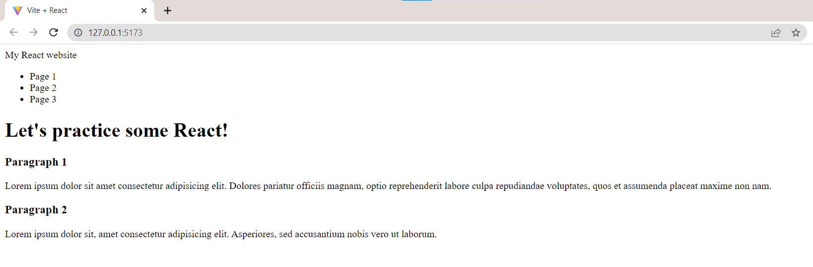
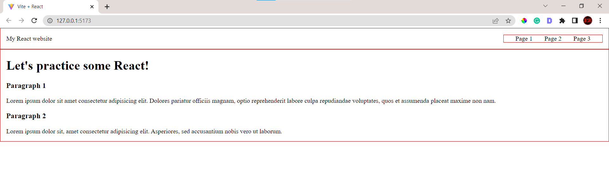
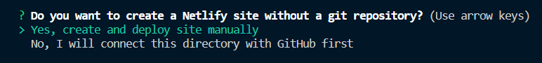
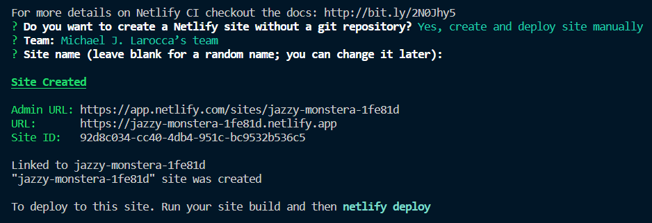
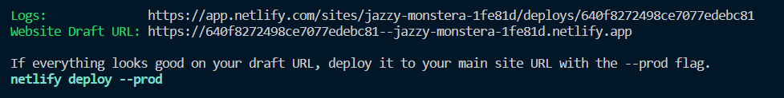
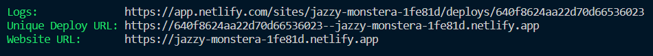

#### You've worked hard to learn JavaScript. Are you now ready to start learning React? This article teaches how to create a local environment using Vite, providing a practical approach to practicing React!

---


---

### Introduction
If you're looking to take your JavaScript skills to the next level, learning React is a great way to go. But where to start? Well, creating a local environment is a practical approach to getting hands-on experience in practicing React! 

In this article, you will learn how to create a local environment using Vite, a build tool and development server that is designed to be fast and efficient. 

**This article covers:**
* Step-by-step instructions on how to create a Vite project 
* Removing the default boilerplate
* Creating simple React components
* Adding basic CSS styling. 
* Deploying the project with Netlify ( optional )

By the end of this tutorial, you will have a solid understanding of creating a local React environment using Vite!

---

### What is Vite?
Vite is a build tool and development server that is designed to be fast and efficient. It is commonly used for developing modern web applications with frameworks like React, Vue, and Svelte. 

Vite provides a quick and easy way to create a local development environment, allowing developers to test and experiment with their code in a safe and controlled setting. 

With Vite, developers can use features like hot module replacement, allowing faster development and testing cycles. Overall, Vite is a powerful tool that can help developers streamline their workflow and improve their productivity.

---

### Prerequisites 
We will use the [VS code editor](https://code.visualstudio.com/) with [Node.js](https://nodejs.org/en/) and [node package manager](https://www.npmjs.com/package/npm) installed to create the local development environment.

#### Command line (bash terminal)
We will then create a Vite project using the command line, selecting JavaScript and React. 

#### (Optional ) Netlify
Finally, we will deploy the React project from the command line to Netlify.

---

### Creating a Vite Project
In VS code, using the bash terminal, type in the following command:
```bash
npm create vite@latest
```

If successful, you will be asked to name the project (the default name is vite-project). 
```
? Project name: vite-project
```

Next, you will be asked to select a framework using the arrow keys. We will select React, pressing the enter key to submit.
```
Select a framework:
     Vanilla
     Vue
     React
     Preact
     Lit
     Svelte
     Others
```

Then you will be asked to select a variant. We will select JavaScript and press the enter key to submit.
```
Select a variant:
     JavaScript
     TypeScript
     JavaScript + SWC
     TypeScript + SWC
```

You will now have a Scaffolding project, and the path will display (mine is C:\Users\larocca\vite-project).

Finally, we are asked to change our directory to our project and then run npm install and npm run dev.
```
Done. Now run:

     cd vite-project
     npm install
     npm run dev
```

After following these instructions, your local React development environment is set!

Hovering over the local address in your bash terminal, use "ctrl + click"  to view the project.
```
  VITE v4.1.4  ready in 495 ms

     ➜  Local:   http://127.0.0.1:5173/
     ➜  Network: use --host to expose
     ➜  press h to show help
```

To edit the project and start your React coding practice, in your VS Code editor:
*  File
*  Open Folder
*  Using the path to the scaffolding project created, choose your project folder (mine is C:\Users\larocca\vite-project)

---


---

### Editing the project
Once you open your project folder, you should see the following files:


We will start by replacing the "Vite + React" text with "Hello World!"

**Navigate to the following file to update:**
* scr
* App.jsx

Now, locate the `<h1>` element ( you can use the find ctrl + f ), and replace the text to say "Hello World!"

Once you have replaced the text, save the project ( ctrl + s ). You will now see your change in the browser! As you make changes in your code, each time you save your work, it will automatically update in the browser (similar to Live Server)


#### Vite terminal shortcuts
Below is a list of Vite shortcuts you can use in the bash terminal. Once you quit the application, use **npm run dev** to start it up again.

```
  Shortcuts
  press r to restart the server
  press u to show server url   
  press o to open in browser   
  press c to clear console     
  press q to quit
```

---

### Removing the Default Boilerplate
**Now that our local React environment is set up, let's look at the default boilerplate and see what we can remove.**

#### App.css and index.css
**What is the difference between App.css and index.css?**

In React, App.css is a file where you can write styles for a specific app component, like a header or footer. 

On the other hand, index.css is used for styles that will affect the whole app, like the background color or font size. 

So, if you want to style a particular component, you can use App.css; if you want to style the entire app, you can use index.css.

***Feel free to remark or delete the content in both the App.css and index.css files.***

Then, in the index.css, we will add the following formatting code:
```css
body {
  box-sizing: border-box;
  margin: 0;
  padding: 0;
}
```

#### App.jsx and main.jsx
In the App.jsx file, we will delete some of the code in the App function. 

The App.jsx file should now look like this:
```javascript
import './App.css'

function App() {

  return (
    <div className="App">

    </div>
  )
}

export default App

```

#### React components
We are going to create a few simple React components. The React components we will make are JavaScript functions that return blocks of HTML code. 

We will then import the React components we make into the main.jsx file to render.

---

### Setting up our React environment 
After removing the default boilerplate, we will create a components folder inside of the src folder.


---

### Creating simple React components 
Now we will make two simple React components, a navigation bar, and a main section.

The syntax may seem a little odd at first( it did to me ), but the concept of the code is quite simple. We are breaking up the website page into parts and writing the HTML code in JavaScript. 

#### Navbar
We create a new jsx file titled "Navbar" in the components folder. Then we write a function named Navbar that retunes a block of HTML code. Finally, we include JavaScript code to report the function.
```javascript
export default function Navbar() {
    return (
            <nav>
                <div>My React website</div>
                <ul>
                    <li>Page 1</li>
                    <li>Page 2</li>
                    <li>Page 3</li>
                </ul>
            </nav>
    )
}
```

#### Main
In a similar manner to the Navbar function we wrote, we will:
* We create a new jsx file titled "Main" in the components folder
* Then we write a function named Main that retunes a block of HTML code
*  Include JavaScript code to report the function
```javascript
export default function Main() {
    return (
            <main>
                <h1>Let's practice some React!</h1>
                <h3>Paragraph 1</h3>
                <p>Lorem ipsum dolor sit amet consectetur adipisicing elit. Dolores pariatur officiis magnam, optio reprehenderit labore culpa repudiandae voluptates, quos et assumenda placeat maxime non nam.</p>
                <h3>Paragraph 2</h3>
                <p>Lorem ipsum dolor sit, amet consectetur adipisicing elit. Asperiores, sed accusantium nobis vero ut laborum.</p>
            </main>
    )
}
```

---

### App.jsx
In the App.jsx file, we will first import the React components we created by adding the following code to the file:
```javascript
import './App.css'
import Navbar from './components/Navbar'
import Main from './components/Main'
```

#### App function
We will now write an App function that will return the Navbar and Main components. Take notice of the syntax. The components are written in the functions as custom-named HTML elements with capital letters. 
```javascript
function App() {

  return (
    <div className="App">
      <Navbar />
      <Main />
    </div>
  )
}

export default App
```

*Since App.jsx already includes the "export default App" at the bottom of the file, we can exclude it from the beginning of the function.*

---

### main.jsx
The boilerplate code in the main jsx file already includes everything needed. It includes all of the necessary imports and then renders our created App function to the webpage.
```javascript
import React from 'react'
import ReactDOM from 'react-dom/client'
import App from './App'
import './index.css'

ReactDOM.createRoot(document.getElementById('root')).render(
  <React.StrictMode>
    <App />
  </React.StrictMode>,
)

```

***The rendered webpage should look like the following:***



---

### Basic CSS styling
Now let's add some basic CSS styling.

We already added the following code to the index.css:
```css
 body {
  box-sizing: border-box;
  margin: 0;
  padding: 0;
}
```

Now let's add the following basic CSS styling to the App CSS file:
```css
nav, nav ul {
  border: 1px solid red;
  display: flex;
  justify-content: space-between;
  align-items: center;
  padding: 0 15px;
}

nav li {
  list-style-type:none;
  margin: 0 15px;
}

nav li:hover {
  color: lightgreen;
  cursor: pointer;
}

main {
  border: 1px solid red;
  padding: 0 15px;
}
```

***After the CSS styling, the rendered webpage should look like the following:***



***Note:*** *The red border color is added for visual HTML element purposes. Feel free to remake or delete them.*

---

### Congratulations!
You have now successfully created a local environment using Vite to practice React coding!

---

### Deploy the project using Netlify ( optional )
On the Vite website, I used the "[deploying a static website guide](https://v2.vitejs.dev/guide/static-deploy.html#netlify)" instructions to deploy my practice React website using Netlify.


 In just a few steps, you can deploy your practice website:

**Netlify**
1. Install the Netlify CLI.
2. Create a new site using ntl init.
3. Deploy using ntl deploy.

**Note:** *To simplify, we will choose to create and deploy the site manually.*


```
# Install the Netlify CLI
$ npm install -g netlify-cli

# Create a new site in Netlify
$ ntl init
```

***Your command line should look similar to this:***



Now we are told first to run our build command:
```
$ npm run build
``` 

We can now preview our site by running ntl deploy. 

***Note:*** *Choose dist for the publish directory.*

```
# Deploy to a unique preview URL
$ ntl deploy
```

Once your deploy is live, preview it using "ctrl + click" while hovering over the website draft URL.



The Netlify CLI will share with you a preview URL to inspect. When you are ready to go into production, use the prod flag.

***Note:*** *Choose dist for the publish directory.*

```
# Deploy the site into production
$ ntl deploy --prod
```

Your site is now deployed! Your terminal should look similar to the screenshot below.  You can navigate to your website by using "ctrl + click" while hovering over the website URL.



---

### Conclusion
Creating a local React environment using Vite is a practical way to get hands-on experience with React and improve your skills. By following the step-by-step instructions in this tutorial article, you can easily create a Vite project, remove the default boilerplate, create simple React components, and add basic CSS styling.

This tutorial article also offers optional instructions on deploying your project using Netlify, enabling you to share your learning React progress with others!

---

**Let's connect! I'm active on [LinkedIn](https://www.linkedin.com/in/michaeljudelarocca/) and [Twitter](https://twitter.com/MikeJudeLarocca).**

---
(WRITE ARTICLE SECTION)
###### ***? ? Please share the article and comment!***