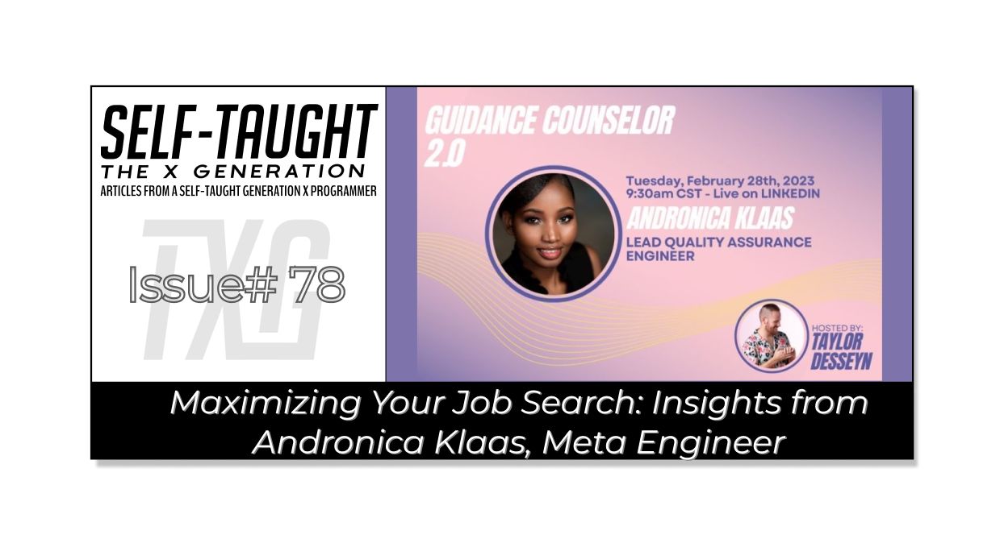
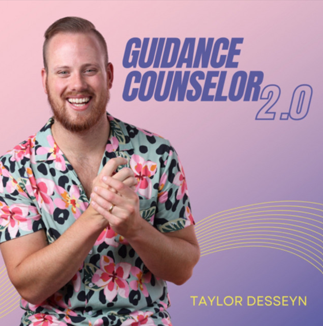

#### Want to maximize your chances of landing a job in the tech industry? In this article, Andronica Klaas from Meta shares insights on how you can land a job on Taylor Desseyn's Guidance Counselor 2.0!

---

---

### Introduction
Are you searching for a job in the tech industry? Would you like guidance to help you navigate the complexities of the job search? Look no further than Taylor Desseyn's Guidance Counselor 2.0! 

In this Livestream series, Taylor invites top industry experts to share their insights and answer your questions. Many attendees have found mentors, new jobs, and valuable connections through these events!

In this Guidance Counselor 2.0 Livestream, Andronica Klaas, a meta engineer who has successfully navigated the job search process, shares tips and tricks on how we can enter the tech industry job force!

---

### Guidance Counselor 2.0
Taylor brings to our attention that although we had access to guidance counselors in school, as working adults, we no longer have this valuable resource available to us.

With his show Guidance Counselor 2.0, he intends to fulfill this need, providing us with a FREE valuable resource by bringing in the best and brightest industry experts for Livestream events, which gives us a chance to learn from them and to have our questions answered!

---

### Andronica Klaas
(WRITE ARTICLE SECTION)

---

### Alternatives to web developers
Did you know that the tech industry offers a wide range of job roles beyond the commonly known position of Front-End Web Developer?

Andronica suggests that we match our strengths and interests with the job role requirements to determine the career path we should take. For example, Andronica found her calling in Q&A.

**Other alternatives to web developers include:**
* Quality Assurance (QA)
* Business Analysis (BA)
* Project Management (PM)
* Data Analysis
* User Experience (UX) Design
* Technical Writing 
* Cybersecurity

Identifying which job role aligns with our strengths and interests early on can greatly assist us in navigating our career and job search, ultimately helping us to land our first job in tech!

---

### Tailor your resume
To increase your chances of landing the job, it's important to tailor your resume to the job description. Look closely at the requirements and customize your resume to show how you meet them.

If you don't meet all the requirements, don't worry! This method is an excellent way to help you identify the skills you need to learn to become eligible for the job.

Andronica also recommends seeking help from various sources to improve your resume, such as your school, online tools, paid services, and even recruiters like Taylor Desse! Don't be afraid to ask for feedback and suggestions to make your resume stand out.

---

***Tip:*** *Know your current market value! Andronica informs us that when we are employed by the same company, we will only receive standard percentage raises as time passes, even though we may be worth much more!*

---

### Internships
Andronica explains to us that internships are a valuable opportunity to gain insight into a company's culture and determine if it's a good fit for us. 

**They also provide a chance to develop skills not taught in schools or coding boot camps, such as:**
* Soft skills
* Working with management
* Collaborating with coworkers

Taking on internship roles lets us preview the job and understand the skills required to succeed and advance in the field. Overall, internships are a great way for us to gain practical experience and set ourselves up for success in our future careers.

---

### Networking
When it comes to networking, Andronica explains that networking it's important to know your intentions before you start. 

**Your intentions may include**
* Seeking a sponsor
* Seeking a mentor
* Enlarging your community
* Or other purposes
 
***Knowing your intentions will help you develop a targeted strategy for initiating conversations with others and making the most of your networking opportunities.***

Another important point that Andronica emphasizes is that networking is not all about you! It's important to understand what you can offer others, not just what they can offer you. Networking is a mutually two-way street, and building relationships requires giving as well as receiving. To maximize your networking opportunities, build genuine connections with others and find ways to add value to their lives and careers. 

---

### Personal branding
Personal branding is not exclusive to the famous!  Andronica implores the importance of personal branding for job seekers and how we can achieve it.

Creating a personal brand for yourself is important as it can provide others with knowledge and proof of your skills and capabilities before they meet you. It can also make you recognizable, providing others with a  more comfortable way to initiate networking with you.

**You can develop your personal brand by:**
* Learning in public
* Sharing your journey on social networks
* Becoming a content creator 

A good method of building a personal brand is consistency, not only with content creation methods. For example, when Andronica attends conferences, she dresses fashionably, making her recognizable!

***You may find my following related article helpful: [The Importance of Learning in Public](https://selftaughttxg.com/2021/08-21/TheImportanceOfLearningInPublic/)***

---

### Conferences
Before attending a conference, Andronica advises us to familiarize ourselves with all the speakers beforehand. With this tactic, if we get an opportunity to meet them personally, it portrays that you are genuinely interested in them. 

Another great piece of advice Andronica provides is to have a list of predetermined questions, making it easier for us to start and maintain conversations.

**List of questions may include**
* Ask others how they got hired/role
* If you were my age, what would you do differently
* If you were my age, what advice what you give

When conversing with others, be attentive! Listen to what others have to say with curiosity, and be flexible in allowing the conversation to lead itself. Through experience, Andronica has learned that people like to talk about themselves, so keep that in mind to help you to keep the  conversations going!

Networking can be intimidating, and it's important to accept that there may be some successes and some setbacks along the way. However, Andronica emphasizes the importance of persevering and continuing to network while also reflecting on ways to improve. 

**One of the best ways to improve is by reaching out to others frequently:**
* In-person at events
* On Twitter
* On LinkedIn
* Other social networks

*You may find my following article helpful: 🔗 [Amazing Conferences for Developers in 2023](https://selftaughttxg.com/2023/01-23/amazing-conferences-for-developers-in-2023/)*

---

### Twitter
TS-21:50
TS-23:20
(WRITE ARTICLE SECTION)

---

### LinkedIn
TS-22:00 
(WRITE ARTICLE SECTION)

---

### Always have recruiter relationships
TS-27:00 
(WRITE ARTICLE SECTION)

---
My other Taylor Desseyn articles
(WRITE ARTICLE SECTION)

🔗 [Taylor Desseyn on leveraging recruiters to land a job in tech](https://selftaughttxg.com/2021/09-21/TaylorDesseyn-LeveragingRecruiters/)

---

### Andronica's links
(WRITE ARTICLE SECTION)

---
Taylor's links
(WRITE ARTICLE SECTION)

* 🔗 [Website](https://www.taylordesseyn.com/)
* 🔗 [LinkedIn](https://www.linkedin.com/in/taylordesseyn)
* 🔗 [Twitter](https://twitter.com/tdesseyn)
* 🔗 [Instagram](http://instagram.com/guidancecounselor2.0)
* 🔗 [YouTube](https://www.youtube.com/@TaylorDesseyn/)

---

### Conclusion
(WRITE ARTICLE SECTION)

---

**Let's connect! I'm active on [LinkedIn](https://www.linkedin.com/in/michaeljudelarocca/) and [Twitter](https://twitter.com/MikeJudeLarocca).**

---

###### ***? ? Please share the article and comment!***

*****