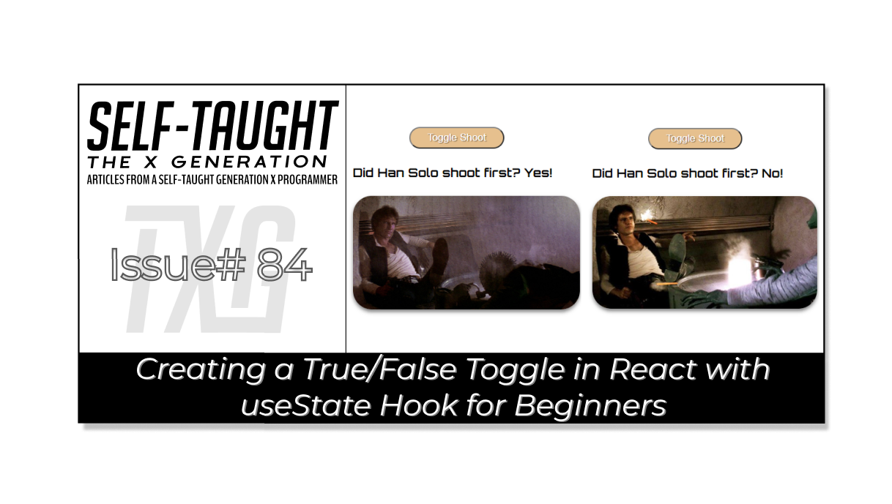
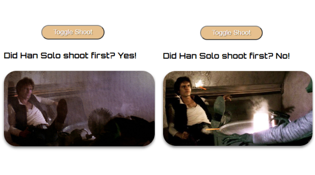

#### HOLD

---



---

### Introduction
(WRITE ARTICLE SECTION)


#### Finished project links
* 🔗 [Link to the GitHub repo](https://github.com/MichaelLarocca/react-hooks-solo)
* 🔗 [Link to the deployed Netlify project](https://react-hooks-solo.netlify.app/)
---

### What are React hooks?
React hooks are a way to add functionality to functional components in React. They allow you to perform side effects, use state, and more. 

*In React, performing side effects means executing code that interacts with the outside world, such as fetching data from an API, manipulating the DOM, or setting a timer. Side effects are typically performed in React using the useEffect hook.*

One of the most commonly used hooks is the **useState** hook, which allows you to add state to functional components. 

---

### The useState hook 
The **useState** hook is used to declare a state variable and its initial value. You can then use this state variable in your component, and whenever the state updates, React will automatically re-render the component with the new state.

The **useState** hook returns an array with two values: the current state value and a state updater function to update that value. By using the **useState** hook, you can manage state changes in a way that's easy to understand and debug.

---

#### Importing and calling the useState hook
To import the useState hook for a component in React, you need to include it at the top of your file as follows:
```javascript
import React, { useState } from 'react';

// Once imported, we can set the state as follows
const [count, setCount] = useState(0);
```

Another way to use React state is by calling the useState function directly from the React object. This syntax is less commonly used than the useState hook but can be useful in certain situations.

```javascript
import React from 'react';

//If not imported, we can set the state as follows
const [count, setCount] = React.useState(0);
```

---

### Understanding the syntax 
This code below creates a variable called **count** that represents the current state value and a function called **setCount** that is used to update that value. The **useState** function is used to add state to a functional component, and the **0** inside the parentheses is the initial value of count. So, whenever **setCount** is called with a new value, React will automatically update the count variable and re-render the component with the new state.

```javascript
const [count, setCount] = useState(0);
```

---

### React useState true or false component
We are now going to step through creating a React component called **HanSolo** that toggles state between true and false values. The overall goal is to display a picture, the current state value, and a corresponding paragraph.

First, we will import the React useState hook by including `{ useState }` to the top of the Han Solo component as follows: 
```javascript
import React, { useState } from 'react';
```

#### Component function
Next, we will create a **HanSolo** component function. As described earlier, we will create a state variable called **didHanSoloShootFirst**, name the state updater function **setDidHanSoloShootFirst**, and set the initial value to **true** (because Han shot first!).

```javascript
function HanSolo() {
  const [didHanSoloShootFirst, setDidHanSoloShootFirst] = useState(true);
}
``` 

#### Toggle function
Inside the **HanSolo** component function, we are now going to create another function that toggles the true and false value of the **didHanSoloShootFirst** state variable. *I am intentionally writing this code the long way, as an if/else if statement,  so it is very clear to understand.*  

**If the current state variable is equal to true, we use the state updater function to set it to false.**

**If the current state variable is equal to false, we use the state updater function to set it to true.**

```javascript
  function toggleDidHanSoloShootFirst() {
    if(didHanSoloShootFirst === true) {
        setDidHanSoloShootFirst(false);
    } else if (didHanSoloShootFirst === false) {
        setDidHanSoloShootFirst(true);
    }
  }
```

#### HTML Button
Now that we've created a function to toggle the state value of the component, we'll return a **div** element that includes a button. This button will use an **onClick** event listener to call the toggle function and update the component's state.

```javascript
  return (
    <div className='container'>
      <button onClick={toggleDidHanSoloShootFirst}>Toggle Shoot</button>    
    </div>
  );
```

#### Add an HTML element 
Next, we will add an `<h4>` element that displays a sentence that includes the component's current state. The syntax might seem a little weird at first (It's easier to understand it if you relate it to JavaScript template literals). 

In the code below, everything between the curly braces is JavaScript. The code is a simple ternary operator that returns the string "Yes!" if the state variable is true and returns the string "No!" if the state variable is false.

```html
<h4>Did Han Solo shoot first? {didHanSoloShootFirst ? "Yes!" : "No!"}</h4>   
```

The final result will return the following text for a state variable equal to **true**:
```
Did Han Solo shoot first? Yes!
``` 

The final result will return the following text for a state variable equal to **false**:
```
Did Han Solo shoot first? No!
```

Now we will add the `<h4>` element to the return `div`.

```javascript
  return (
    <div className='container'>
      <button onClick={toggleDidHanSoloShootFirst}>Toggle Shoot</button>  
      <h4>Did Han Solo shoot first? {didHanSoloShootFirst ? "Yes!" : "No!"}</h4>   
    </div>
  );
```

#### Adding the images
At the top of the component JSX file, we will import two pictures and set them to variables as follows:

```javascript
import React, { useState } from 'react';
import HanShotFirst from '../img/HanShotFirst.jpg'
import HanShotSecond from '../img/HanShotSecond.jpg'
```

Once we have imported the image files, we can once again use a JavaScript ternary operator to check the current state value of the **didHanSoloShootFirst** variable. If the current state value is true, we set the image source to the **HanShotFirst**.  If the current state value is false, we set the image source to the **HanShotSecond** variable. 

```javascript

```

We will now include the HTML image element in the return div as follows:
```javascript
  return (
    <div className='container'>
      <button onClick={toggleDidHanSoloShootFirst}>Toggle Shoot</button>  
      <h4>Did Han Solo shoot first? {didHanSoloShootFirst ? "Yes!" : "No!"}</h4>
         
    </div>
  );
```



#### True and false paragraphs
Finally, we will create two string variables to include in an HTML paragraph element; one paragraph for a true state value and the other for a false state value.

```javascript
const paragraphHanShotFirst = "In the original 1977 release of Star Wars Episode IV: A New Hope, the cantina scene shows Han Solo shooting Greedo, a bounty hunter, first. This scene has sparked controversy among fans, as it depicts Han Solo as a more ruthless and morally ambiguous character. Some fans argue that this version of the scene accurately reflects Han Solo's character, while others believe that it contradicts his later development as a hero.";

const paragraphHanShotSecond = "The cantina scene in Star Wars Episode IV underwent changes in the 1997 re-release by George Lucas, including having Greedo shoot first and miss before Han Solo fires back. This version of the scene also generated controversy, with some fans arguing that it portrays Han Solo as less morally ambiguous and more of a traditional hero. Others believe that the change was unnecessary and that the original scene should have been left intact.";
```

**Note:** *Since the content of the paragraphs doesn't change based on user interaction or other events, you can simply set them as regular string const variables. You don't need to create state variables for each paragraph.*

We will now conclude this component by adding an HTML paragraph element that uses a JavaScript ternary operator to check the current state value and return the proper corresponding text string as follows:  

```html
<p>{didHanSoloShootFirst ? paragraphHanShotFirst : paragraphHanShotSecond}</p>
```

---

### The finished component

```javascript
import React, { useState } from 'react';
import HanShotFirst from '../img/HanShotFirst.jpg'
import HanShotSecond from '../img/HanShotSecond.jpg'

function HanSolo() {
  const [didHanSoloShootFirst, setDidHanSoloShootFirst] = useState(true);
  const paragraphHanShotFirst = "In the original 1977 release of Star Wars Episode IV: A New Hope, the cantina scene shows Han Solo shooting Greedo, a bounty hunter, first. This scene has sparked controversy among fans, as it depicts Han Solo as a more ruthless and morally ambiguous character. Some fans argue that this version of the scene accurately reflects Han Solo's character, while others believe that it contradicts his later development as a hero.";
  const paragraphHanShotSecond = "The cantina scene in Star Wars Episode IV underwent changes in the 1997 re-release by George Lucas, including having Greedo shoot first and miss before Han Solo fires back. This version of the scene also generated controversy, with some fans arguing that it portrays Han Solo as less morally ambiguous and more of a traditional hero. Others believe that the change was unnecessary and that the original scene should have been left intact.";
  
  function toggleDidHanSoloShootFirst() {
    if(didHanSoloShootFirst === true) {
        setDidHanSoloShootFirst(false);
    } else if (didHanSoloShootFirst === false) {
        setDidHanSoloShootFirst(true);
    }
  }

  return (
    <div className='container'>
      <button onClick={toggleDidHanSoloShootFirst}>Toggle Shoot</button>  
      <h4>Did Han Solo shoot first? {didHanSoloShootFirst ? "Yes!" : "No!"}</h4>
      
      <p>{didHanSoloShootFirst ? paragraphHanShotFirst : paragraphHanShotSecond}</p>
    </div>
  );
}

export default HanSolo;
```

---
#### **If you would like to learn how to set up a local React development environment, I wrote the following two beginner-friendly articles:** 
* [Create a React Project, Push It to GitHub, and Deploy With Netlify, From the Command Line](https://selftaughttxg.com/2023/03-23/create-a-react-project-push-it-to-github-and-deploy-with-netlify-from-the-command-line/)
* [How to Create a Local React Environment with Vite](https://selftaughttxg.com/2023/03-23/how-to-create-a-local-react-environment-with-vite/)

---

### Conclusion
The useState hook is a powerful tool in React that allows you to easily manage and update state in your functional components. By using the useState hook, you can add state to your components, and React will automatically re-render the component with the new state. 

The HanSolo component example demonstrates how to create a true/false toggle using the React useState hook. 

By practicing and exploring the possibilities of the useState hook, you can enhance the functionality of your React applications and take your React skills to the next level.

---

**Let's connect! I'm active on [LinkedIn](https://www.linkedin.com/in/michaeljudelarocca/) and [Twitter](https://twitter.com/MikeJudeLarocca).**

---

###### ***? ? Please share the article and comment!***