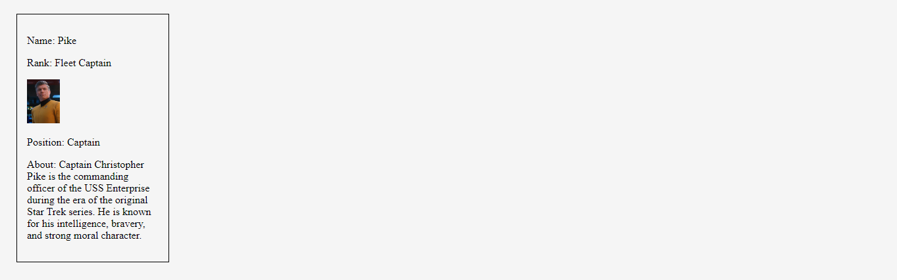

#### After learning JavaScript, getting started with the React environment can feel like a strange new world. In this article, we learn about passing data by using props and making Star Trek card components!

---


---

### Introduction
This article aims to be a beginner-friendly tutorial for JavaScript developers who are new to React and focuses primarily on React props.

**To provide hands-on experience, we will create Star Trek-themed card components in three steps:**
1. Create a hard-coded card component
2. Create a card component that takes data (props) as an argument
3. Use the JavaScript map method to create multiple card components using data from an array
    
***Note:*** *We will be focusing on learning React code, not CSS. However, feel free to clone the project or copy the CSS code.*

---

### The React environment
After learning JavaScript, transitioning to React can feel like a strange new world. The way we learned how to build a web page changes from coding out the whole web page's structure in the HTML file to creating separate components for each part of the web page and then assembling them to form the web page instead.

**If you would like to learn how to set up a local React development environment, I wrote the following two beginner-friendly articles:**

* [Create a React Project, Push It to GitHub, and Deploy With Netlify, From the Command Line](https://selftaughttxg.com/2023/03-23/create-a-react-project-push-it-to-github-and-deploy-with-netlify-from-the-command-line/)
    
* [How to Create a Local React Environment with Vite](https://selftaughttxg.com/2023/03-23/how-to-create-a-local-react-environment-with-vite/)
    

---

### What are React props?
React props, short for properties, are a way to pass data from one component to another in React. They allow you to customize and configure a component based on the data that you pass in. Think of props as arguments that you pass to a function.

To use props in a React component, you simply pass them as attributes to the component when you render it. For example, if you have a component that displays a user's name, you can pass the name as a prop like this: `<User name="Kirk" />`. Inside the User component, you can access the name prop using `props.name`.

Using props is a fundamental concept in React, and it is important to understand how to use them effectively. They allow you to create reusable components that can be customized based on the data that you pass in, making your code more modular and easier to maintain.

---

### Prerequisites
As this article's focus is on React props, you should understand the file structure of a simple React project, including how to create components, export and import them, and render them with an App function.

If you don't, no worries. You will still learn the concept of React props in this article, and if you want to learn the React basics mentioned, you can check out these fun project articles I wrote: [Creating a Digital Business Card with React](https://selftaughttxg.com/2023/03-23/creating-a-digital-business-card-with-react/), and [Creating a Travel Journal with React](https://selftaughttxg.com/2023/04-23/creating-a-travel-journal-with-react/).

---

### Hard-coded card component
First, we are going to create a card component with hard-coded values and then learn how to render it.

**The HTML card includes the following information:**
* Name
* Rank
* An Image
* Position
* About
    
*If you forget about React for a moment and think about HTML (everything inside the div), you will more easily understand the overall goal of the following code:*

```javascript
import React from "react";

export default function CardHardCoded() {
	return (
		<div className="card">
			<p>Name: Pike</p>
			<p>Rank: Fleet Captain</p>
			
			<p>Position: Captain</p>
			<p>
				About: Captain Christopher Pike is the commanding officer of the USS
				Enterprise during the era of the original Star Trek series. He is known
				for his intelligence, bravery, and strong moral character.
			</p>
		</div>
	);
}
```

To render the CardHardCoded card component, we import it into the App. jsx file and then add it to the App function as follows:

```javascript
import "./HardCodedCard.css";
import CardHardCoded from "../src/components/CardHardCoded";

function App() {
	return (
			<main className="ctn-main">
				<CardHardCoded />
			</main>
	);
}

export default App;
```

Since all the values are hard-coded in this component, we only have to add `<CardHardCoded />` to render it.

By adding the following simple styling, the CardHardCoded card component should look similar to the screenshot below.
```css
img {
	width: 50px;
}

.ctn-main {
	display: flex;
}

.card {
	border: 1px solid black;
	color: black;
	width: 200px;
	margin: 25px;
	padding: 15px;
}
```



However, as you may have already noticed, with this method, we would have to write a separate component for each Star Trek character.

In the next section, we will create a new reusable component that takes in key-value pairs as variables in the form of React props.

---

***Tip:*** *In React, we can use curly braces to write JavaScript code within the JSX syntax. This can help us dynamically render content based on JavaScript expressions or variables.*

---

### Create a card component that takes props
In a JavaScript function, we can pass in arguments as a parameter. Similarly, we can also pass in arguments as a parameter in a React component. In React, these arguments are called props, short for properties.

Modifying the first card we made, we will now create a new Card component that takes in **props** as an argument. We will retrieve the values passed in by using the props key, as demonstrated in the JSX syntax below:

```javascript
import React from "react";

export default function Card(props) {
	return (
		<div className="card">
			<p>Name: {props.name}</p>
			<p>Rank: {props.rank}</p>
			
			<p>Position: {props.position}</p>
			<p>About: {props.about}</p>
		</div>
	);
}
```

Since we are now taking props as an argument, we can now pass in values by adding them to the new Card component `<Card />` as follows:

```html
				<Card
					src="../src/img/Pike.png"
					name="Pike"
					rank="Fleet Captain"
					position="Captain"
					about="Captain Christopher Pike is the commanding officer of the USS
					Enterprise during the era of the original Star Trek series. He is known
					for his intelligence, bravery, and strong moral character."
				/>
```

Now that we created a React component card that accepts props as an argument, we can easily add new Star Trek characters to the App function by passing in unique values to each instance of the rendered component card as follows:

```javascript
import "./HardCodedCard.css";
import Card from "../src/components/";

function App() {
	return (
		<main className="ctn-main">
			<Card
				src="../src/img/Pike.png"
				name="Pike"
				rank="Fleet Captain"
				position="Captain"
				about="Captain Christopher Pike is the commanding officer of the USS
					Enterprise during the era of the original Star Trek series. He is known
					for his intelligence, bravery, and strong moral character."
			/>
			<Card
				src="../src/img/Spock.png"
				name="Spock"
				rank="Science Officer"
				position="Commander"
				about="Spock is a half-human, half-Vulcan officer serving aboard the USS Enterprise. He is known for his logical and unemotional approach to problem-solving, as well as his close friendship with Captain Kirk."
			/>
			<Card
				src="../src/img/ChristineChapel.png"
				name="Christine Chapel"
				rank="Fleet Captain"
				position="Head Nurse"
				about="Christine Chapel is a nurse serving aboard the USS Enterprise. She is known for her dedication to her patients and her unrequited love for Mr. Spock."
			/>
		</main>
	);
}

export default App;

```


---

### Use the JavaScript map method to create multiple card components
Now here is the cool part. Instead of manually typing in unique key-value pair variables to each instance of a card component, alternatively, we can use the JavaScript map method on an array of objects that holds the data we want to create multiple card components!

To achieve this, we will now create a new file called data.jsx and then add our array of objects to export.

*Please note, for the image files to work correctly in both the dev environment and the build, you will need to first import them and set them to variables. Then use the corresponding variables in the object, as shown below.*

**Here is the data.jsx file:**
```javascript
import imgPike from "../src/img/Pike.png";
import imgSpock from "../src/img/Spock.png";
import imgChristineChapel from "../src/img/ChristineChapel.png";
import imgSingh from "../src/img/La-anNoonien-Singh.png";

export default [
	{
		key: 0,
		src: imgPike,
		name: "Christopher Pike",
		position: "Captain",
		rank: "Fleet Captain",
		about:
			"Captain Christopher Pike is the commanding officer of the USS Enterprise during the era of the original Star Trek series. He is known for his intelligence, bravery, and strong moral character.",
	},
	{
		key: 1,
		src: imgSpock,
		name: "Spock",
		position: "Science Officer",
		rank: "Commander",
		about:
			"Spock is a half-human, half-Vulcan officer serving aboard the USS Enterprise. He is known for his logical and unemotional approach to problem-solving, as well as his close friendship with Captain Kirk.",
	},
	{
		key: 2,
		src: imgChristineChapel,
		name: "Christine Chapel",
		position: "Head Nurse",
		rank: "Lieutenant",
		about:
			"Christine Chapel is a nurse serving aboard the USS Enterprise. She is known for her dedication to her patients and her unrequited love for Mr. Spock.",
	},
	{
		key: 3,
		src: imgSingh,
		name: "La'an Noonien-Singh",
		position: "Security Officer",
		rank: "Lieutenant",
		about:
			"La'an Noonien-Singh is a genetically engineered human serving aboard the USS Enterprise. She is known for her enhanced physical abilities and her struggle to come to terms with her own identity.",
	},
];
```

***Note:*** *Adding unique key values (key:0, key:1, key:2, key:3) to components in React is important for performance and avoiding errors. Keys help React identify which items have changed, been added, or been removed in a list of components. Not including keys can lead to slow and inefficient behavior, and React may not be able to distinguish between components with the same name.*

Now, on the App.jsx file, we import the array of objects from the data.jsx file and save it to a variable named **characters**.

In the App function, we use the JavaScript map method  
to create a card component for each character in the array of objects and set it to a constant variable named **cards**.

Finally, we render all of the cards created by simply adding them with this one line of code to the App function`{cards}`.

Below is the completed code for the App.jsx file:
```javascript
import "./HardCodedCard.css";
import Card from "../src/components/";
import characters from "./data.jsx";

function App() {
	const cards = characters.map((character) => {
		return (
			<Card
				key={character.key}
				src={character.src}
				name={character.name}
				rank={character.rank}
				position={character.position}
				about={character.about}
			/>
		);
	});

	return (
			<main className="ctn-main">
				{cards}
			</main>
	);
}

export default App;
```

**Now, to add additional Star Trek characters, we simply add them to the object array in the data.jsx file, along with adding their corresponding photo to the image file.**


--- 

### The finished project
**Here are the links to the finished project:**
* 🔗 [GitHub](https://github.com/MichaelLarocca/strange-new-worlds-project)
* 🔗 [Deployed website](https://strange-new-worlds-project.netlify.app/)


---

### Conclusion
When coming from a JavaScript background, getting started with React can really feel like a strange new world. However, in my experience, wrapping my head around the new website structuring concepts seems to be more difficult than the React syntax itself.

To best learn and grasp the new way of structuring a website, when it comes to React components, I found it helpful to create them in three different ways; hard-coded, passing props as an argument, and using the JavaScript map method.

By practicing the creation of React components, you will gradually become more comfortable with the new website structuring concepts. In time, you will become more confident in your continuing mission of seeking out new frameworks, exploring strange new code, and going boldly where other programmers have gone before! 

---

**Let's connect! I'm active on [LinkedIn](https://www.linkedin.com/in/michaeljudelarocca/) and [Twitter](https://twitter.com/MikeJudeLarocca).**

---

###### ***? ? Please share the article and comment!***