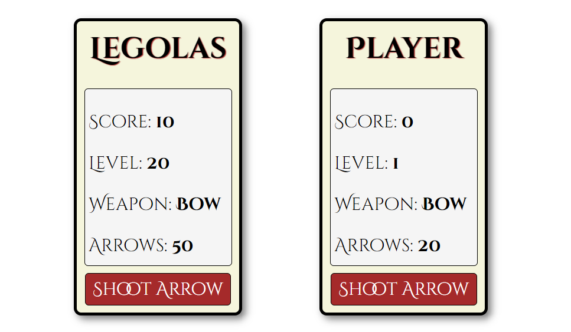

#### This week's article explores the powerful realm of the React useState hook! We create a player component, update specific object properties, and explain how to pass object props to child components!

---


---

### Introduction
This article explores how to use the React useState hook to manage object props in a React component. We will create a Player component that accepts props as an argument and use the useState hook to create an object variable called player and a function called setPlayer to update the player variable. 

We will then discuss how to handle object props by accessing and updating specific properties, as well as passing them to child components. Additionally, we'll create a Shoot Arrow button that decreases the arrow count and increases the score and disable the button when the arrow count reaches zero. 

By the end of this article, you'll have a better understanding of how to manage object props in your React components using the useState hook.

***Note:*** *We will be focusing on learning React code, not CSS. However, feel free to clone the project or copy the CSS code.*

---

### The Player React component
We will create a React component named **Player** that accepts **props** as an argument.
 
In the **Player** React component, we are using the React useState hook to create an object variable called **player**  and a function called **setPlayer**; the **setPlayer** function provides us with a way to update the  **player** variable.

Then we will create key-value pairs, setting the passed-in props as values. We can use the JavaScript **or** operator `||` to set default values if props are not passed in when the component is used. *(We will "hard-code" the Bow as a weapon since this is a simple comment that uses arrows 🏹.*) 

```javascript
import React, { useState } from "react";

function Player(props) {
    const [player, setPlayer] = useState({
        name: props.name || "Player",
        score: props.score || 0,
        level: props.level || 1,
        weapon: "Bow",
        arrows: props.arrows || 20,
      });
```

---

### Adding the Player component
Now we can import the React Player component and add them to our App. We can set the starting values or simply add `<Player />`, which will use the default values we created in the **player** object. 

```javascript
import { useState } from 'react'
import './App.css'
import Player from './components/Player'

function App() {

  return (
    <>
      <Player name="Legolas" score={10} level={20} arrows={50} />
      <Player />
    </>
  )
}

export default App
```

---



---

### Managing Object Props
When working with React components that accept object props, it's important to ensure that all object properties are retained, even if you only want to update one or two of them.

To update a specific property of the object, we can use the spread operator to create a copy of the object's previous state first and then update the specific property we want to change. With this method, all other properties of the object are retained.

---

### Shoot Arrows button
We will now create a button to shoot the arrows. We will decrease the arrow count by 1 for each arrow shot and increase the score by 10.

As mentioned earlier, we want to capture the **player** object's previous state first and then update the **arrow** and **score** values.

Using the **setPlayer** function, we pass in the **player** object's previous state (**prevState **) as an argument. Then with an arrow function, to include the entire **player** object, we use a JavaScript spread operator `...` on the prevState. 

With the previous state of the entire **player** object included, we can now update the **arrows** and **score** values as follows:

```javascript
      function handleClick() {
        setPlayer(prevState => ({
          ...prevState,
          arrows: prevState.arrows - 1,
          score: prevState.score + 10
        }));
      }
```

---

### Return a player card
Finally, we return a player card utilizing props and a button that runs the handleClick function that shoots the remaining arrows.

We can disable the Shoot Arrow button by setting the disabled attribute to true when the arrow count reaches zero.

```javascript
      return (
        <div className="player">
          <h1>{player.name}</h1>
          <div className="card-inner">
          <p>Score: <strong>{player.score}</strong></p>
          <p>Level: <strong>{player.level}</strong></p>
          <p>Weapon: <strong>{player.weapon}</strong></p>
          <p>Arrows: <strong>{player.arrows}</strong></p>
          </div>
          <button disabled={player.arrows === 0} onClick={handleClick}>Shoot Arrow</button>
        </div>
      );
```

---

### The completed Player component
```javascript
import React, { useState } from "react";

function Player(props) {
    const [player, setPlayer] = useState({
        name: props.name || "Player",
        score: props.score || 0,
        level: props.level || 1,
        weapon: "Bow",
        arrows: props.arrows || 20,
      });
    
      function handleClick() {
        setPlayer(prevState => ({
          ...prevState,
          arrows: prevState.arrows - 1,
          score: prevState.score + 10
        }));
      }
    
      return (
        <div className="player">
          <h1>{player.name}</h1>
          <div className="card-inner">
          <p>Score: <strong>{player.score}</strong></p>
          <p>Level: <strong>{player.level}</strong></p>
          <p>Weapon: <strong>{player.weapon}</strong></p>
          <p>Arrows: <strong>{player.arrows}</strong></p>
          </div>
          <button disabled={player.arrows === 0} onClick={handleClick}>Shoot Arrow</button>
        </div>
      );
}

export default Player;
```

---

### The finished project
**Here are the links to the finished project:**
* 🔗 [GitHub](https://github.com/MichaelLarocca/react-hooks-usestate-player-object)
* 🔗 [Netlify](https://react-hooks-usestate-player-object.netlify.app/)

---

### The React environment

**If you would like to learn how to set up a local React development environment, I wrote the following two beginner-friendly articles:**

* [Create a React Project, Push It to GitHub, and Deploy With Netlify, From the Command Line](https://selftaughttxg.com/2023/03-23/create-a-react-project-push-it-to-github-and-deploy-with-netlify-from-the-command-line/)
    
* [How to Create a Local React Environment with Vite](https://selftaughttxg.com/2023/03-23/how-to-create-a-local-react-environment-with-vite/)
    

---

### Advance your career with a 20% discount on Scrimba Pro using this [affiliate link](https://scrimba.com/?via=MichaelLarocca)!

Become a hireable developer with Scrimba Pro! Discover a world of coding knowledge with full access to all courses, hands-on projects, and a vibrant community. You can [read my article](https://selftaughttxg.com/2021/06-21/06-07-21/) to learn more about my exceptional experiences with Scrimba and how it helps many become confident, well-prepared web developers!

###### ***Important:*** *This discount is for new accounts only. If a higher discount is currently available, it will be applied automatically.*

**How to Claim Your Discount:**
1. Click [the link](https://scrimba.com/?via=MichaelLarocca) to explore the new Scrimba 2.0.
2. Create a new account.
3. Upgrade to Pro; the 20% discount will automatically apply.

##### ***Disclosure:*** *This article contains affiliate links. I will earn a commission from any purchases made through these links at no extra cost to you. Your support helps me continue creating valuable content. Thank you!*

---

### Conclusion
Throughout this article, we've covered how to use the React useState hook to manage object props, update specific properties using the spread operator, and pass object props to child components. 

Additionally, we've created a Shoot Arrows button using the useState hook to decrease the arrow count, increase the score, and disable the button when the arrow count reaches zero.

When working with object props in React, it's crucial to include the previous state of the whole object when updating its properties to ensure all properties are retained!

Congratulations on completing your journey into the realm of the React useState hook! Keep exploring, learning, and building with React using the knowledge you've gained!

---

**Let's connect! I'm active on [LinkedIn](https://www.linkedin.com/in/michaeljudelarocca/) and [Twitter](https://twitter.com/MikeJudeLarocca).**

---

###### ***Do you now understand how to update individual values in object props? Do you know other ways to update individual values in object props? Please share the article and comment!***

