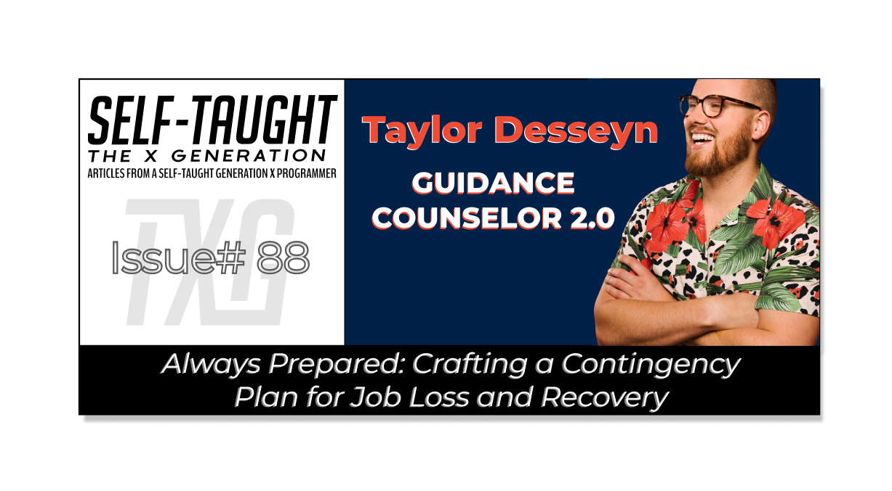

#### In today's market, having a contingency plan is essential in case of a layoff. Industry expert Taylor Desseyn provides valuable insights to help us navigate these challenging times, should they arise!

---

---

### Introduction
In the unfortunate event of a layoff, it's crucial to have a contingency plan in place.

Industry Expert Taylor Desseyn offers his invaluable insights to help you navigate this challenging period, should it arise.

Taylor is a senior recruiter with over a decade of experience in the industry and provides expert career advice and networking opportunities through his weekly Livestream events.

---

### Don't take it personal
Taylor informs us that in the current job market, layoffs often result from budget constraints and overhiring rather than being a reflection of an individual's performance.

Unfortunately, we cannot control the job market situation, so Taylor urges us to do our best not to take a layoff personally.

---

### Take the next day off
*It's best not to be emotional when job searching!*

Taking the next day off is essential to process what happened and to regain your composure. Allow yourself this brief break before beginning your new job search.

---

### Pros, cons, & what you want
*Taylor informs you that most job seekers have yet to learn what they want in their next venture!*

#### Pros & cons
Before you begin your search, take inventory of your current or previous job's pros and cons and consider what you want in your next role. Reflecting on your past experiences, work environment, and company culture will provide valuable insight.

#### What you want
Take time to contemplate your career goals, personal values, and the kind of work-life balance you desire. By doing so, you will be better equipped to find a position that aligns with your wants and needs.

#### Follow your passion
Taylor advises you to follow your passion! If given a new start, seek employment in an industry that truly resonates with your interests and talents!

---

<iframe width="956" height="538" src="https://www.youtube.com/embed/0_D_ydKS03Y"></iframe>

---

### Get your resume set
Make sure your resume's written really well. Taylor explains your resume needs to be **achievement-based** rather than **task oriented**.

As a developer, you may be tempted only to add a sentence to your resume stating that you wrote React code, neglecting to elaborate on what your code accomplished.

**Achievement-based React code includes:**
* The software
* The platform
* What did it do
* How many users
* How many transactions per minute/second
    
*When adding programming experience to your resume, ensure that you include quantitative data and the purpose and solutions the program provides.*

Taylor provides resume templates as well as helpful guides on his website: [https://resources.vaco.com/taylor-desseyn-free-guides](https://resources.vaco.com/taylor-desseyn-free-guides)

---

### Utilize LinkedIn

#### Optimize your LinkedIn profile
Taylor informs us that recruiters and hiring managers use **keywords** when searching for candidates, so it is essential to include them in your LinkedIn profile. Examples of keywords include React, JavaScript, and Developer.

***Check out Taylor's videos on LinkedIn profile optimization:***
* [How Social Media Can Land You Your Dream Job](https://egghead.io/lessons/egghead-how-social-media-can-land-you-your-dream-job)
* [HOW TO USE LINKEDIN AS A DEVELOPER to get a job in tech! How to network!](https://www.youtube.com/watch?v=SG5Sb5WTV_g&t=1s)
    
#### *You may find my following article helpful: [LinkedIn Profile Optimization With Austin Henline](https://selftaughttxg.com/2022/10-22/LinkedIn-AustinHenline/)*

---

### Utilize job boards
Taylor advises uploading your resume to job site profiles to increase your chances and reach when seeking employment.

**Job board websites include:**
* Dice.com
* Indeed
* Career Builder
* Monster
    
Taylor recommends [dice.com](https://www.dice.com/) for posting resumes for web developers. Dice is a platform specializing in tech jobs, unlike other generalized job sites.

---

### Document your job search
Documenting your job search not only provides an organized approach but also presents growth opportunities!

**Taylor suggests the following strategies:**
* Create a job search email
* Track your job search
* Crowdsource answers to your questions  
* Journal interview questions  

#### Create a job search email
Consider creating a separate email specifically for your job search to help you stay organized. Doing so can prevent unintentional non-job-related and personal emails from being sent to the wrong recipients.

#### Track your job search
Taylor recommends Trello for tracking your job search. With Trello or a similar service, you can create a tracking system such as setting up columns for **Submitted, First Round**, **Second Round, Third Round, and Offer.**

Using this organizational method makes it easier for you to keep track of multiple job leads and makes it easier to follow up with them.

#### Crowdsource answers to your questions
If you got a technical question wrong during an interview, post that specific question on social media, asking if anyone else received and passed it. Perhaps others will share their success and solutions.

#### Keep a journal of interview questions
Document the interview questions you missed! Over time, doing so will help build and improve your interviewing skills.

---

### Network your job search

#### Network with recruiters
Taylor advises us to keep in contact with a group of our favorite recruiters and reach out to them monthly. A tip he provides is to BCC (blind carbon copy) them in a group email to get in touch with them, reminding them who you are, your skill set, and that you are still seeking employment.

#### Use your network to connect with hiring managers
When applying for a job at a particular company, first check if your connections know hiring managers within that organization. If so, contact them first, inform them of your interest, and see if they can streamline an introduction to the hiring managers.

#### Network with your interviewers
Taylor explains that interviews are forced networking. After an interview, be sure to send your interviewer a LinkedIn connection request along with a thank you message. With this tip provided by Taylor, you can expand your network while actively searching for employment.

---

### Tips from the community
During Taylor's Livestream events, he invites viewers to ask questions, provide additional insight, and encourages us to network with each other! 

**Here is some additional job-seeking advice offered by the Livestream viewers:**
* Don't sacrifice sleep, good meals, and exercise basics.
* If you have the financial means, take some time off before you begin your job search.
* Knowing is half the battle! Asking your colleagues to honestly tell you about your strengths and weaknesses can significantly help your future endeavors!

---

### My other Taylor Desseyn articles

* [Taylor Desseyn on leveraging recruiters to land a job in tech](https://selftaughttxg.com/2021/09-21/TaylorDesseyn-LeveragingRecruiters/)    
* [Maximizing Your Job Search: Insights from Andronica Klaas, Meta Engineer](https://selftaughttxg.com/2023/03-23/maximizing-your-job-search-andronica-klaas/)
    
---

### Taylor's links
* 🔗 [LinkedIn](https://www.linkedin.com/in/taylordesseyn) 
* 🔗 [Twitter](https://twitter.com/tdesseyn) 
* 🔗 [Website](https://www.vaco.com/taylor/) 
* 🔗 [Instagram](http://instagram.com/guidancecounselor2.0) 
* 🔗 [YouTube](https://www.youtube.com/@TaylorDesseyn/)
    
---

### Conclusion

(WRITE ARTICLE SECTION)

---

**Let's connect! I'm active on** [**LinkedIn**](https://www.linkedin.com/in/michaeljudelarocca/) **and** [**Twitter**](https://twitter.com/MikeJudeLarocca)**.**

---

###### ***?? Please share the article and comment!***