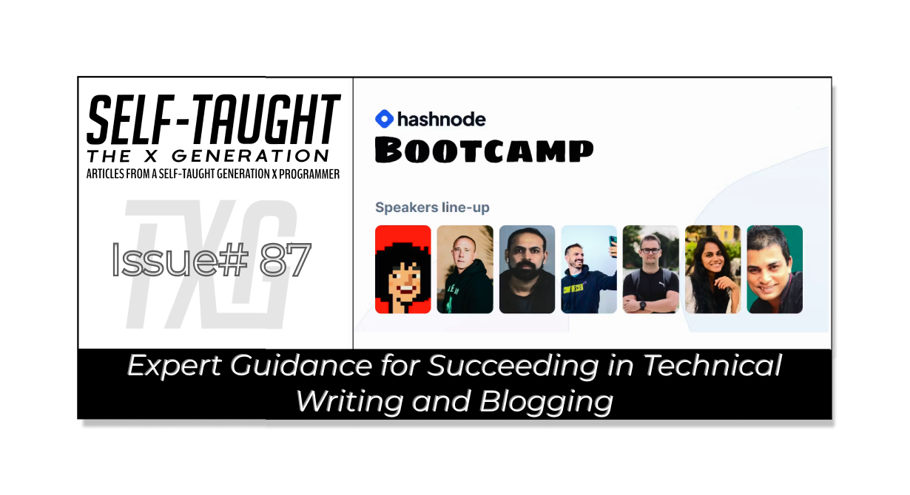

#### This article covers Hashnode's Bootcamp 2023, where we receive expert guidance on writing from industry experts! Develop a unique style, specializing in a niche, harness AI for inspiration, and more!

---

---

### Hashnode Bootcamps
Hashnode's Bootcamps are immersive online events designed for developers and tech enthusiasts to learn, network, and enhance their writing skills.

During Hashnode's 2023 Bootcamp, we had the chance to learn from an exceptional lineup of speakers, including [**Ankur Tyagi**](https://twitter.com/TheAnkurTyagi), [**Swapna Kumar Panda**](https://twitter.com/swapnakpanda), [**Nader Dabit**](https://twitter.com/dabit3), [**Ákos Kőműves**](https://twitter.com/akoskm), and [**James Q Quick**](https://twitter.com/jamesqquick).

These industry experts shared their knowledge, insights, and experiences, providing us with valuable guidance to help us enhance our writing and technical skills.

---

### How to get started with blogging
So you are a computer programmer and would like to create a blog, but what do you write about?

The easiest way to start blogging is to write about your current learning. For example, if you have just learned how to write a recursive function in JavaScript, the in-depth research and work you just completed makes you qualified to cover the topic. As a learner, James Quick proposes that you are the best person qualified to teach and write about these topics.

---

### Create your writing style
When writing, be deliberate in adding your own personality to your content. Over time, doing so will help you develop your writing style.

You will find that specific groups of people will resonate with your unique writing style, and they will prefer reading your articles over others that cover the same topics!

---

### Write documentation articles
Documentation articles serve as excellent topics to write about. Writing your insights will benefit others. You will even find yourself referencing these articles in the future! f you are learning something new and going through a comprehensive, step-by-step process.

---

### People skim your articles
Yes, people skim through your articles. You are probably skimming through this one now, and that is ok! If you understand how others consume your content, you can better organize it to help them better navigate through your articles to find what they need.

People may find your articles when searching for specific solutions to their problems. With this knowledge, it's best to have a clear outline at the beginning of your articles and short and concise paragraphs.

---

### Specialization
To help you get noticed and really stand out from the crowd, Nader Dabit advises us to specialize and find a niche. Just being a generalist is not in your best interest.

Find a specific area you are interested in and focus on developing your skillset in that domain. If you've heard of Gary Simon, UX UI Design will first come to mind. Likewise, CSS will come to mind when you hear about Kevin Powell.

When you establish a reputation within the industry, you will be sought after for various opportunities in the topics you specialize in!

---

---

### Working with AI technologies
**During the Hashnode day three event, James Quick answered my question,** *"As content creators, can you advise us on the correct way to work with AI technologies and the incorrect way?"*

**James tells us that the correct way to use AI is to generate a starting point for inspiration for the content and then build on top of that, and the incorrect way is to auto-generate articles and post them as is.**

AI is never perfect, as James points out, so we must be actively involved in the creation and implementation process. We need to ensure that AI suggestions align with our quality standards and style while also meeting our audience's expectations.

**Greate use cases for AI**
* SEO article titles
* SEO article descriptions 
* Suggestions for improvement
    
---

#### **Hashnode Bootcamp 2023**
* [**Hashnode Bootcamp Day 1**]([https://www.youtube.com/watch?v=obj-wJB6lGs&t=1075s](https://www.youtube.com/watch?v=obj-wJB6lGs&t=1075s))
* [**Hashnode Bootcamp Day 2**]([https://www.youtube.com/watch?v=ysLCBi3L8JI&t=1s](https://www.youtube.com/watch?v=ysLCBi3L8JI&t=1s))  
* [**Hashnode Bootcamp Day 3**]([https://www.youtube.com/watch?v=PNBs3F9biDU&t=1168s](https://www.youtube.com/watch?v=PNBs3F9biDU&t=1168s))
    
---

### Conclusion
The Hashnode Bootcamps are an outstanding resource for learning how to succeed in technical writing and blogging from industry experts.

In the 2023 Bootcamp, we were instructed to develop a unique writing style, craft well-structured content, and specialize in a niche. By doing so, we will not only distinguish ourselves from the crowd but also resonate with specific groups of people and establish a reputation around particular technologies that can lead to many opportunities!

We were also encouraged to embrace AI technologies as a source of inspiration and tool to help enhance our content but to always maintain control over the quality and style when implementing it.

By applying these insights taught by industry experts, you'll be well on your way to succeeding in technical writing and blogging!

---

**Let's connect! I'm active on** [**LinkedIn**](https://www.linkedin.com/in/michaeljudelarocca/) **and** [**Twitter**](https://twitter.com/MikeJudeLarocca)**.**

---

###### ***? ? Please share the article and comment!***