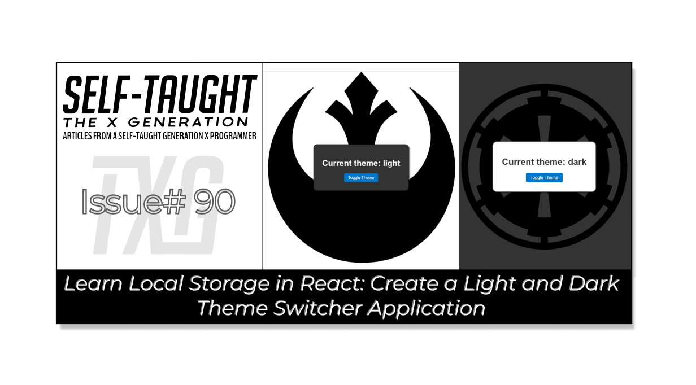
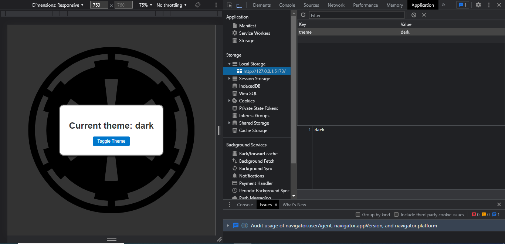

#### This week's article examines React local storage by creating a theme switcher application. We cover the basics, discuss the limitations, and demonstrate how to implement these concepts in a React app!

---



---

### Introduction

In this article, we will learn how to work with local storage in React by creating a simple light/dark theme toggle app. Although we are developing a beginner-friendly React app, there is much more to discover when working with local storage that is worth exploring.

We will first take a look at how to work with local storage in JavaScript. Then, we will learn what additional steps are needed when working with local storage in React, and finally, we will build the light/dark theme toggle app!

***Note:*** *We will be focusing on learning React code, not CSS. However, feel free to clone the project or copy the CSS code.*

---

### What is local storage?

Local storage is a web storage API that allows you to store key-value pairs in a web browser. It is a persistent storage option, meaning the data remains in the browser even after it is closed and reopened. Local storage is useful for remembering user preferences or saving information in web applications. You can use JavaScript to store, retrieve, or delete data from local storage.

**When working with local storage in JavaScript, we have the following methods:**

* **setItem()**: Stores a key-value pair in local storage.
    
* **getItem()**: Retrieves the value associated with a key from local storage.
    
* **removeItem()**: Removes a key-value pair from local storage based on the key.
    
* **clear()**: Deletes all key-value pairs from local storage.
    
* **key()**: Retrieves the key at a specified index in local storage.
    

Additionally, we can use `localStorage.length` to find out the total number of locally stored items.

---

### Local storage format and limitations

Local storage stores text-based data only. To store complex data types, you need to use `JSON.stringify()` to convert them into text format, but methods or functions will be lost!

To retrieve and convert stored data back, you use `JSON.parse()`, but remember to manually reattach methods or functions as they won't be automatically restored. Be mindful of these limitations when using `JSON.stringify()` and `JSON.parse()` with local storage.

Additionally, local storage has a data limit, which is typically around 5-10 MB per domain, depending on the browser.

---

***Note:*** *Data stored in local storage is not encrypted and can be easily read by anyone with access to the browser. Storing sensitive information in this manner can pose a risk.*

---

### Session and local storage

When working with storage, you have two options, session and local.

The main difference is that session storage data is deleted when the browser is closed, while local storage data remains persistent even after the browser is closed and reopened.

*Since we are creating a theme selector, we will use the local storage option so that the theme chosen by the user will remain persistent.*

---

### Working with local storage in React

**To work with local storage in React, we need to use the following hooks:**

* useState
    
* useEffect
    

We use the **useState** hook to save the state of the theme, which has a value of light or dark.

We use the **useEffect** hook to access the local storage and to run a get theme function each time the user toggles the theme value.

***Note:*** *Since our focus is on learning about local storage, we will keep this project beginner-friendly and not create separate components.*

---

### Build the light/dark theme toggle app

It is now time to build the light/dark theme toggle React app! Even though it's a simple app with little code, it's in our best interest to learn and follow best coding practices.

#### Adhere to best coding structure practices

**To build this app in an order that promotes readability, maintainability, and efficient execution, we will code in this order:**

1. Define state variables with `useState` hook.
    
2. Define any helper functions, such as those for interacting with local storage.
    
3. Define event handlers, like `toggleTheme`.
    
4. Use `useEffect` hook for side effects, such as retrieving data from local storage on component mount.
    
5. Render the component, including any event listeners and conditional rendering logic based on state variables.
    

This function order follows best practices for a clear and logical React app structure. It begins with defining state variables, then helper functions and event handlers. The useEffect hook comes next, as it depends on these functions and the component's lifecycle. Finally, rendering the component ensures effective use of state variables, functions, and event handlers for desired output. This order enhances readability, maintainability, and efficiency.

#### Imports

At the top of the App jsx file, we import useState and useEffect hooks from React. We also import the App CSS file.

```javascript
import { useState, useEffect } from "react";
import "./App.css";
```

#### The App function

We now create an App function that holds all of the code we are bout to create, and we export it.

```javascript
function App() {
    // All of the code goes here    
}

export default App;
```

#### useState hook

We use the **useState** hook to set and save the theme variable value, **light** or **dark**. In the following, `const [theme, setTheme] = useState("light")`, the value "**light**" is saved to the **const** "**theme**". The **setTheme** is a function that enables us to change the value of the **theme** variable.

Alternatively, instead of setting the value to "**light**", we can write an anonymous function that checks if there is a preexisting theme value stored in local storage.

In the anonymous function, we create a variable named **initialTheme** and set it equal to `localStorage.getItem("theme")`. This code will retrieve the value of the "**theme**" variable in local storage if there is one, or it will return **NULL** if there is not one.

Using a ternary operator, we **return** the value of **initialTheme** or "**light**" as the **initialTheme** value.

```javascript
	const [theme, setTheme] = useState(() => {
		const initialTheme = localStorage.getItem("theme");
		return initialTheme ? initialTheme : "light";
	});
```

#### Get theme function

The **getThemeFromLocalStorage** function uses `localStorage.getItem("theme")` to retrieve the value of the **theme** variable from local storage and set it to the **savedTheme** variable.

If there is not a value for the **theme** variable in local storage, NULL will be returned. If there is a value for the **theme** variable in local storage, in an if statement, we use the **setTheme** function to change the state variable **theme** to the saved theme's current value.

```javascript
	function getThemeFromLocalStorage() {
		const savedTheme = localStorage.getItem("theme");
		if (savedTheme) {
			setTheme(savedTheme);
		}
	}
```

#### Toggle theme function

Using the **setTheme** function, we examine the current value of the **theme** variable by checking the **prevTheme** state value.

We create the variable **newTheme** and utilize a ternary operator to assign it a value opposite to that of the current theme.

Finally, we utilize `localStorage.setItem("theme", newTheme)` to assign the **newTheme** value and subsequently return the **newTheme** value.

```javascript
	function toggleTheme() {
		setTheme((prevTheme) => {
			const newTheme = prevTheme === "light" ? "dark" : "light";
			localStorage.setItem("theme", newTheme);
			return newTheme;
		});
	}
```

#### useEffect function

We create a **useEffect** hook to run the **getThemeFromLocalStorage()** function every time the **theme** variable changes. We accomplish this by setting the **theme** variable as a dependency in the useEffect's dependency array.

```javascript
	useEffect(() => {
		getThemeFromLocalStorage();
	}, [theme]);
```

#### Render the component

Finally, we return an HTML `<div>` with a class name that is assigned using the current **theme** variable, along with a `<h1>` tag that also contains the current **theme** variable.

We also incorporate a button that allows users to toggle the theme by utilizing an **onClick** event listener, which executes the **toggleTheme** function upon being clicked.

```javascript
	return (
		<div className={`ctn ${theme}`}>
			<div className={`app ${theme}`}>
				<h1>Current theme: {theme}</h1>
				<button onClick={toggleTheme}>Toggle Theme</button>
			</div>
		</div>
	);
```

---

### How to view variables in local storage

After you create key-value pair variables and save them to local storage, you can view them in your browser using the following steps:

1. Open Chrome and navigate to the website where local storage variables are set.
    
2. Right-click anywhere on the page and select "Inspect" from the context menu.
    
3. In the Developer Tools panel that opens, click on the "Application" tab.
    
4. In the left sidebar, expand the "Storage" section.
    
5. Click on "Local Storage" and then select the domain of the website.
    
6. The local storage key-value pairs will be displayed in the right pane.
    



---

### Here is the complete JSX file

```javascript
import { useState, useEffect } from "react";
import "./App.css";

function App() {
	const [theme, setTheme] = useState(() => {
		const initialTheme = localStorage.getItem("theme");
		return initialTheme ? initialTheme : "light";
	});

	function getThemeFromLocalStorage() {
		const savedTheme = localStorage.getItem("theme");
		if (savedTheme) {
			setTheme(savedTheme);
		}
	}

	function toggleTheme() {
		setTheme((prevTheme) => {
			const newTheme = prevTheme === "light" ? "dark" : "light";
			localStorage.setItem("theme", newTheme);
			return newTheme;
		});
	}

	useEffect(() => {
		getThemeFromLocalStorage();
	}, [theme]);

	return (
		<div className={`ctn ${theme}`}>
			<div className={`app ${theme}`}>
				<h1>Current theme: {theme}</h1>
				<button onClick={toggleTheme}>Toggle Theme</button>
			</div>
		</div>
	);
}

export default App;
```

---

### The finished project

**Here are the links to the finished project:**

* [GitHub repo](https://github.com/MichaelLarocca/react-theme-selector)
    
* [Netlify deployed project](https://react-theme-selector.netlify.app/)
    

---

### My other related articles

* [React: How to Use the Star Wars API for Beginners](https://selftaughttxg.com/2023/05-23/react-how-to-use-the-star-wars-api-for-beginners/)
    
* [Using React useState Hook to Manage Object Props](https://selftaughttxg.com/2023/04-23/using-react-usestate-hook-to-manage-object-props/)
    
* [Creating a True/False Toggle in React with useState Hook for Beginners](https://selftaughttxg.com/2023/04-23/creating-a-true-false-toggle-in-react-with-usestate-hook-for-beginners/)
    

---

### Advance your career with a 20% discount on Scrimba Pro using this [affiliate link](https://scrimba.com/?via=MichaelLarocca)!

Become a hireable developer with Scrimba Pro! Discover a world of coding knowledge with full access to all courses, hands-on projects, and a vibrant community. You can [read my article](https://selftaughttxg.com/2021/06-21/06-07-21/) to learn more about my exceptional experiences with Scrimba and how it helps many become confident, well-prepared web developers!

###### ***Important:*** *This discount is for new accounts only. If a higher discount is currently available, it will be applied automatically.*

**How to Claim Your Discount:**
1. Click [the link](https://scrimba.com/?via=MichaelLarocca) to explore the new Scrimba 2.0.
2. Create a new account.
3. Upgrade to Pro; the 20% discount will automatically apply.

##### ***Disclosure:*** *This article contains affiliate links. I will earn a commission from any purchases made through these links at no extra cost to you. Your support helps me continue creating valuable content. Thank you!*

---

### Conclusion

Using storage in your applications can significantly improve your users' experience, from basic saved themes to intricate saved user objects that store their preferences and data.

Understanding the limitations of local storage, such as its text-based data format, storage capacity, and unencrypted security concerns, is essential when working with web applications. Additionally, it's important to be aware of the differences between session storage and local storage to make informed decisions on which storage type best suits your application's needs.

When working with storage in React, you need to utilize the useState and useEffect hooks for saving and updating variables, as well as accessing the storage API.

To create a React app that promotes readability, maintainability, and efficient execution, consider organizing your code in the following order: define state variables, helper functions, event handlers, React hooks, and finally, render the components.

---

**Let's connect! I'm active on** [**LinkedIn**](https://www.linkedin.com/in/michaeljudelarocca/) **and** [**Twitter**](https://twitter.com/MikeJudeLarocca)**.**

---

###### *Are you now skilled in using local storage with React to create a theme switcher application? Do you have more ideas for enhancing user experience using local storage? Please share the article and comment!*
