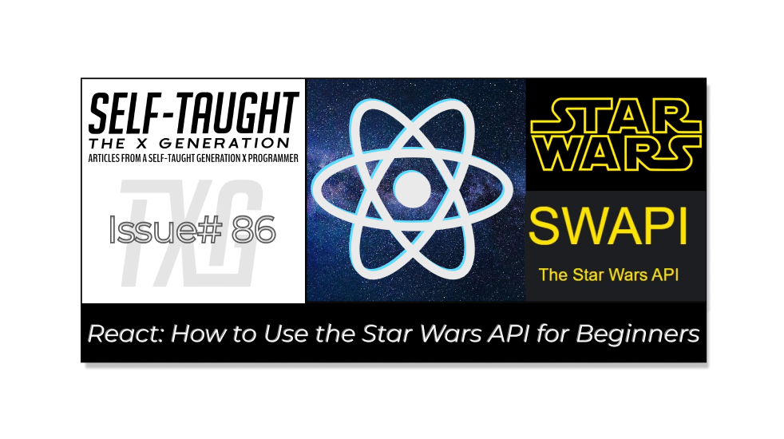

#### **May the 4th be with you! In this article, to celebrate Star Wars Day, I learned and stepped through the process of using the Star Wars API to display information on a React website created with Vite!**


---



---

### Introduction

This article is a beginner-friendly guide on creating a React App that uses the Star Wars API to display information, featuring a Navbar with buttons to render components upon user clicks.

The Star Wars API offers access to an abundance of information from the Star Wars universe. Utilizing this API allows us to seamlessly incorporate Star Wars data into our applications and websites, providing a distinctive and captivating experience for both ourselves and fans of the franchise!

We will build a Navbar, Main, and Planets component together, and please feel free to copy, clone, or write the remaining similar components; Starships and People.

**We will be using the following for this project:**

* Axios
    
* React useState
    
* React useEffect
    

***Note:*** *We will be focusing on learning React code, not CSS. However, feel free to clone the project or copy the CSS code.*

---

### **The Star Wars API**

The [Star Wars API](https://swapi.dev/) contains data from the first seven Star Wars films, including Planets, Spaceships, and Vehicles which we will be working with.

**The Star Wars API is an open API, meaning it is a publicly available application programming interface and does not require authentication.**

*Since the Star Wars API is an open API, we do not need an access token, simplifying the connection process!*

---

### What is Axios, and why use it?

To access the Star Wars API, we will use Axios. Don't worry, it's a very easy setup, and we will only take a few lines of code to access the API.

So what is React Axios? [React Axios](https://axios-http.com/) is a popular library developers use to make HTTP requests in React applications. It simplifies fetching and handling data from APIs, offering features like automatic JSON data transformation and easy error handling. Developers prefer using Axios due to its ease of use, flexibility, and wide compatibility with different browsers.

**Initially, I tried using JavaScript fetch and a try-catch block to retrieve data from the Star Wars API, but I ran into too many problems. After researching, I saw that many React developers use Axios for API calls and decided to go with that as a solution.**

---

### The React environment

For this project, I used the VS Code editor to create a React app with Vite. Afterward, I converted it into a GitHub repository and deployed it on Netlify.

**If you would like to learn how to set up a local React development environment, I wrote the following two beginner-friendly articles:**

* [Create a React Project, Push It to GitHub, and Deploy With Netlify, From the Command Line](https://selftaughttxg.com/2023/03-23/create-a-react-project-push-it-to-github-and-deploy-with-netlify-from-the-command-line/)
    
* [How to Create a Local React Environment with Vite](https://selftaughttxg.com/2023/03-23/how-to-create-a-local-react-environment-with-vite/)
    

---

### React Imports

**To start, we will import React useEffect, useState, and Axios as follows:**

```javascript
import React, { useEffect, useState } from "react";
import axios from "axios";
```

---

### Install Axios

To install Axios, simply run this command:

```bash
npm install axios
```

---

### Planets Component

Next, we will create a Planets component. This component will handle the API call that accesses the Star Wars API planets pages.

**Once completed, it will:**

* Make an API call
    
* Render a loading HTML block
    
* Map through and create 10 plant cards
    
* Create the next and previous page buttons
    

```javascript
function Planets() {
	const [isLoading, setLoading] = useState(true);
	const [starWarsDataPlanets, setStarWarsDataPlanets] = useState();
	const [urlPlanets, setUrlPlanets] = useState(
		`https://swapi.dev/api/planets/?page=1`
	);
}
```

**Using React useState, we create the following variables:**

* **isLoading:** to create a loading state
    
* **starWarsDataPlanets:** to hold the API data
    
* **urlPlanets:** To cycle through the available pages
    

---

### API call with Axious and useEffect

Next, we write and add the code **inside of the Planets function** to access the Star Wars API. We use React's useEffect with Axios as follows:

```javascript
	useEffect(() => {
		axios.get(urlPlanets).then((response) => {
			setStarWarsDataPlanets(response.data);
			setLoading(false);
		});
	}, [urlPlanets]);
```

Axios easily handles the API request. We then save the response data to the **starWarsDataPlanets** variable using the **setStarWarsDataPlanets function**.

We use the function **setLoading** to change the **isLoading** variable to false after we receive the response data.

The **urlPlanets** is used as the **useEffect** dependency array, which enables us to run the **Planets** function automatically every time the **urlPlanets** variable changes.

---

### Loading HTML block

Adding to the Planets function, we create an if statement that checks if the **isLoading** variable is true, which means the API call is currently running. If the isLoading variable is true, we return an HTML loading block. This block includes the Previous Page and Next Page buttons, currently disabled.

*Creating this step that checks if the API is loading is crucial! The returned data from the API will display in the console log before it's actually available to render, which caused me a lot of debugging confusion I would like you to avoid.*

```javascript
	if (isLoading) {
		return (
			<>
				<div>
					<h1 className="txt-shadow-gold">Planets</h1>
					<button
						// onClick={previousPage}
						disabled={true}
					>
						⏪ Previous Page
					</button>
					<button
						// onClick={nextPlanetPage}
						disabled={true}
					>
						Next Page⏩
					</button>
				</div>
				<div
					style={{
						display: "flex",
						flexDirection: "column",
						alignItems: "center",
						justifyContent: "center",
						height: "100vh",
						width: "100vw",
					}}
				>
					Loading... {console.log("loading state")}
				</div>
			</>
		);
	}
```

---

### JavaScript Map

After we receive the data from the Star Wars API, which is initially page one of planets, we use the JavaScript map method to create a variable aptly called **allPlanetsOnPage**.

Each page contains 10 planet records, respectively. When mapping through each planet, we return an HTML card block that contains the planet's name, climate, terrain, and population information.

*We assign each of the names of the planets as the React key. The React key is a special attribute added to elements in a list or an array to help React identify and track each item uniquely, making it easier to update, reorder, or delete items efficiently.*

```javascript
	const allPlanetsOnPage = starWarsDataPlanets.results.map((planet) => {
		console.log(planet);

		return (
			<div className="card card-planet">
				<h2 key={planet.name}>{planet.name}</h2>
				<p>Climate: {planet.climate}</p>
				<p>Terrain: {planet.terrain}</p>
				<p>Population: {planet.population}</p>
				<br />
			</div>
		);
	});
```

---

### Render the Planet pages

Now that we have the first planet page stored in the **allPlanetsOnPage** variable, we return an HTML card block that contains the Previous Page and Next Page buttons, along with a `<main>` div that renders the planets.

We set a click event for each button that runs corresponding functions we are about to write, and we write a ternary operator that checks for a null value provided by the API. If the previous or next page has a null value, we set the disabled attribute to true.

```javascript
	return (
		<div>
			<h1 className="txt-shadow-gold">Planets</h1>
			<button
				onClick={previousPage}
				disabled={starWarsDataPlanets.previous ? false : true}
			>
				⏪ Previous Page
			</button>
			<button
				onClick={nextPlanetPage}
				disabled={starWarsDataPlanets.next ? false : true}
			>
				Next Page⏩
			</button>

			<main>{allPlanetsOnPage}</main>
		</div>
	);
```

---

### Next and Previous functions

Now we write the **nextPlanetPage** and **previousPage** functions that are called when the user clicks the corresponding button.

The functions first set the loading state back to true and then set the next and previous planet URLs provided by the API.

```javascript
	function nextPlanetPage() {
		setLoading(true);
		setUrlPlanets(starWarsDataPlanets.next);
	}

	function previousPage() {
		setLoading(true);
		setUrlPlanets(starWarsDataPlanets.previous);
	}
```

---

### The completed Planets component

```javascript
import React, { useEffect, useState } from "react";
import axios from "axios";
// console.log(React);
function Planets() {
	const [isLoading, setLoading] = useState(true);
	const [starWarsDataPlanets, setStarWarsDataPlanets] = useState();
	const [urlPlanets, setUrlPlanets] = useState(
		`https://swapi.dev/api/planets/?page=1`
	);

	useEffect(() => {
		axios.get(urlPlanets).then((response) => {
			setStarWarsDataPlanets(response.data);
			setLoading(false);
		});
	}, [urlPlanets]);

	if (isLoading) {
		return (
			<>
				<div>
					<h1 className="txt-shadow-gold">Planets</h1>
					<button
						// onClick={previousPage}
						disabled={true}
					>
						⏪ Previous Page
					</button>
					<button
						// onClick={nextPlanetPage}
						disabled={true}
					>
						Next Page⏩
					</button>
				</div>
				<div
					style={{
						display: "flex",
						flexDirection: "column",
						alignItems: "center",
						justifyContent: "center",
						height: "100vh",
						width: "100vw",
					}}
				>
					Loading... {console.log("loading state")}
				</div>
			</>
		);
	}

	const allPlanetsOnPage = starWarsDataPlanets.results.map((planet) => {
		console.log(planet);

		return (
			<div className="card card-planet">
				<h2 key={planet.name}>{planet.name}</h2>
				<p>Climate: {planet.climate}</p>
				<p>Terrain: {planet.terrain}</p>
				<p>Population: {planet.population}</p>
				<br />
			</div>
		);
	});

	return (
		<div>
			<h1 className="txt-shadow-gold">Planets</h1>
			<button
				onClick={previousPage}
				disabled={starWarsDataPlanets.previous ? false : true}
			>
				⏪ Previous Page
			</button>
			<button
				onClick={nextPlanetPage}
				disabled={starWarsDataPlanets.next ? false : true}
			>
				Next Page⏩
			</button>

			<main>{allPlanetsOnPage}</main>
		</div>
	);

	function nextPlanetPage() {
		setLoading(true);
		setUrlPlanets(starWarsDataPlanets.next);
	}

	function previousPage() {
		setLoading(true);
		setUrlPlanets(starWarsDataPlanets.previous);
	}
}

export default Planets;
```

---

### The Starships and People components

The Starships and People components are both created in an identical fashion to the Planets component we just created. Both the Starships and People components have their own unique HTML card block values to return, but the coding concepts are the same.

**From my GitHub repo, feel free to clone or copy them, or if you want the practice, you can try writing the Starships and People components from scratch.**

---

### The Main Component

Nothing special about the Main component. It's just a hero section that explains what this project is about and how to use it.

```javascript
import React from "react";

function Main() {
	return (
		<main className="txt-shadow-red">
			<h1 className="main-title">STAR WARS API</h1>
			<h2 className="main-title">
				Use the previous and next buttons on each category to view the
				information provided by the Star Wars API
			</h2>
		</main>
	);
}

export default Main;
```

---

### The App.jsx file

Here is where all the magic happens! We are going to import the Planets component and all others, whether copied, cloned, or created from scratch (this project will still work with just the Planets component).

**The most important part of this whole project is for you to understand how it works, so let's step through it.**

1. First, we will import useState from React and the components as well as the App.css file ( feel free to copy my CSS code).
    
2. Create a useState variable that holds the currently selected component
    
3. Create a Navbar with buttons that contain anonymous functions that set the currently selected component.
    
4. Use conditional rendering to only render the content of the currently selected component.
    
#### Import useState from React and the components
    

```javascript
import React, { useState } from "react";

import "./App.css";
import Main from "./components/Main";
import Planets from "./components/Planets";
import People from "./components/People";
import Starships from "./components/Starships";
```

#### Create a useState variable that holds the currently selected component
    

```javascript
const [selectedComponent, setSelectedComponent] = useState("Main");
```

#### Create a Navbar with buttons that contain anonymous functions
    

```javascript
			<nav>
				<button onClick={() => setSelectedComponent("Main")}>Main Page</button>
				<button onClick={() => setSelectedComponent("Planets")}>Planets</button>
				<button onClick={() => setSelectedComponent("Starships")}>
					Starships
				</button>
				<button onClick={() => setSelectedComponent("People")}>People</button>
			</nav>
```

#### Use conditional rendering to only render the content of the currently selected component.
    

```javascript
			<div id="ctn-main">
				{selectedComponent === "Main" && <Main />}
				{selectedComponent === "Planets" && <Planets />}
				{selectedComponent === "Starships" && <Starships />}
				{selectedComponent === "People" && <People />}
			</div>
```

---

### How it works

We create separate components for Planets, Starships, and People. Each component handles its own API call, rendering all of our chosen content to HTML card blocks to return. Since the Star Wars API URLs contain approximately 10 records per page, we use the next and previous URLs to set the requested page. If the next or previous URLs are null, we disable the corresponding button that runs the API call.

Then we import the components to the main App.jsx file. We create a Navbar and add buttons for each component to it, and also one for the Main component that acts as a Hero section. Each button has an onClick event that runs an anonymous function that sets the component chosen by the user to the **selectedComponent** variable.

In the final outcome, only the currently selected component is rendered on the page.

### Here is the completed App.jsx file

```javascript
function App() {
	const [selectedComponent, setSelectedComponent] = useState("Main");

	return (
		<>
			<nav>
				<button onClick={() => setSelectedComponent("Main")}>Main Page</button>
				<button onClick={() => setSelectedComponent("Planets")}>Planets</button>
				<button onClick={() => setSelectedComponent("Starships")}>
					Starships
				</button>
				<button onClick={() => setSelectedComponent("People")}>People</button>
			</nav>
			<div id="ctn-main">
				{selectedComponent === "Main" && <Main />}
				{selectedComponent === "Planets" && <Planets />}
				{selectedComponent === "Starships" && <Starships />}
				{selectedComponent === "People" && <People />}
			</div>
		</>
	);
}
```

---

### The finished project

**Here are the links to the finished project:**

* [GitHub repo](https://github.com/MichaelLarocca/star-wars-api-react-version-01)
    
* [Netlify deployed project](https://star-wars-api-react-version-01.netlify.app/)
    

---

### My other API articles

* [JavaScript: How to Use the Star Wars API for Beginners](https://selftaughttxg.com/2022/04-22/StarWarsAPI-01/)
    
* [JavaScript: How to Use the Chuck Norris API for Beginners](https://selftaughttxg.com/2023/02-23/javascript-how-to-use-the-chuck-norris-api-for-beginners/)
    

---

### Your first step into a larger world


###### © Lucasfilm Ltd. All Rights Reserved.

---

### Conclusion

Learning to work with APIs is an essential skill for professional developers. There is definitely a learning curve when transitioning from working with APIs in JavaScript to React. To simplify the process and have more robust control and options, developers tend to use Axious for API calls when working with React.

To make this project as beginner friendly as possible, we only used React's useState and UseEffect, and then we used conditional rendering.

If this is your first time working with APIs in React, and you managed to successfully fetch data from the Star Wars API, convert it to JSON data, and display it, it is a grand achievement you should be proud of!

You've taken your first step into a larger world, working with APIs in React!

---

**Let's connect! I'm active on** [**LinkedIn**](https://www.linkedin.com/in/michaeljudelarocca/) **and** [**Twitter**](https://twitter.com/MikeJudeLarocca)**.**

---

###### ***? ? Please share the article and comment!***