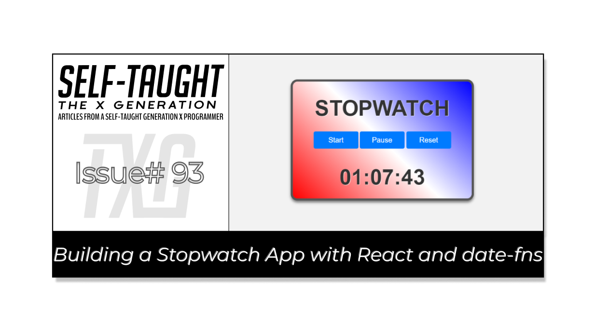
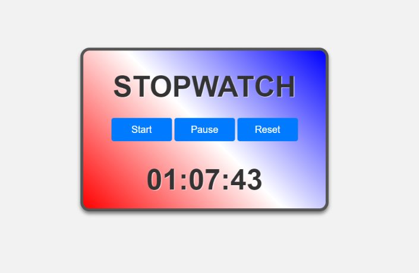

#### HOLD

---



---

### Introduction

(WRITE ARTICLE SECTION)

*(Yes, date-fns makes it easier to handle and format dates and times, resulting in more succinct and readable code.)*

1. Introduction
    
    * Briefly introduce the project and its purpose
        
    * Mention the technologies used (React, date-fns)
        

***Note:*** *We will be focusing on learning React code, not CSS. However, feel free to clone the project or copy the CSS code.*

---

### HOLD

(WRITE ARTICLE SECTION)

---

### Setting up the environment

(WRITE ARTICLE SECTION)

* Explain how to set up a new React project (using create-react-app or other preferred method)
    
* Install date-fns library
    

### The React environment

For this project, I used the VS Code editor to create a React app with Vite. Afterward, I converted it into a GitHub repository and deployed it on Netlify.

**If you would like to learn how to set up a local React development environment, I wrote the following two beginner-friendly articles:**

* [Create a React Project, Push It to GitHub, and Deploy With Netlify, From the Command Line](https://selftaughttxg.com/2023/03-23/create-a-react-project-push-it-to-github-and-deploy-with-netlify-from-the-command-line/)
    
* [How to Create a Local React Environment with Vite](https://selftaughttxg.com/2023/03-23/how-to-create-a-local-react-environment-with-vite/)
    

---

### HOLD

(WRITE ARTICLE SECTION)

---

***Note:*** *Since our focus is on learning about the date-fns library, we will keep this project beginner-friendly and not create separate components.*

---

### Building the Timer component

(WRITE ARTICLE SECTION)

### Import

**At the top of a JSX file, we will import the necessary hooks and library:**

* useState
    
* useEffect
    
* date-fns
    
* App.css
    

```javascript
import React, { useState, useEffect } from 'react';
import { format } from 'date-fns';
import './App.css';
```

---

### App function

#### We will be writing our code inside this App function:

```javascript
function App() {
  
  });
```

#### Inside the App function, we initially set up the variables.

**Variables initialized:**

* **savedTime:** The time value saved in local storage, used to persist the timer's state.
    

**State variables initialized:**

* **time:** A state variable representing the current time of the timer.
    
* **running:** A state variable indicating whether the timer is running or paused.
    
* **startTime:** A state variable representing the time when the timer was started or resumed.
    

```javascript
  const savedTime = parseInt(localStorage.getItem("savedTime"), 10) || 0; 
  const [time, setTime] = useState(new Date(savedTime));
  const [running, setRunning] = useState(false);
  const [startTime, setStartTime] = useState(null);
```

The **savedTime** variable is used to retrieve the user's saved time in local storage. If there is no saved time in local storage, the **savedTime** variable is set to zero.

---

### Function to start the timer

The **startTimer** function first retrieves the saved time from local storage and assigns it to the **savedTime** variable. If savedTime exists, it calculates the new start time by subtracting **savedTime** from the current time and updates the startTime state.

If savedTime does not exist, it sets the current time as the new start time, updates the startTime state, and saves it in local storage. Finally, it sets the running state to true, indicating the timer is running.

```javascript
  function startTimer() {
    const savedTime = parseInt(localStorage.getItem("pausedTime"), 10);
  
    if (savedTime) {
      const newStartTime = new Date().getTime() - savedTime;
      setStartTime(newStartTime);
    } else {
      const newStartTime = new Date();
      setStartTime(newStartTime);
      localStorage.setItem('startTime', newStartTime);
    }
    setRunning(true);
  };
```

---

### Function to pause and resume the time

The **pauseTimer** function checks if the timer is running. If it is, the function sets the running state to false, pausing the timer, and stores the current time value in local storage under the key '**pausedTime**'.

```javascript
  function pauseTimer() {
    if (running) {
      setRunning(false);
      localStorage.setItem('pausedTime', time.getTime());
    }
  };
```

---

### Function to reset the timer

The **resetTimer** function sets the **time** state to a new Date object with a value of **0**, sets the **running** state to **false**, sets the **startTime** state to **null**, and updates the local storage by setting the "**savedTime**" key to **0** and removing the "**startTime**" and "**pausedTime**" keys.

This effectively resets the timer to its initial state.

```javascript
  function resetTimer() {
    setTime(new Date(0));
    setRunning(false);
    setStartTime(null);
    localStorage.setItem("savedTime", 0);
    localStorage.removeItem('startTime');
    localStorage.removeItem('pausedTime');
  };
```

---

### Function to format the time

The **formattedTime** function extracts the minutes, seconds, and milliseconds from the **time** state using the **format function** from **date-fns library**. It then returns a formatted string in the format "**minutes** : **seconds** : **milliseconds**".

```javascript
  function formattedTime() {
    const minutes = format(time, 'mm');
    const seconds = format(time, 'ss');
    const milliseconds = format(time, 'SS');
    return `${minutes}:${seconds}:${milliseconds}`;
  };
```

---

### The useEffect hook

The useEffect hook runs a callback function when any of its dependencies (**running**, **startTime**, **time**) change.

If the **timer** is running, it sets up an interval to update the time state every **10** milliseconds by calculating the difference between the current time and the **startTime**. It also saves the current time in local storage under the key "**savedTime**".

When the running state changes to false or any dependency changes, the useEffect hook cleans up the interval by calling **clearInterval**.

```javascript
  useEffect(() => {
    if (running) {
      const interval = setInterval(() => {
        setTime(new Date(new Date().getTime() - startTime));
      }, 10);
  
      // Save the current time in local storage
      localStorage.setItem("savedTime", time.getTime());
  
      return () => clearInterval(interval);
    }
  }, [running, startTime, time]);
```

---

### Render the Component

This code represents the JSX (JavaScript XML) return statement for the **Timer** component. It renders a div with the className '**timer**', containing an h1 element displaying "**STOPWATCH**", a div with className '**buttons**' that contains three buttons (**Start**, **Pause/Resume**, and **Reset**), and another h1 element displaying the formatted time.

The **Start button** has an **onClick** handler that calls the **startTimer** function and is disabled if the timer is running.

The **Pause** and **Resume** buttons are conditionally rendered based on the running state; if the timer is running, the Pause button is displayed, otherwise the Resume button is shown. Both buttons call the same **startTimer** function when clicked.

The **Reset** button has an onClick handler that calls the **resetTimer** function.

The second h1 element displays the formatted time by calling the **formattedTime** function.

```javascript
  return (
    <div className='timer'>
      <h1>STOPWATCH</h1>
      <div className='buttons'>
        <button onClick={startTimer} disabled={running}>Start</button>
        {running ? (
          <button onClick={pauseTimer}>Pause</button>
        ) : (
          <button onClick={startTimer}>Resume</button>
        )}
        <button onClick={resetTimer}>Reset</button>
      </div>
      <h1>{formattedTime()}</h1>
    </div>
  );
```

**Finally, the Timer component is exported for use in other parts of the application.**

```javascript
export default Timer;
```

---

### HOLD

(WRITE ARTICLE SECTION)

---

### **Here is the complete JSX file**

```javascript
import React, { useState, useEffect } from 'react';
import { format } from 'date-fns';
import './App.css';

const Timer = () => {
  const savedTime = parseInt(localStorage.getItem("savedTime"), 10) || 0; 
  const [time, setTime] = useState(new Date(savedTime));
  const [running, setRunning] = useState(false);
  const [startTime, setStartTime] = useState(null);

  const startTimer = () => {
    const savedTime = parseInt(localStorage.getItem("pausedTime"), 10);
  
    if (savedTime) {
      const newStartTime = new Date().getTime() - savedTime;
      setStartTime(newStartTime);
    } else {
      const newStartTime = new Date();
      setStartTime(newStartTime);
      localStorage.setItem('startTime', newStartTime);
    }
    setRunning(true);
  };

  const pauseTimer = () => {
    if (running) {
      setRunning(false);
      localStorage.setItem('pausedTime', time.getTime());
    }
  };

  const resetTimer = () => {
    setTime(new Date(0));
    setRunning(false);
    setStartTime(null);
    localStorage.setItem("savedTime", 0);
    localStorage.removeItem('startTime');
    localStorage.removeItem('pausedTime');
  };

  const formattedTime = () => {
    const minutes = format(time, 'mm');
    const seconds = format(time, 'ss');
    const milliseconds = format(time, 'SS');
    return `${minutes}:${seconds}:${milliseconds}`;
  };

  useEffect(() => {
    if (running) {
      const interval = setInterval(() => {
        setTime(new Date(new Date().getTime() - startTime));
      }, 10);
  
      // Save the current time in local storage
      localStorage.setItem("savedTime", time.getTime());
  
      return () => clearInterval(interval);
    }
  }, [running, startTime, time]);

  return (
    <div className='timer'>
      <h1>STOPWATCH</h1>
      <div className='buttons'>
        <button onClick={startTimer} disabled={running}>Start</button>
        {running ? (
          <button onClick={pauseTimer}>Pause</button>
        ) : (
          <button onClick={startTimer}>Resume</button>
        )}
        <button onClick={resetTimer}>Reset</button>
      </div>
      <h1>{formattedTime()}</h1>
    </div>
  );
};

export default Timer;
```

---

### **The finished project**

**Here are the links to the finished project:**

* [GitHub repo](https://github.com/MichaelLarocca/react-stopwatch-app)
    
* [Netlify deployed project](https://react-stopwatch-app.netlify.app/)
    

---



---

### **My other related articles**

* [How to Make a Countdown App with React and date-fns](https://selftaughttxg.com/2023/06-23/how-to-make-a-countdown-app-with-react-and-date-fns/)
    
* [Learn Local Storage in React: Create a Light and Dark Theme Switcher Application](https://selftaughttxg.com/2023/05-23/learn-local-storage-in-react-create-a-light-and-dark-theme-switcher-application/)
    
* [Using React useState Hook to Manage Object Props](https://selftaughttxg.com/2023/04-23/using-react-usestate-hook-to-manage-object-props/)
    
* [Creating a True/False Toggle in React with useState Hook for Beginners](https://selftaughttxg.com/2023/04-23/creating-a-true-false-toggle-in-react-with-usestate-hook-for-beginners/)
    

---

### Conclusion

(WRITE ARTICLE SECTION)

---

**Let's connect! I'm active on** [**LinkedIn**](https://www.linkedin.com/in/michaeljudelarocca/) **and** [**Twitter**](https://twitter.com/MikeJudeLarocca)**.**

---

###### *? ? Please share the article and comment!*

---