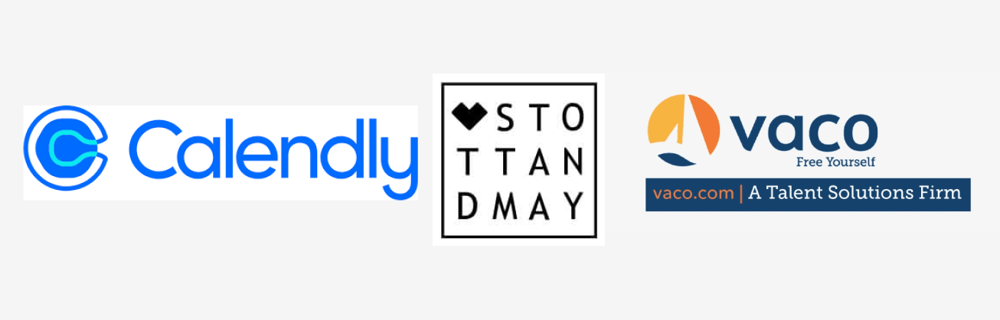

#### This article covers Calendly's Livestream, teaching the importance of creating a personal brand. It covers tips on brand-building, content creation, networking, and more, leading you to career success!

---

---

### Introduction

In this Livestream event hosted by Calendly, four industry professionals teach us about the importance of personal branding and provide valuable tips on how to create one:

**[Serena McMahon](https://www.linkedin.com/in/serenamcmahon)** - hosts the LinkedIn Live event and works for [Calendly](https://calendly.com/) as a digital and social media manager.

**[Taylor Desseyn](https://www.linkedin.com/in/taylordesseyn)** - from [Vaco](https://www.vaco.com/), is a recruiter with over 12 years of experience and has a passion for creating content.

**[Laureen Langstaff-Roberts](https://www.linkedin.com/in/curlyheadedrecruiter)** - is known as the curly-headed recruiter. She's an advocate for women in sales and a principal consultant at [Stott and May](https://www.stottandmay.com/). Laureen has over six years of experience in recruitment.

**[Katee Vallad](https://www.linkedin.com/in/kateemvallad)** - is a senior recruiter for [Calendly](https://calendly.com/) with over ten years of experience.

---

### What is a personal brand

**So, what exactly is a personal brand? A personal brand is the unique combination of skills, experiences, and personality traits that you showcase to the world. It's the image others perceive of you when they think about you or your work.**

By building and maintaining your personal brand, you can differentiate yourself from others and gain credibility in your chosen field.

---

### Why develop a personal brand

Developing a personal brand helps you to stand out from the crowd and provides a way to showcase your work, values, and commitment to consistency, which results in others becoming familiar with you before they even meet you.

Having an established personal brand can provide you with many opportunities you might not otherwise encounter and could significantly increase your chance of success when seeking employment.

*Host Serena McMahon informs us that she contacted Laureen and Taylor for this Livestream event because they both have strong personal brands on LinkedIn!*

---

### Building your brand

#### Be genuine

To best help your content stand out, make sure to bring your personality into your personal brand. If you are a pet person, a coffee enthusiast, or a sci-fi fan like me, incorporating these elements into your content will help establish your brand.

#### Share your passion

To keep your creative flow going, create content on topics you are passionate about. As a web developer, covering the topics you are currently learning will provide you with a constant flow of content to create!

---

### Your brand vs. your company's brand

In the industry, particularly for programmers, people frequently change jobs to pursue better opportunities.

Taylor explains that he follows people (content creators), not companies. When he admires a content creator, he will then research the company they work for.

**Your brand is your own, which makes it your most valuable asset because you take it with you wherever you go.**

---

***In my personal experience, building a strong personal brand has opened numerous doors for me. These opportunities include being paid to write articles, receiving invitations to be a compensated code reviewer, and enjoying a steady stream of job offers from recruiters and hiring managers directly in my direct messages.***

---

<iframe width="956" height="538" src="https://www.youtube.com/embed/l0NCHMqUGSQ"></iframe>

---

### Creating content

#### Find a content medium that works best for you

Experiment with various content creation mediums to determine which one is best suited for you. It might be YouTube videos, a blog, or even something simple such as posting on LinkedIn or Twitter.

*Laureen tells us she has acting experience, making it easier for her to maintain video content creation, whereas Katee prefers to create written content.*

#### How often should you post content?

In my personal opinion, I believe consistency is more important than quantity.

Decide on a content release schedule that works best for you, whether it's daily, weekly, or monthly, and do your best to stick to it.

Consistent content builds trust, showcases expertise, and leads to increased visibility, credibility, and collaboration opportunities.

#### Repurpose content

Serena points out that social media platforms, such as LinkedIn and Twitter, feature posts with a short lifespan, making them ideal candidates for repurposing into new content. For instance, you could transform an old tweet into a video, which provides revised content to a new audience.

**Repurposing your old content across various platforms will help you maintain a consistent content creation workflow and assist you in reaching a broader audience.**

---

### Build your network

**Engaging in other people's content will not only help build your personal brand, but it will also help build your network!**

Find like-minded people that share your niche and actively participate in their posts by asking questions, providing insights, and sharing their content with your network.

Doing so will help you to stand out and broaden your reach beyond your own content creation. As a result, you will appear in others' feeds as an active, knowledgeable participant, which will organically help you build your reputation and network.

---

### Your reputation

If you have an intention of building a personal brand for employment opportunities, be very mindful of what you post, like, and follow, as it affects your online presence. It's in your best interest to be consistently professional across social networks.

Companies, hiring managers, and others will research you when considering you for employment. You wouldn't want negative content to self-sabotage potential opportunities!

---

### Utilizing AI for content creation

To best utilize AI technologies as a content creator, use it to improve your workflow, not replace it.

**You can effectively utilize AI for your content by**

* Researching topics you cover
    
* Organizing content structure
    
* AI suggested improvements
    
* SEO optimization
    
* And streamlining other small tasks
    

**As a content creator leveraging AI technologies, it is crucial that your unique voice resounds through the final product.**

---

### ***If you found the tips provided by the experts in this article helpful, you can show your support by seeking out the services offered by the companies they represent and giving them credit.***

* [Calendly](https://calendly.com/en/)
    
* [Stott and May](https://www.stottandmay.com/)
    
* [Vaco](https://www.vaco.com/)
    

---

### My related articles

* [Maximizing Your Job Search: Insights from Andronica Klaas, Meta Engineer](https://selftaughttxg.com/2023/03-23/maximizing-your-job-search-andronica-klaas/)
    
* [The Importance of Learning in Public](https://selftaughttxg.com/2021/08-21/TheImportanceOfLearningInPublic/)
    
* [LinkedIn Profile Optimization With Austin Henline](https://selftaughttxg.com/2022/10-22/LinkedIn-AustinHenline/)
    
* [Taylor Desseyn on leveraging recruiters to land a job in tech](https://selftaughttxg.com/2021/09-21/TaylorDesseyn-LeveragingRecruiters/)
    

---

### Advance your career with a 20% discount on Scrimba Pro using this [affiliate link](https://scrimba.com/?via=MichaelLarocca)!

Become a hireable developer with Scrimba Pro! Discover a world of coding knowledge with full access to all courses, hands-on projects, and a vibrant community. You can [read my article](https://selftaughttxg.com/2021/06-21/06-07-21/) to learn more about my exceptional experiences with Scrimba and how it helps many become confident, well-prepared web developers!

###### ***Important:*** *This discount is for new accounts only. If a higher discount is currently available, it will be applied automatically.*

**How to Claim Your Discount:**
1. Click [the link](https://scrimba.com/?via=MichaelLarocca) to explore the new Scrimba 2.0.
2. Create a new account.
3. Upgrade to Pro; the 20% discount will automatically apply.

##### ***Disclosure:*** *This article contains affiliate links. I will earn a commission from any purchases made through these links at no extra cost to you. Your support helps me continue creating valuable content. Thank you!*

---

### Conclusion

Your personal brand represents a distinctive blend of skills, experiences, and character traits that you exhibit, shaping the perceptions others have of you. Having a personal brand helps you stand out, increasing your chances of success when seeking employment opportunities, and may even attract opportunities to you!

Tips for building your personal brand include incorporating your personality, specialized skills, hobbies, and interests. When creating content, be authentic and focus on subjects you are passionate about, and utilize AI technologies to streamline your work, not do your work for you! Once you are prepared to share your content, choose a medium that suits you best and maintain consistency in releasing content.

In addition to content creation, you can develop your personal brand by engaging with others. Contributing valuable insights to their posts will help you organically expand your network.

As you transition between jobs throughout your career, your personal brand becomes your most valuable asset because you take it with you wherever you go. So be sure to maintain professionalism in your online presence to protect your reputation!

Now, it's up to you to take the first step toward building your strong personal brand and unlocking new opportunities for success!

---

**Let's connect! I'm active on** [**LinkedIn**](https://www.linkedin.com/in/michaeljudelarocca/) **and** [**Twitter**](https://twitter.com/MikeJudeLarocca)**.**

---

###### *Are you now equipped with personal branding strategies to boost your career? Have you already established a unique and powerful personal brand that has led you to success? Please share the article and leave a comment!*
