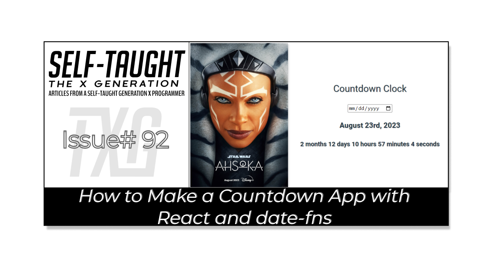

#### HOLD

---



---

### Introduction

In this article, we will explore how to create a countdown app using React and the date-fns library. This step-by-step tutorial will guide you through the process of building a user-friendly countdown timer that allows users to set an end date and watch as the timer counts down to zero. 

We will discuss the essential functions of the date-fns library, the benefits of using it for date manipulation, and how to incorporate it into your React application. By the end of this tutorial, you will have a functional countdown app that demonstrates the power and convenience of the React date-fns library.

---

### The React date-fns library

So, what is the React date-fns library? The React date-fns library is a collection of functions that makes it easy to work with dates and times in a React application. It helps you format, parse, compare, and manipulate dates in a user-friendly way.

**JavaScript is notorious for its poor date support when it comes to writing date-related functions. The React date-fns library alleviates the burden of managing dates, allowing you to focus on other aspects of your projects.**

An additional benefit of this library is that it enables you to import only the functions required for your project, resulting in a smaller app that loads faster. Unlike other libraries, there's no need to import everything, making date-fns a fast and convenient solution for working with dates!

---

### Selected library functions

**For the countdown clock app, we will use the following six functions from the React date-fns library:**

* **format:** Formats a date according to the given format string.
    
* **formatDuration:** Converts a duration object to a human-readable string.
    
* **intervalToDuration:** Calculates the duration between two dates as a duration object.
    
* **isBefore:** Determines if the first date is before the second date.
    
* **addDays:** Adds a specified number of days to a given date.
    
* **add:** Adds a specified amount of time to a given date.
    

---

### Import

**At the top of a JSX file, we will import the necessary hooks, functions, and components:**

useState

* useEffect
    
* date-fns
    
* react-confetti
    
* App.css
    

```javascript
import { useState, useEffect } from 'react';
import { format, formatDuration, intervalToDuration, isBefore, addDays, add } from 'date-fns';
import Confetti from 'react-confetti';
import './App.css'
```

---

### App function

#### We will be writing our code inside this App function:

```javascript
function App() {
  
  });
```

---

#### Inside the App function, we initially set up state variables.

**Initialize state variables:**

* **countdown:** A string representing the countdown timer.
    
* **countdownEnded:** A boolean indicating if the countdown has ended.
    
* **endDate:** The end date of the countdown, either retrieved from localStorage or set to one day from the current date.
    

```javascript
const [countdown, setCountdown] = useState('');
  const [countdownEnded, setCountdownEnded] = useState(false);
  const [endDate, setEndDate] = useState(() => {
    const initialEndDate = localStorage.getItem("endDate");
    return initialEndDate ? new Date(Date.parse(initialEndDate)) : addDays(new Date(), 1);
  });
```

For this app to work as expected, we need to utilize local storage. For the app's first use, the current date plus one day is set as the default value. When a user chooses a date with the date-picker, that date becomes the new end date value, and it is stored in local storage. This way, when a user comes back to the app after closing it, the countdown reflects their chosen end date.

---

### Function to handle date changes

**Define the handleDateChange function:**

* It's called when the user changes the date input.
    
* It calculates the end date in Eastern Standard Time (EST) and saves it to localStorage.
    
* It updates the endDate state and resets the countdownEnded state to false.
    

```javascript
  function handleDateChange(event) {
    const chosenDate = new Date(event.target.value);
    const dateEST = add(chosenDate, { hours: 4 });
    localStorage.setItem("endDate", dateEST);
    setEndDate(dateEST);
    setCountdownEnded(false);
  };
```

When the user picks a new date, the **handleDateChange** is triggered. Their chosen value is stored in the **chosenDate** variable.

*I ran into an issue when working with this library. For some reason, the times were being stored with a four-hour time difference. For simplicity, I created a new variable called* ***dateEST,*** *and I utilized it by adding the missing four hours of time zone difference. (I did find other React libraries to handle time zones but opted to add hours instead).*

The user's chosen date is saved in local storage and to the **endDate** variable. The **setCountdownEnded** boolean is changed to false.

---

### The countdown

**Use the useEffect hook to set up an interval for the countdown logic:**

* It runs every 1000ms (1 second) and calculates the remaining duration.
    
* If the end date is in the past, it sets **countdownEnded** to true and clears the interval.
    
* Otherwise, it updates the countdown state with the remaining time.
    

```javascript
  useEffect(() => {
    const interval = setInterval(() => {
      const now = new Date();
      const duration = intervalToDuration({ start: now, end: endDate });

      if (isBefore(endDate, now)) { 
        setCountdownEnded(true);
        clearInterval(interval);
      } else { 
        setCountdown(`${formatDuration(duration)}`);
      }

    }, 1000);

    return () => clearInterval(interval);
  }, [endDate]);
```

Here is where all the magic happens! Inside a JavaScript **setInterval** function, you will see the ease of handling dates with the functions provided by the React date-fns library.

We create a new variable named **now,** and we use the date-fns function **intervalToDuration** to compare it to the **endDate** variable\*\*.\*\* While the countdown is active, each second, the remaining time is saved and rendered by using the date-fns **formatDuration** function.

With the if statement, we use the date-fns function **isBefore** to check when the **endDate** variable's value is before the current date. If it is, the countdown has ended! We then set the **setCountdownEnded** boolean variable to true and stop the countdown interval.

---

### Render the Component

**The return statement renders the component:**

* If the countdown has ended, display the Confetti component.
    
* Display an image and the countdown timer UI.
    
* The date input has a minimum value set to today's date.
    
* Show the formatted end date and the countdown timer or a "Countdown Ended!" message.
    

```javascript
  return (
    <div className='countdown-timer-container'>
      {countdownEnded && <Confetti />}
       
      <div className='timer'>
        <h2>Countdown Clock</h2>
        <input type="date" min={format(new Date(), "yyyy-MM-dd")} onChange={handleDateChange} />
        <h3>{format(endDate, "MMMM do, yyyy")}</h3>
        {!countdownEnded && <h4>{countdown}</h4>}
        {countdownEnded && <h4>Countdown Ended!</h4>}
      </div>
    </div>
  );
```

**React-confetti** is a fun React library for easily creating confetti animations in your apps. Without any additional steps than the initial import at the top of the JSX file, all you need to do is add the `<Confetti / >` React element. In our case, we only want to render it at the end of the countdown, which we accomplish by checking if the **countdownEnded** variable is true. If it is, the Confetti element is displayed. If not, nothing is displayed.

For this simple app that's focused on learning the date-fns library, I decided to use an image tag with an online source attribute.

For the users, I added an input element with a type of date and an event handler for handling date changes in a React component. I used the **min** attribute to set the minimum allowed value to the current date.

As you can see, we easily format the date using the **format** date-fns function.

Similar to the confetti React element, we only render the countdown **h4** elements when the countdown is completed.

---

### **Here is the complete JSX file**

```javascript
import { useState, useEffect } from 'react';
import { format, formatDuration, intervalToDuration, isBefore, addDays, add } from 'date-fns';
import Confetti from 'react-confetti';
import './App.css'

function App() {
  const [countdown, setCountdown] = useState('');
  const [countdownEnded, setCountdownEnded] = useState(false);
  const [endDate, setEndDate] = useState(() => {
    const initialEndDate = localStorage.getItem("endDate");
    return initialEndDate ? new Date(Date.parse(initialEndDate)) : addDays(new Date(), 1);
  });

  function handleDateChange(event) {
    const chosenDate = new Date(event.target.value);
    const dateEST = add(chosenDate, { hours: 4 });
    localStorage.setItem("endDate", dateEST);
    setEndDate(dateEST);
    setCountdownEnded(false);
  };
  // useEffect hook: Updates the countdown every second and checks if the countdown has ended. If it has, it clears the interval and sets the countdownEnded state to true.
  useEffect(() => {
    const interval = setInterval(() => {
      const now = new Date();
      const duration = intervalToDuration({ start: now, end: endDate });

      if (isBefore(endDate, now)) { 
        setCountdownEnded(true);
        clearInterval(interval);
      } else { 
        setCountdown(`${formatDuration(duration)}`);
      }

    }, 1000);

    return () => clearInterval(interval);
  }, [endDate]);

  return (
    <div className='countdown-timer-container'>
      {countdownEnded && <Confetti />}
       
      <div className='timer'>
        <h2>Countdown Clock</h2>
        <input type="date" min={format(new Date(), "yyyy-MM-dd")} onChange={handleDateChange} />
        <h3>{format(endDate, "MMMM do, yyyy")}</h3>
        {!countdownEnded && <h4>{countdown}</h4>}
        {countdownEnded && <h4>Countdown Ended!</h4>}
      </div>
    </div>
  );    
}

export default App;
```

---

### **The finished project**

**Here are the links to the finished project:**

* [GitHub repo](https://github.com/MichaelLarocca/countdown-clock)
    
* [Netlify deployed project](https://react-countdown-clock.netlify.app/)
    

---

### **My other related articles**

* [HOLD](HOLD)
    
* [HOLD](HOLD)
    
* [HOLD](HOLD)
    

---

### Conclusion

times in your applications. With its user-friendly functions and modular design, it allows you, as a developer, to focus on other aspects of your projects while efficiently handling date-related tasks.

An additional benefit is the ability to import only the functions needed, which results in a smaller app size and faster loading times. This occurs because you avoid importing unnecessary functions, reducing the overall bundle size of your application and improving its performance.

With over 200 functions available, the library offers a versatile solution not only for creating a countdown app like this one but also for various other projects requiring date manipulation and formatting!

---

**Let's connect! I'm active on** [**LinkedIn**](https://www.linkedin.com/in/michaeljudelarocca/) **and** [**Twitter**](https://twitter.com/MikeJudeLarocca)**.**

---

###### *??!*