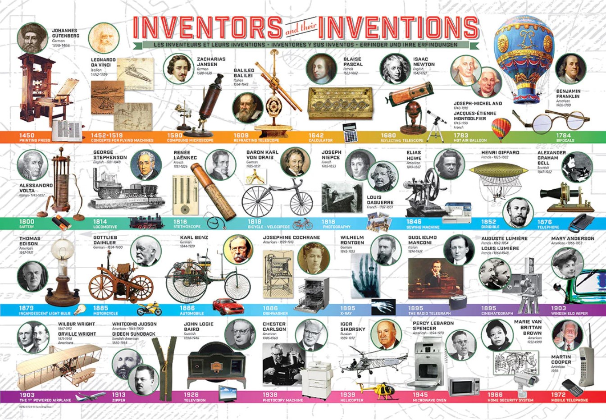

#### Are You Ready for the AI Revolution as a Developer? This article covers James Quick's presentation at THAT Conference, including the benefits, challenges, and ways to adapt to the changing landscape!

---

---

### Introduction

THAT Conference is a technical conference full of workshops, sessions, open spaces, family events, and networking. The live events are typically held in a Kalahari Resort and Waterpark. This family-friendly event is comprised of professional and family tracks, so there is something to learn and experience for all ages!

This article discusses James Quick's presentation, which explores how AI is revolutionizing the developer experience, the benefits and challenges it brings, and how developers can adapt to these changes.

---

### About James

James Quick has been a developer, teacher, and professional speaker for over 10 years. He believes in work-life balance, personal happiness, and empowering others to take control of their career. 

James has worked at top tech companies and several startups and is currently a full-time content creator.

---

<iframe width="944" height="531" src="https://www.youtube.com/embed/N_PEo5QxNrE"></iframe>

#### AI Is Revolutionizing Developer Experience - Are You Ready?

---

### The only constant is change

James warns us that if we are not open to change and do not pursue change before or when it happens, we will get left behind! This is true in our personal lives and our professional lives.

**In our personal lives, we go through major life events such as:**

* Starting a new job
    
* marriage
    
* Having children
    
* Buying a house
    
* Loss of a loved one
    

**There are transitions in life, and there's always a next step to take. You must embrace your new reality and learn how to handle it to excel in your personal life and career.**

In your personal life, consider taking up new hobbies, seeking support during challenging times, and being open to new experiences. This can lead you to a more fulfilling life.

In our professional lives within the tech industry, technological changes occur. When they do, some embrace these changes with optimism, while others resist them pessimistically. It's in your best interest to choose the optimistic path and keep up with the changes with a growth mindset.

In the tech industry, staying updated with the latest programming languages, attending workshops, taking courses, and participating in communities, including conferences, can help you adapt to fast-paced advancements.

**James has successfully navigated significant transitions in his personal and professional life, attributing his mindset of pursuing happiness as the driving force behind these achievements.**

---

"Pursue happiness. Everything that you do should be working towards a next level of happiness."

> James Quick

---

### Will AI take developer jobs?

James presents a fascinating timeline map titled "Inventors and Their Inventions," illustrating how each invention listed has revolutionized how we operate in our daily lives.

**The inventions include:**

* **The printing press:** Invented by Johannes Gutenberg in 1440, it revolutionized the distribution of information and led to the mass production of books.
    
* **The telephone:** Invented by Alexander Graham Bell in 1876, it transformed communication by allowing people to speak with each other over long distances.
    
* **The computer:** Invented in the mid-20th century, it transformed how we process and store information, paving the way for countless technological advancements in various industries.
    
* **The Internet:** Developed in the late 20th century, it has significantly impacted how we access information, communicate, and work, connecting people and businesses worldwide.
    

James tells us if you think that jobs didn't change and jobs didn't get augmented, and jobs didn't go away when those inventions happened, then you are wrong.

**Significant inventions will lead to job elimination through automation, but they will also create new job opportunities.**

*So be encouraged, knowing that if our current job becomes obsolete, we will be better able to adapt to new job roles through continuous learning and growing our skillset!*

**Emerging Job Opportunities in the AI-Driven Development Landscape include:**

* **Machine Learning Engineer:** A developer who specializes in creating algorithms and models that enable machines to learn from and make predictions based on data.
    
* **AI Ethics Specialist:** A professional responsible for ensuring that AI systems are designed and implemented in a manner that respects human rights, values, and ethical principles.
    
* **AI Product Manager:** An individual who oversees the development and deployment of AI-powered products, ensuring that they meet user needs and business goals.
    
* **AI Data Analyst:** A specialist who uses AI tools to analyze large datasets, uncover patterns, and derive insights to inform decision-making.
    
* **Conversational AI Designer:** A professional who designs and develops AI-powered chatbots and virtual assistants to improve user experience and streamline communication.
    

---

### Leveraging AI for Improved Developer Experience

**James presents the positive aspect of AI by shifting the perspective: if we can accomplish tasks more quickly, it doesn't mean we need fewer people; instead, it allows us to create more than we ever thought possible!**

For his [Compressed.fm Podcast](https://www.compressed.fm/), James saves time using the AI service [Cloudinary](https://cloudinary.com/) to automate the creation of cover images for each episode. James gains more time to concentrate on producing the podcast content using this service.

**Other notable services James uses include:**

* [Auth0](https://auth0.com/): Offers AI-based anomaly detection and adaptive multi-factor authentication, improving security and user experience.
    
* [Xata](https://xata.io/): Uses AI for data management, enabling developers to access and analyze data more efficiently.
    
* [Supabase](https://supabase.com/): Automates back-end development tasks using AI, allowing developers to focus on front-end design and functionality.
    
* [Appwrite](https://appwrite.io/): Employs AI-powered text analysis and image recognition features, enhancing application capabilities.
    
* [Netlify](https://www.netlify.com/): Utilizes AI for optimizing site performance and automating deployment, streamlining the development process.
    
* [Vercel](https://vercel.com/): Leverages AI to provide real-time feedback and performance insights, helping developers create more efficient applications.
    

*James drives his point home by pointing out that using these services enables him to focus on what developers excel at, developing!*

---

### How does AI affect learning?

Learning with AI tools has broadened James's horizon of development possibilities. AI accomplishes tasks that James never imagined possible, significantly enhancing his creative potential.

As a teacher, James believes it is more beneficial for beginner developers to learn without AI training wheels, as it takes away from their learning journey. Experiencing errors, needing to fix code that doesn't work as expected, and having to do research are all part of the learning process.

However, James acknowledges that beginner developers using AI tools responsibly, such as [GitHub Copilot](https://github.com/features/copilot), can be empowered to achieve more than they ever could have before.

---

### Using AI as a source of creativity

James tells us he often uses AI tools as a source of inspiration. When he experiences writer's block, whether it's ideas for content, titles, or abstracts, James utilizes AI to spark creativity, helping him to overcome the obstacles holding him back.

James shares an amazing AI use case of how he successfully prompt-engineered a customized Discord bot that generates and posts engaging discussion questions for his Learn Build Teach community, which enables him to bring more value to his community.

James introduces us to the incredible AI tool [Video Tap](https://videotap.com/), which transforms a video into a blog post. The creator and the founding team happen to be his friends!

As a content creator, James explains that a service like Video Tap is invaluable, allowing him to produce more content than ever!

[***Video Tap***](https://videotap.com/) ***re-purposes your videos for multiple platforms and increases their reach. It's like having a whole marketing team for your videos.***

---

**Leveraging AI while keeping your voice**

As a content creator, you will benefit the most by utilizing AI to increase your workflow, productivity, and content creation. You will not benefit from having AI create the content for you!

**Since AI tools are widely available to all, now more than ever, you need to make sure the content you create resounds with your voice and personality.**

With the mindset of utilizing AI to increase productivity, you will empower yourself to create more content with less effort while still ensuring your voice resonates in your work.

**Ideas for balancing AI assistance and personal creativity include:**

1. **Use AI for content research and brainstorming:** Employ AI tools to generate ideas and research topics, but add your unique perspective and insights to the content.
    
2. **Edit AI-generated text:** Review and revise AI-generated content to ensure it aligns with your writing style, tone, and personal touch.
    
3. **Combine AI suggestions with original ideas:** Utilize AI-generated suggestions as a starting point, but expand upon them with your own thoughts and experiences.
    
4. **Set boundaries for AI assistance:** Determine the specific areas where AI can be helpful, such as grammar and proofreading, while preserving the creative aspects for yourself.
    
5. **Continuously refine your collaboration with AI:** Regularly evaluate the effectiveness of your AI-assisted workflow and make adjustments to maintain your voice and creativity.
    

---

### Where AI falls short

James alleviates our concerns about AI replacing us by clarifying that if AI were 100% accurate all the time, then our worries would indeed be justified. However, AI is far from perfect and frequently provides us with misinformation.

To provide context for his statement, he shares a situation where he worked on a project using [GitHub Copilot](https://github.com/features/copilot). The AI mistakenly informed him that he was prepared to discuss a topic entirely unrelated to his project!

Once again, James drives his point home that we can't just take the information we receive from AI without question. First and foremost, we need to understand programming languages so that we can effectively use AI as a tool to streamline our work while still identifying and correcting any misinformation we receive from it.

---

### James Quick links

* 🔗 Check out the [compressed.fm Podcast](https://compressed.fm/)
    
* 🔗 [Courses](https://jamesqquick.com/courses)
    
* 🔗 [Newsletter 🗞](https://www.jamesqquick.com/newsletter)
    
* 🔗 Follow me on [Twitter 🐦](https://www.twitter.com/jamesqquick)
    

#### DISCORD

Join the Learn Build Teach [Discord Server 💬](https://discord.gg/vM2bagU)

---

### My other related articles

* [Amazing Conferences for Developers in 2023](https://selftaughttxg.com/2023/01-23/amazing-conferences-for-developers-in-2023/)
    
* [The Importance of Learning in Public](https://selftaughttxg.com/2021/08-21/TheImportanceOfLearningInPublic/)
    
* [Teacher Feature: James Q Quick](https://selftaughttxg.com/2021/03-21/TeacherFeature_JamesQQuick/)
    
* [Expert Guidance for Succeeding in Technical Writing and Blogging](https://selftaughttxg.com/2023/05-23/expert-guidance-for-succeeding-in-technical-writing-and-blogging/)
    

---

### Conclusion

While AI may cause job displacement, new opportunities will arise in the tech industry. You can best adapt to these changes by continuously learning and updating your skillset, embracing AI-powered tools to streamline your workflows, and focusing on higher-level tasks that require creativity and critical thinking. You can also participate in AI-related courses, workshops, and conferences that can help you stay updated on the latest advancements in AI.

As a developer, you can benefit from AI tools to improve productivity, enhance learning, and spark creativity. Still, it's crucial to maintain a personal voice and creativity while using AI assistance and to understand its limitations.

James concludes his talk by enlightening us that the power of people surpasses that of artificial intelligence because AI lacks the human touch. Although the tech job landscape is changing, people will continue to seek other people, despite the rise in AI technologies.

So, to successfully navigate your career through the new AI frontier, be proactive in learning with a growth mindset of embracing new AI tools, adapt to change through considerate and mindful personal growth, and continue to build relationships, not only grow your network but also to fulfill a fundamental human need that AI cannot satisfy; companionship.

---

**Let's connect! I'm active on** [**LinkedIn**](https://www.linkedin.com/in/michaeljudelarocca/) **and** [**Twitter**](https://twitter.com/MikeJudeLarocca)**.**

---

###### *Are you now more aware of the impact of AI on the developer experience and the importance of adapting to technological advancements? Have you considered integrating AI tools into your workflow to improve productivity and spark creativity? Please share the article and comment!*

---