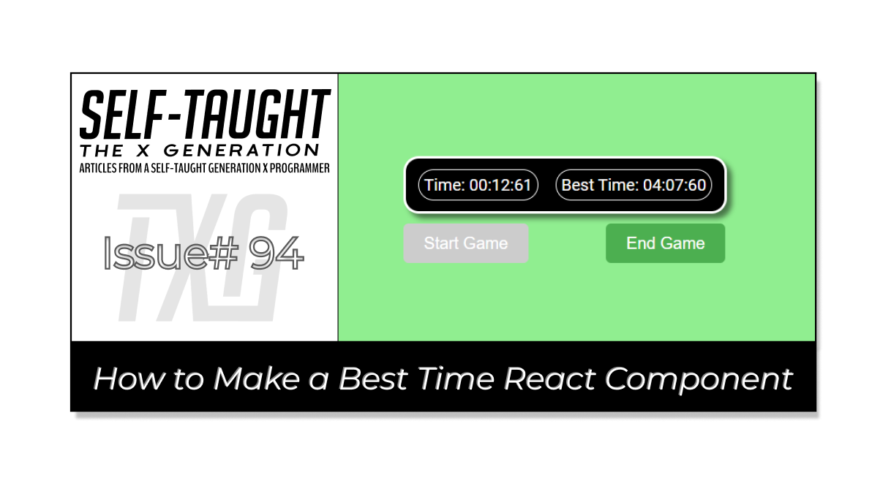

#### HOLD

---

---

### Introduction
(WRITE ARTICLE SECTION)

---

### HOLD
(WRITE ARTICLE SECTION)

---

### **The finished project**

**Here are the links to the finished project:**

* [GitHub repo](HOLD)
    
* [Netlify deployed project](HOLD)
    

---

---

### **My other related articles**

* [Building a Stopwatch App with React and date-fns](https://selftaughttxg.com/2023/06-23/building-a-stopwatch-app-with-react-and-date-fns/)

* [How to Make a Countdown App with React and date-fns](https://selftaughttxg.com/2023/06-23/how-to-make-a-countdown-app-with-react-and-date-fns/)
    
* [Learn Local Storage in React: Create a Light and Dark Theme Switcher Application](https://selftaughttxg.com/2023/05-23/learn-local-storage-in-react-create-a-light-and-dark-theme-switcher-application/)
    
* [Using React useState Hook to Manage Object Props](https://selftaughttxg.com/2023/04-23/using-react-usestate-hook-to-manage-object-props/)
    
* [Creating a True/False Toggle in React with useState Hook for Beginners](https://selftaughttxg.com/2023/04-23/creating-a-true-false-toggle-in-react-with-usestate-hook-for-beginners/)
    

---

### Conclusion
(WRITE ARTICLE SECTION)

---

**Let's connect! I'm active on** [**LinkedIn**](https://www.linkedin.com/in/michaeljudelarocca/) **and** [**Twitter**](https://twitter.com/MikeJudeLarocca)**.**

---

###### *?? Please share the article and comment!*

---