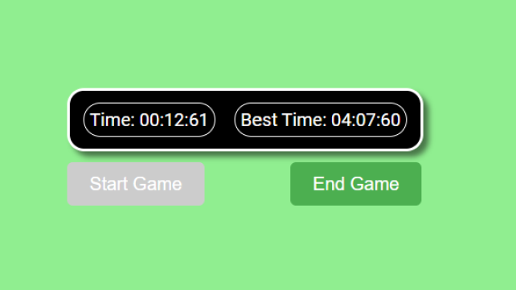

---

#### In this article, we build a React best time game component. You will learn how to work with the date-fns and UUID libraries, React hooks, and local storage, gaining skills for your original projects!

---


---

### Introduction

What does the best time React component do? This component is used in games to capture a player's best time. The best time is the least amount of time it takes the player to complete the game. The player's best time is stored in local storage.

I created this best-time React component with the intention of using it in several upcoming projects ( I mean, that is what React components are all about, right?) Although I've been coding now for quite some time, I haven't yet created a React component that was reused in other apps, nor have I learned how to create one in any of the tutorials I'm taking.

After I created the component, I realized a logical flaw on my part. Since I'm utilizing local storage to store the **storedBestTime** variable, when this component is used in other projects, the same **storedBestTime** variable will be updated by each project, which defeats the whole purpose of creating a reusable component.

I solved this issue by utilizing the UUID library I recently learned about to generate a unique **game ID** for the **storedBestTime** variable, and I refactored to code to utilize it.

---

### Setting up the environment

First, we need to set up our coding environment.

#### The React environment

For this project, I used the VS Code editor to create a React app with Vite. Afterward, I converted it into a GitHub repository and deployed it on Netlify.

**If you would like to learn how to set up a local React development environment, I wrote the following two beginner-friendly articles:**

* [Create a React Project, Push It to GitHub, and Deploy With Netlify, From the Command Line](https://selftaughttxg.com/2023/03-23/create-a-react-project-push-it-to-github-and-deploy-with-netlify-from-the-command-line/)
    
* [How to Create a Local React Environment with Vite](https://selftaughttxg.com/2023/03-23/how-to-create-a-local-react-environment-with-vite/)
    

#### **Install the date-fns library**

To install the date-fns library using Node Package Manager (npm), open your terminal and run the following command:

```javascript
npm install date-fns
```

**The date-fns library is a lightweight JavaScript tool for managing dates and times. It offers functions for parsing, formatting, manipulating, and comparing dates, allowing tasks like date string formatting and time unit calculations. Its modular design ensures efficient and easy-to-maintain code.**

#### **Install the UUID library**

The following command `npm install uuid` installs the UUID library as a dependency in your Node.js project using the Node Package Manager (npm).

```javascript
npm install uuid
```

---

### **Building the** best time react component

**At the top of the App JSX file, we will import the necessary hooks, libraries, and CSS files:**

* useState
    
* useEffect
    
* date-fns
    
* uuid
    
* App.css
    

```javascript
import React, { useState, useEffect } from "react";
import { format } from "date-fns";
import { v4 as uuidv4 } from "uuid";
```

---

### **App function**

#### **We will be writing our code inside this App function:**

```javascript
export default function BestTime() {
  
  });
```

#### **Inside the App function, we initially set up the variables.**

**Variables initialized:**

* **gameID:** A unique identifier generated using the UUID library for each instance of the game, ensuring that the best time for each game is stored separately in the browser's local storage.
    

* **currentTime:** Stores the current time of the game
    
* **gameEndTime:** Stores the time when the game ends
    
* **gameBestTime:** Stores the best time achieved in the game
    
* **gameStarted:** A boolean indicating if the game has started
    
* **gameEnded:** A boolean indicating if the game has ended
    

```javascript
    const [gameID, setGameID] = useState(getOrSetGameID());    
    const [currentTime , setCurrentTime ] = useState(0);
	const [gameEndTime, setGameEndTime] = useState(0);
	const [gameBestTime, setGameBestTime] = useState(getBestTime());
	const [gameStarted, setGameStarted] = useState(false);
	const [gameEnded, setGameEnded] = useState(false);
```

The **currentTime** and **gameEndTime** variables are initially set to **zero**. The **gameStarted and** gameEnded are boolean variables and are initially set to **false**.

The **gameBestTime** variable calls the **getBestTime()** function to set the initial value.

---

### Game ID function

The `getOrSetGameID` function checks if there's an existing game ID in the browser's local storage. If it finds one, it returns that game ID. Otherwise, it creates a new unique game ID using the UUID library and stores it in the local storage before returning the new game ID.

```javascript
	function getOrSetGameID() {
		const storedGameID = localStorage.getItem("gameID");
		if (storedGameID) {
		  return storedGameID;
		} else {
		  const newGameID = uuidv4();
		  localStorage.setItem("gameID", newGameID);
		  return newGameID;
		}
	  }
```

---

### Best time function

The `getBestTime` function retrieves the best time achieved in the game from the browser's local storage. If there is a stored best time, it converts the stored value to an integer and returns it. If there is no stored best time, it returns Infinity, indicating that no best time has been achieved yet.

*As Infinity is a value that is greater than any other number. This makes it easier to compare and update the best time when a new value is recorded.*

```javascript
  function getBestTime() {
    const storedBestTime = localStorage.getItem(`bestTime-${gameID}`);
    return storedBestTime ? parseInt(storedBestTime, 10) : Infinity;
  }
```

---

### Save best time function

The `saveBestTime` function takes a single argument, `bestime`, which represents the best time achieved in the game. The function uses the `localStorage.setItem` method to save this value in the browser's local storage. The key for this value is "bestTime", and the value being stored is `bestime`. This way, the best time can be retrieved and displayed even after the user closes and reopens the browser.

```javascript
  function saveBestTime(bestime) {
    localStorage.setItem(`bestTime-${gameID}`, bestime);
  }
```

---

### The best time function

The `bestTime` function checks if the current game's end time (`gameEndTime`) is less than the previously stored best time (`gameBestTime`) and if the game has ended (indicated by `gameEndTime` not being 0). If both conditions are met, it updates the best time by calling `setGameBestTime` with the new best time (`gameEndTime`) and saves this new best time in the browser's local storage using the `saveBestTime` function.

```javascript
	function bestTime() {
		if (gameEndTime < gameBestTime && gameEndTime !== 0) {
			setGameBestTime(gameEndTime);
			saveBestTime(gameEndTime);
		}
	}
```

---

### The reset time function

The `resetTime` function sets the current time (`currentTime`) and the game end time (`gameEndTime`) back to 0, essentially resetting the timer for a new game.

```javascript
	function resetTime() {
		setCurrentTime(0);
		setGameEndTime(0);
	}
```

---

### The start game function

The `startGame` function sets the `gameStarted` variable to `true` and the `gameEnded` variable to `false`, indicating that a new game has begun.

```javascript
	function startGame() {
		setGameStarted(true);
		setGameEnded(false);
	}
```

---

### The end game function

The `endGame` function sets the `gameEnded` variable to `true`, the `gameStarted` variable to `false`, and updates the `gameEndTime` variable with the value of `currentTime`. This indicates that the game has ended and records the time at which the game finished.

```javascript
	function endGame() {
		setGameEnded(true);
		setGameStarted(false);
		setGameEndTime(currentTime);
	}
```

---

### The formatted time function

The `formattedTime` function takes a time value as input and checks if it's Infinity or not a number (NaN). If it is, the function returns a placeholder string "--:--:--". If it's a valid number, the function creates a new Date object with the time value multiplied by 10, formats the date into a "mm:ss:SS" format, and returns the formatted string.

```javascript
	function formattedTime(timeValue) {
		if (timeValue === Infinity || isNaN(timeValue)) {
		  return "--:--:--";
		}
		const date = new Date(timeValue * 10);
		return format(date, "mm:ss:SS");
	  }
```

---

### The React useEffect Hooks

For the best time react component, we create useEffect hooks to trigger when the **gameStarted**, **gameEndTime**, and **gameEnded** variables change.

When the `gameStarted` variable changes, this useEffect hook is triggered. If `gameStarted` is `true`, it calls the `resetTime()` function to reset the timer for a new game. The hook ensures that the timer is reset every time a new game begins.

```javascript
	useEffect(() => {
		if (gameStarted) {
			resetTime();
		}
	}, [gameStarted]);
```

This useEffect hook is triggered when the `gameEndTime` variable changes. It calls the `bestTime()` function to check and update the best time achieved in the game.

```javascript
	useEffect(() => {
		bestTime();
	}, [gameEndTime]);
```

The last useEffect hook is triggered when either the `gameStarted` or `gameEnded` variables change. If the game has started and not ended, it sets up an interval to update the `currentTime` variable every 10 milliseconds. When the component unmounts or the game ends, the interval is cleared to prevent memory leaks.

*To prevent the component from malfunctioning when the timer exceeds an hour, the if statement clears the interval, stops the timer, and returns the current time.*

```javascript
	useEffect(() => {
		if (gameStarted && !gameEnded) {
		  const intervalId = setInterval(() => {
			setCurrentTime((prevTime) => {
			  if (prevTime >= 360000) {
				clearInterval(intervalId);
				return prevTime;
			  }
			  return prevTime + 1;
			});
		  }, 10);
		  // Clean up the interval on component unmount
		  return () => {
			clearInterval(intervalId);
		  };
		}
	  }, [gameStarted, gameEnded]);
```

---

### **Render the Component**

The component renders a section containing the current time and best time, both formatted using the `formattedTime` function. Below the section, two buttons are displayed: "Start Game" and "End Game". The "Start Game" button is disabled when the game is already in progress, and clicking on the "End Game" button ends the current game.

```javascript
	return (
		<>
			<section className="best-time">
				<div className="inner-border">
					<div>Time: {formattedTime(currentTime)}</div>
				</div>
				<div className="inner-border">
					<div>Best Time: {formattedTime(gameBestTime)}</div>
				</div>
			</section>
			<button onClick={startGame} disabled={gameStarted}>
				Start Game
			</button>
			<button onClick={endGame}>End Game</button>
		</>
	);
```

*When incorporating this component into a React project, the "Start Game" and "End Game" buttons are meant to be removed after the code is revised accordingly. When the code is revised, return only the HTML section element.*

```javascript
    return (	
            <section className="best-time">
				<div className="inner-border">
					<div>Time: {formattedTime(currentTime)}</div>
				</div>
				<div className="inner-border">
					<div>Best Time: {formattedTime(gameBestTime)}</div>
				</div>
			</section>
       );
```

---

### **Here is the complete** best time component

```javascript
import React, { useState, useEffect } from "react";
import { format } from "date-fns";
import { v4 as uuidv4 } from "uuid";

export default function BestTime() {
	const [gameID, setGameID] = useState(getOrSetGameID());
	const [currentTime , setCurrentTime ] = useState(0);
	const [gameEndTime, setGameEndTime] = useState(0);
	const [gameBestTime, setGameBestTime] = useState(getBestTime());
	const [gameStarted, setGameStarted] = useState(false);
	const [gameEnded, setGameEnded] = useState(false);

	function getOrSetGameID() {
		const storedGameID = localStorage.getItem("gameID");
		if (storedGameID) {
		  return storedGameID;
		} else {
		  const newGameID = uuidv4();
		  localStorage.setItem("gameID", newGameID);
		  return newGameID;
		}
	  }

	function getBestTime() {
		const storedBestTime = localStorage.getItem(`bestTime-${gameID}`);
		return storedBestTime ? parseInt(storedBestTime, 10) : Infinity;
	  }

	function saveBestTime(bestime) {
		localStorage.setItem(`bestTime-${gameID}`, bestime);
	  }

	function bestTime() {
		if (gameEndTime < gameBestTime && gameEndTime !== 0) {
			setGameBestTime(gameEndTime);
			saveBestTime(gameEndTime);
		}
	}

	function resetTime() {
		setCurrentTime(0);
		setGameEndTime(0);
	}

	function startGame() {
		setGameStarted(true);
		setGameEnded(false);
	}

	function endGame() {
		setGameEnded(true);
		setGameStarted(false);
		setGameEndTime(currentTime);
	}

	function formattedTime(timeValue) {
		if (timeValue === Infinity || isNaN(timeValue)) {
		  return "--:--:--";
		}
		const date = new Date(timeValue * 10);
		return format(date, "mm:ss:SS");
	  }

	useEffect(() => {
		if (gameStarted) {
			resetTime();
		}
	}, [gameStarted]);

	useEffect(() => {
		bestTime();
	}, [gameEndTime]);

	useEffect(() => {
		if (gameStarted && !gameEnded) {
		  const intervalId = setInterval(() => {
			setCurrentTime((prevTime) => {
			  if (prevTime >= 360000) {
				clearInterval(intervalId);
				return prevTime;
			  }
			  return prevTime + 1;
			});
		  }, 10);
		  // Clean up the interval on component unmount
		  return () => {
			clearInterval(intervalId);
		  };
		}
	  }, [gameStarted, gameEnded]);

	return (
		<>
			<section className="best-time">
				<div className="inner-border">
					<div>Time: {formattedTime(currentTime)}</div>
				</div>
				<div className="inner-border">
					<div>Best Time: {formattedTime(gameBestTime)}</div>
				</div>
			</section>
			<button onClick={startGame} disabled={gameStarted}>
				Start Game
			</button>
			<button onClick={endGame}>End Game</button>
		</>
	);
}
```

---

***Note:*** *I did have an issue with the initial best time not saving on two of my computers that was resolved by clearing the local storage.*

---

### **The finished project**

**Here are the links to the finished project:**

* [GitHub repo](HOLD)
    
* [Netlify deployed project](HOLD)
    

---



---

### **My other related articles**

* [Building a Stopwatch App with React and date-fns](https://selftaughttxg.com/2023/06-23/building-a-stopwatch-app-with-react-and-date-fns/)
    
* [How to Make a Countdown App with React and date-fns](https://selftaughttxg.com/2023/06-23/how-to-make-a-countdown-app-with-react-and-date-fns/)
    
* [Learn Local Storage in React: Create a Light and Dark Theme Switcher Application](https://selftaughttxg.com/2023/05-23/learn-local-storage-in-react-create-a-light-and-dark-theme-switcher-application/)
    
* [Using React useState Hook to Manage Object Props](https://selftaughttxg.com/2023/04-23/using-react-usestate-hook-to-manage-object-props/)
    
* [Creating a True/False Toggle in React with useState Hook for Beginners](https://selftaughttxg.com/2023/04-23/creating-a-true-false-toggle-in-react-with-usestate-hook-for-beginners/)
    

---

### Conclusion

In this article, we created a reusable best time React component for tracking players' best times in games. We covered setting up the coding environment, building the component with functions and hooks, and rendering the component with a user interface.

To make sure this component can be used in multiple apps, we used the UUID library to generate unique game IDs for local storage. We also utilized the date-fns and UUID libraries to manage time formatting.

To take a quote from my favorite movie, "This is where the fun begins!" Now it's time to use this best time component in upcoming React projects!

---

**Let's connect! I'm active on** [**LinkedIn**](https://www.linkedin.com/in/michaeljudelarocca/) **and** [**Twitter**](https://twitter.com/MikeJudeLarocca)**.**

---

###### *?? Please share the article and comment!*

---


<!-- 
---

#### HOLD

---


---

### Introduction
(WRITE ARTICLE SECTION)

---

### Setting up the environment

First, we need to set up our coding environment.

#### The React environment
For this project, I used the VS Code editor to create a React app with Vite. Afterward, I converted it into a GitHub repository and deployed it on Netlify.

**If you would like to learn how to set up a local React development environment, I wrote the following two beginner-friendly articles:**

* [Create a React Project, Push It to GitHub, and Deploy With Netlify, From the Command Line](https://selftaughttxg.com/2023/03-23/create-a-react-project-push-it-to-github-and-deploy-with-netlify-from-the-command-line/)
    
* [How to Create a Local React Environment with Vite](https://selftaughttxg.com/2023/03-23/how-to-create-a-local-react-environment-with-vite/)

---

#### **Install the date-fns library**

To install the date-fns library using Node Package Manager (npm), open your terminal and run the following command:

```javascript
npm install date-fns
```

**The date-fns library is a lightweight JavaScript tool for managing dates and times. It offers functions for parsing, formatting, manipulating, and comparing dates, allowing tasks like date string formatting and time unit calculations. Its modular design ensures efficient and easy-to-maintain code.**

---


### **Building the** best time react component

**At the top of the App JSX file, we will import the necessary hooks, library, and CSS file:**

* useState
    
* useEffect
    
* date-fns
    
* App.css
    

```javascript
import React, { useState, useEffect } from "react";
import { format } from "date-fns";
```

---

### **App function**

#### **We will be writing our code inside this App function:**

```javascript
export default function BestTime() {
  
  });
```

#### **Inside the App function, we initially set up the variables.**

**Variables initialized:**

* **currentTime:** Stores the current time of the game
    
* **gameEndTime:** Stores the time when the game ends
    
* **gameBestTime:** Stores the best time achieved in the game
    
* **gameStarted:** A boolean indicating if the game has started
    
* **gameEnded:** A boolean indicating if the game has ended
    

```javascript
	const [currentTime , setCurrentTime ] = useState(0);
	const [gameEndTime, setGameEndTime] = useState(0);
	const [gameBestTime, setGameBestTime] = useState(getBestTime());
	const [gameStarted, setGameStarted] = useState(false);
	const [gameEnded, setGameEnded] = useState(false);
```

The **currentTime** and **gameEndTime** variables are initially set to **zero**. The **gameStarted and** gameEnded are boolean variables and are initially set to **false**.

The **gameBestTime** variable calls the **getBestTime()** function to set the initial value.

---

### Best time function

The `getBestTime` function retrieves the best time achieved in the game from the browser's local storage. If there is a stored best time, it converts the stored value to an integer and returns it. If there is no stored best time, it returns Infinity, indicating that no best time has been achieved yet.

*As Infinity is a value that is greater than any other number. This makes it easier to compare and update the best time when a new value is recorded.*

```javascript
	function getBestTime() {
		const storedBestTime = localStorage.getItem("bestTime");
		return storedBestTime ? parseInt(storedBestTime, 10) : Infinity;
	}
```

---

### Save best time function

The `saveBestTime` function takes a single argument, `bestime`, which represents the best time achieved in the game. The function uses the `localStorage.setItem` method to save this value in the browser's local storage. The key for this value is "bestTime", and the value being stored is `bestime`. This way, the best time can be retrieved and displayed even after the user closes and reopens the browser.

```javascript
	function saveBestTime(bestime) {
	localStorage.setItem("bestTime", bestime);
	}    
```

---

### The best time function

The `bestTime` function checks if the current game's end time (`gameEndTime`) is less than the previously stored best time (`gameBestTime`) and if the game has ended (indicated by `gameEndTime` not being 0). If both conditions are met, it updates the best time by calling `setGameBestTime` with the new best time (`gameEndTime`) and saves this new best time in the browser's local storage using the `saveBestTime` function.

```javascript
	function bestTime() {
		if (gameEndTime < gameBestTime && gameEndTime !== 0) {
			setGameBestTime(gameEndTime);
			saveBestTime(gameEndTime);
		}
	}
```

---

### The reset time function

The `resetTime` function sets the current time (`currentTime`) and the game end time (`gameEndTime`) back to 0, essentially resetting the timer for a new game.

```javascript
	function resetTime() {
		setCurrentTime(0);
		setGameEndTime(0);
	}
```

---

### The start game function

The `startGame` function sets the `gameStarted` variable to `true` and the `gameEnded` variable to `false`, indicating that a new game has begun.

```javascript
	function startGame() {
		setGameStarted(true);
		setGameEnded(false);
	}
```

---

### The end game function

The `endGame` function sets the `gameEnded` variable to `true`, the `gameStarted` variable to `false`, and updates the `gameEndTime` variable with the value of `currentTime`. This indicates that the game has ended and records the time at which the game finished.

```javascript
	function endGame() {
		setGameEnded(true);
		setGameStarted(false);
		setGameEndTime(currentTime);
	}
```

---

### The formatted time function

The `formattedTime` function takes a time value as input and checks if it's Infinity or not a number (NaN). If it is, the function returns a placeholder string "--:--:--". If it's a valid number, the function creates a new Date object with the time value multiplied by 10, formats the date into a "mm:ss:SS" format, and returns the formatted string.

```javascript
	function formattedTime(timeValue) {
		if (timeValue === Infinity || isNaN(timeValue)) {
		  return "--:--:--";
		}
		const date = new Date(timeValue * 10);
		return format(date, "mm:ss:SS");
	  }
```

---

### The React useEffect Hooks

For the best time react component, we create useEffect hooks to trigger when the **gameStarted**, **gameEndTime**, and **gameEnded** variables change.

When the `gameStarted` variable changes, this useEffect hook is triggered. If `gameStarted` is `true`, it calls the `resetTime()` function to reset the timer for a new game. The hook ensures that the timer is reset every time a new game begins.

```javascript
	useEffect(() => {
		if (gameStarted) {
			resetTime();
		}
	}, [gameStarted]);
```

This useEffect hook is triggered when the `gameEndTime` variable changes. It calls the `bestTime()` function to check and update the best time achieved in the game.

```javascript
	useEffect(() => {
		bestTime();
	}, [gameEndTime]);
```

The last useEffect hook is triggered when either the `gameStarted` or `gameEnded` variables change. If the game has started and not ended, it sets up an interval to update the `currentTime` variable every 10 milliseconds. When the component unmounts or the game ends, the interval is cleared to prevent memory leaks.

*To prevent the component from malfunctioning when the timer exceeds an hour, the if statement clears the interval, stops the timer, and returns the current time.*

```javascript
	useEffect(() => {
		if (gameStarted && !gameEnded) {
		  const intervalId = setInterval(() => {
			setCurrentTime((prevTime) => {
			  if (prevTime >= 360000) {
				clearInterval(intervalId);
				return prevTime;
			  }
			  return prevTime + 1;
			});
		  }, 10);
		  // Clean up the interval on component unmount
		  return () => {
			clearInterval(intervalId);
		  };
		}
	  }, [gameStarted, gameEnded]);
```

---

### **Render the Component**

The component renders a section containing the current time and best time, both formatted using the `formattedTime` function. Below the section, two buttons are displayed: "Start Game" and "End Game". The "Start Game" button is disabled when the game is already in progress, and clicking on the "End Game" button ends the current game.

```javascript
	return (
		<>
			<section className="best-time">
				<div className="inner-border">
					<div>Time: {formattedTime(currentTime)}</div>
				</div>
				<div className="inner-border">
					<div>Best Time: {formattedTime(gameBestTime)}</div>
				</div>
			</section>
			<button onClick={startGame} disabled={gameStarted}>
				Start Game
			</button>
			<button onClick={endGame}>End Game</button>
		</>
	);
```

*When incorporating this component into a React project, the "Start Game" and "End Game" buttons are meant to be removed after the code is revised accordingly. When the code is revised, return only the HTML section element.*

```javascript
    return (	
            <section className="best-time">
				<div className="inner-border">
					<div>Time: {formattedTime(currentTime)}</div>
				</div>
				<div className="inner-border">
					<div>Best Time: {formattedTime(gameBestTime)}</div>
				</div>
			</section>
       );
```

---

### **Here is the complete** best time component

```javascript
import React, { useState, useEffect } from "react";
import { format } from "date-fns";

export default function BestTime() {
	const [currentTime , setCurrentTime ] = useState(0);
	const [gameEndTime, setGameEndTime] = useState(0);
	const [gameBestTime, setGameBestTime] = useState(getBestTime());
	const [gameStarted, setGameStarted] = useState(false);
	const [gameEnded, setGameEnded] = useState(false);

	function getBestTime() {
		const storedBestTime = localStorage.getItem("bestTime");
		return storedBestTime ? parseInt(storedBestTime, 10) : Infinity;
	}

	function saveBestTime(bestime) {
	localStorage.setItem("bestTime", bestime);
	}    

	function bestTime() {
		if (gameEndTime < gameBestTime && gameEndTime !== 0) {
			setGameBestTime(gameEndTime);
			saveBestTime(gameEndTime);
		}
	}

	function resetTime() {
		setCurrentTime(0);
		setGameEndTime(0);
	}

	function startGame() {
		setGameStarted(true);
		setGameEnded(false);
	}

	function endGame() {
		setGameEnded(true);
		setGameStarted(false);
		setGameEndTime(currentTime);
	}

	function formattedTime(timeValue) {
		if (timeValue === Infinity || isNaN(timeValue)) {
		  return "--:--:--";
		}
		const date = new Date(timeValue * 10);
		return format(date, "mm:ss:SS");
	  }

	useEffect(() => {
		if (gameStarted) {
			resetTime();
		}
	}, [gameStarted]);

	useEffect(() => {
		bestTime();
	}, [gameEndTime]);

	useEffect(() => {
		if (gameStarted && !gameEnded) {
		  const intervalId = setInterval(() => {
			setCurrentTime((prevTime) => {
			  if (prevTime >= 360000) {
				clearInterval(intervalId);
				return prevTime;
			  }
			  return prevTime + 1;
			});
		  }, 10);
		  // Clean up the interval on component unmount
		  return () => {
			clearInterval(intervalId);
		  };
		}
	  }, [gameStarted, gameEnded]);

	return (
		<>
			<section className="best-time">
				<div className="inner-border">
					<div>Time: {formattedTime(currentTime)}</div>
				</div>
				<div className="inner-border">
					<div>Best Time: {formattedTime(gameBestTime)}</div>
				</div>
			</section>
			<button onClick={startGame} disabled={gameStarted}>
				Start Game
			</button>
			<button onClick={endGame}>End Game</button>
		</>
	);
}
```

---

***Note:*** *I did have an issue with the initial best time not saving on two of my computers that was resolved by clearing the local storage.*

---

### **The finished project**

**Here are the links to the finished project:**

* [GitHub repo](https://github.com/MichaelLarocca/react-best-time-component)
    
* [Netlify deployed project](https://react-best-time-component.netlify.app/)
    

---


---

### **My other related articles**

* [Building a Stopwatch App with React and date-fns](https://selftaughttxg.com/2023/06-23/building-a-stopwatch-app-with-react-and-date-fns/)

* [How to Make a Countdown App with React and date-fns](https://selftaughttxg.com/2023/06-23/how-to-make-a-countdown-app-with-react-and-date-fns/)
    
* [Learn Local Storage in React: Create a Light and Dark Theme Switcher Application](https://selftaughttxg.com/2023/05-23/learn-local-storage-in-react-create-a-light-and-dark-theme-switcher-application/)
    
* [Using React useState Hook to Manage Object Props](https://selftaughttxg.com/2023/04-23/using-react-usestate-hook-to-manage-object-props/)
    
* [Creating a True/False Toggle in React with useState Hook for Beginners](https://selftaughttxg.com/2023/04-23/creating-a-true-false-toggle-in-react-with-usestate-hook-for-beginners/)
    

---

### Conclusion
(WRITE ARTICLE SECTION)

---

**Let's connect! I'm active on** [**LinkedIn**](https://www.linkedin.com/in/michaeljudelarocca/) **and** [**Twitter**](https://twitter.com/MikeJudeLarocca)**.**

---

###### *?? Please share the article and comment!*

--- -->