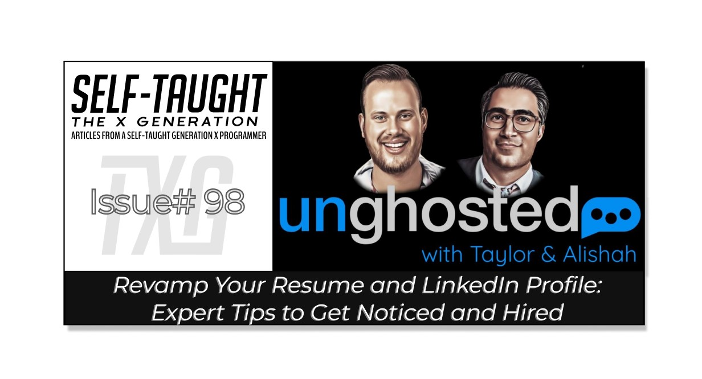

#### This article explores expert tips to revamp your resume and LinkedIn profile, ensuring they stand out to recruiters and employers alike, providing you with a competitive advantage in your job search!

---

---

### About Unghosted

Unghosted is a monthly Livestream show hosted by Taylor Desseyn and Alishah Novin with one goal, helping YOU get seen!

In this episode, Taylor and Alishah evaluate resumes and LinkedIn profiles, providing tips and valuable industry insights on enhancing them to help us stand out from the crowd and get noticed!

Alishah Novin is a product manager at Microsoft, and Taylor is a recruiter currently working at Gun.io. Alishah and Taylor have extensive experience hiring and placing candidates in programming roles.

---

### Resumes

#### Overall look and structure

By both Taylor and Alishah, it is recommended to have a one-page resume. It is advisable to be one column, without color, with consistency in fonts, lines, and white space for easy readability.

For the structure, you will benefit from organizing your information, starting with the high-priority information and working your way down the resume to the lower-priority information.

It is ideal to begin with a career summary, as it offers a concise and easily understandable overview.

**Career Summary**

A career summary is a concise bullet point list that showcases your skills and experience in a neat, brief section on your resume. Including one allows reviewers to quickly and clearly understand your qualifications.

**If you have a good summary that meets the needs of the particular job role in question, Taylor says he will call you immediately! So taking the time to craft a well-written career summary section can work to your advantage.**

If there is no career summary, Alishah explains that he (and others) would have to take extra time to review your resume and decipher your years of experience, what computer languages you know, and other important facts about you. During this extra step of creating a career summary equivalent, Alishah admits he may make a mistake in his notes.

**Another advantage of including a career summary section in your resume, Alishah points out, is that it demonstrates that you have strong communication skills, a highly sought-after attribute for developer roles.**

Below is a demonstration of a career summary as it appears in Alishah Novin's [Resume Template](https://docs.google.com/document/d/1QXvTn7LaleLDscDlHKCnkOkYHT4bVcycJVGnI4KIxqc/edit).

<table><tbody><tr><td colspan="3" rowspan="1">
CAREER SUMMARY
</td></tr><tr><td colspan="1" rowspan="1">

</td><td colspan="1" rowspan="1">

</td><td colspan="1" rowspan="1">

</td></tr><tr><td colspan="1" rowspan="1">
<strong>Experience</strong>
</td><td colspan="2" rowspan="1">
2+ years as Jr Web Developer with 3 start-ups in the Music &amp; Entertainment space
</td></tr><tr><td colspan="1" rowspan="1">
<strong>Languages</strong>
</td><td colspan="2" rowspan="1">
React, Angular, Node.JS, CSS, HTML, MySQL, PHP, XML
</td></tr><tr><td colspan="1" rowspan="1">
<strong>Tools</strong>
</td><td colspan="2" rowspan="1">
Visual Studio, GitHub, Gimp, PostMan, Photoshop, Atom, Sublime,&nbsp;
</td></tr><tr><td colspan="1" rowspan="1">
<strong>Methodologies</strong>
</td><td colspan="2" rowspan="1">
Scrum, Kanban, Test Driven Development, Extreme, Pair Programming
</td></tr><tr><td colspan="1" rowspan="1">
<strong>Project Management</strong>
</td><td colspan="2" rowspan="1">
2+ years managing customers, requirements and gathering on variety of projects
</td></tr></tbody></table>

#### Job experience

When listing your job experience, It's important to include the quantitative value you provided, not just your job description.

For example, as a web developer, include information such as "Reduced website load time by 23% after optimizing JavaScript and CSS, resulting in a 12% increase in user engagement."

***Following Taylor's and Alishah's guidelines, you can craft a well-structured resume that effectively highlights your skills and experience, significantly impacting your job search and making it easier for recruiters and hiring managers to recognize your potential. It will also assist you in standing out from the competition and aid in capturing employers' attention.***

---

***🔗 Be sure to check out Alishah Novin's*** [***Resume Template***](https://docs.google.com/document/d/1QXvTn7LaleLDscDlHKCnkOkYHT4bVcycJVGnI4KIxqc/edit)***!***

---

<iframe width="703" height="395" src="https://www.youtube.com/embed/sDxA2n8tPnY"></iframe>

#### **Unghosted w/Alishah Novin and Taylor Desseyn**

---

### LinkedIn

#### LinkedIn Banner

A valuable insight I can offer is that not all recruiters are programmers! I assumed they would be, and I updated my LinkedIn profile to accommodate their needs better.

Taylor makes this point clear during the Livestream when he addresses Colin Williams's custom LinkedIn banner, which consists of programming logos such as HTML, CSS, React, and more (to Taylor's credit as a non-programmer recruiter, he did recognize several, but not all).

**For your LinkedIn banner, avoid using images that might not be recognizable to everyone, like specific logos. Instead, be deliberate in choosing a banner image that reflects the job role you're pursuing; for example, my banner image displays "Front-End Web Developer."**

*Another tip Taylor offers is to incorporate a "conversation starter" in your LinkedIn banner. He shares a success story of a developer who incorporated his time as an audio engineer on tour with the Back Street Boys in his LinkedIn banner. A recruiter, intrigued by his music industry experience, reached out to him and secured a developer job for him because of it!*

---

#### Contact information

When it was time for my LinkedIn profile was review, I was complimented for adding my contact information to the banner. Although Alishah stated that including my phone number was bold, a recruiter in the Livestream comments praised it.

**Recruiters using LinkedIn have a limited amount of InMail credits that they use to contact potential candidates. Including your contact information in your LinkedIn banner provides a way for others to reach out to you without limitations!**

###### ***InMail credits*** *are a feature on LinkedIn that allows users to send private messages to people they are not connected with. Each user gets a limited number of credits depending on their subscription plan, and once the credits are used up, they must wait for a monthly refresh or purchase more to continue sending InMail messages.*

---

#### LinkedIn job roles

Be clear about the job roles you are pursuing. I have listed both technical writing and front-end web developer roles in my profile. Because of this, I have caused unintentional confusion, making it unclear about which role I truly want. Alishah points out that a hiring manager may hesitate to place me in one position, such as a developer, when my passion may lie in technical writing.

**If you an interested in "spreading your net" to acquire more employment opportunities by listing multiple job roles, be specific in which role is your primary and which ones are secondary.**

---

#### Other LinkedIn profile tweaks:

* Add your best posts to your "**Featured**" section
    
* Keep your "**Activity**" section active by posting and replying to posts
    
* Write your "**About**" section similar to an elevator pitch
    
* Ask your network to provide testimonials in your profile's "**Recommendations**" section.
    

---

### My other related articles

* [Create CVs and Resumes that get noticed by tech recruiters](https://selftaughttxg.com/2021/05-21/CreateCVsAndResumesThatGetNoticedByTechRecruiters/)
    
* [LinkedIn Profile Optimization With Austin Henline](https://selftaughttxg.com/2022/10-22/LinkedIn-AustinHenline/)
    
* [LinkedIn Review with Danny Thompson](https://selftaughttxg.com/2021/05-21/LinkedInReviewWithDannyThompson/)
    
* [Create a LinkedIn profile that gets noticed by tech recruiters](https://selftaughttxg.com/2021/03-21/LinkedIn-Profile-Review/)
    

---

### Conclusion

Optimizing your resume and LinkedIn profile is crucial for standing out in a competitive job market.

Following the advice from Taylor Desseyn and Alishah Novin, you can effectively structure your resume, craft a compelling career summary, and fine-tune your LinkedIn presence to significantly boost your chances of capturing the attention of recruiters and employers, bringing you one step closer to advancing your career in the tech industry!

---

**Let's connect! I'm active on** [**LinkedIn**](https://www.linkedin.com/in/michaeljudelarocca/) **and** [**Twitter**](https://twitter.com/MikeJudeLarocca)**.**

---

###### *Are you ready to revamp your resume and LinkedIn profile for success? Have you already optimized them and have additional tips to add? Please share the article and comment!*

---
