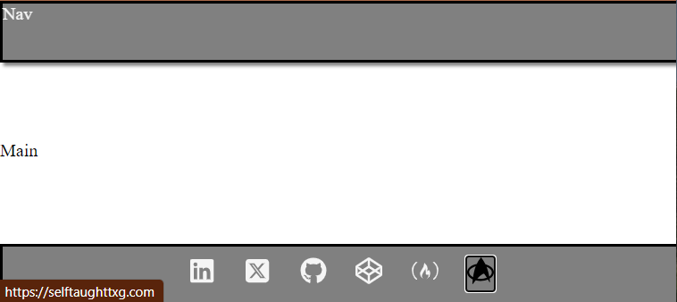

#### In this article, discover the versatile React Icons library, which allows you to integrate Font Awesome icons into your React applications and also create a React Footer component with social icons!

---


---

### Font Awesome Icons

So, what are Font Awesome icons? Font Awesome icons are a popular icon library that provides scalable vector icons and social logos. They can be customized with CSS, making them useful for various web design projects. Font Awesome icons come in different styles, such as solid, regular, light, and brands, and can be easily integrated into web projects, including React applications.

---

### The React Icons library

You may have already used Font Awesome icons in vanilla JavaScript projects. However, the React Icons library was designed to make working with icons even easier, offering additional benefits specifically for React projects and it's not limited to Font Awesome icons!

**The React Icons library offers icons from various icon libraries, such as:**

* Font Awesome 6
    
* Bootstrap Icons
    
* Material Design icons
    
* Ionicons
    
* And many more!
    

An additional benefit of using the react-icons library is that it allows you to import only the specific icons you need, potentially reducing the size of your bundle. It also makes it easier to manage and integrate icons with your React application by using them as React components.

---

### **Setting up the environment**

First, we need to set up our coding environment.

#### **The React environment**

For this project, I used the VS Code editor to create a React app with Vite. Afterward, I converted it into a GitHub repository and deployed it on Netlify.

**If you would like to learn how to set up a local React development environment, I wrote the following two beginner-friendly articles:**

* [Create a React Project, Push It to GitHub, and Deploy With Netlify, From the Command Line](https://selftaughttxg.com/2023/03-23/create-a-react-project-push-it-to-github-and-deploy-with-netlify-from-the-command-line/)
    
* [How to Create a Local React Environment with Vite](https://selftaughttxg.com/2023/03-23/how-to-create-a-local-react-environment-with-vite/)
    

---

### Install the React Icons library

After you have set up your React environment, run the following node package manager command.

```bash
npm install react-icons --save
```

---

### Footer Component

**For a simple and practical project that utilizes the React Icons library, I created a custom React Footer component that includes links to my relevant socials with the use of social icons.**

The icons I used are from the **Font Awesome** and **Simple Icons** libraries. The Font Awesome icons I used are LinkedIn, Twitter/X, GitHub, CodePen, and freeCodeCamp.

Since the only icon I could find for a blog was Blogger, I decided to have some fun and opt for a Star Trek icon to link to my "Self-Taught: The X Generation" blog instead. The Star Trek icon is from the Simple Icons library.

#### Importing icons

After you have installed the React Icons library with npm, just search for the icons you want to use on the [react-icons.github.io](https://react-icons.github.io/react-icons) website. Clicking the icon you want to use copies the code you need to the clipboard. Then import them for use at the top of your chosen React file (mine is the component Footer.jsx file).

```javascript
import React from "react";
import { FaLinkedin, FaSquareXTwitter, FaGithub, FaCodepen, FaFreeCodeCamp } from "react-icons/fa6";
import { SiStartrek } from "react-icons/si";
```

Please note that you must import the icons from the associated libraries. For example, the LinkedIn Font Awesome icon is imported from the "react-icons/fa6" library (Font Awesome 6). Then, on a separate line of code, the Star Trek icon is imported from the "react-icons/si" library (Simple Icons).

#### The Footer component

The great thing about using the React Icons is that the icons are React components! Since each icon is a React component, they are easy to place them where you want.

**Here is the LinkedIn React icon: &lt;FaLinkedin /&gt;**

#### The anchor tags

**For each anchor tag, I added the following:**

* **target:** The attribute that specifies where to open the linked document, such as opening in a new tab with `_blank`.
    
* **rel:** The attribute that defines the relationship between the current document and the linked document, often used for security reasons, like `noopener noreferrer`.
    
* **className:** The attribute that assigns a CSS class to the anchor tag for styling purposes.
    

*The rel="noopener noreferrer" attribute in an anchor tag is used to improve security and performance when opening external links in a new tab. noopener prevents the new page from accessing the originating page's window object, while noreferrer prevents the new page from knowing the originating page's URL through the Referer header.*

```javascript
<a href="https://www.linkedin.com/in/michaeljudelarocca" target="_blank" rel="noopener noreferrer" className="icon"><FaLinkedin /></a>
```

---

**Note:** I added the class to the anchor tag because the focus state was not changing the icon color when the class was added to the icon.

---

***Below is the custom React Footer component. I surrounded the anchors in a div with a "social-icons" class name to arrange the icons using flex-box.***

```javascript
function Footer() {
    return(
        <footer>
            <div className="social-icons">
                <a href="https://www.linkedin.com/in/michaeljudelarocca" target="_blank" rel="noopener noreferrer" className="icon"><FaLinkedin /></a>
                <a href="https://www.twitter.com/mikejudelarocca" target="_blank" rel="noopener noreferrer"  className="icon"><FaSquareXTwitter /></a>
                <a href="https://github.com/MichaelLarocca" target="_blank" rel="noopener noreferrer"  className="icon"><FaGithub /></a>
                <a href="https://codepen.io/Michael_Larocca" target="_blank" rel="noopener noreferrer"  className="icon"><FaCodepen /></a>
                <a href="https://www.freecodecamp.org/news/author/michael-larocca/" target="_blank" rel="noopener noreferrer"  className="icon"><FaFreeCodeCamp /></a>
                <a href="https://selftaughttxg.com/" target="_blank" rel="noopener noreferrer"  className="icon"><SiStartrek /></a>
            </div>
        </footer>
    )
}

export default Footer;
```

---

### **The finished project**

**Here are the links to the finished project:**

* [GitHub repo](https://github.com/MichaelLarocca/react-icons)
    
* [Netlify deployed project](https://txg-react-icons.netlify.app/)
    

---



---

### **My other related articles**

* [Understanding and Implementing Unique Keys in React](https://selftaughttxg.com/2023/05-23/understanding-and-implementing-unique-keys-in-react/)
    
* [Building a Stopwatch App with React and date-fns](https://selftaughttxg.com/2023/06-23/building-a-stopwatch-app-with-react-and-date-fns/)
    
* [How to Make a Countdown App with React and date-fns](https://selftaughttxg.com/2023/06-23/how-to-make-a-countdown-app-with-react-and-date-fns/)
    
* [Learn Local Storage in React: Create a Light and Dark Theme Switcher Application](https://selftaughttxg.com/2023/05-23/learn-local-storage-in-react-create-a-light-and-dark-theme-switcher-application/)
    
* [Using React useState Hook to Manage Object Props](https://selftaughttxg.com/2023/04-23/using-react-usestate-hook-to-manage-object-props/)
    
* [Creating a True/False Toggle in React with useState Hook for Beginners](https://selftaughttxg.com/2023/04-23/creating-a-true-false-toggle-in-react-with-usestate-hook-for-beginners/)
    

---

### Advance your career with a 20% discount on Scrimba Pro using this [affiliate link](https://scrimba.com/?via=MichaelLarocca)!

Become a hireable developer with Scrimba Pro! Discover a world of coding knowledge with full access to all courses, hands-on projects, and a vibrant community. You can [read my article](https://selftaughttxg.com/2021/06-21/06-07-21/) to learn more about my exceptional experiences with Scrimba and how it helps many become confident, well-prepared web developers!

###### ***Important:*** *This discount is for new accounts only. If a higher discount is currently available, it will be applied automatically.*

**How to Claim Your Discount:**
1. Click [the link](https://scrimba.com/?via=MichaelLarocca) to explore the new Scrimba 2.0.
2. Create a new account.
3. Upgrade to Pro; the 20% discount will automatically apply.

##### ***Disclosure:*** *This article contains affiliate links. I will earn a commission from any purchases made through these links at no extra cost to you. Your support helps me continue creating valuable content. Thank you!*

---

### **Conclusion**

The React Icons library is a powerful tool for incorporating Font Awesome icons and other icon libraries into your React applications. It was designed to make working with icons even easier, offering additional benefits such as importing only the specific icons you need, which potentially reduces the size of your bundle, and since the icons are React components, it makes it easier to manage and integrate into your projects!

---

**Let's connect! I'm active on** [**LinkedIn**](https://www.linkedin.com/in/michaeljudelarocca/) **and** [**Twitter**](https://twitter.com/MikeJudeLarocca)**.**

---

###### ***Are you now confident in integrating Font Awesome icons into your React applications using the React Icons library? Have you already successfully created custom components with this library? Please share the article and comment!***

---
